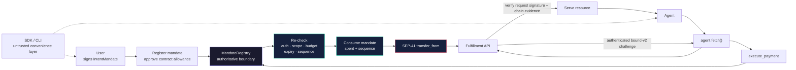

# ⚡ reapp-protocol

**Protocol, SDK, CLI, and reference agents for mandate-enforced agent payments on Stellar. The SDK prepares requests; the contract decides whether money moves.**

[](https://stellar.expert/explorer/testnet/contract/CCHQ5G4Y4YBMY6D3TYYJSVJVCKUM22Q6TMKCCHVAHY4X7K6QELQACZRM)
[](https://github.com/reapp-protocol/reapp-protocol/actions/workflows/ci.yml)
[](packages/sdk)
[](https://www.npmjs.com/package/@reapp-sdk/core)
[](docs/x402-roundtrip.md)

---

## 🔒 One Enforced Payment Path

A user defines the budget and scope. An agent can request payment, but only the MandateRegistry can validate, consume, and transfer against that authorization.



> **Core invariant:** money moves only through `MandateRegistry.execute_payment` (solo payments) and `clear_pool` (composite capture of a pooled schedule each member pre-authorized at registration), each of which validates-and-consumes atomically before any transfer. The user approves the SEP-41 allowance for the **contract**, never for the agent, SDK, or CLI.

---

## Why REAPP Is Different

| Property | Protocol guarantee |
|---|---|
| Contract-authoritative limits | Budget, merchant scope, asset, expiry, caller authorization, and sequence are re-checked on every payment. |
| Atomic enforcement | Mandate consumption and token transfer happen in one transaction; a failed transfer reverts the state change. |
| SDK cannot bypass policy | The SDK and CLI hold no spending authority. They submit requests to the same contract boundary as any other caller. |
| Replay resistance | Every spend supplies the current mandate sequence; stale and out-of-order calls are rejected. |
| Bound HTTP delivery | Exact-origin GET challenges, agent signatures, pre-broadcast receipts, explicit application acknowledgment, and atomic claim plus immutable-result replay close public-transaction reuse. |
| Adaptable HTTP layer | x402 request and response parsing is isolated from the mandate model and contract interface. |
| Controlled evolution | The default testnet contract supports admin pause and a one-hour timelocked same-address upgrade while preserving storage and contract ID. |

---

## 🌐 Current Testnet Surfaces

| Surface | Current source or deployment |
|---|---|
| Default simple MandateRegistry | [`CCHQ5G4Y…CZRM`](https://stellar.expert/explorer/testnet/contract/CCHQ5G4Y4YBMY6D3TYYJSVJVCKUM22Q6TMKCCHVAHY4X7K6QELQACZRM) — [`simple-v0.2.3`](https://github.com/reapp-protocol/reapp-protocol-contracts/releases/tag/simple-v0.2.3_contracts_simple_mandate_registry_mandate-registry_pkg0.2.3_cli25.1.0), WASM `ba370a80…76e87`, verified source, pause, authority rotation, and one-hour same-address upgrades |
| Composite MandateRegistry | [`CCYRF7FK…HEYW`](https://stellar.expert/explorer/testnet/contract/CCYRF7FKYGSNWX5I7WLYXZ6LNUNVCSPE4BOTQFVWVTABOHAP52DYHEYW) — deterministic clearing pools with the same operational controls |
| Contract releases and hashes | [`reapp-protocol-contracts`](https://github.com/reapp-protocol/reapp-protocol-contracts) |
| High-level SDK | [`@reapp-sdk/core`](https://www.npmjs.com/package/@reapp-sdk/core) — mandates, payments, and `agent.fetch()` |
| Stellar binding | [`@reapp-sdk/stellar`](https://www.npmjs.com/package/@reapp-sdk/stellar) — typed contract client, network config, signers, and SEP-41 helpers |
| AP2 profile | [`@reapp-sdk/ap2`](https://www.npmjs.com/package/@reapp-sdk/ap2) — signed, version-pinned AP2 v0.1 validation plus fail-closed binding into the contract mandate |
| Express middleware | [`@reapp-sdk/express-middleware`](https://www.npmjs.com/package/@reapp-sdk/express-middleware) — authenticated bound-v2 challenges, independent settlement verification, and a paid JSON route with atomic claim plus immutable-result replay |
| CLI | [`reapp-protocol-cli`](https://www.npmjs.com/package/reapp-protocol-cli) — setup, mandate creation, crash-safe payment reconciliation, exact success acknowledgment, and demo flow |

The contract is authoritative. SDK-side checks only fail fast; they never replace on-chain validation.

---

## 📁 Repository Map

| Path | Purpose |
|---|---|
| [`packages/sdk`](packages/sdk) | `@reapp-sdk/core`: contract client, bound-v2 adapter, durable settlement receipts, and no-second-payment recovery |
| [`packages/stellar`](packages/stellar) | `@reapp-sdk/stellar`: generated binding, network config, signer, and token helpers |
| [`packages/ap2`](packages/ap2) | `@reapp-sdk/ap2`: signed AP2 v0.1 REAPP profile validator with deterministic binding evidence and 59 tests |
| [`packages/express-middleware`](packages/express-middleware) | `@reapp-sdk/express-middleware`: exact-origin GET verification and at-most-once paid JSON fulfillment |
| [`packages/cli`](packages/cli) | `reapp-protocol-cli`: terminal workflow, pre-broadcast journal, exact-hash reconciliation, and explicit success acknowledgment |
| [`apps/consumer-agent`](apps/consumer-agent) | Reference ResearchAgent that buys data through `agent.fetch()` |
| [`apps/fulfillment-agent`](apps/fulfillment-agent) | Reference 402-gated API that verifies settlement before serving |
| [`scripts`](scripts) | Testnet demos, live flows, deployment, and gate check tooling |
| [`security`](security) | Threat model, data flows, upgrade custody, and contract/SDK/x402 gate check records |

---

## 🚀 Run the Flow

```bash
npm ci
npm run gatecheck:t2
```

Run the reviewer CLI from any clean directory:

```bash
npm install -g reapp-protocol-cli
reapp demo research-agent
```

Run both reference agents from this repository with one command:

```bash
npm run agents:testnet
```

That command creates and funds fresh testnet actors, starts the Express
fulfillment agent, and drives the consumer through real `agent.fetch()`
purchases. Three resources settle and are independently verified; the fourth is
rejected by the contract-enforced budget. The run also proves exact bound-v2
receipts and rejects an old settlement re-signed for a fresh request. No local
key or environment file is required.

Run the three named SDK failure drills separately:

```bash
npm run drills:testnet
```

Use the public browser companion at [reapp.live/express](https://reapp.live/express),
or follow the verified [clean VS Code project guide](docs/express-vscode-quickstart.md).
Operational evidence and boundaries are in the [live drill record](docs/live-failure-drills.md),
[threat model](security/threat-model.md), [data flow](security/data-flow.md), and
[upgrade authority runbook](security/upgrade-authority.md).

*The SDK is untrusted. The contract enforces the limit.*
