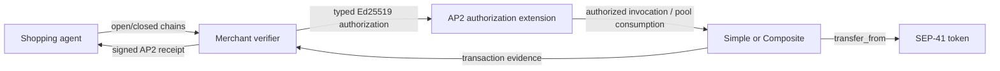

# AP2 v0.2 merchant verification and contract interoperability

Status: implemented and locally verified in the `ap2v0.2` branches of
`reapp-protocol` and `reapp-protocol-contracts`. The extension and updated
Composite contract are not deployed yet.

## What a new user can choose

REAPP now has source support for three AP2 routes:

| Purchase | AP2 evidence | On-chain route |
|---|---|---|
| Simple payment | Standard v0.2 open/closed Checkout and Payment Mandate chains | AP2 extension → unchanged Simple `execute_payment` |
| Released Composite child paying solo | Standard v0.2 open/closed Checkout and Payment Mandate chains | AP2 extension `CompositeSolo` → Composite `execute_payment` |
| Composite pooled purchase | Standard Checkout chain plus the REAPP open/closed pool-participation extension | Composite `clear_pool_ap2` → AP2 extension → existing pooled transfers |

An application may offer all three choices through one merchant verifier and
one extension deployment. A single pool chooses either legacy or AP2-aware
authorization at registration; legacy and AP2 children do not mix inside that
pool.

Existing mandates registered through the AP2 v0.1 bridge remain executable on
their existing contract paths. This is AP2 v0.1 backwards compatibility at the
on-chain boundary. The admission validator also recognizes the exact
`reapp-ap2-credential/1` IntentMandate envelope and applies the legacy v0.1
schema, signature, binding, scope, amount, expiry, and replay rules. A v0.1
credential is never reinterpreted as a v0.2 Payment Mandate.

## Merchant-side open/closed verification

`@reapp-sdk/ap2` provides:

- `verifyDelegateSdJwtChain` for bounded Delegate SD-JWT chains, selective
  disclosures, predecessor hashes, `cnf` delegation, audience, nonce, time,
  and signature verification;
- `verifyAp2CheckoutAuthorization` for the open/closed Checkout chain,
  merchant-signed Checkout JWT, checkout hash, merchant, currency, and
  disclosed Checkout constraints;
- `verifyAp2MerchantAuthorization` for the complete Checkout plus Payment
  flow, including Payment-to-Checkout linkage and disclosed Payment
  constraints;
- `verifyReappPoolParticipation` for the explicitly named REAPP pooled
  extension; and
- signed Checkout and Payment success/error receipts.

The standard merchant verifier evaluates allowed merchants, line items,
payees, payment instruments, PISPs, amount ranges, budgets, recurrence,
execution dates, preset claims, and checkout references. Unknown constraints
fail closed.

The verifier supports ES256 and EdDSA compact JWS signatures. The application
supplies the trusted root-key and Checkout-JWT-key resolvers. That keeps DNS,
certificate-chain, issuer allowlist, and key-rotation policy visible to the
merchant instead of implying that accepting an `x5c` or `kid` value is itself
a trust decision.

This is a complete open/closed flow for those supported algorithms and
resolver contracts. It should not be presented as automatic interoperability
with every AP2 issuer or trust profile.

## Why SD-JWT stays off-chain

JSON, JWS, disclosures, and web trust resolution would substantially enlarge
the Soroban money path while still leaving issuer policy off-chain. The
merchant verifier therefore signs a compact Soroban-typed result after
verification:



The verifier is a trust boundary whose accepted keys must be published. The
registry remains the money boundary: it independently checks scope, budget,
expiry, sequence, pool state, and allowance.

## Separate `Ap2AuthorizationExtension`

The contract lives at
`reapp-protocol-contracts/contracts/ap2-authorization/mandate-extension`.
It:

1. stores administrator-enabled verifier keys;
2. verifies versioned, network-bound, domain-separated Ed25519
   authorizations;
3. consumes solo authorizations and pool participations once;
4. routes Simple and released-child solo calls; and
5. accepts pool registration/consumption only from the named registry
   contract.

It never receives a token allowance and has no token client. Simple or
Composite remains the only contract able to move funds. If the downstream
registry call or a later token transfer fails, Soroban rolls extension and
registry state back together; integration tests cover both directions.

Solo authorization ids use:

```text
SHA-256("REAPP\0AP2\0CAPTURE\0V1\0" || SorobanXdr(CaptureAuthorization))
```

Pool participation ids use:

```text
SHA-256(
  "REAPP\0AP2\0POOL-PARTICIPATION\0V1\0"
  || SorobanXdr(PoolParticipationAuthorization)
)
```

Both schemas bind the network, registry, verifier, mandate, merchant, asset,
shopping agent, validity window, nonce, and open/closed evidence hashes. Solo
authorizations additionally bind capture kind, amount, and expected sequence.
Pool participation binds the pool, maximum amount, and exact schedule hash.

TypeScript and Rust share fixed authorization and schedule-hash vectors.

## Simple needs no registry upgrade

For an AP2-routed Simple mandate, register the extension address as the
mandate's on-chain `agent`. The actual shopping agent remains in the signed
authorization:

1. the user registers the otherwise unchanged Simple mandate and approves
   Simple as the SEP-41 spender;
2. the shopping agent authenticates to `execute_simple`;
3. the extension verifies and consumes the exact capture authorization;
4. its cross-contract invocation satisfies Simple's stored-agent
   authorization; and
5. Simple repeats its normal sequence, scope, budget, expiry, and allowance
   checks before transferring.

A direct call by the shopping agent cannot satisfy authorization for the
extension address. Tests use the real unchanged Simple registry and SEP-41
token and also prove downstream failure restores extension replay state.

## Composite pooled hook

A wrapper alone cannot protect legacy `clear_pool`, because that method is
permissionless. Composite therefore adds an explicit AP2 pool mode using
sidecar storage; existing `Mandate` and `ClearingPool` encodings remain
unchanged.

### Registration and commitment

`register_pool_ap2(..., extension)` fixes one extension for the pool.
`commit_child_ap2(mandate_id, authorization, signature)` requires:

- the AP2 pool mode and extension to match;
- the mandate to store that extension as its on-chain `agent`;
- exact network, registry, pool, mandate, merchant, asset, budget, and
  schedule-hash matches;
- a verifier authorization valid beyond the inclusive capture window; and
- all existing child status, funding, trustline, capacity, and duplicate-user
  checks.

The schedule hash is:

```text
SHA-256("REAPP\0AP2\0SCHEDULE\0V1\0" || SorobanXdr(Vec<SchedulePoint>))
```

Composite commits the child before the cross-contract registration call so
reentry sees a non-Unlinked child. A failed extension call reverts that state.

### Clearing

`clear_pool_ap2(pool_id)` uses the same child-view builder and pure clearing
function as legacy clearing:

1. compute the canonical outcome;
2. abort and release normally when it does not fire;
3. reject capture while paused;
4. persist the pool and every child effect as a reentrancy guard;
5. calculate the allocation root;
6. consume each winner's stored participation through the selected extension;
7. perform the existing all-or-nothing token transfers; and
8. emit the normal cleared event.

A missing, mismatched, expired, disabled, or already-consumed participation
fails the attempted capture. It never silently removes a winner and
recalculates the outcome. Any extension or token failure restores the pool,
children, participation state, and balances.

Legacy `commit_child` and `clear_pool` return `Ap2Required` for AP2-aware pools.
The AP2 entry points return `Ap2NotEnabled` for legacy pools.

## Why pooled participation is a REAPP extension

A standard closed Payment Mandate names a transaction-specific amount, but a
Composite leg is unknown until the pool closes. Waiting for every winner to
close a new Payment Mandate would give each agent a capture-window veto.

The REAPP pool-participation VCT instead binds the user's pre-deadline demand
schedule:

```text
https://reapp.live/ap2/mandate/pool-participation.open/1
https://reapp.live/ap2/mandate/pool-participation/1
```

Its exact terms are registry, pool id, mandate id, shopping agent, merchant,
asset, maximum amount, schedule hash, and capture-window end. Unknown extension
constraints fail closed. At capture, the trusted registry supplies the
canonical exact amount, previous sequence, and allocation root while the
extension ensures the participation is live and unused.

This preserves permissionless deadline clearing. It should be described to a
user as “AP2 v0.2 with the REAPP pooled extension,” since base AP2 does not
standardize demand curves or multi-user clearing.

## Mixing and fallback

Mixing is supported at the application and extension level:

- Simple and Composite registries may share one extension;
- standard Simple and released-child captures have separate `Simple` and
  `CompositeSolo` authorization kinds;
- pooled participation uses a separate schema and replay domain; and
- legacy and AP2 routes remain available side by side.

Within one pool, modes do not mix. This avoids an ambiguous outcome in which a
caller could omit selected proofs. If an AP2 child is priced out, evicted, or
released by an aborted pool, its registry `agent` remains the extension. A
fresh `CompositeSolo` Payment authorization is therefore required for any
later solo spend.

## Verification completed

Local suites cover:

- SD-JWT chains, disclosures, signature algorithms, audience, nonce, and
  predecessor binding;
- Checkout/Payment linkage, known constraints, unknown-constraint rejection,
  trusted amount/merchant context, and receipts;
- REAPP open/closed pool-participation verification;
- TypeScript/Rust XDR hash vectors and Ed25519 signatures;
- wrong network, route, window, verifier, maximum, and replay cases;
- real unchanged Simple plus SEP-41 transfer behavior;
- AP2/legacy pool-mode separation;
- exact Composite capture and released-child `CompositeSolo` fallback; and
- cross-contract rollback when the extension rejects capture.

## Still required before users rely on it

The code is not a live-service claim. A release needs:

1. tagged and reproducible extension and Composite WASM artifacts;
2. a deployed extension with published administrator and verifier-key policy;
3. a timelocked Composite upgrade or a new deployment;
4. published contract ids, hashes, and generated client bindings;
5. testnet gate checks against the deployed addresses; and
6. merchant trust-resolver and receipt-key operating policy.

Until those are published, the existing testnet Simple and Composite
deployments continue to expose only their currently documented release
interfaces.
