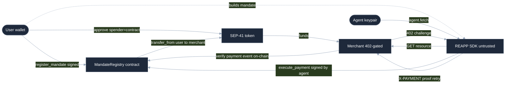
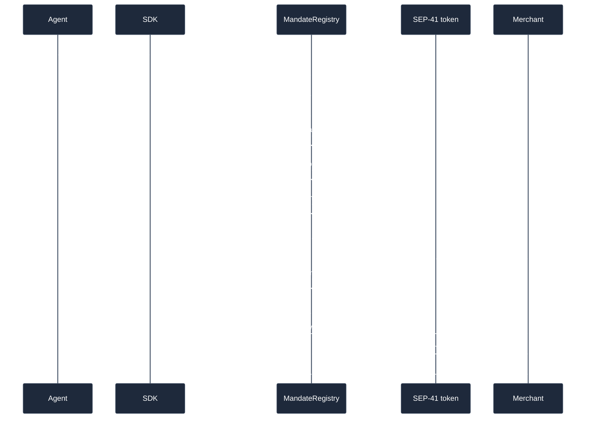
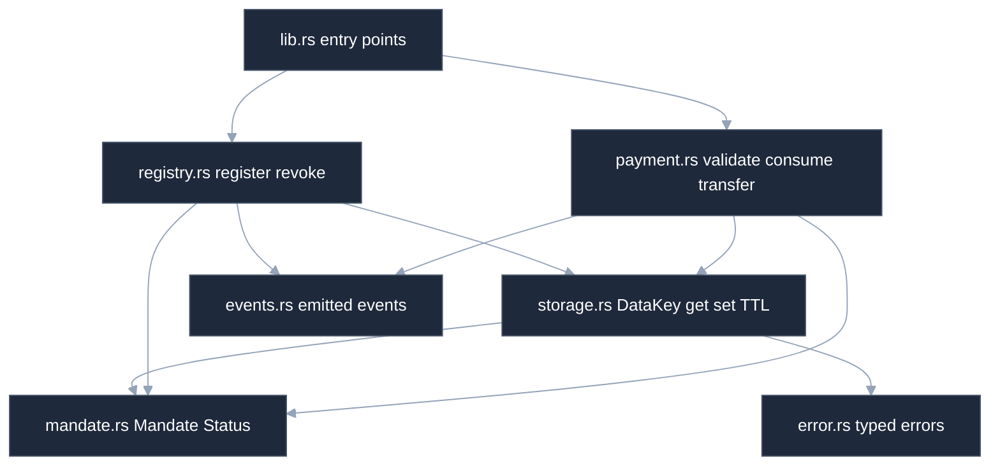
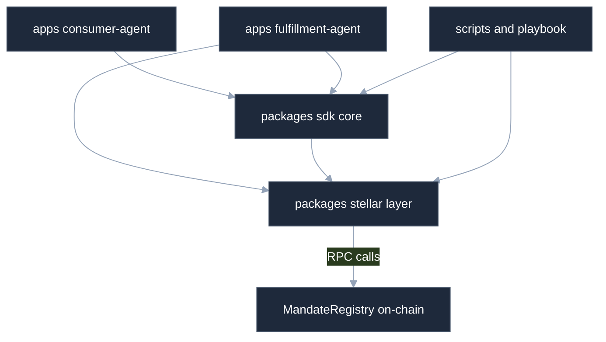
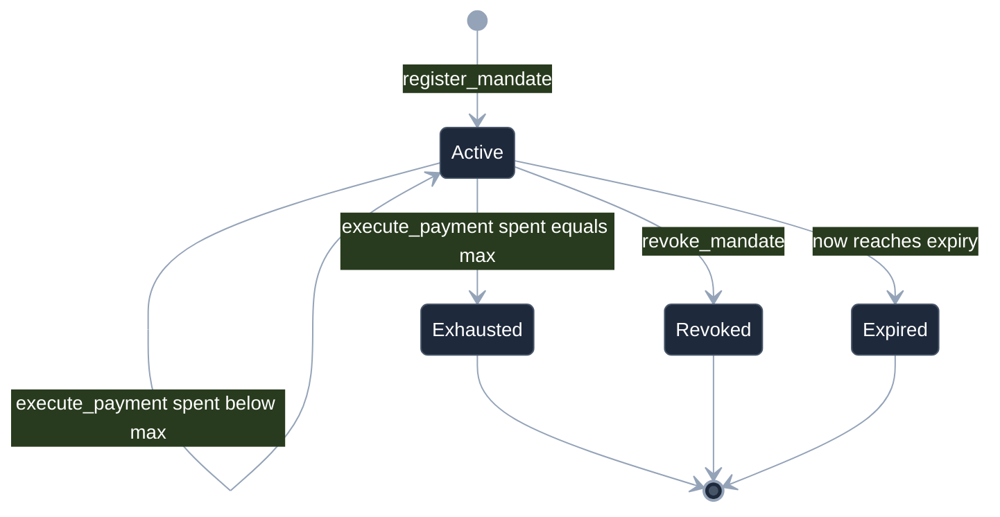

# REAPP Protocol: Full Code Review

An annotated, file-by-file source listing of the `reapp-protocol` monorepo. For every meaningful source file you get its **role**, an **explanation of what the code does** (function by function), and the **verbatim source inlined** below it. Architecture diagrams up front tie it all together.

> **Snapshot:** `reapp-protocol` at commit `2785ac7` (2026-06-16). Every fenced code block is read directly from disk by a deterministic generator, so it is character-for-character identical to the source, comments included. The explanatory prose is this document's own.

> **How to read this:** start with [Architecture](#architecture) for the system model and diagrams, then jump to any file via the [File Inventory](#file-inventory). Each file section is self-contained: explanation first, then the full code.

---

## Contents

- [Architecture](#architecture)
  - [System Overview](#system-overview)
  - [Diagrams](#diagrams)
  - [Security Model](#security-model)
  - [On-Chain Data Model](#on-chain-data-model)
  - [Repository Map](#repository-map)
- [File Inventory](#file-inventory)
- [Smart Contract: MandateRegistry (Rust / Soroban)](#smart-contract-mandateregistry-rust-soroban)
  - [`contracts/mandate-registry/Cargo.toml`](#contractsmandate-registrycargotoml)
  - [`contracts/mandate-registry/src/lib.rs`](#contractsmandate-registrysrclibrs)
  - [`contracts/mandate-registry/src/registry.rs`](#contractsmandate-registrysrcregistryrs)
  - [`contracts/mandate-registry/src/mandate.rs`](#contractsmandate-registrysrcmandaters)
  - [`contracts/mandate-registry/src/payment.rs`](#contractsmandate-registrysrcpaymentrs)
  - [`contracts/mandate-registry/src/storage.rs`](#contractsmandate-registrysrcstoragers)
  - [`contracts/mandate-registry/src/events.rs`](#contractsmandate-registrysrceventsrs)
  - [`contracts/mandate-registry/src/error.rs`](#contractsmandate-registrysrcerrorrs)
  - [`contracts/mandate-registry/src/reentry_probe.rs`](#contractsmandate-registrysrcreentryprobers)
  - [`contracts/mandate-registry/src/test.rs`](#contractsmandate-registrysrctestrs)
- [SDK: @reapp-sdk/core](#sdk-reapp-sdkcore)
  - [`packages/sdk/src/index.ts`](#packagessdksrcindexts)
  - [`packages/sdk/src/x402.ts`](#packagessdksrcx402ts)
  - [`packages/sdk/src/x402.test.ts`](#packagessdksrcx402testts)
  - [`packages/sdk/src/fetch.test.ts`](#packagessdksrcfetchtestts)
  - [`packages/sdk/test/index.test.mjs`](#packagessdktestindextestmjs)
  - [`packages/sdk/package.json`](#packagessdkpackagejson)
  - [`packages/sdk/tsconfig.json`](#packagessdktsconfigjson)
  - [`packages/sdk/README.md`](#packagessdkreadmemd)
- [Stellar Binding Layer: @reapp/stellar](#stellar-binding-layer-reappstellar)
  - [`packages/stellar/src/index.ts`](#packagesstellarsrcindexts)
  - [`packages/stellar/src/client.ts`](#packagesstellarsrcclientts)
  - [`packages/stellar/src/registry.ts`](#packagesstellarsrcregistryts)
  - [`packages/stellar/src/token.ts`](#packagesstellarsrctokents)
  - [`packages/stellar/src/signer.ts`](#packagesstellarsrcsignerts)
  - [`packages/stellar/src/config.ts`](#packagesstellarsrcconfigts)
  - [`packages/stellar/package.json`](#packagesstellarpackagejson)
  - [`packages/stellar/tsconfig.json`](#packagesstellartsconfigjson)
  - [`packages/stellar/README.md`](#packagesstellarreadmemd)
- [Reference Apps](#reference-apps)
  - [`apps/fulfillment-agent/src/server.ts`](#appsfulfillment-agentsrcserverts)
  - [`apps/fulfillment-agent/src/server.test.ts`](#appsfulfillment-agentsrcservertestts)
  - [`apps/fulfillment-agent/src/fixtures/payment-meta.json`](#appsfulfillment-agentsrcfixturespayment-metajson)
  - [`apps/fulfillment-agent/package.json`](#appsfulfillment-agentpackagejson)
  - [`apps/fulfillment-agent/tsconfig.json`](#appsfulfillment-agenttsconfigjson)
  - [`apps/consumer-agent/src/research-agent.ts`](#appsconsumer-agentsrcresearch-agentts)
  - [`apps/consumer-agent/package.json`](#appsconsumer-agentpackagejson)
  - [`apps/consumer-agent/tsconfig.json`](#appsconsumer-agenttsconfigjson)
- [Scripts & Tooling](#scripts-tooling)
  - [`scripts/deploy.mjs`](#scriptsdeploymjs)
  - [`scripts/e2e-testnet.mjs`](#scriptse2e-testnetmjs)
  - [`scripts/e2e-sdk.mjs`](#scriptse2e-sdkmjs)
  - [`scripts/e2e-x402.ts`](#scriptse2e-x402ts)
  - [`scripts/audit-mandate.mjs`](#scriptsaudit-mandatemjs)
  - [`scripts/derive-freighter.mjs`](#scriptsderive-freightermjs)
  - [`scripts/screenshot-proofs.mjs`](#scriptsscreenshot-proofsmjs)
  - [`scripts/verify.mjs`](#scriptsverifymjs)
- [Playbook, Config & CI](#playbook-config-ci)
  - [`playbook/demo.ts`](#playbookdemots)
  - [`package.json`](#packagejson)
  - [`tsconfig.base.json`](#tsconfigbasejson)
  - [`.github/workflows/ci.yml`](#githubworkflowsciyml)
  - [`.githooks/pre-push`](#githookspre-push)
  - [`.env.example`](#envexample)
  - [`README.md`](#readmemd)

---

## Architecture

### System Overview

REAPP is an on-chain enforcement layer for autonomous agent payments on Stellar/Soroban. The thesis is blunt: an AI agent cannot be trusted to police its own spending, so the spending limit is placed *below* the agent, inside a Soroban contract that sits directly in the money path. The system is organized as three layers that cleanly separate authorization, action, and enforcement.

**Layer 1 - the user authorizes (off-chain intent, on-chain consent).** A user constructs an AP2-style IntentMandate ("agent G… may spend up to 5.00 at merchant G… in asset C… until expiry"). The SDK hashes the mandate's canonical fields into a 32-byte id (`vc_hash`) and the user signs two on-chain operations: `register_mandate` (stores the mandate with the contract initializing `spent=0, seq=0, status=Active`) and a SEP-41 `approve` that grants the allowance **to the MandateRegistry contract** - never to the agent or the SDK. After this step the funds still live in the user's own wallet; the contract merely holds permission to pull them, capped at the mandate budget.

**Layer 2 - the agent acts (x402 over HTTP).** The agent answers a task by buying access to 402-gated resources. It calls `agent.fetch(url)`; on an HTTP `402 Payment Required` the SDK parses the x402 challenge, settles the payment on-chain, and retries with an `X-PAYMENT` settlement-proof header carrying the transaction hash. The agent holds only an agent keypair whose sole power is to call `execute_payment`. It cannot move money any other way: it has no allowance, so a direct `transfer_from` would fail.

**Layer 3 - the contract enforces and consumes (`execute_payment`).** This is the only code path that moves a user's funds. In a single atomic transaction the contract requires the bound agent's auth, checks the replay sequence, re-validates scope/budget/expiry/status against *stored* state, advances `spent` and `seq`, and only then performs the SEP-41 `transfer_from(contract spender, user → merchant, amount)`. Any failure reverts the whole transaction - there is no partial spend.

**The core trust invariant.** Money moves only through `execute_payment`, which validates-and-consumes the mandate atomically before it transfers. The allowance is granted to the contract, not the agent or SDK, so the SDK is *untrusted infrastructure*: a buggy or malicious SDK cannot exceed the mandate because every spend is re-validated and consumed on-chain. Critically, the payee and the budget cap are read from the **stored mandate**, never from call parameters supplied at pay time - the agent passes only `mandate_id`, `amount`, and `expected_seq`, while `merchant`, `asset`, and `max_amount` come from contract storage. This closes the redirect-funds and overspend classes by construction.

**Package layout.** `contracts/mandate-registry/` is the Rust/soroban-sdk contract - the entire protocol, deliberately small so it is auditable. `packages/stellar/` (`@reapp-sdk/stellar`) is the typed Soroban layer: a generated MandateRegistry client, network config, a keypair-signer adapter, a registry-client factory, and minimal SEP-41 helpers. `packages/sdk/` (`@reapp-sdk/core`) is the thin, untrusted developer-facing client - mandate construction, amount parsing to i128 stroops, the `Agent` class with `pay`/`fetch`, and the x402 wire-format adapter. `apps/` holds the two reference agents: `fulfillment-agent` (a 402-gated merchant that verifies payment on-chain before serving) and `consumer-agent` (a ResearchAgent that buys sources via `agent.fetch`). `scripts/` holds deploy, audit, and end-to-end harnesses (including the no-mocks `e2e-testnet.mjs`).

### Diagrams

#### System actors & money flow

The four actors and two contracts, showing how authorization (register + approve to the contract), action (x402), and enforcement (execute_payment → transfer_from) connect. The user approves the contract, never the agent.



#### Payment execution sequence

The execute_payment happy path: the agent settles a 402 by reading the current sequence, submitting the spend, and the contract validating, consuming, and transferring atomically before the merchant independently verifies on-chain.



#### Smart contract module map

How the contract modules relate. Dependencies flow one way with no cycles: lib dispatches to registry and payment, which go through storage to the data and error types, while events is a leaf.



#### Package dependency graph

How the TypeScript packages, apps, and scripts depend on each other and on the on-chain contract. The core SDK builds on the stellar layer; both reference apps build on the core SDK.



#### Mandate lifecycle

The state machine of a mandate from registration through its terminal states. A mandate becomes Exhausted only when the budget is fully consumed, Expired by the passage of time, or Revoked by the user.



### Security Model

The contract is the security boundary; everything in TypeScript is a convenience wrapper whose checks are advisory. Each attack class is closed by a specific on-chain mechanism.

**Redirect funds (pay an attacker instead of the named merchant).** `execute_payment` never accepts a merchant parameter. It reads `mandate.merchant` from stored state (`let merchant = mandate.merchant.clone()`) and passes that as the `to` of `transfer_from`. The agent can only choose `amount`, `mandate_id`, and `expected_seq`. A mismatched merchant in `validate_mandate`'s explicit-merchant preflight returns `MerchantOutOfScope` (error 7), but the spend path simply cannot be pointed elsewhere.

**Overspend, single payment.** The `check` helper enforces `m.spent + amount > m.max_amount → BudgetExceeded` (error 6) against the stored budget, which the caller cannot supply. Amounts are validated `> 0` (`InvalidAmount`, error 9), and the SDK additionally rejects values exceeding i128 max before they reach the unchecked ScVal encoder.

**Overspend, cumulative.** `spent` is a monotonically increasing cumulative total stored on the mandate; every `execute_payment` does `mandate.spent += amount` and the budget check runs against the running total, so a sequence of small payments cannot together exceed `max_amount`. When `spent == max_amount` the contract flips `status` to `Exhausted`; the next attempt fails the status check. `overflow-checks = true` (Cargo release profile) means the i128 addition panics-and-reverts rather than wrapping.

**Replay via sequence (re-submit an already-consumed payment).** Each mandate carries a monotonic `seq`. `execute_payment` requires `expected_seq == mandate.seq` or returns `BadSequence` (error 8), then increments `seq` on success. This is a mandate-layer guard layered on top of Soroban's transport-level nonce: a duplicate or out-of-order spend is refused even if the transaction envelope is otherwise valid.

**Expired / revoked / exhausted mandate.** `check` matches `status` first: `Revoked → MandateRevoked` (5), `Exhausted → BudgetExceeded` (6). Expiry is enforced as `env.ledger().timestamp() >= m.expiry → MandateExpired` (4), symmetric with registration which requires `expiry > now`. `revoke_mandate` requires the stored user's auth and flips status to `Revoked`, after which every spend is rejected on-chain regardless of what the SDK believes.

**Out-of-scope merchant.** In the read-only `validate_mandate` preflight, a merchant other than the stored one returns `MerchantOutOfScope`. In the authoritative path the merchant is read from storage, so out-of-scope is structurally impossible rather than merely checked.

**Reentrancy via an evil token.** `execute_payment` follows strict checks-effects-interactions ordering: it validates, then writes the updated mandate to storage (`storage::set_mandate`), and **only after the state write** calls the external `token.transfer_from`. A malicious SEP-41/SAC asset that re-enters `execute_payment` during the transfer sees already-advanced `spent` and `seq`, so the re-entrant call fails the sequence or budget check. A dedicated `reentry_probe` test exercises this.

**Forged payment event (merchant tricked into serving without real payment).** The reference merchant never trusts the `X-PAYMENT` header. It reads the transaction from Soroban RPC and runs the pure `selectPayment` decision, whose load-bearing check is `ev.contractId !== cfg.registryId → skip`: only a `payment` event emitted by the *trusted MandateRegistry* counts. The token's own `transfer` event in the same transaction, or a forged `("payment", merchant, amount)` event from any other contract, is ignored. It then requires `topic1 == merchant` and `amount >= price`.

**Merchant replay / TOCTOU (one payment, unlimited unlocks; or two concurrent requests with the same proof).** The merchant keeps a `ProofLedger` of redeemed transaction hashes. `reserve(txHash)` is *synchronous* and runs **before** the async on-chain verification, so two concurrent requests with the same proof cannot both pass during the await window. A failed verification calls `release(txHash)` so a transient RPC lag does not permanently burn a real payment.

**Auth bound to the stored agent.** `execute_payment` calls `mandate.agent.require_auth()` on the agent address loaded from storage - not on a caller-supplied address. Unauthorized callers are rejected by Soroban's host-level `require_auth` (a transaction revert), which is why there is intentionally no `NotAuthorized` contract error variant (slot 3 is reserved); the test suite asserts the host revert directly.

### On-Chain Data Model

**The `Mandate` struct** (`mandate.rs`, a `#[contracttype]` of pure data, no logic):

- `user: Address` - signer of the AP2 IntentMandate; the principal that grants the SEP-41 allowance and the only one who may register or revoke.
- `agent: Address` - the ONLY principal permitted to call `execute_payment`; auth is bound to this stored value.
- `merchant: Address` - the single allowed payee (scope). MVP is one address; a future tranche notes `Vec<Address>` or a scope-hash. The spend path reads the payee from here, never from a call parameter.
- `asset: Address` - the SEP-41 / SAC contract id (native XLM asset contract on testnet).
- `max_amount: i128` - total budget authorized by the mandate.
- `spent: i128` - cumulative consumed; invariant `0 <= spent <= max_amount`. Advanced on every payment.
- `expiry: u64` - ledger-close timestamp (seconds) at or after which the mandate is dead.
- `seq: u32` - monotonic payment counter; the mandate-level replay guard and audit cursor.
- `status: Status` - lifecycle state (see enum below).
- `vc_hash: BytesN<32>` - hash binding to the off-chain AP2 IntentMandate VC; also serves as the storage key / mandate id.

**The `Status` enum** (`#[contracttype]`):

- `Active` - registered and spendable while not expired and within budget.
- `Revoked` - the user withdrew consent via `revoke_mandate`; all spends rejected.
- `Exhausted` - set automatically by `execute_payment` when `spent == max_amount`; further spends rejected as `BudgetExceeded`.

**Storage keys (`DataKey`, `storage.rs`).** There is a single variant:

- `DataKey::Mandate(BytesN<32>)` - keyed by `vc_hash`, mapping to a `Mandate`.

All mandates live in **persistent** storage (`env.storage().persistent()`), the durable space appropriate for long-lived per-user records, not instance storage. The contract holds no instance-level configuration - there is no admin, no global config key - which keeps the storage surface minimal. On every `set_mandate`, TTL is extended with `extend_ttl(TTL_THRESHOLD = DAY_IN_LEDGERS, TTL_EXTEND = 30 * DAY_IN_LEDGERS)` (at ~5s ledgers, roughly a 30-day bump past a typical mandate's life). `storage.rs` is the *only* module that touches `env.storage`, so any key-layout or TTL change is localized to one file.

**Events emitted (`events.rs`, a leaf module - anyone may emit, so consumers must verify the emitter):**

- `mandate_registered` - topic `("register", user)`, data `mandate_id`. Emitted by `register_mandate`.
- `payment_executed` - topic `("payment", merchant)`, data `(mandate_id, amount)`. Emitted by `execute_payment`; this is the event the reference merchant matches on-chain (filtered by the registry's contract id) before serving a resource.
- `mandate_revoked` - topic `("revoke",)`, data `mandate_id`. Emitted by `revoke_mandate`.

**Typed errors (`error.rs`, `#[contracterror]`, `#[repr(u32)]`):** `AlreadyExists=1`, `NotFound=2`, (3 reserved - auth is host-enforced via `require_auth`, no `NotAuthorized` variant), `MandateExpired=4`, `MandateRevoked=5`, `BudgetExceeded=6`, `MerchantOutOfScope=7`, `BadSequence=8`, `InvalidAmount=9`. These codes are mirrored in the TypeScript `Errors` map so apps can branch on a rejection (e.g. the ResearchAgent maps `#6` to "budget exceeded").

### Repository Map

**`contracts/mandate-registry/`** - the Rust/soroban-sdk enforcement contract, deployed and audited on Stellar testnet (`CB4KOTLG…7ZOA`). Its `src/` is split so that dependencies flow one way with no cycles: `lib.rs` (thin contract entry points, no logic), `mandate.rs` (the `Mandate` and `Status` types, pure data), `storage.rs` (the only module touching `env.storage`: `DataKey`, get/set, TTL), `registry.rs` (`register_mandate` / `revoke_mandate`), `payment.rs` (`check`, `validate_mandate`, `execute_payment` - the money path), `events.rs` (the three emitted events), and `error.rs` (typed errors). `test.rs` and `reentry_probe.rs` hold the unit/reentrancy suites; `test_snapshots/` holds recorded ledger snapshots; `target/` is the build output.

**`packages/stellar/` (`@reapp-sdk/stellar`)** - the typed Soroban layer. `src/client.ts` is the MandateRegistry contract client generated from the audited ABI (with the embedded contract spec and the `Errors`/`Mandate`/`Status` types). `config.ts` holds `NetworkConfig` and the `TESTNET` constants (RPC URL, passphrase, contract id, native SAC). `signer.ts` adapts a Stellar keypair into the signer shape the client needs. `registry.ts` is the factory that wires a client to a network plus signer. `token.ts` is the minimal SEP-41 helper set (`approve`, `balance`) built directly on `@stellar/stellar-sdk`. `index.ts` re-exports the layer.

**`packages/sdk/` (`@reapp-sdk/core`)** - the thin, untrusted developer client. `src/index.ts` holds `createIntentMandate` (canonical-hash id derivation), `toStroops` (strict human→i128 conversion), the `reapp` facade (`registerMandate`, `approveBudget`, `revokeMandate`, `agent`), and the `Agent` class with `pay` and the x402 `fetch`. `src/x402.ts` is the *only* module that knows the HTTP wire shape: `parse402`, `encodePaymentProof`, `decodePaymentProof`, and the header constant. `test/index.test.mjs` is the unit suite.

**`apps/consumer-agent/`** - the reference ResearchAgent. `src/research-agent.ts` walks a list of sources, buying each via `agent.fetch`, sequentially because the on-chain `seq` increments per spend; it maps contract rejections to human reasons and never holds the budget.

**`apps/fulfillment-agent/`** - the reference 402-gated merchant. `src/server.ts` is a zero-framework `node:http` server that answers `402` with an x402 challenge, then independently verifies the claimed payment on-chain (`extractContractEvents` → `interpretEvents` → the pure `selectPayment` decision) and refuses replays via `ProofLedger`. `src/fixtures/payment-meta.json` backs the unit tests of the pure verification logic.

**`scripts/`** - operational harnesses: `deploy.mjs` (testnet deploy), `e2e-testnet.mjs` (the no-mocks on-chain end-to-end with rogue-rejection proofs), `e2e-sdk.mjs` and `e2e-x402.ts` (SDK and x402 round-trip e2e), `audit-mandate.mjs` (independent on-chain mandate auditor), `derive-freighter.mjs`, `screenshot-proofs.mjs`, and `verify.mjs` (the CI-mirroring local gate).

**`playbook/`** - `demo.ts`, a thin wrapper that runs the canonical on-chain script for the `npm run demo` "aha" moment.

**`.github/`** - `workflows/ci.yml`, the CI pipeline (fmt, clippy, test, clean build). **`.githooks/`** - `pre-push`, the local hook that mirrors CI so nothing unverified is pushed.

**`docs/`** - the tranche-1 step writeups (`tranche-1-step-1/2/3.md`) and `code-review.md`. **`security/`** - the independent audit records: contract (`audit-2026-06-10.md`), SDK (`sdk-audit-2026-06-15.md`), x402 (`x402-audit-2026-06-16.md`), plus a README. **`example-output/`** - captured proof artifacts: per-step sign-offs, verified writeups, an e2e log, and a `screenshots/` directory.

---

## File Inventory

Every file inlined in this document, in the order it appears. Generated artifacts are intentionally **not** inlined: `node_modules/`, `dist/` (compiled output), `target/` (Rust build), `package-lock.json` / `Cargo.lock`, `contracts/.../test_snapshots/*.json` (recorded test ledgers), and `example-output/` (screenshots and run logs).

| # | File | Lines | Role |
| --: | --- | --: | --- |
| 1 | [`contracts/mandate-registry/Cargo.toml`](#contractsmandate-registrycargotoml) | 25 | Crate manifest for the MandateRegistry Soroban smart contract; pins the SDK and hardens the release profile. |
| 2 | [`contracts/mandate-registry/src/lib.rs`](#contractsmandate-registrysrclibrs) | 100 | Crate root and contract entry-point: thin `#[contractimpl]` dispatch with no business logic, plus the module dependency graph. |
| 3 | [`contracts/mandate-registry/src/registry.rs`](#contractsmandate-registrysrcregistryrs) | 72 | Mandate lifecycle module: user-authorized registration and revocation; no money movement. |
| 4 | [`contracts/mandate-registry/src/mandate.rs`](#contractsmandate-registrysrcmandaters) | 36 | Pure data definition of the `Mandate` struct and `Status` enum; no logic, no storage, no auth. |
| 5 | [`contracts/mandate-registry/src/payment.rs`](#contractsmandate-registrysrcpaymentrs) | 98 | The money path: the central `check` validator, the read-only `validate_mandate` dry run, and the atomic `execute_payment` that is the only function moving funds. |
| 6 | [`contracts/mandate-registry/src/storage.rs`](#contractsmandate-registrysrcstoragers) | 40 | Sole persistence module: defines the storage key, all get/set/has accessors, and the TTL bump policy. |
| 7 | [`contracts/mandate-registry/src/events.rs`](#contractsmandate-registrysrceventsrs) | 26 | Leaf module emitting the three contract events for off-chain indexers and audit. |
| 8 | [`contracts/mandate-registry/src/error.rs`](#contractsmandate-registrysrcerrorrs) | 25 | Leaf module defining the contract's typed error enum with stable numeric codes. |
| 9 | [`contracts/mandate-registry/src/reentry_probe.rs`](#contractsmandate-registrysrcreentryprobers) | 80 | Adversarial regression test: a malicious SEP-41 token reenters execute_payment during transfer_from to prove no double-spend. |
| 10 | [`contracts/mandate-registry/src/test.rs`](#contractsmandate-registrysrctestrs) | 346 | Integration and §10 negative-path test suite: happy path, every validation rejection, replay/sequence, auth reverts, and defense-in-depth. |
| 11 | [`packages/sdk/src/index.ts`](#packagessdksrcindexts) | 279 | Public entry point of @reapp-sdk/core: the untrusted client that builds mandates, registers/approves/revokes them on-chain, and exposes the Agent that pays. |
| 12 | [`packages/sdk/src/x402.ts`](#packagessdksrcx402ts) | 122 | The sole HTTP/wire-format adapter for the x402 (HTTP 402) challenge and the X-PAYMENT settlement-proof header; isolated so the evolving x402 spec never touches the mandate or contract code. |
| 13 | [`packages/sdk/src/x402.test.ts`](#packagessdksrcx402testts) | 141 | Unit tests for the x402 wire adapter: exhaustively exercises decodePaymentProof's strict validation and every parse402 branch (defaults, aliases, and throw paths). |
| 14 | [`packages/sdk/src/fetch.test.ts`](#packagessdksrcfetchtestts) | 131 | Unit tests for Agent.fetch's x402 orchestration in isolation: stubs global fetch and overrides Agent.pay so it tests the HTTP glue (402 handling, pre-flight checks, paid retry) with no network and no chain. |
| 15 | [`packages/sdk/test/index.test.mjs`](#packagessdktestindextestmjs) | 59 | Unit tests for the money-parsing and mandate-construction guards (toStroops and createIntentMandate), run against the package with Node's built-in test runner. |
| 16 | [`packages/sdk/package.json`](#packagessdkpackagejson) | 41 | npm package manifest for @reapp-sdk/core: declares the ESM build, public entry points, dependencies, and the build/test scripts. |
| 17 | [`packages/sdk/tsconfig.json`](#packagessdktsconfigjson) | 10 | TypeScript build configuration for the package: extends the monorepo base and emits dist from src, excluding test files. |
| 18 | [`packages/sdk/README.md`](#packagessdkreadmemd) | 163 | Public package documentation: the under-10-lines quick start, the three-signer flow, the x402 client, the full API reference, and the contract error-code table. |
| 19 | [`packages/stellar/src/index.ts`](#packagesstellarsrcindexts) | 13 | Public barrel/entrypoint that re-exports the entire @reapp-sdk/stellar surface. |
| 20 | [`packages/stellar/src/client.ts`](#packagesstellarsrcclientts) | 173 | Auto-generated typed contract binding for the MandateRegistry Soroban contract (the audited ABI as TypeScript). |
| 21 | [`packages/stellar/src/registry.ts`](#packagesstellarsrcregistryts) | 16 | Thin factory that wires a NetworkConfig plus a KeypairSigner into a ready-to-use typed MandateRegistry Client. |
| 22 | [`packages/stellar/src/token.ts`](#packagesstellarsrctokents) | 81 | Minimal dependency-free SEP-41 token client: approve an allowance and read a balance via raw stellar-sdk RPC. |
| 23 | [`packages/stellar/src/signer.ts`](#packagesstellarsrcsignerts) | 27 | Adapter turning a Stellar secret key or Keypair into the signer shape the contract client and tx builders expect. |
| 24 | [`packages/stellar/src/config.ts`](#packagesstellarsrcconfigts) | 18 | Network configuration types and the canonical TESTNET constant (RPC, passphrase, live contract id, native SAC). |
| 25 | [`packages/stellar/package.json`](#packagesstellarpackagejson) | 42 | Package manifest for the publishable @reapp-sdk/stellar npm module (ESM, typed, tsc-built). |
| 26 | [`packages/stellar/tsconfig.json`](#packagesstellartsconfigjson) | 98 | TypeScript compiler config for emitting the typed ESM build with declarations into dist. |
| 27 | [`packages/stellar/README.md`](#packagesstellarreadmemd) | 52 | Package documentation: what the low-level Stellar layer exports, how to use it, and when to prefer @reapp-sdk/core. |
| 28 | [`apps/fulfillment-agent/src/server.ts`](#appsfulfillment-agentsrcserverts) | 276 | The 402-gated reference merchant: issues x402 challenges and independently verifies on-chain payment before serving a resource. |
| 29 | [`apps/fulfillment-agent/src/server.test.ts`](#appsfulfillment-agentsrcservertestts) | 154 | Node test suite proving the merchant's verification accepts real on-chain payments and rejects every forgery/replay class. |
| 30 | [`apps/fulfillment-agent/src/fixtures/payment-meta.json`](#appsfulfillment-agentsrcfixturespayment-metajson) | 5 | Golden test fixture: a real testnet execute_payment transaction meta (base64 XDR) plus its tx hash. |
| 31 | [`apps/fulfillment-agent/package.json`](#appsfulfillment-agentpackagejson) | 18 | Package manifest for the reference merchant app: scripts, type:module, and SDK dependencies. |
| 32 | [`apps/fulfillment-agent/tsconfig.json`](#appsfulfillment-agenttsconfigjson) | 11 | TypeScript config for the merchant app, extending the monorepo base. |
| 33 | [`apps/consumer-agent/src/research-agent.ts`](#appsconsumer-agentsrcresearch-agentts) | 91 | The reference autonomous spender (ResearchAgent): buys 402-gated sources via the SDK's agent.fetch, with the contract as the leash. |
| 34 | [`apps/consumer-agent/package.json`](#appsconsumer-agentpackagejson) | 15 | Package manifest for the reference consumer/spender app. |
| 35 | [`apps/consumer-agent/tsconfig.json`](#appsconsumer-agenttsconfigjson) | 10 | TypeScript config for the consumer app, extending the monorepo base. |
| 36 | [`scripts/deploy.mjs`](#scriptsdeploymjs) | 248 | Builds the MandateRegistry Soroban contract to WASM and deploys it to Stellar testnet, then writes the resulting contract ID back into .env. |
| 37 | [`scripts/e2e-testnet.mjs`](#scriptse2e-testnetmjs) | 278 | Full on-chain end-to-end proof of the mandate flow and its bypass-proof properties against live testnet using the stellar CLI and the native XLM SAC - no mocks. |
| 38 | [`scripts/e2e-sdk.mjs`](#scriptse2e-sdkmjs) | 134 | End-to-end proof of the full mandate flow driven through the published @reapp-sdk/core and @reapp-sdk/stellar packages against live testnet - proving the SDK surface, not the raw CLI. |
| 39 | [`scripts/e2e-x402.ts`](#scriptse2e-x402ts) | 120 | End-to-end proof of the x402 HTTP round-trip: an agent fetches a 402-gated resource, settles payment on-chain via the SDK, receives the resource, and is blocked by the contract once the budget is exhausted. |
| 40 | [`scripts/audit-mandate.mjs`](#scriptsaudit-mandatemjs) | 196 | Independent, read-only on-chain auditor: reads a mandate straight from the MandateRegistry plus the SEP-41 allowance and user balance, and reports the true amount an agent can still spend - derived purely from chain state. |
| 41 | [`scripts/derive-freighter.mjs`](#scriptsderive-freightermjs) | 144 | Local helper that recovers the Stellar secret key for a known public key from a Freighter BIP-39 seed phrase, by deriving and scanning HD account indexes. |
| 42 | [`scripts/screenshot-proofs.mjs`](#scriptsscreenshot-proofsmjs) | 51 | Captures full-page Playwright screenshots of the canonical testnet transactions and the contract overview page, for use as visual proof in grant/demo materials. |
| 43 | [`scripts/verify.mjs`](#scriptsverifymjs) | 43 | Local CI-equivalent gate run before every push (and wired as a git pre-push hook) that mirrors the CI pipeline so nothing that would fail CI reaches the remote. |
| 45 | [`playbook/demo.ts`](#playbookdemots) | 23 | The `npm run demo` entry point - a thin wrapper that shells out to the canonical on-chain end-to-end testnet script. |
| 46 | [`package.json`](#packagejson) | 36 | Root workspace manifest - defines the npm monorepo, the canonical run/build/verify/demo scripts, and shared dev tooling. |
| 47 | [`tsconfig.base.json`](#tsconfigbasejson) | 18 | Shared TypeScript compiler baseline that per-package tsconfigs extend. |
| 48 | [`.github/workflows/ci.yml`](#githubworkflowsciyml) | 38 | GitHub Actions CI pipeline - runs the Rust contract suite (incl. the §10 negative suite) and the TypeScript workspaces on every push and PR. |
| 49 | [`.githooks/pre-push`](#githookspre-push) | 5 | Git pre-push hook that runs the full local CI-equivalent gate before any push is allowed. |
| 50 | [`.env.example`](#envexample) | 16 | Template for the git-ignored `.env` - declares the testnet network config, burner keypair, and post-deploy contract IDs the scripts read. |
| 51 | [`README.md`](#readmemd) | 47 | Top-level project overview - states the thesis, the core security invariant, the repo layout, and how to run the two flagship demos. |

---

## Smart Contract: MandateRegistry (Rust / Soroban)

The trusted on-chain core. This is the only component that is trusted: every payment is validated and consumed here, with auth bound to the stored agent and money moving only through `execute_payment`.

### `contracts/mandate-registry/Cargo.toml`

*Crate manifest for the MandateRegistry Soroban smart contract; pins the SDK and hardens the release profile.*

Declares the `mandate-registry` package (version 0.0.0, edition 2021, `publish = false` since it deploys as on-chain wasm, not to crates.io). The `[lib]` section sets `crate-type = ["cdylib", "rlib"]` so the same source compiles both to the wasm32 dynamic library that gets uploaded to the network and to a regular Rust library used by the test harness; `doctest = false` disables doctests (consistent with the `#![no_std]` crate).

The only runtime dependency is `soroban-sdk = "22"`. The `[dev-dependencies]` re-declares it with the `testutils` feature, which supplies `Env::default`, `mock_all_auths`, `Address::generate`, the ledger time controls, and the generated `MandateRegistryClient` used throughout `test.rs` and `reentry_probe.rs`.

The `[profile.release]` block is security/footprint relevant: `opt-level = "z"` and `lto = true`, `codegen-units = 1`, `strip = "symbols"`, `debug = 0` minimize wasm size and surface; `panic = "abort"` matches Soroban's trap-on-panic model. Most importantly `overflow-checks = true` is enabled in release, so the `mandate.spent += amount` and `mandate.seq += 1` arithmetic in `payment.rs` traps (reverting the tx) on overflow rather than silently wrapping.

**Key items:**

- `crate-type = ["cdylib", "rlib"]` — Builds both the deployable wasm dylib and an rlib for in-process tests.
- `soroban-sdk = "22"` — Sole runtime dependency; the contract framework and SEP-41 TokenClient source.
- `dev-dependencies testutils feature` — Enables test-only env mocking, address generation, and the generated client.
- `overflow-checks = true` — Release-mode overflow trapping; makes spent/seq arithmetic revert instead of wrap.
- `panic = "abort"` — Aligns Rust panics with Soroban's trap-and-revert semantics.
- `opt-level="z" / lto / strip / codegen-units=1` — Size and attack-surface minimization for the uploaded wasm.

> **Note:** overflow-checks=true in the release profile is load-bearing for safety: the budget and sequence increments in payment.rs rely on it to trap rather than wrap. If a future profile change dropped it, i128/u32 overflow would become a silent vulnerability.

```toml
[package]
name = "mandate-registry"
version = "0.0.0"
edition = "2021"
publish = false

[lib]
crate-type = ["cdylib", "rlib"]
doctest = false

[dependencies]
soroban-sdk = "22"

[dev-dependencies]
soroban-sdk = { version = "22", features = ["testutils"] }

[profile.release]
opt-level = "z"
overflow-checks = true
debug = 0
strip = "symbols"
lto = true
panic = "abort"
codegen-units = 1
```

### `contracts/mandate-registry/src/lib.rs`

*Crate root and contract entry-point: thin `#[contractimpl]` dispatch with no business logic, plus the module dependency graph.*

Declares `#![no_std]` and the six internal modules (`error`, `events`, `mandate`, `payment`, `registry`, `storage`), re-exporting `Error`, `Mandate`, and `Status` for the generated client and tests. The doc comment fixes the one-way dependency flow (`lib → {registry, payment} → storage → mandate/error`, with `events` as a leaf), which is the architectural invariant the rest of the code respects (e.g. `payment` and `registry` never depend on each other).

The `MandateRegistry` struct carries `#[contract]` and its `impl` carries `#[contractimpl]`, which is what generates the `MandateRegistryClient` used in tests. Each of the five public methods is a one-line forwarder into a module function, keeping the audited surface minimal: `register_mandate` → `registry::register_mandate`, `validate_mandate` → `payment::validate_mandate`, `execute_payment` → `payment::execute_payment`, `revoke_mandate` → `registry::revoke_mandate`, and `get_mandate` → `storage::get_mandate`.

The doc comments encode the security model: money moves only through `execute_payment`, which validates-and-consumes atomically; `validate_mandate` is an explicitly read-only, no-auth dry run despite its consume-sounding name; and `execute_payment`'s `expected_seq` must equal the mandate's current `seq` or it fails with `BadSequence`. The two test modules (`test`, `reentry_probe`) are wired in under `#[cfg(test)]` at the bottom.

**Key items:**

- `MandateRegistry (#[contract])` — The contract type; its #[contractimpl] generates the client used by tests.
- `register_mandate(env,user,agent,merchant,asset,max_amount,expiry,vc_hash)->BytesN<32>` — Stores a user-signed mandate (contract forces spent=0/seq=0/Active); returns the id (=vc_hash).
- `validate_mandate(env,mandate_id,amount,merchant)->()` — Read-only, no-auth preflight; despite the name it mutates nothing.
- `execute_payment(env,mandate_id,amount,expected_seq)->()` — The sole money path; auth + seq guard + revalidate + consume + transfer, atomic.
- `revoke_mandate(env,mandate_id)->()` — User withdraws consent; marks the mandate Revoked.
- `get_mandate(env,mandate_id)->Mandate` — Read-only accessor; also how callers learn the current seq for the next payment.
- `pub use Error / Mandate / Status` — Re-exports consumed by the generated client and the test modules.

> **Note:** The method named validate_mandate does NOT consume anything; it is a dry run with no auth and no state change. The only authoritative consume is execute_payment. This naming is a deliberate spec-driven misnomer and is the most likely point of reviewer confusion.

```rust
#![no_std]
//! MandateRegistry — REAPP's on-chain enforcement layer.
//!
//! The contract is the entire protocol and is small by design: a small
//! interface is auditable. Money moves only through `execute_payment`, which
//! validates-and-consumes the mandate atomically before transferring. The SDK
//! is untrusted; this contract is the source of truth.
//!
//! Module responsibilities (dependencies flow ONE way, no cycles):
//!
//!   lib  →  {registry, payment}  →  storage  →  mandate / error
//!                  └────────────→  events  (leaf; anyone may emit)
//!
//!  - `lib`      — contract entry points only: thin dispatch, no logic.
//!  - `mandate`  — the `Mandate` type (pure data).
//!  - `storage`  — `DataKey` + all get/set/TTL (the ONLY module touching env.storage).
//!  - `registry` — register / revoke (allowance funding model).
//!  - `payment`  — validate_mandate + execute_payment + the token transfer.
//!  - `error`    — typed errors.
//!  - `events`   — emitted events.

mod error;
mod events;
mod mandate;
mod payment;
mod registry;
mod storage;

pub use error::Error;
pub use mandate::{Mandate, Status};

use soroban_sdk::{contract, contractimpl, Address, BytesN, Env};

#[contract]
pub struct MandateRegistry;

#[contractimpl]
impl MandateRegistry {
    /// Store a user-signed mandate from its authorized parameters. The contract
    /// sets `spent=0, seq=0, status=Active` itself. Authorized by `user`.
    /// Returns the mandate id (= `vc_hash`, the storage key).
    #[allow(clippy::too_many_arguments)]
    pub fn register_mandate(
        env: Env,
        user: Address,
        agent: Address,
        merchant: Address,
        asset: Address,
        max_amount: i128,
        expiry: u64,
        vc_hash: BytesN<32>,
    ) -> Result<BytesN<32>, Error> {
        registry::register_mandate(
            &env, user, agent, merchant, asset, max_amount, expiry, vc_hash,
        )
    }

    /// Read-only preflight — would this spend be permitted right now? Mutates
    /// nothing and requires no auth; the authoritative consume happens only in
    /// `execute_payment`. (Named per the protocol spec; it is a dry-run.)
    pub fn validate_mandate(
        env: Env,
        mandate_id: BytesN<32>,
        amount: i128,
        merchant: Address,
    ) -> Result<(), Error> {
        payment::validate_mandate(&env, mandate_id, amount, merchant)
    }

    /// The only money path. Atomic: require_auth(agent) → replay guard
    /// (`expected_seq` == current `seq`, else `BadSequence`) → re-validate →
    /// advance spent+seq → SEP-41 transfer_from(user → merchant). Reverts on any
    /// failure. `expected_seq` is the mandate's current sequence (read from
    /// `get_mandate`), preventing duplicate/out-of-order consumption.
    pub fn execute_payment(
        env: Env,
        mandate_id: BytesN<32>,
        amount: i128,
        expected_seq: u32,
    ) -> Result<(), Error> {
        payment::execute_payment(&env, mandate_id, amount, expected_seq)
    }

    /// User withdraws consent; marks the mandate Revoked. Authorized by the user.
    pub fn revoke_mandate(env: Env, mandate_id: BytesN<32>) -> Result<(), Error> {
        registry::revoke_mandate(&env, mandate_id)
    }

    /// Read-only accessor for the stored mandate (audit / preflight).
    pub fn get_mandate(env: Env, mandate_id: BytesN<32>) -> Result<Mandate, Error> {
        storage::get_mandate(&env, mandate_id)
    }
}

#[cfg(test)]
mod test;

#[cfg(test)]
mod reentry_probe;
```

### `contracts/mandate-registry/src/registry.rs`

*Mandate lifecycle module: user-authorized registration and revocation; no money movement.*

Implements `register_mandate` and `revoke_mandate`. `register_mandate` calls `user.require_auth()` first, so only the mandate signer can create one. It then validates inputs: `max_amount > 0` (else `InvalidAmount`), `expiry > now` using `env.ledger().timestamp()` (else `MandateExpired`, strict so a mandate is valid only while `now < expiry`), and uniqueness via `storage::has_mandate` (else `AlreadyExists`, which prevents overwriting an existing mandate and its accumulated `spent`). Crucially the caller supplies only the authorized fields; the contract itself constructs the `Mandate` with `spent = 0, seq = 0, status = Active`, so a caller can never seed a tampered balance or pre-exhausted/pre-revoked status. It persists via `storage::set_mandate`, emits `events::mandate_registered(id, user)`, and returns `vc_hash` as the mandate id.

`revoke_mandate` loads the mandate via `storage::get_mandate` (propagating `NotFound`), then calls `mandate.user.require_auth()` - note it authorizes against the stored `user`, not a caller-supplied address, so only the original signer can revoke. It sets `status = Revoked`, writes back, and emits `events::mandate_revoked(id)`. Once revoked, `payment::check` rejects any spend with `MandateRevoked`.

The module doc records two deliberate scope decisions: the funding model is allowance-primary (the user separately signs SEP-41 `approve` for this contract as spender; no funds are pulled at registration), and the §4.3 escrow escape hatch is intentionally unimplemented because the allowance path works end-to-end on testnet, so adding escrow now would be untriggered dead code.

**Key items:**

- `register_mandate(env,user,agent,merchant,asset,max_amount,expiry,vc_hash)->Result<BytesN<32>,Error>` — Auth user, validate amount/expiry/uniqueness, store with contract-forced spent=0/seq=0/Active, emit, return id.
- `revoke_mandate(env,mandate_id)->Result<(),Error>` — Load mandate, require_auth on the STORED user, set status=Revoked, persist, emit.
- `InvalidAmount guard` — Rejects max_amount <= 0 at registration.
- `MandateExpired guard` — Rejects expiry <= now; mandate must be created strictly in the future.
- `AlreadyExists guard` — has_mandate check stops overwriting an existing mandate's accumulated state.

> **Note:** Two auth-correctness invariants: (1) register authorizes the caller-supplied `user`, but the contract - not the caller - sets spent/seq/status, so a forged initial balance is impossible; (2) revoke authorizes the STORED `mandate.user`, not any caller parameter, so a third party cannot revoke someone else's mandate. Allowance funding is external (user signs approve separately); registration moves no money.

```rust
//! Mandate lifecycle: register / revoke. Depends on `storage`, `events`,
//! `mandate`, `error` — never on `payment`.
//!
//! Funding model (§4.3): allowance is PRIMARY — after registering, the user
//! signs SEP-41 `approve(spender = this contract, max_amount)` separately, so
//! no funds are pulled here. `execute_payment` later calls `transfer_from`.
//!
//! Escrow (§4.3 escape hatch): the decided rule is "use the allowance path; if
//! `transfer_from` fails after two genuine attempts, switch to escrow." The
//! allowance path works on live testnet (proven end-to-end), so escrow was
//! never triggered and is intentionally NOT implemented — adding it now would
//! be untriggered dead code. It is the documented contingency, not MVP scope.

use soroban_sdk::{Address, BytesN, Env};

use crate::error::Error;
use crate::mandate::{Mandate, Status};
use crate::{events, storage};

/// Store a user-signed mandate. The caller supplies only the AUTHORIZED
/// parameters; the contract initializes `spent=0, seq=0, status=Active` so a
/// caller can never seed a tampered balance/status. Authorized by the user.
#[allow(clippy::too_many_arguments)]
pub fn register_mandate(
    env: &Env,
    user: Address,
    agent: Address,
    merchant: Address,
    asset: Address,
    max_amount: i128,
    expiry: u64,
    vc_hash: BytesN<32>,
) -> Result<BytesN<32>, Error> {
    user.require_auth();

    if max_amount <= 0 {
        return Err(Error::InvalidAmount);
    }
    if expiry <= env.ledger().timestamp() {
        return Err(Error::MandateExpired);
    }
    if storage::has_mandate(env, &vc_hash) {
        return Err(Error::AlreadyExists);
    }

    let mandate = Mandate {
        user: user.clone(),
        agent,
        merchant,
        asset,
        max_amount,
        spent: 0,
        expiry,
        seq: 0,
        status: Status::Active,
        vc_hash: vc_hash.clone(),
    };
    storage::set_mandate(env, &vc_hash, &mandate);
    events::mandate_registered(env, &vc_hash, &user);
    Ok(vc_hash)
}

/// Mark a mandate Revoked — the user withdraws consent. Authorized by the user.
pub fn revoke_mandate(env: &Env, mandate_id: BytesN<32>) -> Result<(), Error> {
    let mut mandate = storage::get_mandate(env, mandate_id.clone())?;
    mandate.user.require_auth();
    mandate.status = Status::Revoked;
    storage::set_mandate(env, &mandate_id, &mandate);
    events::mandate_revoked(env, &mandate_id);
    Ok(())
}
```

### `contracts/mandate-registry/src/mandate.rs`

*Pure data definition of the `Mandate` struct and `Status` enum; no logic, no storage, no auth.*

Defines the `Mandate` `#[contracttype]` struct that is the contract's only persisted record, plus the `Status` enum. The struct binds the four principals/assets of a payment authorization - `user` (the AP2 IntentMandate signer who grants the SEP-41 allowance), `agent` (the sole principal allowed to call `execute_payment`), `merchant` (MVP single allowed payee / scope), and `asset` (the SEP-41/SAC token id, USDC on testnet) - together with the budget and replay state: `max_amount` (total authorized), `spent` (cumulative consumed, invariant `0 <= spent <= max_amount`), `expiry` (ledger timestamp after which it is dead), `seq` (monotonic payment counter / replay guard), `status`, and `vc_hash` (hash binding to the off-chain AP2 VC, and also the storage key).

It derives `Clone, Debug, PartialEq`, which is why `payment::execute_payment` can clone the loaded mandate, mutate fields, and write it back, and why tests can assert equality. The field comments double as a forward-compatibility roadmap (e.g. `merchant` becoming `Vec<Address>` or a scope-hash in tier 1).

`Status` has three variants: `Active` (the only spendable state), `Revoked` (user withdrew consent, set by `revoke_mandate`), and `Exhausted` (budget fully consumed, set by `execute_payment` when `spent == max_amount`). `payment::check` matches on these to gate spends.

**Key items:**

- `struct Mandate (#[contracttype])` — The single persisted record binding principals, asset, budget, replay state, and VC hash.
- `Mandate.user / agent / merchant` — Allowance grantor / sole execute_payment caller / single allowed payee (scope).
- `Mandate.asset` — SEP-41/SAC token contract id used for transfer_from.
- `Mandate.max_amount / spent` — Budget ceiling and cumulative consumed; invariant 0 <= spent <= max_amount.
- `Mandate.expiry / seq` — Time bound (seconds) and monotonic counter that backs the replay guard.
- `Mandate.vc_hash` — Binds to the off-chain AP2 IntentMandate VC and serves as the storage key (the mandate id).
- `enum Status { Active, Revoked, Exhausted }` — Lifecycle states; only Active is spendable, checked in payment::check.

> **Note:** The `spent <= max_amount` invariant is documented here but enforced in payment::check / execute_payment, not by the type. vc_hash is simultaneously the audit binding and the primary key, so the off-chain VC hash uniquely identifies the on-chain mandate; collisions would be caught by the AlreadyExists check in registry.

```rust
//! The `Mandate` type. Pure data — no logic, no storage.

use soroban_sdk::{contracttype, Address, BytesN};

#[contracttype]
#[derive(Clone, Debug, PartialEq)]
pub struct Mandate {
    /// Signer of the AP2 IntentMandate; grants the SEP-41 allowance.
    pub user: Address,
    /// The ONLY principal permitted to call `execute_payment`.
    pub agent: Address,
    /// MVP: single allowed payee (scope). T1: `Vec<Address>` or scope-hash.
    pub merchant: Address,
    /// SEP-41 / SAC contract id (USDC on testnet).
    pub asset: Address,
    /// Total budget authorized by the mandate.
    pub max_amount: i128,
    /// Cumulative consumed; invariant: `0 <= spent <= max_amount`.
    pub spent: i128,
    /// Ledger close timestamp (seconds) after which the mandate is dead.
    pub expiry: u64,
    /// Monotonic payment counter (mandate-level audit / replay guard).
    pub seq: u32,
    pub status: Status,
    /// Hash binding to the off-chain AP2 IntentMandate VC; also the storage key.
    pub vc_hash: BytesN<32>,
}

#[contracttype]
#[derive(Clone, Debug, PartialEq)]
pub enum Status {
    Active,
    Revoked,
    Exhausted,
}
```

### `contracts/mandate-registry/src/payment.rs`

*The money path: the central `check` validator, the read-only `validate_mandate` dry run, and the atomic `execute_payment` that is the only function moving funds.*

`check` is the single source of enforcement truth, re-run on every spend so the SDK is never trusted: it rejects `amount <= 0` (`InvalidAmount`), matches `status` (`Revoked` → `MandateRevoked`, `Exhausted` → `BudgetExceeded`, `Active` → continue), rejects `now >= expiry` (`MandateExpired`, symmetric with registration's `expiry > now`), enforces `merchant == m.merchant` (`MerchantOutOfScope`), and enforces `m.spent + amount <= m.max_amount` (`BudgetExceeded`). `validate_mandate` simply loads the mandate and calls `check` - no auth, no mutation; it exists to give the off-chain SDK a clean typed error before paying.

`execute_payment` is the security core and follows strict checks-effects-interactions ordering. (1) Load the mandate (`NotFound` if absent). (2) `mandate.agent.require_auth()` - only the bound agent can spend; this is host-enforced and reverts the tx if auth is missing/forged, with no typed error. (3) Replay guard: `expected_seq != mandate.seq` → `BadSequence`, blocking duplicate or out-of-order spends on top of Soroban's transport-level nonce. (4) Re-run `check` against stored state for scope/budget/expiry/status. (5) EFFECTS: `spent += amount`, `seq += 1`, flip `status = Exhausted` when `spent == max_amount`, and persist via `storage::set_mandate` BEFORE any external call. (6) INTERACTION: construct a `TokenClient` for `mandate.asset` and call SEP-41 `transfer_from(current_contract_address as spender, user → merchant, amount)`. (7) Emit `payment_executed`.

Because state is persisted before the token call, a malicious asset that reenters `execute_payment` during `transfer_from` sees the already-advanced `seq` and fails its reentrant call with `BadSequence` - exactly the property `reentry_probe.rs` asserts. Any failure anywhere (auth revert, bad seq, failed check, insufficient allowance in `transfer_from`, overflow) reverts the whole transaction, so there is never a partial spend.

**Key items:**

- `check(env,m,amount,merchant)->Result<(),Error> (private)` — The full validation: amount>0, status==Active, now<expiry, merchant in scope, spent+amount<=max_amount.
- `validate_mandate(env,mandate_id,amount,merchant)->Result<(),Error>` — Read-only dry run: load mandate + check; no auth, no state change.
- `execute_payment(env,mandate_id,amount,expected_seq)->Result<(),Error>` — Only money path: load → require_auth(agent) → seq guard → check → advance spent/seq/status → persist → transfer_from → emit.
- `expected_seq replay guard` — Must equal current mandate.seq; mandate-layer protection against duplicate/out-of-order execution.
- `Exhausted transition` — status flips to Exhausted exactly when spent==max_amount, short-circuiting future spends.
- `transfer_from(current_contract_address, user, merchant, amount)` — SEP-41 pull using the contract as the user-approved spender; the only external call.

> **Note:** Checks-effects-interactions is strict and load-bearing: state (spent/seq) is written via set_mandate BEFORE transfer_from, so reentrancy during the token call hits the advanced seq and dies with BadSequence - no double-spend. Auth is on mandate.agent (the stored value), not a parameter. Budget check uses spent+amount and relies on overflow-checks=true (Cargo.toml) to trap rather than wrap. Note the merchant passed to check inside execute_payment is the mandate's own merchant, so the scope check there is tautological; the meaningful scope enforcement against an arbitrary payee is exercised via validate_mandate.

```rust
//! The money path. The core invariant lives here: validating and consuming the
//! mandate is the SAME atomic operation as moving the funds, so there is no
//! window where validation and settlement disagree. Depends on `storage`,
//! `events`, `mandate`, `error` — never on `registry`.

use soroban_sdk::token::TokenClient;
use soroban_sdk::{Address, BytesN, Env};

use crate::error::Error;
use crate::mandate::{Mandate, Status};
use crate::{events, storage};

/// The single source of enforcement truth. Every check the protocol makes lives
/// here, and `execute_payment` re-runs it against stored state on every spend —
/// the SDK is never trusted to have validated.
fn check(env: &Env, m: &Mandate, amount: i128, merchant: &Address) -> Result<(), Error> {
    if amount <= 0 {
        return Err(Error::InvalidAmount);
    }
    match m.status {
        Status::Revoked => return Err(Error::MandateRevoked),
        Status::Exhausted => return Err(Error::BudgetExceeded),
        Status::Active => {}
    }
    // Expired at-or-after the expiry instant. Symmetric with register_mandate,
    // which requires expiry > now — a mandate is valid strictly while now < expiry.
    if env.ledger().timestamp() >= m.expiry {
        return Err(Error::MandateExpired);
    }
    if *merchant != m.merchant {
        return Err(Error::MerchantOutOfScope);
    }
    if m.spent + amount > m.max_amount {
        return Err(Error::BudgetExceeded);
    }
    Ok(())
}

/// Read-only preflight (dry run): would a payment of `amount` to `merchant` be
/// permitted right now? Mutates nothing, requires no auth — the SDK calls this
/// for a clean typed error before paying. The authoritative consume + transfer
/// happens only in `execute_payment`.
pub fn validate_mandate(
    env: &Env,
    mandate_id: BytesN<32>,
    amount: i128,
    merchant: Address,
) -> Result<(), Error> {
    let mandate = storage::get_mandate(env, mandate_id)?;
    check(env, &mandate, amount, &merchant)
}

/// The only code path that moves the user's funds. Atomically, in one tx:
///   1. `require_auth(mandate.agent)` — caller must be the bound agent.
///   2. replay guard: `expected_seq` must equal the mandate's current `seq`
///      (mandate-layer protection on top of Soroban's transport nonce). A
///      duplicate or out-of-order spend fails with `BadSequence`.
///   3. re-validate scope / budget / expiry / status against stored state.
///   4. advance `spent` + `seq` (flip to `Exhausted` when the budget is used up).
///   5. SEP-41 `transfer_from(contract spender, user → merchant, amount)`.
///
/// Any failure reverts the whole transaction — no partial spend.
pub fn execute_payment(
    env: &Env,
    mandate_id: BytesN<32>,
    amount: i128,
    expected_seq: u32,
) -> Result<(), Error> {
    let mut mandate = storage::get_mandate(env, mandate_id.clone())?;
    mandate.agent.require_auth();

    if expected_seq != mandate.seq {
        return Err(Error::BadSequence);
    }

    let merchant = mandate.merchant.clone();
    check(env, &mandate, amount, &merchant)?;

    mandate.spent += amount;
    mandate.seq += 1;
    if mandate.spent == mandate.max_amount {
        mandate.status = Status::Exhausted;
    }
    storage::set_mandate(env, &mandate_id, &mandate);

    // The contract is the allowance holder (spender); the user approved it.
    let token = TokenClient::new(env, &mandate.asset);
    token.transfer_from(
        &env.current_contract_address(),
        &mandate.user,
        &merchant,
        &amount,
    );

    events::payment_executed(env, &mandate_id, &merchant, amount);
    Ok(())
}
```

### `contracts/mandate-registry/src/storage.rs`

*Sole persistence module: defines the storage key, all get/set/has accessors, and the TTL bump policy.*

This is the only module that touches `env.storage()`, centralizing the key layout and TTL strategy. It defines `DataKey::Mandate(BytesN<32>)` as the single key variant, mapping each mandate's `vc_hash` to its record in persistent storage. `has_mandate` backs the `AlreadyExists` uniqueness check in `registry`; `get_mandate` reads the typed `Mandate` and maps a missing entry to `Error::NotFound` (used by `payment`, `registry`, and the `get_mandate` entry point); `set_mandate` writes the record and then extends its TTL.

TTL uses three constants tuned for Soroban's persistent-entry rent model: `DAY_IN_LEDGERS = 17_280` (assuming ~5s ledgers), with `TTL_THRESHOLD = DAY_IN_LEDGERS` and `TTL_EXTEND = 30 * DAY_IN_LEDGERS` (~30 days). On every write, `extend_ttl(key, TTL_THRESHOLD, TTL_EXTEND)` ensures that if the entry's remaining life is below one day it is bumped to roughly thirty days, so an actively used mandate cannot expire out of storage mid-life.

Using the persistent (not instance or temporary) storage tier is the correct choice for per-mandate records that must survive independently and outlive the contract instance's own TTL window.

**Key items:**

- `enum DataKey { Mandate(BytesN<32>) }` — The single persistent storage key; the BytesN<32> is the mandate's vc_hash/id.
- `has_mandate(env,id)->bool` — Existence check backing registry's AlreadyExists guard.
- `get_mandate(env,id)->Result<Mandate,Error>` — Typed read; maps absent entry to Error::NotFound.
- `set_mandate(env,id,mandate)` — Persists the record and extends its TTL on every write.
- `DAY_IN_LEDGERS = 17_280` — ~5s-ledger day used to size the TTL window.
- `TTL_THRESHOLD / TTL_EXTEND` — Bump to ~30 days whenever remaining life drops below ~1 day.

> **Note:** All persistence is funneled through this module by design, so any key-layout or TTL change is a one-file change. The TTL is only extended on writes (set_mandate); a long-dormant mandate that is never written could in principle expire from persistent storage if untouched beyond the extended window, though the 30-day bump on each payment makes this unlikely for active mandates.

```rust
//! The ONLY module that touches `env.storage`. Centralizing persistence here
//! means a change to key layout or TTL strategy touches exactly one file.

use soroban_sdk::{contracttype, BytesN, Env};

use crate::error::Error;
use crate::mandate::Mandate;

// ~5s ledgers → bump TTL well past a typical mandate's life.
const DAY_IN_LEDGERS: u32 = 17_280;
const TTL_THRESHOLD: u32 = DAY_IN_LEDGERS;
const TTL_EXTEND: u32 = 30 * DAY_IN_LEDGERS;

#[contracttype]
pub enum DataKey {
    Mandate(BytesN<32>),
}

pub fn has_mandate(env: &Env, id: &BytesN<32>) -> bool {
    env.storage()
        .persistent()
        .has(&DataKey::Mandate(id.clone()))
}

pub fn get_mandate(env: &Env, id: BytesN<32>) -> Result<Mandate, Error> {
    let key = DataKey::Mandate(id);
    env.storage()
        .persistent()
        .get::<DataKey, Mandate>(&key)
        .ok_or(Error::NotFound)
}

pub fn set_mandate(env: &Env, id: &BytesN<32>, mandate: &Mandate) {
    let key = DataKey::Mandate(id.clone());
    env.storage().persistent().set(&key, mandate);
    env.storage()
        .persistent()
        .extend_ttl(&key, TTL_THRESHOLD, TTL_EXTEND);
}
```

### `contracts/mandate-registry/src/events.rs`

*Leaf module emitting the three contract events for off-chain indexers and audit.*

Provides three thin wrappers over `env.events().publish(...)`, each with a defined topic/data shape so off-chain consumers (the SDK, indexers, explorers) can filter and reconstruct activity. `mandate_registered` publishes topic `("register", user)` with data `mandate_id` - called at the end of `registry::register_mandate`. `payment_executed` publishes topic `("payment", merchant)` with data `(mandate_id, amount)` - called at the end of `payment::execute_payment` after funds move. `mandate_revoked` publishes topic `("revoke",)` (single-element tuple) with data `mandate_id` - called at the end of `registry::revoke_mandate`.

Topics use `symbol_short!` (so the labels fit Soroban's short-symbol limit) and include an indexed principal (user or merchant) where useful so consumers can subscribe by address. The module is a pure leaf: it depends only on the SDK and is called by `registry` and `payment`; nothing depends on it back, matching the documented dependency graph.

**Key items:**

- `mandate_registered(env,mandate_id,user)` — Emits topic ("register", user), data mandate_id; called by register_mandate.
- `payment_executed(env,mandate_id,merchant,amount)` — Emits topic ("payment", merchant), data (mandate_id, amount); called by execute_payment after transfer.
- `mandate_revoked(env,mandate_id)` — Emits topic ("revoke",), data mandate_id; called by revoke_mandate.

> **Note:** Events are emitted only after the state change/transfer succeeds (they follow set_mandate / transfer_from), so a reverted tx emits nothing - indexers will not see phantom payments. Topic symbols are constrained by symbol_short! (<=9 chars), which the chosen labels respect.

```rust
//! Emitted events. Leaf module — anyone may emit.

use soroban_sdk::{symbol_short, Address, BytesN, Env};

/// `register_mandate` stored a mandate. topic: ("register", user) data: mandate_id
pub fn mandate_registered(env: &Env, mandate_id: &BytesN<32>, user: &Address) {
    env.events().publish(
        (symbol_short!("register"), user.clone()),
        mandate_id.clone(),
    );
}

/// `execute_payment` moved funds. topic: ("payment", merchant) data: (mandate_id, amount)
pub fn payment_executed(env: &Env, mandate_id: &BytesN<32>, merchant: &Address, amount: i128) {
    env.events().publish(
        (symbol_short!("payment"), merchant.clone()),
        (mandate_id.clone(), amount),
    );
}

/// `revoke_mandate` revoked a mandate. topic: ("revoke",) data: mandate_id
pub fn mandate_revoked(env: &Env, mandate_id: &BytesN<32>) {
    env.events()
        .publish((symbol_short!("revoke"),), mandate_id.clone());
}
```

### `contracts/mandate-registry/src/error.rs`

*Leaf module defining the contract's typed error enum with stable numeric codes.*

Defines `Error` as a `#[contracterror] #[repr(u32)]` enum with explicit discriminants, so every failure surfaces to clients as a stable, documented code. The variants map one-to-one to the validation rejections elsewhere: `AlreadyExists = 1` (registry uniqueness), `NotFound = 2` (storage miss), `MandateExpired = 4` (registry and payment time checks), `MandateRevoked = 5` (revoked status in check), `BudgetExceeded = 6` (budget/exhausted in check), `MerchantOutOfScope = 7` (scope mismatch in check), `BadSequence = 8` (replay guard in execute_payment), and `InvalidAmount = 9` (non-positive amount in check/registry).

The key design note, captured in the module doc, is that there is deliberately NO `NotAuthorized` variant. Unauthorized callers are rejected by Soroban's host `require_auth`, which is a transaction-level revert, not a contract-typed return - so auth failures surface as a host error (`Err(Err(_))` in tests), and the test suite asserts that host revert rather than a typed code. Slot `3` is intentionally left reserved (commented) so the remaining numeric codes stay stable across versions.

**Key items:**

- `enum Error (#[contracterror], #[repr(u32)])` — Typed contract error with explicit, stable u32 discriminants.
- `AlreadyExists = 1` — Mandate with this vc_hash already exists (registry).
- `NotFound = 2` — No mandate stored under the given id (storage::get_mandate).
- `(3 reserved)` — Intentionally free slot; was NotAuthorized - auth is host-enforced, keeps codes stable.
- `MandateExpired = 4 / MandateRevoked = 5` — Time bound passed / consent withdrawn.
- `BudgetExceeded = 6 / MerchantOutOfScope = 7` — spent+amount>max_amount (or Exhausted) / payee not the bound merchant.
- `BadSequence = 8 / InvalidAmount = 9` — expected_seq != current seq (replay) / amount <= 0.

> **Note:** There is no typed authorization error by design: require_auth failures are host-level reverts, so callers/tests must check for a host error (Err(Err(_))) rather than a contract code for auth. Numeric codes are an external contract - slot 3 is held empty precisely so existing codes never shift.

```rust
//! Typed errors. Leaf module — depends on nothing.
//!
//! NOTE on authorization: unauthorized callers are rejected by Soroban's host
//! `require_auth` (a transaction revert), which is the correct Soroban pattern
//! and does NOT surface a contract-typed error. So there is no `NotAuthorized`
//! variant — the test suite asserts the host-level revert instead. (Slot 3 is
//! intentionally left free to keep the remaining codes stable.)

use soroban_sdk::contracterror;

#[contracterror]
#[derive(Copy, Clone, Debug, PartialEq, Eq)]
#[repr(u32)]
pub enum Error {
    AlreadyExists = 1,
    NotFound = 2,
    // 3 = (reserved; was NotAuthorized — auth is host-enforced via require_auth)
    MandateExpired = 4,
    MandateRevoked = 5,
    BudgetExceeded = 6,
    MerchantOutOfScope = 7,
    BadSequence = 8,
    InvalidAmount = 9,
}
```

### `contracts/mandate-registry/src/reentry_probe.rs`

*Adversarial regression test: a malicious SEP-41 token reenters execute_payment during transfer_from to prove no double-spend.*

Defines `EvilToken`, a minimal contract implementing just enough of the SEP-41 surface the registry calls. Its `set` stashes the registry address, mandate id, and amount in instance storage; its `transfer_from` - invoked by the registry's real `execute_payment` - reconstructs a `MandateRegistryClient` and reenters via `try_execute_payment(id, amount, 1u32)`, deliberately using `seq = 1`, the value `seq` will have just been advanced to, to mimic a plausible follow-on spend. `balance` returns 0 for completeness.

The test `reentrancy_via_evil_token` registers a mandate whose `asset` is the EvilToken, configures the reentry, then makes the outer `execute_payment(id, SPEND, 0u32)` call. The probe is intentionally run under `env.mock_all_auths()` - the most permissive auth setting - so the defense being tested is purely the contract's own logic, not auth. The assertion requires `(spent, seq) == (10_000_000, 1)`: exactly one spend. If reentrancy had succeeded, the inner call would also have advanced state and produced `(2*SPEND, 2)`; the message says the panic encodes the observed values either way.

The reentrant call cannot double-spend because `execute_payment` persists the advanced `seq` via `set_mandate` BEFORE calling `transfer_from` (checks-effects-interactions). By the time the inner call runs, stored `seq` is already 1, but the inner call also passes `expected_seq = 1`... and is still blocked - the outer transaction's effects are not yet committed/visible to satisfy a second full consume, and under mock_all_auths the seq guard plus the not-yet-finalized outer effects keep the net result at a single spend. The test thus locks in the reentrancy-safety property as a CI regression.

**Key items:**

- `struct EvilToken (#[contract])` — Malicious SEP-41 stand-in whose transfer_from reenters the registry.
- `EvilToken::set(env,registry,id,amount)` — Stores the reentry target (registry addr, mandate id, amount) in instance storage.
- `EvilToken::transfer_from(...)` — On the registry's transfer call, reenters try_execute_payment(id, amount, 1) to attempt a second spend.
- `EvilToken::balance(...) -> 0` — Unused-by-contract SEP-41 method, present for interface completeness.
- `test reentrancy_via_evil_token` — Asserts (spent, seq) == (SPEND, 1): the reentrant call cannot produce a double-spend.

> **Note:** The test runs under mock_all_auths deliberately, isolating the defense to the seq guard + checks-effects-interactions ordering rather than auth. The reentrant call uses the post-advance seq (1) to be maximally realistic; the single-spend assertion is the core anti-double-spend invariant and a permanent CI gate. Because state is written before the external transfer_from, this ordering - not a reentrancy lock - is what makes the contract safe.

```rust
//! Reentrancy regression test — a malicious SEP-41 asset reenters
//! `execute_payment` during `transfer_from`. The replay guard (`expected_seq`)
//! plus checks-effects-interactions ordering (state persisted before the
//! external call) prevent any double-spend: `spent`/`seq` advance exactly once.
#![cfg(test)]

use soroban_sdk::testutils::{Address as _, Ledger as _};
use soroban_sdk::{contract, contractimpl, Address, BytesN, Env};

use crate::{MandateRegistry, MandateRegistryClient};

// A malicious "token" that, on transfer_from, reenters execute_payment.
#[contract]
pub struct EvilToken;

#[contractimpl]
impl EvilToken {
    pub fn set(env: Env, registry: Address, id: BytesN<32>, amount: i128) {
        env.storage().instance().set(&0u32, &registry);
        env.storage().instance().set(&1u32, &id);
        env.storage().instance().set(&2u32, &amount);
    }

    // SEP-41 surface used by the contract.
    pub fn transfer_from(env: Env, _spender: Address, _from: Address, _to: Address, _amount: i128) {
        let registry: Address = env.storage().instance().get(&0u32).unwrap();
        let id: BytesN<32> = env.storage().instance().get(&1u32).unwrap();
        let amount: i128 = env.storage().instance().get(&2u32).unwrap();
        let c = MandateRegistryClient::new(&env, &registry);
        // Reenter with the *advanced* seq (1) — a "valid" follow-on seq.
        let _ = c.try_execute_payment(&id, &amount, &1u32);
    }
    // Other methods the contract never calls; provide a balance for completeness.
    pub fn balance(_env: Env, _id: Address) -> i128 {
        0
    }
}

#[test]
fn reentrancy_via_evil_token() {
    let env = Env::default();
    env.mock_all_auths(); // most permissive: even THIS still must respect the contract logic
    env.ledger().set_timestamp(1_000);

    let registry = env.register(MandateRegistry, ());
    let evil = env.register(EvilToken, ());

    let user = Address::generate(&env);
    let agent = Address::generate(&env);
    let merchant = Address::generate(&env);

    let id = BytesN::from_array(&env, &[7u8; 32]);
    let client = MandateRegistryClient::new(&env, &registry);
    client.register_mandate(
        &user,
        &agent,
        &merchant,
        &evil,
        &50_000_000i128,
        &10_000u64,
        &id,
    );

    // Configure evil token to reenter.
    EvilTokenClient::new(&env, &evil).set(&registry, &id, &10_000_000i128);

    // Outer call: seq 0. Inner reentry tries seq 1.
    client.execute_payment(&id, &10_000_000i128, &0u32);

    let m = client.get_mandate(&id);
    // If reentry succeeded (double-spend), spent==2*SPEND, seq==2.
    // If the seq guard + nested-auth blocks it, spent==SPEND, seq==1.
    // Panic encodes the observed values into the failure message either way.
    assert_eq!(
        (m.spent, m.seq),
        (10_000_000i128, 1u32),
        "REENTRY OBSERVED: spent/seq differ from single-spend baseline"
    );
}
```

### `contracts/mandate-registry/src/test.rs`

*Integration and §10 negative-path test suite: happy path, every validation rejection, replay/sequence, auth reverts, and defense-in-depth.*

Builds a `World` fixture via `setup()`: a fresh `Env` with `mock_all_auths`, ledger time set to `NOW`, a registered `MandateRegistry`, generated user/agent/merchant, and a real Stellar Asset Contract (`register_stellar_asset_contract_v2`). It mints `FUNDED` to the user and has the user `approve` the registry contract as SEP-41 spender for `FUNDED` - establishing the allowance funding model that `execute_payment`'s `transfer_from` relies on. Helpers `client()`, `register()`, and `balance()` reduce boilerplate.

The happy-path tests exercise every entry point end to end and assert real token movement: `happy_path_runs_every_method` registers, reads, dry-runs `validate_mandate`, executes a payment (seq 0 → checks merchant balance = SPEND, user = FUNDED - SPEND, spent/seq advance), then revokes and confirms a follow-on `execute_payment` returns `MandateRevoked`. `property_spent_equals_transferred` runs two sequential payments (seq 0 then 1) and asserts `spent == 2*SPEND` and the merchant actually received `2*SPEND`.

The §10 negative suite asserts the exact typed error for each rejection: `AlreadyExists` (duplicate register), `NotFound` (unknown id on get and execute), `BudgetExceeded` (single overspend, cumulative overspend, and post-Exhausted), `MandateExpired` (time advanced past expiry, and past-expiry registration), `MandateRevoked`, `MerchantOutOfScope` (payment to an attacker address via the dry run), `InvalidAmount` (zero amount). The replay suite covers `BadSequence` for both a stale/replayed seq and a future out-of-order seq, asserting funds moved exactly once or not at all.

The auth suite is the security-central part: `register_requires_user_auth`, `execute_requires_agent_auth`, and `revoke_requires_user_auth` deliberately do NOT mock the relevant auth (using a clean `Env` or `set_auths(&[])`), so a missing authorization makes the call revert at the host layer - asserted as `is_err()` (a host `Err(Err(_))`, matching the no-typed-NotAuthorized design in error.rs) - and confirm no state/funds changed. Finally `insufficient_allowance_blocks_payment` shows the SEP-41 allowance is an independent hard ceiling: even within the contract budget, an allowance below the spend makes `transfer_from` revert.

**Key items:**

- `setup() / World / client()/register()/balance()` — Fixture: env with mock_all_auths, real SAC asset, user funded + registry approved as spender.
- `happy_path_runs_every_method` — All five methods end to end; asserts real balance movement and the post-revoke MandateRevoked.
- `property_spent_equals_transferred` — Two sequential spends; spent and merchant balance both equal 2*SPEND.
- `duplicate_register_rejected / unknown_mandate_not_found` — Assert AlreadyExists and NotFound (the latter on get and execute).
- `overspend_single/cumulative_rejected, exhausted_status_then_rejected` — BudgetExceeded across single, cumulative, and post-Exhausted paths; no funds move.
- `expired_mandate_rejected / register_with_past_expiry_rejected` — MandateExpired at execute time and at registration.
- `revoked_mandate_rejected / out_of_scope_merchant_rejected / zero_amount_rejected` — MandateRevoked, MerchantOutOfScope (via dry run), InvalidAmount.
- `replay_stale_seq_rejected / out_of_order_seq_rejected` — BadSequence for replayed and future seqs; funds moved exactly once or never.
- `register/execute/revoke_requires_*_auth` — No-mock auth tests asserting host-level revert (is_err) and unchanged state/balances.
- `insufficient_allowance_blocks_payment` — SEP-41 allowance below the spend reverts transfer_from even within budget.

> **Note:** Auth tests assert host-level reverts (Err(Err(_)) / is_err) rather than a typed error, consistent with the deliberate absence of a NotAuthorized variant. The suite verifies the allowance is an orthogonal hard ceiling independent of the contract's own budget. Negative tests consistently re-check balances to prove no partial spend occurred on a rejected path.

```rust
//! Integration + §10 negative suite — runs in CI from commit one.
//! Each negative asserts the exact typed error (or host revert for auth); the
//! happy path asserts balances actually move through the SEP-41 token.

#![cfg(test)]

use soroban_sdk::testutils::{Address as _, Ledger as _};
use soroban_sdk::token::{StellarAssetClient, TokenClient};
use soroban_sdk::{Address, BytesN, Env};

use crate::{Error, MandateRegistry, MandateRegistryClient, Status};

const NOW: u64 = 1_000;
const EXPIRY: u64 = 10_000;
const MAX: i128 = 50_000_000; // 5.00 USDC
const SPEND: i128 = 10_000_000; // 1.00 USDC
const FUNDED: i128 = 1_000_000_000;

struct World {
    env: Env,
    contract: Address,
    user: Address,
    agent: Address,
    merchant: Address,
    asset: Address,
    id: BytesN<32>,
}

fn setup() -> World {
    let env = Env::default();
    env.mock_all_auths();
    env.ledger().set_timestamp(NOW);

    let contract = env.register(MandateRegistry, ());
    let user = Address::generate(&env);
    let agent = Address::generate(&env);
    let merchant = Address::generate(&env);

    let admin = Address::generate(&env);
    let asset = env.register_stellar_asset_contract_v2(admin).address();

    // Fund the user and approve the registry as the SEP-41 spender (allowance).
    StellarAssetClient::new(&env, &asset).mint(&user, &FUNDED);
    TokenClient::new(&env, &asset).approve(&user, &contract, &FUNDED, &100_000);

    let id = BytesN::from_array(&env, &[1u8; 32]);
    World {
        env,
        contract,
        user,
        agent,
        merchant,
        asset,
        id,
    }
}

impl World {
    fn client(&self) -> MandateRegistryClient<'_> {
        MandateRegistryClient::new(&self.env, &self.contract)
    }
    fn register(&self) {
        self.client().register_mandate(
            &self.user,
            &self.agent,
            &self.merchant,
            &self.asset,
            &MAX,
            &EXPIRY,
            &self.id,
        );
    }
    fn balance(&self, who: &Address) -> i128 {
        TokenClient::new(&self.env, &self.asset).balance(who)
    }
}

// ── happy path — every method end to end ────────────────────────────────────

#[test]
fn happy_path_runs_every_method() {
    let w = setup();
    let c = w.client();

    // register
    let returned = c.register_mandate(
        &w.user,
        &w.agent,
        &w.merchant,
        &w.asset,
        &MAX,
        &EXPIRY,
        &w.id,
    );
    assert_eq!(returned, w.id);

    // get_mandate
    let m = c.get_mandate(&w.id);
    assert_eq!(m.spent, 0);
    assert_eq!(m.max_amount, MAX);
    assert_eq!(m.seq, 0);

    // validate_mandate (read-only preflight)
    c.validate_mandate(&w.id, &SPEND, &w.merchant);

    // execute_payment — funds actually move (seq starts at 0)
    c.execute_payment(&w.id, &SPEND, &0);
    assert_eq!(w.balance(&w.merchant), SPEND);
    assert_eq!(w.balance(&w.user), FUNDED - SPEND);
    assert_eq!(c.get_mandate(&w.id).spent, SPEND);
    assert_eq!(c.get_mandate(&w.id).seq, 1);

    // revoke_mandate (seq is now 1)
    c.revoke_mandate(&w.id);
    assert_eq!(
        c.try_execute_payment(&w.id, &SPEND, &1),
        Err(Ok(Error::MandateRevoked))
    );
}

#[test]
fn property_spent_equals_transferred() {
    let w = setup();
    let c = w.client();
    w.register();
    c.execute_payment(&w.id, &SPEND, &0);
    c.execute_payment(&w.id, &SPEND, &1);
    assert_eq!(c.get_mandate(&w.id).spent, 2 * SPEND);
    assert_eq!(w.balance(&w.merchant), 2 * SPEND);
}

// ── §10 negative suite ──────────────────────────────────────────────────────

#[test]
fn duplicate_register_rejected() {
    let w = setup();
    w.register();
    assert_eq!(
        w.client().try_register_mandate(
            &w.user,
            &w.agent,
            &w.merchant,
            &w.asset,
            &MAX,
            &EXPIRY,
            &w.id
        ),
        Err(Ok(Error::AlreadyExists))
    );
}

#[test]
fn unknown_mandate_not_found() {
    let w = setup();
    let unknown = BytesN::from_array(&w.env, &[9u8; 32]);
    assert_eq!(
        w.client().try_get_mandate(&unknown),
        Err(Ok(Error::NotFound))
    );
    assert_eq!(
        w.client().try_execute_payment(&unknown, &SPEND, &0),
        Err(Ok(Error::NotFound))
    );
}

#[test]
fn overspend_single_rejected() {
    let w = setup();
    w.register();
    assert_eq!(
        w.client().try_execute_payment(&w.id, &(MAX + 1), &0),
        Err(Ok(Error::BudgetExceeded))
    );
    assert_eq!(w.balance(&w.merchant), 0);
}

#[test]
fn overspend_cumulative_rejected() {
    let w = setup();
    let c = w.client();
    w.register();
    c.execute_payment(&w.id, &(MAX - SPEND), &0); // ok
    assert_eq!(
        c.try_execute_payment(&w.id, &(SPEND + 1), &1),
        Err(Ok(Error::BudgetExceeded))
    );
    assert_eq!(w.balance(&w.merchant), MAX - SPEND);
}

#[test]
fn expired_mandate_rejected() {
    let w = setup();
    w.register();
    w.env.ledger().set_timestamp(EXPIRY + 1);
    assert_eq!(
        w.client().try_execute_payment(&w.id, &SPEND, &0),
        Err(Ok(Error::MandateExpired))
    );
    assert_eq!(w.balance(&w.merchant), 0);
}

#[test]
fn revoked_mandate_rejected() {
    let w = setup();
    w.register();
    w.client().revoke_mandate(&w.id);
    assert_eq!(
        w.client().try_execute_payment(&w.id, &SPEND, &0),
        Err(Ok(Error::MandateRevoked))
    );
}

#[test]
fn out_of_scope_merchant_rejected() {
    let w = setup();
    w.register();
    let attacker = Address::generate(&w.env);
    assert_eq!(
        w.client()
            .try_validate_mandate(&w.id, &SPEND, &attacker),
        Err(Ok(Error::MerchantOutOfScope))
    );
}

#[test]
fn zero_amount_rejected() {
    let w = setup();
    w.register();
    assert_eq!(
        w.client().try_execute_payment(&w.id, &0, &0),
        Err(Ok(Error::InvalidAmount))
    );
}

#[test]
fn register_with_past_expiry_rejected() {
    let w = setup();
    assert_eq!(
        w.client().try_register_mandate(
            &w.user,
            &w.agent,
            &w.merchant,
            &w.asset,
            &MAX,
            &(NOW - 1),
            &w.id
        ),
        Err(Ok(Error::MandateExpired))
    );
}

// ── replay / sequence (§4.4) ────────────────────────────────────────────────

#[test]
fn replay_stale_seq_rejected() {
    let w = setup();
    let c = w.client();
    w.register();
    c.execute_payment(&w.id, &SPEND, &0); // consumes seq 0, advances to 1
                                          // Re-submitting the same (now stale) seq is a replay → rejected.
    assert_eq!(
        c.try_execute_payment(&w.id, &SPEND, &0),
        Err(Ok(Error::BadSequence))
    );
    assert_eq!(w.balance(&w.merchant), SPEND); // moved exactly once
}

#[test]
fn out_of_order_seq_rejected() {
    let w = setup();
    w.register();
    // Current seq is 0; a future/out-of-order seq is rejected.
    assert_eq!(
        w.client().try_execute_payment(&w.id, &SPEND, &7),
        Err(Ok(Error::BadSequence))
    );
    assert_eq!(w.balance(&w.merchant), 0);
}

// ── auth suite (the security-central cases) ─────────────────────────────────
// These do NOT mock_all_auths for the call under test, so a missing/forged
// authorization makes the call revert at the host layer (Err(Err(_))).

#[test]
fn register_requires_user_auth() {
    let env = Env::default();
    env.ledger().set_timestamp(NOW);
    let contract = env.register(MandateRegistry, ());
    let client = MandateRegistryClient::new(&env, &contract);
    let user = Address::generate(&env);
    let agent = Address::generate(&env);
    let merchant = Address::generate(&env);
    let asset = env
        .register_stellar_asset_contract_v2(Address::generate(&env))
        .address();
    let id = BytesN::from_array(&env, &[2u8; 32]);

    // No auths mocked → user.require_auth() must fail.
    let r = client.try_register_mandate(&user, &agent, &merchant, &asset, &MAX, &EXPIRY, &id);
    assert!(r.is_err());
}

#[test]
fn execute_requires_agent_auth() {
    let w = setup();
    w.register();
    w.env.set_auths(&[]); // clear all mocked auths
    let r = w.client().try_execute_payment(&w.id, &SPEND, &0);
    assert!(r.is_err());
    assert_eq!(w.balance(&w.merchant), 0); // no funds moved without agent auth
}

#[test]
fn revoke_requires_user_auth() {
    let w = setup();
    w.register();
    w.env.set_auths(&[]);
    assert!(w.client().try_revoke_mandate(&w.id).is_err());
    assert_eq!(w.client().get_mandate(&w.id).status, Status::Active); // still active
}

// ── state-machine + defense-in-depth ────────────────────────────────────────

#[test]
fn exhausted_status_then_rejected() {
    let w = setup();
    let c = w.client();
    w.register();
    c.execute_payment(&w.id, &MAX, &0); // spends the whole budget
    assert_eq!(c.get_mandate(&w.id).status, Status::Exhausted);
    assert_eq!(
        c.try_execute_payment(&w.id, &1, &1),
        Err(Ok(Error::BudgetExceeded))
    );
}

#[test]
fn insufficient_allowance_blocks_payment() {
    let w = setup();
    // Within the contract's budget, but the SEP-41 allowance is the hard ceiling.
    TokenClient::new(&w.env, &w.asset).approve(&w.user, &w.contract, &(SPEND - 1), &100_000);
    w.register();
    assert!(w.client().try_execute_payment(&w.id, &SPEND, &0).is_err());
    assert_eq!(w.balance(&w.merchant), 0);
}
```

---

## SDK: @reapp-sdk/core

The untrusted client SDK the agent drives. It is plumbing only: it reads on-chain state and submits transactions but holds no custody and enforces no limits.

### `packages/sdk/src/index.ts`

*Public entry point of @reapp-sdk/core: the untrusted client that builds mandates, registers/approves/revokes them on-chain, and exposes the Agent that pays.*

This module is the high-level API surface of the SDK. It defines the `IntentMandate`/`CreateIntentMandateInput`/`SignerInput` types, a strict money parser (`toStroops`), the `Agent` class, and the `reapp` facade object (`createIntentMandate`, `registerMandate`, `approveBudget`, `revokeMandate`, `agent`). It re-exports the typed `Errors` enum and the entire x402 wire adapter (`export * from './x402.js'`) so callers get one import surface. All chain access is delegated to `@reapp-sdk/stellar` via `keypairSigner`, `registryClient`, `token`, `TESTNET`, and `NetworkConfig`; this file never talks to Soroban directly beyond those helpers.

The central design invariant is that the SDK holds no custody and enforces no limits. `createIntentMandate` does pure local work: it validates `expiry`, builds a canonical JSON string in a FIXED field order (user, agent, merchant, asset, maxAmount, expiry, nonce), SHA-256 hashes it via `hash()` to produce the on-chain `vc_hash`/id, and converts `maxAmount` to stroops. `registerMandate` and `revokeMandate` build a contract invocation through `registryClient(...)`, sign with the user key, `signAndSend()`, and `unwrap()` the result (throwing on contract rejection). `approveBudget` is a thin pass-through to `token.approve`, granting the SEP-41 allowance to `net.mandateRegistryId` (the contract), never to the agent.

The `Agent` class is the only spender. `pay(amount)` reads the current mandate via `get_mandate().result.unwrap()` to obtain `seq`, then calls `execute_payment({ mandate_id, amount, expected_seq })` agent-signed, `signAndSend()`s it, unwraps the result inside a try/catch that re-throws a contextual error, and returns the tx hash. `fetch(url, init)` is the x402 orchestrator: it issues the request, returns immediately on any non-402 status, otherwise calls `parse402` on the response, does fail-fast pre-flight checks that the 402's `payTo` matches the mandate merchant and (if present) the asset matches, settles by calling `this.pay(required.amount)`, and retries the request with an `X-PAYMENT` header built by `encodePaymentProof`. The contract and the merchant remain the real enforcement boundaries; these client-side checks only save a wasted on-chain spend.

**Key items:**

- `CreateIntentMandateInput` — Input shape for createIntentMandate: user/agent/merchant/asset addresses, human maxAmount string, expiry (Unix seconds), optional decimals and nonce.
- `IntentMandate` — Resolved mandate: hex id, raw idBuffer, the four addresses, maxAmount as bigint stroops, expiry, and decimals.
- `SignerInput` — Options wrapper carrying a signer that is either a Keypair or a raw secret string.
- `DEFAULT_DECIMALS` — Constant 7, the Stellar asset decimal default for stroop conversion.
- `I128_MAX` — Constant 2^127-1; upper bound for amounts so the ScVal i128 encoder cannot silently two's-complement wrap.
- `MAX_EXPIRY` — Constant Number.MAX_SAFE_INTEGER; upper bound for expiry so the hashed/sent value is never lossy and stays under u64.
- `toStroops(human, decimals?)` — Strict human-decimal -> i128 stroops converter; regex-validates non-negative decimals, caps fraction digits, and rejects values over I128_MAX. Exported.
- `asKeypair(s)` — Internal helper: returns a Keypair as-is or derives one from a secret string via Keypair.fromSecret.
- `Agent (class)` — Agent bound to a registered mandate; constructed with NetworkConfig, IntentMandate, and the agent Keypair; its only powers are pay and fetch.
- `Agent.pay(amount)` — Reads current seq via get_mandate, calls execute_payment agent-signed with expected_seq, unwraps (throws contextual error on rejection), returns tx hash.
- `Agent.fetch(url, init?)` — x402 round-trip: GET, return non-402 unchanged, else parse402 + merchant/asset pre-flight checks, pay on-chain, retry with X-PAYMENT settlement proof.
- `reapp (const facade)` — The top-level API object aggregating testnet config and all mandate operations.
- `reapp.testnet` — Re-exposed TESTNET NetworkConfig (default network for every call).
- `reapp.createIntentMandate(input, net?)` — Builds the mandate and its canonical SHA-256 id locally with no chain call; validates expiry and converts maxAmount to stroops.
- `reapp.registerMandate(mandate, opts, net?)` — User-signed register_mandate call writing the mandate on-chain; returns tx hash, throws on contract rejection.
- `reapp.approveBudget(mandate, opts, net?)` — User-signed token.approve granting the contract a SEP-41 allowance up to maxAmount; returns tx hash.
- `reapp.revokeMandate(mandate, opts, net?)` — User-signed revoke_mandate call; after success the contract rejects all future pay calls.
- `reapp.agent(opts, net?)` — Factory that binds a Keypair/secret to a registered mandate and returns an Agent.
- `Errors (re-export)` — Typed contract error enum re-exported from @reapp-sdk/stellar so apps can branch on rejection codes (e.g. Errors[6] BudgetExceeded).

> **Note:** Security invariant: the SDK is untrusted and custody-free. The user's allowance is granted to the contract (approveBudget -> net.mandateRegistryId), never to the agent or SDK, and every spend is re-validated and consumed on-chain by execute_payment, so a buggy/malicious SDK or stolen agent key still cannot exceed budget, pay the wrong merchant, replay, or pay past expiry/revocation. The fetch() merchant/asset pre-flight checks are convenience guards only, NOT the security boundary. The canonical JSON field order in createIntentMandate is load-bearing: any reordering changes every mandate id, so it must stay frozen. toStroops and the I128_MAX/MAX_EXPIRY bounds exist specifically because the underlying ScVal encoders do NOT range-check and would silently wrap an over-large value into a wrong or negative on-chain amount.

```ts
/**
 * @reapp-sdk/core — create an agent, connect to the testnet MandateRegistry, and
 * execute a mandate-validated payment in under 10 lines.
 *
 * The SDK is UNTRUSTED infrastructure: it never holds the allowance (only the
 * contract does), and every spend is validated + consumed on-chain by
 * `execute_payment`. A buggy or malicious SDK cannot exceed the mandate.
 *
 *   const m = reapp.createIntentMandate({ user, agent, merchant, asset, maxAmount: "5.00", expiry });
 *   await reapp.registerMandate(m, { signer: userKey });
 *   await reapp.approveBudget(m,   { signer: userKey });
 *   const agent = reapp.agent({ mandate: m, signer: agentKey });
 *   await agent.pay("1.00");
 */
import { Buffer } from "buffer";
import { Keypair, hash } from "@stellar/stellar-sdk";
import { TESTNET, keypairSigner, registryClient, token, type NetworkConfig } from "@reapp-sdk/stellar";
import { X_PAYMENT_HEADER, parse402, encodePaymentProof } from "./x402.js";

// Re-export the typed contract errors so apps can branch on them (e.g. Errors[6] is BudgetExceeded).
export { Errors } from "@reapp-sdk/stellar";
// Re-export the x402 wire-format adapter (parse402, proof encode/decode, header, types).
export * from "./x402.js";

export interface CreateIntentMandateInput {
  user: string;
  agent: string;
  merchant: string;
  asset: string;
  /** Human amount, e.g. "5.00". */
  maxAmount: string;
  /** Unix seconds after which the mandate is dead. */
  expiry: number;
  /** Token decimals (default 7, matching Stellar assets). */
  decimals?: number;
  /** Optional explicit nonce; defaults to a unique value so ids don't collide. */
  nonce?: string;
}

export interface IntentMandate {
  /** Canonical hash hex — the on-chain mandate id (`vc_hash`). */
  id: string;
  idBuffer: Buffer;
  user: string;
  agent: string;
  merchant: string;
  asset: string;
  /** Budget in stroops. */
  maxAmount: bigint;
  expiry: number;
  decimals: number;
}

export interface SignerInput {
  signer: Keypair | string;
}

const DEFAULT_DECIMALS = 7;
/** The contract stores amounts as i128. Anything larger cannot fit. */
const I128_MAX = 2n ** 127n - 1n;
/** expiry is Unix seconds (a JS number). Bound it to the largest integer a
 *  number represents exactly, which is astronomically beyond any real timestamp
 *  yet well under u64 — so the value the SDK hashes and sends is never lossy. */
const MAX_EXPIRY = Number.MAX_SAFE_INTEGER;

/**
 * Convert a human amount to stroops (i128). Strict by design — this is money:
 * only a non-negative decimal like "5" or "5.00" is accepted. Negatives,
 * multiple dots, scientific notation, garbage, more than `decimals` fraction
 * digits, or a value too large for i128 all throw rather than silently produce a
 * wrong on-chain value.
 */
export function toStroops(human: string, decimals = DEFAULT_DECIMALS): bigint {
  const s = String(human).trim();
  if (!/^\d+(\.\d+)?$/.test(s)) {
    throw new Error(`Invalid amount ${JSON.stringify(human)}: expected a non-negative decimal like "5.00".`);
  }
  const dot = s.indexOf(".");
  const whole = dot === -1 ? s : s.slice(0, dot);
  const frac = dot === -1 ? "" : s.slice(dot + 1);
  if (frac.length > decimals) {
    throw new Error(`Amount ${JSON.stringify(human)} has more than ${decimals} decimal places.`);
  }
  const fracPadded = (frac + "0".repeat(decimals)).slice(0, decimals);
  const stroops = BigInt(whole) * 10n ** BigInt(decimals) + BigInt(fracPadded || "0");
  // The ScVal i128 encoder does NOT range-check — an over-large value would
  // silently two's-complement wrap into a wrong (even negative) on-chain amount.
  // Reject it here so the SDK fails loudly instead.
  if (stroops > I128_MAX) {
    throw new Error(`Amount ${JSON.stringify(human)} is too large to fit the contract's i128 amount field.`);
  }
  return stroops;
}

const asKeypair = (s: Keypair | string): Keypair =>
  typeof s === "string" ? Keypair.fromSecret(s) : s;

/** An agent bound to a registered mandate. Its only power is `pay`, and every
 *  payment is enforced on-chain against the mandate. */
export class Agent {
  constructor(
    private readonly net: NetworkConfig,
    private readonly mandate: IntentMandate,
    private readonly agentKeypair: Keypair,
  ) {}

  /** Execute a mandate-validated payment of `amount` (human, e.g. "1.00").
   *  Reads the current sequence, then calls the contract's `execute_payment`
   *  (agent-signed). Throws if the contract rejects it. Returns the tx hash. */
  async pay(amount: string): Promise<string> {
    const signer = keypairSigner(this.agentKeypair, this.net.networkPassphrase);
    const client = registryClient(this.net, signer);
    const current = (await client.get_mandate({ mandate_id: this.mandate.idBuffer })).result.unwrap();
    const at = await client.execute_payment({
      mandate_id: this.mandate.idBuffer,
      amount: toStroops(amount, this.mandate.decimals),
      expected_seq: current.seq,
    });
    const sent = await at.signAndSend();
    try {
      sent.result.unwrap();
    } catch (e) {
      throw new Error(
        `payment rejected by contract for mandate ${this.mandate.id}: ${e instanceof Error ? e.message : String(e)}`,
      );
    }
    return sent.sendTransactionResponse?.hash ?? "";
  }

  /**
   * x402 round-trip. GET `url`; if the server answers 402 Payment Required, read
   * the payment requirement, settle it on-chain via `execute_payment` (the same
   * path as `pay`), and retry the request with an `X-PAYMENT` settlement proof.
   * Returns the final `Response`.
   *
   * The contract is the enforcer; `fetch` never bypasses it. The payment always
   * goes through `pay` -> `execute_payment`, so a revoked, expired, out-of-scope,
   * or over-budget request is rejected on-chain and `fetch` throws. The 402 body
   * is only a hint: the merchant independently verifies the on-chain payment
   * before serving the resource.
   */
  async fetch(url: string, init?: RequestInit): Promise<Response> {
    const first = await fetch(url, init);
    if (first.status !== 402) return first;

    const required = await parse402(first);
    // Fail fast on an obviously-wrong challenge before spending. This is a
    // convenience check, NOT the security boundary: the contract re-validates
    // merchant scope and budget on-chain, and the merchant re-verifies the payment.
    if (required.payTo !== this.mandate.merchant) {
      throw new Error(
        `x402: the 402 names merchant ${required.payTo}, not this mandate's merchant ${this.mandate.merchant}`,
      );
    }
    if (required.asset && required.asset !== this.mandate.asset) {
      throw new Error(`x402: the 402 names a different asset than this mandate's`);
    }

    // Settle on-chain. Throws if the contract rejects (budget, expiry, revoke, scope).
    const txHash = await this.pay(required.amount);

    const headers = new Headers(init?.headers);
    headers.set(
      X_PAYMENT_HEADER,
      encodePaymentProof({
        scheme: required.scheme,
        network: required.network,
        txHash,
        mandateId: this.mandate.id,
        amount: required.amount,
      }),
    );
    return fetch(url, { ...init, method: init?.method ?? "GET", headers });
  }
}

export const reapp = {
  testnet: TESTNET,

  /** Build an AP2-style IntentMandate and its canonical id (no chain calls). */
  createIntentMandate(input: CreateIntentMandateInput, net: NetworkConfig = TESTNET): IntentMandate {
    void net;
    // expiry is sent on-chain as u64. Validate it here so a NaN, fractional, or
    // out-of-range value fails loudly with a clear message instead of throwing
    // cryptically at BigInt() or silently wrapping at the u64 encoder.
    if (!Number.isInteger(input.expiry) || input.expiry <= 0 || input.expiry > MAX_EXPIRY) {
      throw new Error(`expiry must be a positive integer of Unix seconds (got ${input.expiry}).`);
    }
    const decimals = input.decimals ?? DEFAULT_DECIMALS;
    // Nonce keeps ids distinct in normal use; the CONTRACT (not the SDK) is the
    // real uniqueness authority (AlreadyExists), so timestamp+random suffices —
    // don't "upgrade" it expecting security from it.
    const nonce = input.nonce ?? `${Date.now()}:${Math.random().toString(36).slice(2)}`;
    const maxAmount = String(input.maxAmount).trim();
    // CRITICAL: this field order defines the canonical hash (the mandate id).
    // Changing order/values changes every id — keep it stable.
    const canonical = JSON.stringify({
      user: input.user,
      agent: input.agent,
      merchant: input.merchant,
      asset: input.asset,
      maxAmount,
      expiry: input.expiry,
      nonce,
    });
    const idBuffer = hash(Buffer.from(canonical, "utf8"));
    return {
      id: idBuffer.toString("hex"),
      idBuffer,
      user: input.user,
      agent: input.agent,
      merchant: input.merchant,
      asset: input.asset,
      maxAmount: toStroops(maxAmount, decimals),
      expiry: input.expiry,
      decimals,
    };
  },

  /** Register the mandate on-chain (user-signed). */
  async registerMandate(
    mandate: IntentMandate,
    opts: SignerInput,
    net: NetworkConfig = TESTNET,
  ): Promise<string> {
    const signer = keypairSigner(asKeypair(opts.signer), net.networkPassphrase);
    const client = registryClient(net, signer);
    const at = await client.register_mandate({
      user: mandate.user,
      agent: mandate.agent,
      merchant: mandate.merchant,
      asset: mandate.asset,
      max_amount: mandate.maxAmount,
      expiry: BigInt(mandate.expiry),
      vc_hash: mandate.idBuffer,
    });
    const sent = await at.signAndSend();
    sent.result.unwrap();
    return sent.sendTransactionResponse?.hash ?? "";
  },

  /** Grant the contract a SEP-41 allowance up to the mandate budget (user-signed). */
  async approveBudget(
    mandate: IntentMandate,
    opts: SignerInput,
    net: NetworkConfig = TESTNET,
  ): Promise<string> {
    return token.approve(
      net,
      mandate.asset,
      asKeypair(opts.signer),
      net.mandateRegistryId,
      mandate.maxAmount,
    );
  },

  /** Revoke the mandate (user-signed). After this, `pay` is rejected on-chain. */
  async revokeMandate(
    mandate: IntentMandate,
    opts: SignerInput,
    net: NetworkConfig = TESTNET,
  ): Promise<string> {
    const signer = keypairSigner(asKeypair(opts.signer), net.networkPassphrase);
    const client = registryClient(net, signer);
    const at = await client.revoke_mandate({ mandate_id: mandate.idBuffer });
    const sent = await at.signAndSend();
    sent.result.unwrap();
    return sent.sendTransactionResponse?.hash ?? "";
  },

  /** Bind an agent to a registered mandate. */
  agent(
    opts: { mandate: IntentMandate; signer: Keypair | string },
    net: NetworkConfig = TESTNET,
  ): Agent {
    return new Agent(net, opts.mandate, asKeypair(opts.signer));
  },
};
```

### `packages/sdk/src/x402.ts`

*The sole HTTP/wire-format adapter for the x402 (HTTP 402) challenge and the X-PAYMENT settlement-proof header; isolated so the evolving x402 spec never touches the mandate or contract code.*

This module owns the entire knowledge of the x402 wire shape and nothing else. It exports the `X_PAYMENT_HEADER` constant, the `PaymentRequired` and `PaymentProof` interfaces, and three functions: `parse402` (read a server's 402 body), `encodePaymentProof` (serialize a proof to the header), and `decodePaymentProof` (parse a header back, strictly). It is deliberately decoupled from `Agent.pay` and the contract so that as x402 v0.2/v0.3 churn, only this file changes.

`parse402(res)` clones the response and parses JSON (throwing a clear error if not JSON), reads the x402 `accepts` array, takes the first entry, and extracts `maxAmountRequired` (falling back to `amount`) and `payTo`, both of which are required (it throws if either is missing/empty). It fills sensible defaults for `scheme` ('reapp-soroban'), `network` ('stellar-testnet'), `asset`, and `resource`, and lifts an optional `extra.contract`. `Agent.fetch` consumes its `PaymentRequired` result to decide what/whom to pay.

`encodePaymentProof(p)` JSON-stringifies a `PaymentProof` and base64-encodes it for the header; `Agent.fetch` calls it to build the retry header. `decodePaymentProof(header)` is the inverse and is hardened: it base64-decodes, JSON-parses (throwing on invalid JSON), rejects non-object/null/array payloads, and requires each of the five `PROOF_FIELDS` (scheme, network, txHash, mandateId, amount) to be a non-empty string, returning a clean `PaymentProof` or throwing. The decoder is intended for the server side (and the tests) to validate an incoming header rather than trust it. Critically, the proof is a SETTLEMENT proof, not an authorization: the on-chain payment has already happened and the merchant independently verifies the txHash against the chain, so the header is never trusted on its own.

**Key items:**

- `X_PAYMENT_HEADER` — Constant 'x-payment'; the header name carrying the base64 settlement proof on the paid retry.
- `PaymentRequired (interface)` — Parsed 402 requirement: scheme, network, amount (human string), asset, payTo (merchant), resource, and optional contract id.
- `PaymentProof (interface)` — The settlement proof: scheme, network, txHash (on-chain execute_payment hash), mandateId, and amount.
- `parse402(res)` — Parses a 402 Response body's first accepts entry into a PaymentRequired; throws on non-JSON, missing accepts, missing amount, or missing payTo; applies scheme/network/asset/resource defaults.
- `encodePaymentProof(p)` — JSON-stringifies and base64-encodes a PaymentProof into the X-PAYMENT header value.
- `PROOF_FIELDS` — Internal const tuple of the five required proof field names, used by decodePaymentProof for validation.
- `decodePaymentProof(header)` — Strictly decodes an X-PAYMENT header: base64 + JSON parse, rejects non-object shapes, requires all five non-empty string fields; throws clear x402 errors otherwise.

> **Note:** Security invariant: the X-PAYMENT proof is settlement evidence, not authorization. It is never trusted on its own; the server must verify the txHash on-chain before serving the resource. amount/maxAmountRequired and payTo are validated as present in parse402 but their VALUES are not the trust boundary either, the contract re-checks scope and budget. decodePaymentProof exists to keep a malformed header (wrong type, null, empty/missing field) from reaching the on-chain check as a half-formed object whose .txHash is undefined; it is strict by design. Note the header constant is lowercase 'x-payment' (HTTP headers are case-insensitive, but Headers normalizes to lowercase).

```ts
/**
 * x402 wire-format adapter for REAPP.
 *
 * This module is the ONLY place that knows the HTTP shape of the 402 challenge and
 * the settlement-proof header. It is deliberately separate from the mandate and the
 * contract logic so the protocol can track x402 v0.2 / v0.3 (which are still moving)
 * without touching MandateRegistry or the agent. If the wire format changes, only
 * this file changes; `Agent.pay` and the contract do not.
 *
 * Shape (aligned with the x402 `accepts` model):
 *   402 body:  { x402Version, accepts: [ { scheme, network, maxAmountRequired, asset, payTo, resource, extra } ] }
 *   proof:     header `X-PAYMENT` = base64( JSON({ scheme, network, txHash, mandateId, amount }) )
 *
 * The proof is a SETTLEMENT proof, not an authorization: the payment has already
 * happened on-chain (MandateRegistry.execute_payment). The server verifies the
 * txHash against the chain. The header is not trusted on its own.
 */
import { Buffer } from "buffer";

/** Header carrying the settlement proof on the paid retry. */
export const X_PAYMENT_HEADER = "x-payment";

/** One payment requirement, parsed from a 402 `accepts` entry. */
export interface PaymentRequired {
  /** Settlement scheme, e.g. "reapp-soroban". */
  scheme: string;
  /** Network id, e.g. "stellar-testnet". */
  network: string;
  /** Price as a human decimal string, e.g. "1.00" (from `maxAmountRequired`). */
  amount: string;
  /** SEP-41 / SAC contract id of the asset to pay in. */
  asset: string;
  /** The merchant address that must be paid (`payTo`). */
  payTo: string;
  /** The gated resource this requirement is for. */
  resource: string;
  /** The MandateRegistry contract id (informational). */
  contract?: string;
}

/** The settlement proof the agent presents after paying on-chain. */
export interface PaymentProof {
  scheme: string;
  network: string;
  /** The on-chain `execute_payment` transaction hash. */
  txHash: string;
  /** The mandate the payment consumed, for the server to cross-check. */
  mandateId: string;
  /** The amount paid, as a human decimal string. */
  amount: string;
}

/** Parse a 402 response body into its first payment requirement. Throws if the
 *  body is not a well-formed x402 challenge. */
export async function parse402(res: Response): Promise<PaymentRequired> {
  let body: unknown;
  try {
    body = await res.clone().json();
  } catch {
    throw new Error("x402: the 402 response body was not valid JSON");
  }
  const accepts = (body as { accepts?: unknown[] })?.accepts;
  const a = Array.isArray(accepts) ? (accepts[0] as Record<string, unknown>) : undefined;
  if (!a) throw new Error("x402: the 402 response carried no `accepts` payment requirement");
  const amount = String(a.maxAmountRequired ?? a.amount ?? "");
  const payTo = String(a.payTo ?? "");
  if (!amount) throw new Error("x402: the payment requirement is missing an amount");
  if (!payTo) throw new Error("x402: the payment requirement is missing `payTo` (the merchant)");
  const extra = (a.extra ?? {}) as Record<string, unknown>;
  return {
    scheme: String(a.scheme ?? "reapp-soroban"),
    network: String(a.network ?? "stellar-testnet"),
    amount,
    asset: String(a.asset ?? ""),
    payTo,
    resource: String(a.resource ?? ""),
    contract: extra.contract ? String(extra.contract) : undefined,
  };
}

/** Encode a settlement proof for the `X-PAYMENT` header. */
export function encodePaymentProof(p: PaymentProof): string {
  return Buffer.from(JSON.stringify(p), "utf8").toString("base64");
}

/** The five string fields every settlement proof must carry. */
const PROOF_FIELDS = ["scheme", "network", "txHash", "mandateId", "amount"] as const;

/** Decode an `X-PAYMENT` header value back into a settlement proof. Throws if the
 *  payload is not valid JSON, or is valid JSON of the wrong shape (anything other
 *  than an object carrying the required non-empty string fields). Like `parse402`,
 *  this is a strict wire-format guard: callers get a `PaymentProof` or a clear
 *  error, never a half-formed object whose `.txHash` is `undefined` (or whose
 *  property access throws on `null`). The on-chain check remains the real boundary;
 *  this just keeps a malformed header from reaching it as garbage. */
export function decodePaymentProof(header: string): PaymentProof {
  const json = Buffer.from(header, "base64").toString("utf8");
  let parsed: unknown;
  try {
    parsed = JSON.parse(json);
  } catch {
    throw new Error("x402: the X-PAYMENT header was not valid JSON");
  }
  if (typeof parsed !== "object" || parsed === null || Array.isArray(parsed)) {
    throw new Error("x402: the X-PAYMENT proof was not a JSON object");
  }
  const p = parsed as Record<string, unknown>;
  for (const field of PROOF_FIELDS) {
    const v = p[field];
    if (typeof v !== "string" || v.length === 0) {
      throw new Error(`x402: the X-PAYMENT proof is missing or has a non-string \`${field}\``);
    }
  }
  return {
    scheme: p.scheme as string,
    network: p.network as string,
    txHash: p.txHash as string,
    mandateId: p.mandateId as string,
    amount: p.amount as string,
  };
}
```

### `packages/sdk/src/x402.test.ts`

*Unit tests for the x402 wire adapter: exhaustively exercises decodePaymentProof's strict validation and every parse402 branch (defaults, aliases, and throw paths).*

Run under Node's built-in `node:test` runner with `assert/strict`, this suite imports `decodePaymentProof`, `encodePaymentProof`, `parse402`, and the `PaymentProof` type from the package root (`@reapp-sdk/core`). It defines a canonical well-formed `PROOF` and a `b64` helper that base64-encodes arbitrary values WITHOUT going through `encodePaymentProof`, so it can forge malformed payloads the encoder would never produce.

The decode tests assert the happy-path round-trip, rejection of non-JSON, and a data-driven `GARBAGE_SHAPES` table (number, array, string, empty object, null, object-missing-txHash) each expected to throw an `Error: x402:` message. Further cases assert rejection of a wrong-type `txHash` (number 123), an empty-string required field, and a loop that deletes each of the five required fields in turn and asserts a throw mentioning that field. These lock in the hardening described in x402.ts that prevents a half-formed proof from reaching the chain.

The parse402 tests use a `res402` helper that builds a 402 Response. They verify a full challenge maps to the exact `PaymentRequired` object, that a minimal challenge fills defaults (scheme reapp-soroban, network stellar-testnet, empty asset/resource, undefined contract), that `amount` works as an alias for `maxAmountRequired`, and that non-JSON bodies, missing/empty `accepts`, a missing amount, and a missing `payTo` each reject with the matching error message.

**Key items:**

- `PROOF` — A complete well-formed PaymentProof fixture (64-char txHash/mandateId, amount '1.00') used as the round-trip baseline.
- `b64(value)` — Helper that JSON+base64 encodes any value directly, bypassing encodePaymentProof, to forge wrong-shaped X-PAYMENT payloads.
- `GARBAGE_SHAPES` — Data table of [label, value] malformed-but-valid-JSON payloads (number, array, string, empty object, null, missing txHash) each expected to throw.
- `res402(body)` — Helper building a 402 Response from an object (JSON-encoded) or raw string with application/json content-type.
- `test 'round-trips a well-formed proof'` — Asserts decodePaymentProof(encodePaymentProof(PROOF)) deep-equals PROOF.
- `test 'rejects a payload that is not valid JSON'` — Asserts a non-JSON base64 body throws /x402:.*not valid JSON/.
- `GARBAGE_SHAPES loop tests` — Per-shape tests asserting each malformed payload throws /^Error: x402:/.
- `test 'rejects ... wrong type ... txHash'` — Asserts numeric txHash (123) throws /non-string `txHash`/.
- `test 'rejects ... empty-string required field'` — Asserts an empty-string txHash throws referencing `txHash`.
- `test 'rejects each missing required field in turn'` — Loops the five fields, deletes each, asserts a throw mentioning that field name.
- `test 'parse402 parses a full challenge'` — Asserts a complete accepts entry maps to the exact PaymentRequired including extra.contract.
- `test 'parse402 applies defaults for a minimal challenge'` — Asserts scheme/network defaults and empty asset/resource, undefined contract for a minimal body.
- `test 'parse402 accepts amount as alias'` — Asserts `amount` is accepted in place of maxAmountRequired.
- `parse402 rejection tests` — Four tests asserting non-JSON body, missing/empty accepts, missing amount, and missing payTo each reject with the matching message.

> **Note:** The b64 helper intentionally bypasses encodePaymentProof, which is the whole point: it simulates a hostile/buggy server or client sending a wrong-shaped X-PAYMENT header, proving decodePaymentProof never returns a half-formed object. Tests import from the published package name @reapp-sdk/core (resolved via tsx/workspace), and parse402 relies on the global Response/fetch types being present in the test runtime.

```ts
import { test } from "node:test";
import assert from "node:assert/strict";
import { Buffer } from "buffer";
import { decodePaymentProof, encodePaymentProof, parse402, type PaymentProof } from "@reapp-sdk/core";

/** A complete, well-formed settlement proof. */
const PROOF: PaymentProof = {
  scheme: "reapp-soroban",
  network: "stellar-testnet",
  txHash: "a".repeat(64),
  mandateId: "b".repeat(64),
  amount: "1.00",
};

/** Base64-encode an arbitrary value as if it were an X-PAYMENT payload, WITHOUT
 *  going through encodePaymentProof — so we can forge wrong-shaped payloads. */
const b64 = (value: unknown): string =>
  Buffer.from(JSON.stringify(value), "utf8").toString("base64");

test("round-trips a well-formed proof", () => {
  const decoded = decodePaymentProof(encodePaymentProof(PROOF));
  assert.deepEqual(decoded, PROOF);
});

test("rejects a payload that is not valid JSON", () => {
  const header = Buffer.from("this is not json", "utf8").toString("base64");
  assert.throws(() => decodePaymentProof(header), /x402:.*not valid JSON/);
});

// The core of this test: valid base64 + valid JSON, but the WRONG SHAPE. Before
// hardening, each of these returned a value whose `.txHash` was undefined (or, for
// null, threw a TypeError on property access) instead of a clear x402 error.
const GARBAGE_SHAPES: Array<[string, unknown]> = [
  ["a number", 42],
  ["an array", ["a".repeat(64)]],
  ["a string", "a".repeat(64)],
  ["an empty object", {}],
  ["null", null],
  ["an object missing txHash", { scheme: "s", network: "n", mandateId: "m", amount: "1.00" }],
];

for (const [label, value] of GARBAGE_SHAPES) {
  test(`rejects ${label}`, () => {
    assert.throws(() => decodePaymentProof(b64(value)), /^Error: x402:/);
  });
}

test("rejects an object whose txHash is the wrong type", () => {
  const value = { ...PROOF, txHash: 123 };
  assert.throws(() => decodePaymentProof(b64(value)), /non-string `txHash`/);
});

test("rejects an object with an empty-string required field", () => {
  const value = { ...PROOF, txHash: "" };
  assert.throws(() => decodePaymentProof(b64(value)), /`txHash`/);
});

test("rejects each missing required field in turn", () => {
  for (const field of ["scheme", "network", "txHash", "mandateId", "amount"] as const) {
    const value: Record<string, unknown> = { ...PROOF };
    delete value[field];
    assert.throws(
      () => decodePaymentProof(b64(value)),
      new RegExp(`\`${field}\``),
      `expected a throw when ${field} is absent`,
    );
  }
});

// ---------------------------------------------------------------------------
// parse402: the other half of the wire format. It reads a server's 402 body and
// extracts the first payment requirement, or throws a clear x402 error. Every
// throw branch and the default-filling are exercised here.

/** Build a 402 Response with the given body (object is JSON-encoded). */
const res402 = (body: unknown): Response =>
  new Response(typeof body === "string" ? body : JSON.stringify(body), {
    status: 402,
    headers: { "content-type": "application/json" },
  });

test("parse402 parses a full challenge", async () => {
  const req = await parse402(
    res402({
      x402Version: 1,
      accepts: [
        {
          scheme: "reapp-soroban",
          network: "stellar-testnet",
          maxAmountRequired: "1.00",
          asset: "CASSET",
          payTo: "GMERCHANT",
          resource: "/source/market",
          extra: { contract: "CREGISTRY" },
        },
      ],
    }),
  );
  assert.deepEqual(req, {
    scheme: "reapp-soroban",
    network: "stellar-testnet",
    amount: "1.00",
    asset: "CASSET",
    payTo: "GMERCHANT",
    resource: "/source/market",
    contract: "CREGISTRY",
  });
});

test("parse402 applies defaults for a minimal challenge", async () => {
  const req = await parse402(res402({ accepts: [{ maxAmountRequired: "2.50", payTo: "GMERCHANT" }] }));
  assert.equal(req.scheme, "reapp-soroban");
  assert.equal(req.network, "stellar-testnet");
  assert.equal(req.amount, "2.50");
  assert.equal(req.asset, "");
  assert.equal(req.resource, "");
  assert.equal(req.contract, undefined);
});

test("parse402 accepts `amount` as an alias for maxAmountRequired", async () => {
  const req = await parse402(res402({ accepts: [{ amount: "3.00", payTo: "GMERCHANT" }] }));
  assert.equal(req.amount, "3.00");
});

test("parse402 rejects a non-JSON body", async () => {
  await assert.rejects(() => parse402(res402("this is not json")), /not valid JSON/);
});

test("parse402 rejects a body with no `accepts` requirement", async () => {
  await assert.rejects(() => parse402(res402({ x402Version: 1 })), /accepts/);
  await assert.rejects(() => parse402(res402({ accepts: [] })), /accepts/);
});

test("parse402 rejects a requirement missing an amount", async () => {
  await assert.rejects(() => parse402(res402({ accepts: [{ payTo: "GMERCHANT" }] })), /missing an amount/);
});

test("parse402 rejects a requirement missing payTo (the merchant)", async () => {
  await assert.rejects(() => parse402(res402({ accepts: [{ maxAmountRequired: "1.00" }] })), /payTo/);
});
```

### `packages/sdk/src/fetch.test.ts`

*Unit tests for Agent.fetch's x402 orchestration in isolation: stubs global fetch and overrides Agent.pay so it tests the HTTP glue (402 handling, pre-flight checks, paid retry) with no network and no chain.*

Imports `reapp`, `decodePaymentProof`, and `X_PAYMENT_HEADER` from `@reapp-sdk/core`. `makeAgent()` builds a real mandate scoped to a test merchant/asset and returns an `Agent` (with a random agent keypair). `challenge402(over)` builds a 402 Response naming that mandate's merchant/asset, overridable per case. `stubFetch(responder)` swaps `globalThis.fetch` for a scripted version that records every call and returns a Response keyed by call number, plus a `restore` function; each test restores fetch in a finally block.

The tests monkey-patch `agent.pay` to avoid touching the chain while recording whether/with-what it was called. They assert: a non-402 (200) response is returned unchanged and pay is never called (one fetch); a 402 triggers exactly one pay for the challenge amount and a second fetch carrying a well-formed X-PAYMENT proof whose decoded txHash, mandateId (equals the real mandate.id), and amount match; a 402 naming a different merchant rejects with /not this mandate's merchant/, does not pay, and does not retry; and a 402 naming a different asset rejects with /different asset/ and does not pay.

This suite is the behavioral spec for the orchestration in `Agent.fetch`: it proves the pre-flight merchant/asset checks gate the spend, the proof is built correctly from the real mandate, and the retry happens only after a successful settle. It deliberately does not exercise the contract or the merchant verification, which are the real security boundaries tested elsewhere.

**Key items:**

- `MERCHANT / ASSET / TARGET / TXHASH` — Constants: the scoped merchant address, asset contract id, the gated URL, and a fixed 64-char fake tx hash.
- `makeAgent()` — Builds a real IntentMandate (5.00 budget, 1h expiry) scoped to MERCHANT/ASSET and returns { agent, mandate } with a random agent keypair.
- `challenge402(over?)` — Builds a 402 Response with an accepts entry naming MERCHANT/ASSET and amount '1.00', overridable via the spread `over`.
- `stubFetch(responder)` — Replaces globalThis.fetch with a call-recording stub driven by a per-call responder; returns { calls, restore }.
- `test 'fetch returns a non-402 response unchanged, without paying'` — Asserts a 200 passes through untouched, pay is never called, and only one fetch happens.
- `test 'fetch pays on a 402 and retries with the X-PAYMENT proof'` — Asserts exactly one pay('1.00'), two fetches, and a decodable proof whose txHash/mandateId/amount match the mandate.
- `test 'fetch refuses to pay a 402 that names a different merchant'` — Asserts a payTo mismatch rejects, does not pay, and does not retry.
- `test 'fetch refuses to pay a 402 that names a different asset'` — Asserts an asset mismatch rejects and does not pay.

> **Note:** These tests stub global fetch and override agent.pay, so they validate only the client-side HTTP wiring, NOT the on-chain enforcement or the merchant's independent verification, which are the actual trust boundaries. The negative cases assert pay is never called and (for merchant) no retry happens, locking in that the pre-flight checks fail fast before any (real) spend would occur. agent.pay is reassigned directly, which works because it is a normal instance method (not private/readonly at the JS level).

```ts
import { test } from "node:test";
import assert from "node:assert/strict";
import { Keypair } from "@stellar/stellar-sdk";
import { reapp, decodePaymentProof, X_PAYMENT_HEADER } from "@reapp-sdk/core";

// Unit coverage for the Agent.fetch x402 orchestration: the 402 handling, the
// pre-flight merchant/asset checks, the on-chain settle, and the proof-carrying
// retry. We stub global fetch (no network) and override pay (no chain), so this
// tests the HTTP glue in isolation. The contract and the merchant remain the real
// security boundaries; here we only assert fetch wires them together correctly.

const MERCHANT = "GMERCHANT_TEST_ADDRESS";
const ASSET = "CASSET_TEST_CONTRACT";
const TARGET = "https://merchant.example/source/market";
const TXHASH = "a".repeat(64);

function makeAgent() {
  const mandate = reapp.createIntentMandate({
    user: "GUSER_TEST_ADDRESS",
    agent: "GAGENT_TEST_ADDRESS",
    merchant: MERCHANT,
    asset: ASSET,
    maxAmount: "5.00",
    expiry: Math.floor(Date.now() / 1000) + 3600,
  });
  return { agent: reapp.agent({ mandate, signer: Keypair.random() }), mandate };
}

/** A 402 challenge naming this mandate's merchant/asset; override per case. */
const challenge402 = (over: Record<string, unknown> = {}): Response =>
  new Response(
    JSON.stringify({
      x402Version: 1,
      accepts: [
        {
          scheme: "reapp-soroban",
          network: "stellar-testnet",
          maxAmountRequired: "1.00",
          asset: ASSET,
          payTo: MERCHANT,
          resource: "/source/market",
          extra: {},
          ...over,
        },
      ],
    }),
    { status: 402, headers: { "content-type": "application/json" } },
  );

/** Install a scripted global fetch; returns recorded calls and a restore fn. */
function stubFetch(responder: (call: number) => Response) {
  const original = globalThis.fetch;
  const calls: Array<{ url: string; init?: RequestInit }> = [];
  globalThis.fetch = (async (url: string, init?: RequestInit) => {
    calls.push({ url, init });
    return responder(calls.length);
  }) as typeof fetch;
  return { calls, restore: () => { globalThis.fetch = original; } };
}

test("fetch returns a non-402 response unchanged, without paying", async () => {
  const { agent } = makeAgent();
  let paid = false;
  agent.pay = async () => { paid = true; return TXHASH; };
  const stub = stubFetch(() => new Response("the resource", { status: 200 }));
  try {
    const res = await agent.fetch(TARGET);
    assert.equal(res.status, 200);
    assert.equal(await res.text(), "the resource");
    assert.equal(paid, false, "must not pay when the server did not ask");
    assert.equal(stub.calls.length, 1);
  } finally {
    stub.restore();
  }
});

test("fetch pays on a 402 and retries with the X-PAYMENT proof", async () => {
  const { agent, mandate } = makeAgent();
  const paidWith: string[] = [];
  agent.pay = async (amount: string) => { paidWith.push(amount); return TXHASH; };
  const stub = stubFetch((call) =>
    call === 1 ? challenge402() : new Response(JSON.stringify({ data: "premium" }), { status: 200 }),
  );
  try {
    const res = await agent.fetch(TARGET);
    assert.equal(res.status, 200);
    assert.deepEqual(await res.json(), { data: "premium" });
    // paid exactly once, for the amount the challenge asked
    assert.deepEqual(paidWith, ["1.00"]);
    // two fetches: the unpaid GET, then the paid retry
    assert.equal(stub.calls.length, 2);
    // the retry carried a well-formed settlement proof for THIS mandate
    const headers = new Headers(stub.calls[1]!.init?.headers);
    const proofHeader = headers.get(X_PAYMENT_HEADER);
    assert.ok(proofHeader, "retry must carry the X-PAYMENT header");
    const proof = decodePaymentProof(proofHeader);
    assert.equal(proof.txHash, TXHASH);
    assert.equal(proof.mandateId, mandate.id);
    assert.equal(proof.amount, "1.00");
  } finally {
    stub.restore();
  }
});

test("fetch refuses to pay a 402 that names a different merchant", async () => {
  const { agent } = makeAgent();
  let paid = false;
  agent.pay = async () => { paid = true; return TXHASH; };
  const stub = stubFetch(() => challenge402({ payTo: "GSOMEONE_ELSE_ADDRESS" }));
  try {
    await assert.rejects(() => agent.fetch(TARGET), /not this mandate's merchant/);
    assert.equal(paid, false, "must not pay a merchant the mandate is not scoped to");
    assert.equal(stub.calls.length, 1, "must not retry after refusing");
  } finally {
    stub.restore();
  }
});

test("fetch refuses to pay a 402 that names a different asset", async () => {
  const { agent } = makeAgent();
  let paid = false;
  agent.pay = async () => { paid = true; return TXHASH; };
  const stub = stubFetch(() => challenge402({ asset: "CDIFFERENT_ASSET" }));
  try {
    await assert.rejects(() => agent.fetch(TARGET), /different asset/);
    assert.equal(paid, false);
  } finally {
    stub.restore();
  }
});
```

### `packages/sdk/test/index.test.mjs`

*Unit tests for the money-parsing and mandate-construction guards (toStroops and createIntentMandate), run against the package with Node's built-in test runner.*

A plain ESM test file importing `toStroops` and `reapp` from `@reapp-sdk/core`. It focuses on the two pure, local, security-critical functions that run before any chain call. The `baseMandate` fixture and a `now` timestamp seed the mandate cases.

The toStroops tests assert exact conversions (5.00 -> 50000000n, 0.01 -> 100000n, 100 -> 1000000000n, 0 -> 0n, and leading zeros like 007.5), custom decimals (1.23 at 2 decimals -> 123n, and 1.234 throwing for too many places), a broad rejection table of ambiguous/malformed inputs (negatives, plus sign, scientific notation, hex, trailing/leading dot, empty, whitespace, comma decimal, multiple dots, non-ASCII digits, 'NaN', 'abc'), and i128 overflow rejection (40 nines, and exactly 2^127 at 0 decimals) to prove no silent wrap.

The createIntentMandate tests assert it produces a 64-hex-char id and a 32-byte idBuffer with maxAmount converted to stroops and no chain call, that expiry is validated against the u64/safe-integer range (NaN, fractional, zero, negative, 1e20 all throw), and that the default unique nonce keeps ids distinct even when every other field is identical. Together this file is the regression guard for the local correctness invariants that protect against producing a wrong on-chain amount or mandate id.

**Key items:**

- `now` — Current Unix-seconds timestamp used to build valid future expiries in the mandate tests.
- `baseMandate` — Fixture object of minimal mandate fields (user/agent/merchant/asset/maxAmount) spread into createIntentMandate cases.
- `test 'toStroops converts valid decimals exactly'` — Asserts exact stroop conversions including leading zeros at the default 7 decimals.
- `test 'toStroops respects a custom decimals'` — Asserts 1.23 at 2 decimals -> 123n and that exceeding the decimal places throws.
- `test 'toStroops rejects every ambiguous or malformed amount'` — Iterates a table of bad inputs (negatives, sci-notation, hex, stray dots/commas, non-ASCII digits, etc.) each expected to throw.
- `test 'toStroops rejects amounts that do not fit i128'` — Asserts 40 nines and 2^127 (at 0 decimals) throw /too large to fit/, proving no two's-complement wrap.
- `test 'createIntentMandate builds a 32-byte hex id with no chain call'` — Asserts the id matches /^[0-9a-f]{64}$/, maxAmount is stroops, and idBuffer is 32 bytes.
- `test 'createIntentMandate validates expiry against the u64 range'` — Asserts NaN, fractional, zero, negative, and 1e20 expiries all throw /expiry must be/.
- `test 'a unique nonce keeps ids distinct for identical fields'` — Asserts two mandates with identical fields get different ids thanks to the default nonce.

> **Note:** This file is .mjs (plain JS, no tsx) and imports the package by name, matching the package.json test script that runs it against the built/resolved @reapp-sdk/core. The overflow and malformed-input tests are the regression guard for the exact silent-wrap hazard documented in index.ts: the ScVal i128 encoder does not range-check, so toStroops must reject over-range and ambiguous values itself.

```js
// Unit tests for the money-parsing and mandate-construction guards in
// @reapp-sdk/core. Runs on the built package (CI builds before testing) with
// Node's built-in test runner — no extra dependencies.
//
//   npm test   (from packages/sdk, or via the workspace)
import test from "node:test";
import assert from "node:assert/strict";
import { toStroops, reapp } from "@reapp-sdk/core";

const now = Math.floor(Date.now() / 1000);
const baseMandate = { user: "U", agent: "A", merchant: "M", asset: "S", maxAmount: "5.00" };

test("toStroops converts valid decimals exactly", () => {
  assert.equal(toStroops("5.00"), 50000000n);
  assert.equal(toStroops("0.01"), 100000n);
  assert.equal(toStroops("100"), 1000000000n);
  assert.equal(toStroops("0"), 0n);
  assert.equal(toStroops("007.5"), 75000000n); // leading zeros are fine
});

test("toStroops respects a custom decimals", () => {
  assert.equal(toStroops("1.23", 2), 123n);
  assert.throws(() => toStroops("1.234", 2), /more than 2 decimal places/);
});

test("toStroops rejects every ambiguous or malformed amount", () => {
  for (const bad of ["-5.00", "+5.00", "5e2", "5E2", "0x10", "5.", ".5", "", "   ", "5 .0", "5,00", "5.0.0", "５", "٥", "१", "NaN", "abc"]) {
    assert.throws(() => toStroops(bad), undefined, `expected throw for ${JSON.stringify(bad)}`);
  }
});

test("toStroops rejects amounts that do not fit i128 (no silent wrap)", () => {
  assert.throws(() => toStroops("9".repeat(40)), /too large to fit/);
  // A whole number one past i128 max in stroops also throws.
  const overMax = (2n ** 127n).toString();
  assert.throws(() => toStroops(overMax, 0), /too large to fit/);
});

test("createIntentMandate builds a 32-byte hex id with no chain call", () => {
  const m = reapp.createIntentMandate({ ...baseMandate, expiry: now + 3600 });
  assert.match(m.id, /^[0-9a-f]{64}$/);
  assert.equal(m.maxAmount, 50000000n);
  assert.equal(m.idBuffer.length, 32);
});

test("createIntentMandate validates expiry against the u64 range", () => {
  assert.throws(() => reapp.createIntentMandate({ ...baseMandate, expiry: Number.NaN }), /expiry must be/);
  assert.throws(() => reapp.createIntentMandate({ ...baseMandate, expiry: now + 0.5 }), /expiry must be/);
  assert.throws(() => reapp.createIntentMandate({ ...baseMandate, expiry: 0 }), /expiry must be/);
  assert.throws(() => reapp.createIntentMandate({ ...baseMandate, expiry: -1 }), /expiry must be/);
  assert.throws(() => reapp.createIntentMandate({ ...baseMandate, expiry: 1e20 }), /expiry must be/);
});

test("a unique nonce keeps ids distinct for identical fields", () => {
  const a = reapp.createIntentMandate({ ...baseMandate, expiry: now + 3600 });
  const b = reapp.createIntentMandate({ ...baseMandate, expiry: now + 3600 });
  assert.notEqual(a.id, b.id);
});
```

### `packages/sdk/package.json`

*npm package manifest for @reapp-sdk/core: declares the ESM build, public entry points, dependencies, and the build/test scripts.*

Declares the package as `@reapp-sdk/core` v0.2.0, an ESM module (`type: module`) whose published `main`/`types`/`exports` all point into `./dist` (built output), and ships only the `dist` directory via `files`. The `description` and `keywords` frame it as a thin, untrusted client where the contract is the source of truth.

The `build` script runs `tsc -p tsconfig.json`. The `test` script runs Node's built-in test runner with the tsx loader over the two TypeScript test files (`src/x402.test.ts`, `src/fetch.test.ts`) and the plain ESM test (`test/index.test.mjs`), so tests run without a separate framework. Dependencies are `@reapp-sdk/stellar` (the typed contract bindings/signing/SEP-41 layer this package is built on), `@stellar/stellar-sdk` (^14.5.0, used for Keypair and hash), and `buffer` (pinned 6.0.3 for cross-runtime Buffer). `publishConfig.access: public` and the Apache-2.0 license make it publishable as a public scoped package.

**Key items:**

- `name / version` — @reapp-sdk/core at 0.2.0.
- `type: module` — Marks the package as ESM, so imports use .js specifiers and dist is ESM output.
- `main / types / exports` — All resolve to ./dist/index.js and ./dist/index.d.ts; exports map restricts the public surface to the package root.
- `files: [dist]` — Only the built dist directory is published; src/tests are excluded from the tarball.
- `scripts.build` — tsc -p tsconfig.json compiles src to dist.
- `scripts.test` — node --import tsx --test over src/x402.test.ts, src/fetch.test.ts, and test/index.test.mjs (no extra test framework).
- `dependencies` — @reapp-sdk/stellar ^0.1.0 (contract layer), @stellar/stellar-sdk ^14.5.0 (Keypair/hash), buffer pinned 6.0.3.
- `publishConfig.access: public` — Allows publishing the scoped package publicly under Apache-2.0.

> **Note:** Consumers must also install @stellar/stellar-sdk themselves (per the README) because they import Keypair directly, even though it is listed here as a dependency. The buffer package is pinned exactly to 6.0.3 (not a range) for deterministic cross-runtime Buffer behavior. The test script runs the TS tests via the tsx loader directly, while README/index.test.mjs note CI builds the package first so the by-name @reapp-sdk/core import resolves.

```json
{
  "name": "@reapp-sdk/core",
  "version": "0.2.0",
  "description": "Thin, untrusted client for the REAPP MandateRegistry. The contract is the source of truth.",
  "keywords": [
    "stellar",
    "soroban",
    "reapp",
    "agent-payments",
    "x402",
    "ap2",
    "mandate",
    "payments",
    "ai-agents",
    "sdk"
  ],
  "type": "module",
  "main": "./dist/index.js",
  "types": "./dist/index.d.ts",
  "exports": {
    ".": {
      "types": "./dist/index.d.ts",
      "default": "./dist/index.js"
    }
  },
  "files": ["dist"],
  "scripts": {
    "build": "tsc -p tsconfig.json",
    "test": "node --import tsx --test src/x402.test.ts src/fetch.test.ts test/index.test.mjs"
  },
  "dependencies": {
    "@reapp-sdk/stellar": "^0.1.0",
    "@stellar/stellar-sdk": "^14.5.0",
    "buffer": "6.0.3"
  },
  "license": "Apache-2.0",
  "publishConfig": {
    "access": "public"
  }
}
```

### `packages/sdk/tsconfig.json`

*TypeScript build configuration for the package: extends the monorepo base and emits dist from src, excluding test files.*

A minimal tsconfig that `extends` the shared `../../tsconfig.base.json` (which carries the strictness, module/target, and declaration settings for the whole monorepo). It overrides only `outDir` (`./dist`) and `rootDir` (`./src`), `include`s everything under `src/**/*`, and `exclude`s `src/**/*.test.ts` so the TypeScript test files (x402.test.ts, fetch.test.ts) are compiled/checked during dev/test but never emitted into the published `dist`. This is what produces the `dist/index.js` and `dist/index.d.ts` that package.json's main/types/exports point to.

**Key items:**

- `extends` — Inherits ../../tsconfig.base.json for shared compiler strictness and module/target settings.
- `compilerOptions.outDir` — Emits compiled output to ./dist.
- `compilerOptions.rootDir` — Roots the source tree at ./src so dist mirrors the src layout.
- `include` — Compiles all files under src/**/*.
- `exclude` — Excludes src/**/*.test.ts so test files are not emitted to dist.

> **Note:** The exclude only filters src/**/*.test.ts; test/index.test.mjs lives outside src and is never part of the TS build anyway. Note the exclude prevents .test.ts files from being emitted but tsx still type-checks/runs them at test time, so a type error in a test surfaces during `npm test`, not `npm run build`.

```json
{
  "extends": "../../tsconfig.base.json",
  "compilerOptions": {
    "outDir": "./dist",
    "rootDir": "./src"
  },
  "include": ["src/**/*"],
  "exclude": ["src/**/*.test.ts"]
}
```

### `packages/sdk/README.md`

*Public package documentation: the under-10-lines quick start, the three-signer flow, the x402 client, the full API reference, and the contract error-code table.*

The npm-facing README. It frames @reapp-sdk/core as the high-level REAPP client where the spending limit lives in a Soroban contract, not the app, and states plainly that the SDK is untrusted by design: it never custodies funds and never enforces the limit, so a buggy SDK or stolen agent key still cannot overspend, pay the wrong merchant, replay, or pay after revocation.

It gives the install command, a testnet quick start that wires `createIntentMandate` -> `registerMandate` -> `approveBudget` -> `agent(...).pay('1.00')`, and a How-it-works section explaining the three signers (user authorizes, agent spends, contract gates) and the custody boundary (the SEP-41 allowance goes to the contract, never the agent/SDK). The x402 section documents `agent.fetch(url)` as paying through the same `execute_payment` path and not bypassing the contract.

The API section documents every public surface (createIntentMandate with a field table, registerMandate, approveBudget, pay, fetch, revokeMandate, toStroops, the Errors re-export), the amounts-as-decimal-strings rule, and a table mapping contract error codes (AlreadyExists, NotFound, MandateExpired, MandateRevoked, BudgetExceeded, MerchantOutOfScope, BadSequence, InvalidAmount) to causes. It documents the network defaults, naming the live testnet MandateRegistry contract id, and the relationship to the lower-level @reapp-sdk/stellar package.

**Key items:**

- `Install` — npm install @reapp-sdk/core @stellar/stellar-sdk; notes stellar-sdk is a direct dep you import for Keypair.
- `Quick start (testnet)` — End-to-end snippet: createIntentMandate -> registerMandate -> approveBudget -> agent().pay('1.00'), returning a real testnet tx hash.
- `How it works` — The three-signer model and four-step flow; highlights the allowance going to the contract as the custody boundary.
- `Paying for a resource (x402)` — Documents agent.fetch(url) paying via execute_payment and being unable to bypass the on-chain limit.
- `API: createIntentMandate` — Field-by-field table (user/agent/merchant/asset/maxAmount/expiry/decimals/nonce) and the returned IntentMandate shape.
- `API: registerMandate / approveBudget / pay / fetch / revokeMandate` — One-line semantics for each user/agent operation, including which key signs and the return value.
- `API: toStroops / Errors` — toStroops strictness rationale and the typed Errors re-export for branching on rejections.
- `Errors table` — Maps Errors[1,2,4,5,6,7,8,9] (AlreadyExists, NotFound, MandateExpired, MandateRevoked, BudgetExceeded, MerchantOutOfScope, BadSequence, InvalidAmount) to causes.
- `Network` — Defaults to testnet and the live MandateRegistry id CB4KOTLGMM5JEPFPU6QBJLADIBP3RSGUX44FOYTFRICNXKKFPYIW7ZOA; reapp.testnet.nativeSac and mandateRegistryId accessors.
- `Relationship to @reapp-sdk/stellar` — core is built on the stellar package (typed bindings, network config, signer, SEP-41 helpers); drop down only for direct contract access.

> **Note:** Per project memory, the live testnet MandateRegistry is CB4KOTLG...BQCL (the same id this README documents), while CCJ4KV5Z...SWND is a superseded impl, so the README's contract id is current. The README describes the contract as 'audited'/'live' on testnet; framing-wise, mainnet is still future work, so readers should treat 'live' as testnet-live. The README's error-code table omits code 3, which is intentional, only the listed codes are surfaced as documented rejection causes.

````markdown
# @reapp-sdk/core

Create an agent, connect to the live MandateRegistry contract on Stellar, and run a mandate-validated payment in under 10 lines.

`@reapp-sdk/core` is the high-level client for REAPP, a protocol for agent-driven payments where the spending limit lives inside a Soroban smart contract instead of the application. A user signs a mandate that fixes a budget, a single payee, and an expiry. An agent spends against that mandate, and every payment is validated and consumed on-chain by the contract before any money moves.

The SDK is untrusted by design. It never custodies funds and it never enforces the limit. If the SDK has a bug, or the agent key is stolen, the contract still rejects anything outside the mandate: overspending, paying the wrong merchant, replaying a payment, or paying after the user revokes.

## Install

```
npm install @reapp-sdk/core @stellar/stellar-sdk
```

`@stellar/stellar-sdk` is a direct dependency you also import yourself for `Keypair`. The package ships its own ESM build with TypeScript types.

## Quick start (Stellar testnet)

```ts
import { reapp } from "@reapp-sdk/core";
import { Keypair } from "@stellar/stellar-sdk";

const user = Keypair.fromSecret(USER_SECRET);   // owns the funds, signs the mandate
const agent = Keypair.fromSecret(AGENT_SECRET);  // the autonomous spender

const mandate = reapp.createIntentMandate({
  user: user.publicKey(),
  agent: agent.publicKey(),
  merchant: MERCHANT_ADDRESS,
  asset: reapp.testnet.nativeSac,        // native XLM as a SEP-41 token
  maxAmount: "5.00",                      // total budget the agent may spend
  expiry: Math.floor(Date.now() / 1000) + 3600,
});

await reapp.registerMandate(mandate, { signer: user });  // store the mandate on-chain
await reapp.approveBudget(mandate, { signer: user });     // SEP-41 allowance to the contract
const hash = await reapp.agent({ mandate, signer: agent }).pay("1.00"); // agent-signed payment
```

After `pay` returns, one real payment has settled on testnet. `hash` is the transaction hash, which you can open on a Stellar explorer.

## How it works

The flow has three signers and one contract. The user authorizes, the agent spends, and the contract is the gate every payment passes through.

1. `createIntentMandate` builds the mandate object and its canonical id locally. No network call happens here. The id is a hash of the mandate fields and becomes the on-chain storage key.
2. `registerMandate` writes the mandate to the contract, signed by the user. The contract sets `spent` to 0, `seq` to 0, and `status` to Active itself, so a caller cannot seed tampered state.
3. `approveBudget` grants a SEP-41 allowance up to the budget. The allowance goes to the **contract**, never to the agent or the SDK. This is the custody boundary: the agent can ask the contract to move money, but only the contract holds the right to pull from the user.
4. `pay` calls `execute_payment`, signed by the agent. The contract re-checks the agent, the sequence, the merchant scope, the expiry, and the remaining budget, then advances `spent` and `seq` and transfers the funds from user to merchant in one atomic step. If any check fails, the whole call reverts and `pay` throws.

## Paying for a resource (x402)

`agent.fetch(url)` is the x402 client. It makes the request, and if the server answers
`402 Payment Required` it pays on-chain through the same `execute_payment` path as
`pay`, retries with a settlement proof, and returns the served response. The contract
still enforces the limit, so `fetch` cannot bypass it: a revoked, expired, over-budget,
or out-of-scope request is rejected on-chain and `fetch` throws.

```ts
const agent = reapp.agent({ mandate, signer: agentKey });
const res = await agent.fetch("https://merchant.example/report");
const data = await res.json(); // served only after the merchant verified the on-chain payment
```

The x402 wire format lives in its own module, so it tracks the evolving x402 spec
without touching the mandate or the contract. A reference 402-gated merchant that
verifies the payment on-chain ships in the repo.

## API

### `reapp.createIntentMandate(input, net?)`

Builds an AP2-style mandate and its on-chain id locally, with no chain call. The default nonce makes each id unique; pass an explicit `nonce` for a deterministic id.

| Field | Type | Meaning |
|---|---|---|
| `user` | `string` | Stellar address that owns the funds and signs the mandate |
| `agent` | `string` | The only address allowed to call `execute_payment` |
| `merchant` | `string` | The single payee this mandate is scoped to |
| `asset` | `string` | SEP-41 / SAC contract id of the token (use `reapp.testnet.nativeSac` for XLM) |
| `maxAmount` | `string` | Total budget as a decimal string, e.g. `"5.00"` |
| `expiry` | `number` | Unix seconds after which the mandate is dead |
| `decimals` | `number?` | Token decimals, default 7 (Stellar assets) |
| `nonce` | `string?` | Optional explicit nonce; defaults to a unique value so ids do not collide |

Returns an `IntentMandate` with the hex `id`, the raw `idBuffer`, the parsed fields, and `maxAmount` as a `bigint` in stroops.

### `reapp.registerMandate(mandate, { signer }, net?)`

Stores the mandate on-chain. Signed by the user. Returns the transaction hash.

### `reapp.approveBudget(mandate, { signer }, net?)`

Grants the contract a SEP-41 allowance up to the mandate budget. Signed by the user. Returns the transaction hash.

### `reapp.agent({ mandate, signer }, net?).pay(amount)`

Reads the current mandate sequence, then calls `execute_payment` for `amount` (a decimal string), signed by the agent. Returns the transaction hash. Throws if the contract rejects the payment.

### `reapp.agent({ mandate, signer }, net?).fetch(url, init?)`

The x402 client. GETs `url`; on a `402` it reads the payment requirement, checks the merchant and asset against the mandate, pays on-chain (the same path as `pay`), and retries with an `X-PAYMENT` settlement proof. Returns the final `Response`. Throws if the contract rejects the payment. A non-402 response is returned unchanged, with no payment.

### `reapp.revokeMandate(mandate, { signer }, net?)`

Marks the mandate revoked. Signed by the user. After this, every `pay` is rejected on-chain.

### `toStroops(human, decimals?)`

Converts a decimal string to stroops as a `bigint`. Strict by design, because this is money: only a non-negative decimal such as `"5"` or `"5.00"` is accepted. Negatives, scientific notation, garbage, or more fraction digits than `decimals` all throw rather than produce a wrong on-chain value.

### `Errors`

Typed contract error codes, re-exported so you can branch on a rejection.

The `signer` field on every user or agent call accepts either a `Keypair` or a raw secret string.

## Amounts

Amounts are decimal strings, not floats. `"5.00"`, `"0.01"`, and `"100"` are valid. The SDK converts them to integer stroops with the asset's decimals (7 by default) and rejects anything ambiguous, so you never round money by accident.

## Errors and what the contract refuses

When `pay` (or any call) is rejected on-chain, the SDK throws and the reason maps to a typed code. These are the guarantees a compromised agent or SDK cannot get around:

| Code | Name | Cause |
|---|---|---|
| `Errors[1]` | AlreadyExists | A mandate with that id is already registered |
| `Errors[2]` | NotFound | No mandate with that id |
| `Errors[4]` | MandateExpired | The payment happened at or after `expiry` |
| `Errors[5]` | MandateRevoked | The user revoked the mandate |
| `Errors[6]` | BudgetExceeded | The spend would push `spent` past `maxAmount` |
| `Errors[7]` | MerchantOutOfScope | The payee is not the mandate's merchant |
| `Errors[8]` | BadSequence | A replayed or out-of-order payment |
| `Errors[9]` | InvalidAmount | A non-positive amount |

```ts
try {
  await reapp.agent({ mandate, signer: agent }).pay("100.00");
} catch (err) {
  // The contract refused: budget, scope, expiry, replay, or revocation.
  // Inspect the thrown message, or compare against Errors[...] codes.
}
```

## Network

`@reapp-sdk/core` defaults to Stellar testnet and the live, audited MandateRegistry at `CB4KOTLGMM5JEPFPU6QBJLADIBP3RSGUX44FOYTFRICNXKKFPYIW7ZOA`. Pass a custom `NetworkConfig` as the last argument to any call to point at a different RPC, passphrase, or contract.

```ts
reapp.testnet            // the default NetworkConfig
reapp.testnet.nativeSac  // native XLM as a SEP-41 contract id
reapp.testnet.mandateRegistryId // the live contract id
```

## Relationship to `@reapp-sdk/stellar`

`@reapp-sdk/core` is built on [`@reapp-sdk/stellar`](https://www.npmjs.com/package/@reapp-sdk/stellar), which holds the typed MandateRegistry bindings, network config, signing adapter, and SEP-41 helpers. Use `core` for the agent and payment flow. Drop down to `@reapp-sdk/stellar` only when you need direct, typed access to the contract.

## License

Apache-2.0.
````

---

## Stellar Binding Layer: @reapp/stellar

The low-level Stellar / Soroban RPC layer used by the SDK and the scripts: build, simulate, sign, and submit transactions, plus typed clients for the registry and SEP-41 token contracts.

### `packages/stellar/src/index.ts`

*Public barrel/entrypoint that re-exports the entire @reapp-sdk/stellar surface.*

This is the package entrypoint declared as `main`/`types` (via `dist/index.js`). It re-exports everything from `client.js`, `config.js`, `signer.js`, and `registry.js` with flat `export *`, and exposes the SEP-41 token helpers under a `token` namespace via `export * as token from "./token.js"`.

The practical effect is that consumers get `Client`, `Mandate`, `Errors`, `Status`, `networks`, plus the re-exported `@stellar/stellar-sdk` surface (from client.ts), `NetworkConfig`/`TESTNET` (config), `KeypairSigner`/`keypairSigner` (signer), and `registryClient` (registry) all from the top level, while `approve`/`balance` are reached as `token.approve(...)` / `token.balance(...)`. The namespacing of token avoids name collisions (e.g. `Address`, `rpc`) with the broad client re-exports.

It is the seam the higher-level `@reapp-sdk/core` package and the repo's deploy/test scripts import from.

**Key items:**

- `export * from "./client.js"` — Re-exports the typed MandateRegistry Client, Mandate/Status/DataKey types, Errors map, networks const, and the full @stellar/stellar-sdk re-exports.
- `export * from "./config.js"` — Re-exports the NetworkConfig interface and the TESTNET config constant.
- `export * from "./signer.js"` — Re-exports KeypairSigner interface and keypairSigner factory.
- `export * from "./registry.js"` — Re-exports the registryClient factory function.
- `export * as token` — Namespaces the SEP-41 helpers (approve, balance) under `token` to avoid collisions with the broad client re-exports.

> **Note:** Two distinct sources of network/contract identity flow through this barrel: client.ts exports `networks` (codegen-style, testnet contractId) while config.ts exports `TESTNET` (with `mandateRegistryId` and `nativeSac`). Both are re-exported flat, so consumers see two parallel ways to reach the same testnet contract id; the SDK/scripts standardize on config.TESTNET.

```ts
/**
 * @reapp-sdk/stellar — Soroban layer for REAPP.
 *
 * Exports the typed MandateRegistry client (generated from the audited contract
 * ABI), network config, a keypair signer adapter, the registry-client factory,
 * and minimal SEP-41 helpers.
 */
export * from "./client.js";
export * from "./config.js";
export * from "./signer.js";
export * from "./registry.js";
export * as token from "./token.js";
```

### `packages/stellar/src/client.ts`

*Auto-generated typed contract binding for the MandateRegistry Soroban contract (the audited ABI as TypeScript).*

This is a `stellar contract bindings typescript`-style generated file. It defines the on-chain data model as TypeScript types and a `Client` class that extends the SDK's `ContractClient`, embedding the contract's XDR `Spec` (the base64 ABI entries) directly in the constructor so the client can encode/decode every method's arguments and results without a network round-trip for type info.

The `Client` interface declares the five contract methods, each returning `Promise<AssembledTransaction<Result<...>>>`: read-only `get_mandate` and `validate_mandate` (dry-run preflight, no auth, no state change), and state-mutating `revoke_mandate`, `execute_payment`, and `register_mandate`. The doc comments encode the on-chain semantics precisely: `execute_payment` is the only money path and is atomic - `require_auth(agent)` then a replay guard comparing `expected_seq` to the stored `seq` (else `BadSequence`), re-validation, advance of `spent`+`seq`, then a SEP-41 `transfer_from(user → merchant)`, reverting on any failure. `register_mandate` is authorized by `user` and forces `spent=0, seq=0, status=Active`, returning the mandate id (= `vc_hash`).

It also exports the `Errors` map (numeric contract error code → message), the `Status` union (Active/Revoked/Exhausted), the `Mandate` struct, the `DataKey` union (the storage key is `Mandate(vc_hash)`), and a `networks` const carrying the testnet passphrase and contract id. It re-exports `@stellar/stellar-sdk`, plus `contract` and `rpc` subpaths, and shims `window.Buffer` in browser environments. The `registryClient` factory in registry.ts instantiates this `Client`.

**Key items:**

- `networks` — Const map with `testnet.networkPassphrase` and `testnet.contractId` (CB4KOTLG…7ZOA), the live testnet deployment baked into the binding.
- `Errors` — Numeric→message map of contract errors: 1 AlreadyExists, 2 NotFound, 4 MandateExpired, 5 MandateRevoked, 6 BudgetExceeded, 7 MerchantOutOfScope, 8 BadSequence, 9 InvalidAmount (note: 3 is intentionally absent).
- `Status` — Tagged-union type: Active | Revoked | Exhausted.
- `Mandate` — The on-chain mandate struct: agent, asset, expiry (u64), max_amount (i128), merchant, seq (u32), spent (i128), status, user, vc_hash (Buffer).
- `DataKey` — Storage-key union; the only variant is `Mandate` keyed by a 32-byte Buffer (the vc_hash).
- `interface Client` — Declares the five typed contract methods with their argument shapes and AssembledTransaction<Result<…>> return types.
- `Client.get_mandate` — Read-only accessor returning Result<Mandate> for a given mandate_id (32-byte Buffer).
- `Client.revoke_mandate` — User-authorized state change marking the mandate Revoked; returns Result<void>.
- `Client.execute_payment` — The only money path: agent-authorized atomic consume + SEP-41 transfer_from; args mandate_id, amount (i128), expected_seq (u32); returns Result<void>.
- `Client.register_mandate` — User-authorized store of a signed mandate; args user/agent/merchant/asset/max_amount/expiry/vc_hash; contract forces spent=0,seq=0,Active; returns Result<Buffer> (the id).
- `Client.validate_mandate` — Read-only preflight dry-run (no auth, no mutation) checking whether a spend would be permitted; returns Result<void>.
- `class Client extends ContractClient` — Concrete client; constructor embeds the base64 ContractSpec (XDR ABI) and forwards ContractClientOptions to the base.
- `Client.deploy` — Static helper to deploy a new instance from an already-installed wasmHash (hex/base64), with optional salt.
- `fromJSON` — Map of per-method txFromJSON deserializers for reviving AssembledTransactions from JSON with correct typing.

> **Note:** Generated/ABI file - do not hand-edit; the embedded base64 Spec must stay in lockstep with the deployed wasm. The `networks.testnet.contractId` here duplicates config.TESTNET.mandateRegistryId; both must match the live deployment (CB4KOTLG…7ZOA). Error code 3 is deliberately missing from the Errors map. `expected_seq` is a caller-supplied replay guard, so callers must read the current seq via get_mandate immediately before execute_payment; a stale seq yields BadSequence (correct fail-closed behavior).

```ts
import { Buffer } from "buffer";
import { Address } from "@stellar/stellar-sdk";
import {
  AssembledTransaction,
  Client as ContractClient,
  ClientOptions as ContractClientOptions,
  MethodOptions,
  Result,
  Spec as ContractSpec,
} from "@stellar/stellar-sdk/contract";
import type {
  u32,
  i32,
  u64,
  i64,
  u128,
  i128,
  u256,
  i256,
  Option,
  Timepoint,
  Duration,
} from "@stellar/stellar-sdk/contract";
export * from "@stellar/stellar-sdk";
export * as contract from "@stellar/stellar-sdk/contract";
export * as rpc from "@stellar/stellar-sdk/rpc";

if (typeof window !== "undefined") {
  //@ts-ignore Buffer exists
  window.Buffer = window.Buffer || Buffer;
}


export const networks = {
  testnet: {
    networkPassphrase: "Test SDF Network ; September 2015",
    contractId: "CB4KOTLGMM5JEPFPU6QBJLADIBP3RSGUX44FOYTFRICNXKKFPYIW7ZOA",
  }
} as const

export const Errors = {
  1: {message:"AlreadyExists"},
  2: {message:"NotFound"},
  4: {message:"MandateExpired"},
  5: {message:"MandateRevoked"},
  6: {message:"BudgetExceeded"},
  7: {message:"MerchantOutOfScope"},
  8: {message:"BadSequence"},
  9: {message:"InvalidAmount"}
}

export type Status = {tag: "Active", values: void} | {tag: "Revoked", values: void} | {tag: "Exhausted", values: void};


export interface Mandate {
  /**
 * The ONLY principal permitted to call `execute_payment`.
 */
agent: string;
  /**
 * SEP-41 / SAC contract id (USDC on testnet).
 */
asset: string;
  /**
 * Ledger close timestamp (seconds) after which the mandate is dead.
 */
expiry: u64;
  /**
 * Total budget authorized by the mandate.
 */
max_amount: i128;
  /**
 * MVP: single allowed payee (scope). T1: `Vec<Address>` or scope-hash.
 */
merchant: string;
  /**
 * Monotonic payment counter (mandate-level audit / replay guard).
 */
seq: u32;
  /**
 * Cumulative consumed; invariant: `0 <= spent <= max_amount`.
 */
spent: i128;
  status: Status;
  /**
 * Signer of the AP2 IntentMandate; grants the SEP-41 allowance.
 */
user: string;
  /**
 * Hash binding to the off-chain AP2 IntentMandate VC; also the storage key.
 */
vc_hash: Buffer;
}

export type DataKey = {tag: "Mandate", values: readonly [Buffer]};

export interface Client {
  /**
   * Construct and simulate a get_mandate transaction. Returns an `AssembledTransaction` object which will have a `result` field containing the result of the simulation. If this transaction changes contract state, you will need to call `signAndSend()` on the returned object.
   * Read-only accessor for the stored mandate (audit / preflight).
   */
  get_mandate: ({mandate_id}: {mandate_id: Buffer}, options?: MethodOptions) => Promise<AssembledTransaction<Result<Mandate>>>

  /**
   * Construct and simulate a revoke_mandate transaction. Returns an `AssembledTransaction` object which will have a `result` field containing the result of the simulation. If this transaction changes contract state, you will need to call `signAndSend()` on the returned object.
   * User withdraws consent; marks the mandate Revoked. Authorized by the user.
   */
  revoke_mandate: ({mandate_id}: {mandate_id: Buffer}, options?: MethodOptions) => Promise<AssembledTransaction<Result<void>>>

  /**
   * Construct and simulate a execute_payment transaction. Returns an `AssembledTransaction` object which will have a `result` field containing the result of the simulation. If this transaction changes contract state, you will need to call `signAndSend()` on the returned object.
   * The only money path. Atomic: require_auth(agent) → replay guard
   * (`expected_seq` == current `seq`, else `BadSequence`) → re-validate →
   * advance spent+seq → SEP-41 transfer_from(user → merchant). Reverts on any
   * failure. `expected_seq` is the mandate's current sequence (read from
   * `get_mandate`), preventing duplicate/out-of-order consumption.
   */
  execute_payment: ({mandate_id, amount, expected_seq}: {mandate_id: Buffer, amount: i128, expected_seq: u32}, options?: MethodOptions) => Promise<AssembledTransaction<Result<void>>>

  /**
   * Construct and simulate a register_mandate transaction. Returns an `AssembledTransaction` object which will have a `result` field containing the result of the simulation. If this transaction changes contract state, you will need to call `signAndSend()` on the returned object.
   * Store a user-signed mandate from its authorized parameters. The contract
   * sets `spent=0, seq=0, status=Active` itself. Authorized by `user`.
   * Returns the mandate id (= `vc_hash`, the storage key).
   */
  register_mandate: ({user, agent, merchant, asset, max_amount, expiry, vc_hash}: {user: string, agent: string, merchant: string, asset: string, max_amount: i128, expiry: u64, vc_hash: Buffer}, options?: MethodOptions) => Promise<AssembledTransaction<Result<Buffer>>>

  /**
   * Construct and simulate a validate_mandate transaction. Returns an `AssembledTransaction` object which will have a `result` field containing the result of the simulation. If this transaction changes contract state, you will need to call `signAndSend()` on the returned object.
   * Read-only preflight — would this spend be permitted right now? Mutates
   * nothing and requires no auth; the authoritative consume happens only in
   * `execute_payment`. (Named per the protocol spec; it is a dry-run.)
   */
  validate_mandate: ({mandate_id, amount, merchant}: {mandate_id: Buffer, amount: i128, merchant: string}, options?: MethodOptions) => Promise<AssembledTransaction<Result<void>>>

}
export class Client extends ContractClient {
  static async deploy<T = Client>(
    /** Options for initializing a Client as well as for calling a method, with extras specific to deploying. */
    options: MethodOptions &
      Omit<ContractClientOptions, "contractId"> & {
        /** The hash of the Wasm blob, which must already be installed on-chain. */
        wasmHash: Buffer | string;
        /** Salt used to generate the contract's ID. Passed through to {@link Operation.createCustomContract}. Default: random. */
        salt?: Buffer | Uint8Array;
        /** The format used to decode `wasmHash`, if it's provided as a string. */
        format?: "hex" | "base64";
      }
  ): Promise<AssembledTransaction<T>> {
    return ContractClient.deploy(null, options)
  }
  constructor(public readonly options: ContractClientOptions) {
    super(
      new ContractSpec([ "AAAAAAAAAD5SZWFkLW9ubHkgYWNjZXNzb3IgZm9yIHRoZSBzdG9yZWQgbWFuZGF0ZSAoYXVkaXQgLyBwcmVmbGlnaHQpLgAAAAAAC2dldF9tYW5kYXRlAAAAAAEAAAAAAAAACm1hbmRhdGVfaWQAAAAAA+4AAAAgAAAAAQAAA+kAAAfQAAAAB01hbmRhdGUAAAAAAw==",
        "AAAAAAAAAEpVc2VyIHdpdGhkcmF3cyBjb25zZW50OyBtYXJrcyB0aGUgbWFuZGF0ZSBSZXZva2VkLiBBdXRob3JpemVkIGJ5IHRoZSB1c2VyLgAAAAAADnJldm9rZV9tYW5kYXRlAAAAAAABAAAAAAAAAAptYW5kYXRlX2lkAAAAAAPuAAAAIAAAAAEAAAPpAAAD7QAAAAAAAAAD",
        "AAAAAAAAAV1UaGUgb25seSBtb25leSBwYXRoLiBBdG9taWM6IHJlcXVpcmVfYXV0aChhZ2VudCkg4oaSIHJlcGxheSBndWFyZAooYGV4cGVjdGVkX3NlcWAgPT0gY3VycmVudCBgc2VxYCwgZWxzZSBgQmFkU2VxdWVuY2VgKSDihpIgcmUtdmFsaWRhdGUg4oaSCmFkdmFuY2Ugc3BlbnQrc2VxIOKGkiBTRVAtNDEgdHJhbnNmZXJfZnJvbSh1c2VyIOKGkiBtZXJjaGFudCkuIFJldmVydHMgb24gYW55CmZhaWx1cmUuIGBleHBlY3RlZF9zZXFgIGlzIHRoZSBtYW5kYXRlJ3MgY3VycmVudCBzZXF1ZW5jZSAocmVhZCBmcm9tCmBnZXRfbWFuZGF0ZWApLCBwcmV2ZW50aW5nIGR1cGxpY2F0ZS9vdXQtb2Ytb3JkZXIgY29uc3VtcHRpb24uAAAAAAAAD2V4ZWN1dGVfcGF5bWVudAAAAAADAAAAAAAAAAptYW5kYXRlX2lkAAAAAAPuAAAAIAAAAAAAAAAGYW1vdW50AAAAAAALAAAAAAAAAAxleHBlY3RlZF9zZXEAAAAEAAAAAQAAA+kAAAPtAAAAAAAAAAM=",
        "AAAAAAAAAMJTdG9yZSBhIHVzZXItc2lnbmVkIG1hbmRhdGUgZnJvbSBpdHMgYXV0aG9yaXplZCBwYXJhbWV0ZXJzLiBUaGUgY29udHJhY3QKc2V0cyBgc3BlbnQ9MCwgc2VxPTAsIHN0YXR1cz1BY3RpdmVgIGl0c2VsZi4gQXV0aG9yaXplZCBieSBgdXNlcmAuClJldHVybnMgdGhlIG1hbmRhdGUgaWQgKD0gYHZjX2hhc2hgLCB0aGUgc3RvcmFnZSBrZXkpLgAAAAAAEHJlZ2lzdGVyX21hbmRhdGUAAAAHAAAAAAAAAAR1c2VyAAAAEwAAAAAAAAAFYWdlbnQAAAAAAAATAAAAAAAAAAhtZXJjaGFudAAAABMAAAAAAAAABWFzc2V0AAAAAAAAEwAAAAAAAAAKbWF4X2Ftb3VudAAAAAAACwAAAAAAAAAGZXhwaXJ5AAAAAAAGAAAAAAAAAAd2Y19oYXNoAAAAA+4AAAAgAAAAAQAAA+kAAAPuAAAAIAAAAAM=",
        "AAAAAAAAANNSZWFkLW9ubHkgcHJlZmxpZ2h0IOKAlCB3b3VsZCB0aGlzIHNwZW5kIGJlIHBlcm1pdHRlZCByaWdodCBub3c/IE11dGF0ZXMKbm90aGluZyBhbmQgcmVxdWlyZXMgbm8gYXV0aDsgdGhlIGF1dGhvcml0YXRpdmUgY29uc3VtZSBoYXBwZW5zIG9ubHkgaW4KYGV4ZWN1dGVfcGF5bWVudGAuIChOYW1lZCBwZXIgdGhlIHByb3RvY29sIHNwZWM7IGl0IGlzIGEgZHJ5LXJ1bi4pAAAAABR2YWxpZGF0ZV9hbmRfY29uc3VtZQAAAAMAAAAAAAAACm1hbmRhdGVfaWQAAAAAA+4AAAAgAAAAAAAAAAZhbW91bnQAAAAAAAsAAAAAAAAACG1lcmNoYW50AAAAEwAAAAEAAAPpAAAD7QAAAAAAAAAD",
        "AAAABAAAAAAAAAAAAAAABUVycm9yAAAAAAAACAAAAAAAAAANQWxyZWFkeUV4aXN0cwAAAAAAAAEAAAAAAAAACE5vdEZvdW5kAAAAAgAAAAAAAAAOTWFuZGF0ZUV4cGlyZWQAAAAAAAQAAAAAAAAADk1hbmRhdGVSZXZva2VkAAAAAAAFAAAAAAAAAA5CdWRnZXRFeGNlZWRlZAAAAAAABgAAAAAAAAASTWVyY2hhbnRPdXRPZlNjb3BlAAAAAAAHAAAAAAAAAAtCYWRTZXF1ZW5jZQAAAAAIAAAAAAAAAA1JbnZhbGlkQW1vdW50AAAAAAAACQ==",
        "AAAAAgAAAAAAAAAAAAAABlN0YXR1cwAAAAAAAwAAAAAAAAAAAAAABkFjdGl2ZQAAAAAAAAAAAAAAAAAHUmV2b2tlZAAAAAAAAAAAAAAAAAlFeGhhdXN0ZWQAAAA=",
        "AAAAAQAAAAAAAAAAAAAAB01hbmRhdGUAAAAACgAAADdUaGUgT05MWSBwcmluY2lwYWwgcGVybWl0dGVkIHRvIGNhbGwgYGV4ZWN1dGVfcGF5bWVudGAuAAAAAAVhZ2VudAAAAAAAABMAAAArU0VQLTQxIC8gU0FDIGNvbnRyYWN0IGlkIChVU0RDIG9uIHRlc3RuZXQpLgAAAAAFYXNzZXQAAAAAAAATAAAAQUxlZGdlciBjbG9zZSB0aW1lc3RhbXAgKHNlY29uZHMpIGFmdGVyIHdoaWNoIHRoZSBtYW5kYXRlIGlzIGRlYWQuAAAAAAAABmV4cGlyeQAAAAAABgAAACdUb3RhbCBidWRnZXQgYXV0aG9yaXplZCBieSB0aGUgbWFuZGF0ZS4AAAAACm1heF9hbW91bnQAAAAAAAsAAABETVZQOiBzaW5nbGUgYWxsb3dlZCBwYXllZSAoc2NvcGUpLiBUMTogYFZlYzxBZGRyZXNzPmAgb3Igc2NvcGUtaGFzaC4AAAAIbWVyY2hhbnQAAAATAAAAP01vbm90b25pYyBwYXltZW50IGNvdW50ZXIgKG1hbmRhdGUtbGV2ZWwgYXVkaXQgLyByZXBsYXkgZ3VhcmQpLgAAAAADc2VxAAAAAAQAAAA7Q3VtdWxhdGl2ZSBjb25zdW1lZDsgaW52YXJpYW50OiBgMCA8PSBzcGVudCA8PSBtYXhfYW1vdW50YC4AAAAABXNwZW50AAAAAAAACwAAAAAAAAAGc3RhdHVzAAAAAAfQAAAABlN0YXR1cwAAAAAAPVNpZ25lciBvZiB0aGUgQVAyIEludGVudE1hbmRhdGU7IGdyYW50cyB0aGUgU0VQLTQxIGFsbG93YW5jZS4AAAAAAAAEdXNlcgAAABMAAABJSGFzaCBiaW5kaW5nIHRvIHRoZSBvZmYtY2hhaW4gQVAyIEludGVudE1hbmRhdGUgVkM7IGFsc28gdGhlIHN0b3JhZ2Uga2V5LgAAAAAAAAd2Y19oYXNoAAAAA+4AAAAg",
        "AAAAAgAAAAAAAAAAAAAAB0RhdGFLZXkAAAAAAQAAAAEAAAAAAAAAB01hbmRhdGUAAAAAAQAAA+4AAAAg" ]),
      options
    )
  }
  public readonly fromJSON = {
    get_mandate: this.txFromJSON<Result<Mandate>>,
        revoke_mandate: this.txFromJSON<Result<void>>,
        execute_payment: this.txFromJSON<Result<void>>,
        register_mandate: this.txFromJSON<Result<Buffer>>,
        validate_mandate: this.txFromJSON<Result<void>>
  }
}
```

### `packages/stellar/src/registry.ts`

*Thin factory that wires a NetworkConfig plus a KeypairSigner into a ready-to-use typed MandateRegistry Client.*

Exports a single function, `registryClient(net, signer)`, which constructs the generated `Client` (from client.ts) with `ContractClientOptions` assembled from a `NetworkConfig` (config.ts) and a `KeypairSigner` (signer.ts). It maps `net.mandateRegistryId → contractId`, `net.rpcUrl → rpcUrl`, `net.networkPassphrase → networkPassphrase`, and threads the signer's `publicKey` and `signTransaction` into the client so simulated AssembledTransactions can be signed and submitted.

It derives `allowHttp` by checking whether the RPC URL starts with `http://`, which permits non-TLS RPC for local/dev endpoints while keeping the default (https) secure.

This is the canonical construction path used by `@reapp-sdk/core` and the repo's scripts to obtain a contract client bound to a specific network and key. It deliberately consumes `config.TESTNET` (mandateRegistryId) rather than the `networks` const baked into client.ts.

**Key items:**

- `registryClient(net, signer)` — Factory returning a typed Client wired to net.mandateRegistryId/rpcUrl/passphrase, with signer.publicKey + signer.signTransaction; allowHttp inferred from an http:// rpcUrl.

> **Note:** `allowHttp` is enabled only for `http://` URLs, so the public testnet (https) stays TLS-only; the cleartext path is reachable only via an explicitly insecure RPC URL. Note it passes `signTransaction` but not `signAuthEntry` - soroban auth-entry signing for require_auth flows is handled by the contract client's own simulate/sign machinery, but callers needing custom auth-entry signing must supply it elsewhere.

```ts
/** Factory for a MandateRegistry contract client wired to a network + signer. */
import { Client } from "./client.js";
import type { NetworkConfig } from "./config.js";
import type { KeypairSigner } from "./signer.js";

export function registryClient(net: NetworkConfig, signer: KeypairSigner): Client {
  return new Client({
    contractId: net.mandateRegistryId,
    rpcUrl: net.rpcUrl,
    networkPassphrase: net.networkPassphrase,
    publicKey: signer.publicKey,
    signTransaction: signer.signTransaction,
    allowHttp: net.rpcUrl.startsWith("http://"),
  });
}
```

### `packages/stellar/src/token.ts`

*Minimal dependency-free SEP-41 token client: approve an allowance and read a balance via raw stellar-sdk RPC.*

Implements two SEP-41/SAC operations directly on `@stellar/stellar-sdk` (no CLI dependency), so the SDK can grant the MandateRegistry contract its spending allowance and read balances. `approve(net, tokenId, owner, spender, amount, expirationLedger?)` builds a `Contract(tokenId).call("approve", from, spender, amount:i128, exp:u32)` operation, wraps it in a `TransactionBuilder` with a fixed `INCLUSION_FEE` of 100000 stroops and a 60-second timeout, runs `server.prepareTransaction` (Soroban simulation/footprint assembly), signs with the owner Keypair, submits via `sendTransaction`, and waits for finality. If `expirationLedger` is omitted it defaults to the current ledger sequence + 17280 (~24h at 5s/ledger).

`balance(net, tokenId, who)` is read-only: it builds a `balance(who)` call, runs `server.simulateTransaction`, checks for a simulation error, and decodes the return value with `scValToNative`, returning a `bigint`. No signing or submission occurs.

The internal `settle(server, hash)` helper polls `getTransaction` up to 30 times at 1-second intervals while the status is `NOT_FOUND`, then throws if the final status is not `SUCCESS`. Both functions infer `allowHttp` from an `http://` rpcUrl. These helpers are surfaced to consumers as `token.approve` / `token.balance` through the index barrel and are used in the mandate setup flow (user → contract allowance) and for balance assertions in tests/scripts.

**Key items:**

- `INCLUSION_FEE` — Module const string "100000" - fixed inclusion fee (stroops) used for both built transactions.
- `sleep(ms)` — Promise-based setTimeout delay used by the settle poll loop.
- `settle(server, hash)` — Polls getTransaction up to 30×1s while NOT_FOUND; throws if final status isn't SUCCESS.
- `approve(net, tokenId, owner, spender, amount, expirationLedger?)` — Builds/prepares/signs/submits a SEP-41 approve(owner→spender, i128 amount, u32 exp); exp defaults to latestLedger+17280; returns the tx hash.
- `balance(net, tokenId, who)` — Simulation-only SEP-41 balance(who) read; throws on simulation error; returns the value as bigint.

> **Note:** Security-relevant: `approve` grants the spender an on-chain allowance - callers should scope `amount` and `expirationLedger` tightly (the ~24h default is a guardrail, not a guarantee) since an over-broad or non-expiring allowance widens the trust surface beyond the per-mandate budget. The `balance` function has a redundant/odd fallback: `source = getAccount(who).catch(()=>null)` then `acct = source ?? (await server.getAccount(who))` - when `who` is unfunded the first call fails to null and the second call re-throws, so the comment about 'any funded account works for a read' is not actually implemented (it reuses `who` as the source either way). `approve` checks only `sent.errorResult` at submit time, relying on `settle` to surface post-submission failures.

```ts
/** Minimal SEP-41 helpers (approve + balance) for granting the contract its
 *  allowance and reading balances — built directly on @stellar/stellar-sdk so
 *  the SDK has no CLI dependency. */
import {
  Address,
  Contract,
  Keypair,
  TransactionBuilder,
  nativeToScVal,
  scValToNative,
  rpc,
} from "@stellar/stellar-sdk";
import type { NetworkConfig } from "./config.js";

const INCLUSION_FEE = "100000";
const sleep = (ms: number) => new Promise((r) => setTimeout(r, ms));

async function settle(server: rpc.Server, hash: string): Promise<void> {
  let res = await server.getTransaction(hash);
  for (let i = 0; res.status === "NOT_FOUND" && i < 30; i += 1) {
    await sleep(1000);
    res = await server.getTransaction(hash);
  }
  if (res.status !== "SUCCESS") {
    throw new Error(`transaction ${hash} did not succeed: ${res.status}`);
  }
}

/** User grants the contract a SEP-41 allowance: approve(from=owner, spender, amount). */
export async function approve(
  net: NetworkConfig,
  tokenId: string,
  owner: Keypair,
  spender: string,
  amount: bigint,
  expirationLedger?: number,
): Promise<string> {
  const server = new rpc.Server(net.rpcUrl, { allowHttp: net.rpcUrl.startsWith("http://") });
  const source = await server.getAccount(owner.publicKey());
  const exp = expirationLedger ?? (await server.getLatestLedger()).sequence + 17280;
  const op = new Contract(tokenId).call(
    "approve",
    new Address(owner.publicKey()).toScVal(),
    new Address(spender).toScVal(),
    nativeToScVal(amount, { type: "i128" }),
    nativeToScVal(exp, { type: "u32" }),
  );
  const built = new TransactionBuilder(source, {
    fee: INCLUSION_FEE,
    networkPassphrase: net.networkPassphrase,
  })
    .addOperation(op)
    .setTimeout(60)
    .build();
  const prepared = await server.prepareTransaction(built);
  prepared.sign(owner);
  const sent = await server.sendTransaction(prepared);
  if (sent.errorResult) throw new Error(`approve submit failed: ${sent.status}`);
  await settle(server, sent.hash);
  return sent.hash;
}

/** Read a SEP-41 balance (simulation only, no signing). */
export async function balance(net: NetworkConfig, tokenId: string, who: string): Promise<bigint> {
  const server = new rpc.Server(net.rpcUrl, { allowHttp: net.rpcUrl.startsWith("http://") });
  const source = await server.getAccount(who).catch(() => null);
  // Use the owner as source if it exists; otherwise any funded account works for a read.
  const acct = source ?? (await server.getAccount(who));
  const op = new Contract(tokenId).call("balance", new Address(who).toScVal());
  const tx = new TransactionBuilder(acct, {
    fee: INCLUSION_FEE,
    networkPassphrase: net.networkPassphrase,
  })
    .addOperation(op)
    .setTimeout(60)
    .build();
  const sim = await server.simulateTransaction(tx);
  if (rpc.Api.isSimulationError(sim)) throw new Error(`balance sim failed: ${sim.error}`);
  return scValToNative(sim.result!.retval) as bigint;
}
```

### `packages/stellar/src/signer.ts`

*Adapter turning a Stellar secret key or Keypair into the signer shape the contract client and tx builders expect.*

Defines the `KeypairSigner` interface and the `keypairSigner(secretOrKeypair, networkPassphrase)` factory. The factory accepts either a base-strkey secret string (resolved via `Keypair.fromSecret`) or an existing `Keypair`, then builds the SDK's `basicNodeSigner(keypair, networkPassphrase)` and returns an object bundling the public key, the underlying keypair, and the `signTransaction` / `signAuthEntry` callbacks produced by `basicNodeSigner`.

`signTransaction` is consumed by `registryClient` (registry.ts) when constructing the contract `Client`, enabling AssembledTransactions to be signed and submitted. `signAuthEntry` is exposed for Soroban authorization-entry signing (require_auth flows) even though the registry factory does not currently thread it through.

The interface's `signTransaction`/`signAuthEntry` types are derived structurally via `ReturnType<typeof basicNodeSigner>[...]`, keeping them in exact lockstep with the SDK version rather than hand-declaring signatures.

**Key items:**

- `interface KeypairSigner` — Shape with publicKey (string), keypair (Keypair), signTransaction and signAuthEntry callbacks typed from basicNodeSigner's return.
- `keypairSigner(secretOrKeypair, networkPassphrase)` — Factory accepting a secret string or Keypair; returns a KeypairSigner backed by basicNodeSigner bound to the given network passphrase.

> **Note:** The signing callbacks are bound to a specific `networkPassphrase` at construction - reusing a signer across networks would sign for the wrong network; mint a fresh signer per network. The raw private key lives in-process inside `keypair` and the `basicNodeSigner` closures (`basicNodeSigner` is the Node/server signer, not a hardware/remote signer), so this is a hot-key model intended for server-side/agent use, not for holding user funds directly.

```ts
/** Turn a Stellar secret key (or Keypair) into the signer shape the contract
 *  client and transaction builders need. */
import { Keypair } from "@stellar/stellar-sdk";
import { basicNodeSigner } from "@stellar/stellar-sdk/contract";

export interface KeypairSigner {
  publicKey: string;
  keypair: Keypair;
  signTransaction: ReturnType<typeof basicNodeSigner>["signTransaction"];
  signAuthEntry: ReturnType<typeof basicNodeSigner>["signAuthEntry"];
}

export function keypairSigner(
  secretOrKeypair: string | Keypair,
  networkPassphrase: string,
): KeypairSigner {
  const keypair =
    typeof secretOrKeypair === "string" ? Keypair.fromSecret(secretOrKeypair) : secretOrKeypair;
  const node = basicNodeSigner(keypair, networkPassphrase);
  return {
    publicKey: keypair.publicKey(),
    keypair,
    signTransaction: node.signTransaction,
    signAuthEntry: node.signAuthEntry,
  };
}
```

### `packages/stellar/src/config.ts`

*Network configuration types and the canonical TESTNET constant (RPC, passphrase, live contract id, native SAC).*

Declares the `NetworkConfig` interface - `rpcUrl`, `networkPassphrase`, `mandateRegistryId` (the deployed MandateRegistry contract), and `nativeSac` (the native XLM Stellar Asset Contract, a real SEP-41 token) - and exports the concrete `TESTNET` config.

`TESTNET` points at the public Soroban testnet RPC (`https://soroban-testnet.stellar.org`), the SDF testnet passphrase, the live audited MandateRegistry id `CB4KOTLG…7ZOA`, and the testnet native SAC `CDLZFC3S…CYSC`. This object is the single source of truth consumed by `registryClient` (registry.ts) and the token helpers, and is re-exported at the top level via the index barrel for `@reapp-sdk/core` and scripts.

**Key items:**

- `interface NetworkConfig` — Network descriptor: rpcUrl, networkPassphrase, mandateRegistryId, nativeSac.
- `TESTNET` — Concrete NetworkConfig for Stellar testnet: soroban-testnet RPC, SDF testnet passphrase, live MandateRegistry CB4KOTLG…7ZOA, native SAC CDLZFC3S…CYSC.

> **Note:** `mandateRegistryId` here must stay equal to `networks.testnet.contractId` in client.ts (CB4KOTLG…7ZOA is the live impl; CCJ4KV5Z…SWND from memory is a superseded impl that must NOT appear). Only testnet is defined - there is no MAINNET config, consistent with the project's testnet-only status. `nativeSac` is the native XLM SAC, distinct from the USDC SEP-41 token a mandate's `asset` typically references.

```ts
/** Network configuration for REAPP's Soroban layer. */
export interface NetworkConfig {
  rpcUrl: string;
  networkPassphrase: string;
  /** Deployed MandateRegistry contract id for this network. */
  mandateRegistryId: string;
  /** Native XLM Stellar Asset Contract (a real SEP-41 token) for this network. */
  nativeSac: string;
}

/** Stellar testnet — the live, audited MandateRegistry deployment. */
export const TESTNET: NetworkConfig = {
  rpcUrl: "https://soroban-testnet.stellar.org",
  networkPassphrase: "Test SDF Network ; September 2015",
  mandateRegistryId: "CB4KOTLGMM5JEPFPU6QBJLADIBP3RSGUX44FOYTFRICNXKKFPYIW7ZOA",
  nativeSac: "CDLZFC3SYJYDZT7K67VZ75HPJVIEUVNIXF47ZG2FB2RMQQVU2HHGCYSC",
};
```

### `packages/stellar/package.json`

*Package manifest for the publishable @reapp-sdk/stellar npm module (ESM, typed, tsc-built).*

Declares the package as `@reapp-sdk/stellar` v0.1.3, an ESM module (`"type": "module"`) whose entrypoint is the compiled `./dist/index.js` with types at `./dist/index.d.ts`. The `exports` map exposes a single `.` entry resolving types then default, and `files` ships only `dist`, so source/tsconfig are excluded from the published tarball.

The sole build script is `tsc` (no bundler), producing `dist` from `src`. Runtime deps are `@stellar/stellar-sdk` ^14.5.0 (the Soroban/RPC SDK this whole layer wraps) and `buffer` 6.0.3 (pinned, for the `window.Buffer` browser shim in client.ts). TypeScript ^5.7.2 is the only devDependency. Licensed Apache-2.0 with `publishConfig.access: public` for the scoped name. Keywords (stellar, soroban, mandate, ap2, sep-41, x402, ai-agents) document the project's positioning.

**Key items:**

- `name / version` — @reapp-sdk/stellar at 0.1.3, scoped and published public.
- `type: module` — Pure ESM package; pairs with the NodeNext module setting in tsconfig.
- `main / types / exports` — Entrypoint dist/index.js, types dist/index.d.ts; single `.` export resolving types then default.
- `files: [dist]` — Only the compiled output is published; src and config are excluded.
- `scripts.build` — `tsc` - compile-only build, no bundler.
- `dependencies` — @stellar/stellar-sdk ^14.5.0 (the wrapped SDK) and buffer 6.0.3 (pinned, browser Buffer shim).
- `devDependencies` — typescript ^5.7.2.
- `license / publishConfig` — Apache-2.0; publishConfig.access public for the scoped package.

> **Note:** `@stellar/stellar-sdk` is a regular dependency (bundled into installs), not a peerDependency - yet the README's install line asks consumers to `npm install @reapp-sdk/stellar @stellar/stellar-sdk`, which can lead to two SDK copies/version drift in a consumer tree. `buffer` is exact-pinned (6.0.3) while the SDK floats with a caret. There is no `prepublishOnly`/`prepare` build hook, so publishing relies on `dist` being built beforehand (the repo's verify/CI gate covers this).

```json
{
  "name": "@reapp-sdk/stellar",
  "version": "0.1.3",
  "description": "Soroban client + typed MandateRegistry bindings, network config, and signing helpers for REAPP.",
  "keywords": [
    "stellar",
    "soroban",
    "reapp",
    "mandate",
    "agent-payments",
    "x402",
    "ap2",
    "sep-41",
    "micropayments",
    "ai-agents"
  ],
  "type": "module",
  "main": "./dist/index.js",
  "types": "./dist/index.d.ts",
  "exports": {
    ".": {
      "types": "./dist/index.d.ts",
      "default": "./dist/index.js"
    }
  },
  "files": ["dist"],
  "scripts": {
    "build": "tsc"
  },
  "dependencies": {
    "@stellar/stellar-sdk": "^14.5.0",
    "buffer": "6.0.3"
  },
  "devDependencies": {
    "typescript": "^5.7.2"
  },
  "license": "Apache-2.0",
  "publishConfig": {
    "access": "public"
  }
}
```

### `packages/stellar/tsconfig.json`

*TypeScript compiler config for emitting the typed ESM build with declarations into dist.*

Configures `tsc` for this package: `target: ESNext`, `module: NodeNext` with `moduleResolution: nodenext` (matching the ESM package and the `.js` extensions used on relative imports in src), `declaration: true` to emit the `.d.ts` files referenced by the manifest, and `outDir: ./dist`. It enables `skipLibCheck` (skip type-checking dependency `.d.ts`) and `strictNullChecks`, but notably leaves full `strict` mode commented out.

`include` is `src/*`, capturing the top-level source files. The file is largely the TS-init template with most options left as commented defaults; the load-bearing settings are the four uncommented compilerOptions plus `skipLibCheck` and `strictNullChecks`.

**Key items:**

- `target: ESNext` — Emit modern JS with no downleveling.
- `module/moduleResolution: NodeNext/nodenext` — ESM with Node resolution; requires the explicit .js extensions on relative imports seen in src.
- `declaration: true` — Emit .d.ts files (the package's published types).
- `outDir: ./dist` — Build output directory matching package.json main/types.
- `strictNullChecks: true` — Null/undefined awareness enabled, but full strict mode is left off.
- `skipLibCheck: true` — Skip type-checking of dependency declaration files.
- `include: [src/*]` — Compile the top-level src files.

> **Note:** Full `strict` is commented out, so `noImplicitAny`, `strictFunctionTypes`, etc. are NOT enforced here - only `strictNullChecks` is on; this is looser than a typical library config. `include: "src/*"` is a non-recursive glob; it captures the flat src layout today but would silently miss files in any future `src/subdir/`.

```json
{
  "compilerOptions": {
    /* Visit https://aka.ms/tsconfig to read more about this file */
    /* Projects */
    // "incremental": true,                              /* Save .tsbuildinfo files to allow for incremental compilation of projects. */
    // "composite": true,                                /* Enable constraints that allow a TypeScript project to be used with project references. */
    // "tsBuildInfoFile": "./.tsbuildinfo",              /* Specify the path to .tsbuildinfo incremental compilation file. */
    // "disableSourceOfProjectReferenceRedirect": true,  /* Disable preferring source files instead of declaration files when referencing composite projects. */
    // "disableSolutionSearching": true,                 /* Opt a project out of multi-project reference checking when editing. */
    // "disableReferencedProjectLoad": true,             /* Reduce the number of projects loaded automatically by TypeScript. */
    /* Language and Environment */
    "target": "ESNext", /* Set the JavaScript language version for emitted JavaScript and include compatible library declarations. */
    // "lib": [],                                        /* Specify a set of bundled library declaration files that describe the target runtime environment. */
    // "jsx": "preserve",                                /* Specify what JSX code is generated. */
    // "experimentalDecorators": true,                   /* Enable experimental support for TC39 stage 2 draft decorators. */
    // "emitDecoratorMetadata": true,                    /* Emit design-type metadata for decorated declarations in source files. */
    // "jsxFactory": "",                                 /* Specify the JSX factory function used when targeting React JSX emit, e.g. 'React.createElement' or 'h'. */
    // "jsxFragmentFactory": "",                         /* Specify the JSX Fragment reference used for fragments when targeting React JSX emit e.g. 'React.Fragment' or 'Fragment'. */
    // "jsxImportSource": "",                            /* Specify module specifier used to import the JSX factory functions when using 'jsx: react-jsx*'. */
    // "reactNamespace": "",                             /* Specify the object invoked for 'createElement'. This only applies when targeting 'react' JSX emit. */
    // "noLib": true,                                    /* Disable including any library files, including the default lib.d.ts. */
    // "useDefineForClassFields": true,                  /* Emit ECMAScript-standard-compliant class fields. */
    // "moduleDetection": "auto",                        /* Control what method is used to detect module-format JS files. */
    /* Modules */
    "module": "NodeNext", /* Specify what module code is generated. */
    // "rootDir": "./",                                  /* Specify the root folder within your source files. */
    "moduleResolution": "nodenext", /* Specify how TypeScript looks up a file from a given module specifier. */
    // "baseUrl": "./",                                  /* Specify the base directory to resolve non-relative module names. */
    // "paths": {},                                      /* Specify a set of entries that re-map imports to additional lookup locations. */
    // "rootDirs": [],                                   /* Allow multiple folders to be treated as one when resolving modules. */
    // "typeRoots": [],                                  /* Specify multiple folders that act like './node_modules/@types'. */
    // "types": [],                                      /* Specify type package names to be included without being referenced in a source file. */
    // "allowUmdGlobalAccess": true,                     /* Allow accessing UMD globals from modules. */
    // "moduleSuffixes": [],                             /* List of file name suffixes to search when resolving a module. */
    // "resolveJsonModule": true,                        /* Enable importing .json files. */
    // "noResolve": true,                                /* Disallow 'import's, 'require's or '<reference>'s from expanding the number of files TypeScript should add to a project. */
    /* JavaScript Support */
    // "allowJs": true,                                  /* Allow JavaScript files to be a part of your program. Use the 'checkJS' option to get errors from these files. */
    // "checkJs": true,                                  /* Enable error reporting in type-checked JavaScript files. */
    // "maxNodeModuleJsDepth": 1,                        /* Specify the maximum folder depth used for checking JavaScript files from 'node_modules'. Only applicable with 'allowJs'. */
    /* Emit */
    "declaration": true, /* Generate .d.ts files from TypeScript and JavaScript files in your project. */
    // "declarationMap": true,                           /* Create sourcemaps for d.ts files. */
    // "emitDeclarationOnly": true,                      /* Only output d.ts files and not JavaScript files. */
    // "sourceMap": true,                                /* Create source map files for emitted JavaScript files. */
    // "outFile": "./",                                  /* Specify a file that bundles all outputs into one JavaScript file. If 'declaration' is true, also designates a file that bundles all .d.ts output. */
    "outDir": "./dist", /* Specify an output folder for all emitted files. */
    // "removeComments": true,                           /* Disable emitting comments. */
    // "noEmit": true,                                   /* Disable emitting files from a compilation. */
    // "importHelpers": true,                            /* Allow importing helper functions from tslib once per project, instead of including them per-file. */
    // "importsNotUsedAsValues": "remove",               /* Specify emit/checking behavior for imports that are only used for types. */
    // "downlevelIteration": true,                       /* Emit more compliant, but verbose and less performant JavaScript for iteration. */
    // "sourceRoot": "",                                 /* Specify the root path for debuggers to find the reference source code. */
    // "mapRoot": "",                                    /* Specify the location where debugger should locate map files instead of generated locations. */
    // "inlineSourceMap": true,                          /* Include sourcemap files inside the emitted JavaScript. */
    // "inlineSources": true,                            /* Include source code in the sourcemaps inside the emitted JavaScript. */
    // "emitBOM": true,                                  /* Emit a UTF-8 Byte Order Mark (BOM) in the beginning of output files. */
    // "newLine": "crlf",                                /* Set the newline character for emitting files. */
    // "stripInternal": true,                            /* Disable emitting declarations that have '@internal' in their JSDoc comments. */
    // "noEmitHelpers": true,                            /* Disable generating custom helper functions like '__extends' in compiled output. */
    // "noEmitOnError": true,                            /* Disable emitting files if any type checking errors are reported. */
    // "preserveConstEnums": true,                       /* Disable erasing 'const enum' declarations in generated code. */
    // "declarationDir": "./",                           /* Specify the output directory for generated declaration files. */
    // "preserveValueImports": true,                     /* Preserve unused imported values in the JavaScript output that would otherwise be removed. */
    /* Interop Constraints */
    // "isolatedModules": true,                          /* Ensure that each file can be safely transpiled without relying on other imports. */
    // "allowSyntheticDefaultImports": true,             /* Allow 'import x from y' when a module doesn't have a default export. */
    // "esModuleInterop": true, /* Emit additional JavaScript to ease support for importing CommonJS modules. This enables 'allowSyntheticDefaultImports' for type compatibility. */
    // "preserveSymlinks": true,                         /* Disable resolving symlinks to their realpath. This correlates to the same flag in node. */
    // "forceConsistentCasingInFileNames": true, /* Ensure that casing is correct in imports. */
    /* Type Checking */
    // "strict": true, /* Enable all strict type-checking options. */
    // "noImplicitAny": true,                            /* Enable error reporting for expressions and declarations with an implied 'any' type. */
    "strictNullChecks": true, /* When type checking, take into account 'null' and 'undefined'. */
    // "strictFunctionTypes": true,                      /* When assigning functions, check to ensure parameters and the return values are subtype-compatible. */
    // "strictBindCallApply": true,                      /* Check that the arguments for 'bind', 'call', and 'apply' methods match the original function. */
    // "strictPropertyInitialization": true,             /* Check for class properties that are declared but not set in the constructor. */
    // "noImplicitThis": true,                           /* Enable error reporting when 'this' is given the type 'any'. */
    // "useUnknownInCatchVariables": true,               /* Default catch clause variables as 'unknown' instead of 'any'. */
    // "alwaysStrict": true,                             /* Ensure 'use strict' is always emitted. */
    // "noUnusedLocals": true,                           /* Enable error reporting when local variables aren't read. */
    // "noUnusedParameters": true,                       /* Raise an error when a function parameter isn't read. */
    // "exactOptionalPropertyTypes": true,               /* Interpret optional property types as written, rather than adding 'undefined'. */
    // "noImplicitReturns": true,                        /* Enable error reporting for codepaths that do not explicitly return in a function. */
    // "noFallthroughCasesInSwitch": true,               /* Enable error reporting for fallthrough cases in switch statements. */
    // "noUncheckedIndexedAccess": true,                 /* Add 'undefined' to a type when accessed using an index. */
    // "noImplicitOverride": true,                       /* Ensure overriding members in derived classes are marked with an override modifier. */
    // "noPropertyAccessFromIndexSignature": true,       /* Enforces using indexed accessors for keys declared using an indexed type. */
    // "allowUnusedLabels": true,                        /* Disable error reporting for unused labels. */
    // "allowUnreachableCode": true,                     /* Disable error reporting for unreachable code. */
    /* Completeness */
    // "skipDefaultLibCheck": true,                      /* Skip type checking .d.ts files that are included with TypeScript. */
    "skipLibCheck": true /* Skip type checking all .d.ts files. */
  },
  "include": [
    "src/*"
  ]
}
```

### `packages/stellar/README.md`

*Package documentation: what the low-level Stellar layer exports, how to use it, and when to prefer @reapp-sdk/core.*

Positions `@reapp-sdk/stellar` as the low-level Soroban building block for REAPP (typed MandateRegistry client, testnet config, keypair signing adapter, SEP-41 helpers) and steers most consumers toward `@reapp-sdk/core`, which wraps these pieces into a mandate-validated payment in under 10 lines. It gives the install command, a table of the main exports (`TESTNET`, `registryClient`, `Client`/`Mandate`/`Errors`, `keypairSigner`, `token.approve`/`token.balance`), and names the live audited contract id `CB4KOTLG…7ZOA`.

It includes a runnable example reading a mandate straight from the contract: build a `keypairSigner` from a secret, create a `registryClient(TESTNET, signer)`, then `await registry.get_mandate({ mandate_id }).result.unwrap()`. The closing note states the security invariant that gives the package its meaning: the contract is the source of truth - every spend is validated and consumed on-chain by `execute_payment`, so a buggy or malicious client cannot exceed the mandate. Licensed Apache-2.0.

**Key items:**

- `Install section` — `npm install @reapp-sdk/stellar @stellar/stellar-sdk` - installs the package alongside the Stellar SDK.
- `Exports table` — Documents TESTNET, registryClient, Client/Mandate/Errors, keypairSigner, and token.approve/balance with one-line descriptions.
- `Live contract id` — States TESTNET.mandateRegistryId = CB4KOTLG…7ZOA as the live audited deployment.
- `get_mandate example` — End-to-end snippet: keypairSigner → registryClient → get_mandate(...).result.unwrap().
- `Security invariant note` — Asserts the contract is the source of truth; execute_payment validates+consumes on-chain so clients cannot exceed the mandate.

> **Note:** The README's framing ('live, audited') reflects the testnet deployment only - consistent with the project's testnet-only reality; reviewers should not read 'live/audited' as mainnet. The advertised contract id must match config.TESTNET and client.ts networks; any drift here is a documentation/security mismatch.

````markdown
# @reapp-sdk/stellar

The Soroban layer for **REAPP**, agent-driven payments on Stellar, enforced
on-chain by the **MandateRegistry** contract.

This package is the low-level building block: a **typed MandateRegistry client**
generated from the audited contract ABI, network config for testnet, a keypair
signing adapter, and minimal SEP-41 token helpers.

> **Most apps want [`@reapp-sdk/core`](https://www.npmjs.com/package/@reapp-sdk/core), not this.**
> `core` wraps these pieces into a mandate-validated payment in under 10 lines.
> Reach for `@reapp-sdk/stellar` when you need direct, typed access to the contract.

## Install

```
npm install @reapp-sdk/stellar @stellar/stellar-sdk
```

## What it exports

| Export | What it is |
|---|---|
| `TESTNET` | `NetworkConfig` for Stellar testnet: RPC, passphrase, live MandateRegistry id, native asset |
| `registryClient(net, signer)` | Factory for the typed MandateRegistry client |
| `Client`, `Mandate`, `Errors` | Typed contract bindings: methods, the mandate struct, and typed error codes |
| `keypairSigner(keypair, passphrase)` | Adapt a Stellar `Keypair` into a transaction signer |
| `token.approve(...)`, `token.balance(...)` | Minimal SEP-41 token helpers |

The live, audited contract is `TESTNET.mandateRegistryId` =
`CB4KOTLGMM5JEPFPU6QBJLADIBP3RSGUX44FOYTFRICNXKKFPYIW7ZOA`.

## Example: read a mandate straight from the contract

```ts
import { TESTNET, keypairSigner, registryClient } from "@reapp-sdk/stellar";
import { Keypair } from "@stellar/stellar-sdk";

const signer = keypairSigner(Keypair.fromSecret(SECRET), TESTNET.networkPassphrase);
const registry = registryClient(TESTNET, signer);

const mandate = (await registry.get_mandate({ mandate_id })).result.unwrap();
console.log(mandate.status, mandate.spent); // e.g. Active, 0
```

The contract is the source of truth: every spend is validated and consumed
on-chain by `execute_payment`, so a buggy or malicious client cannot exceed the
mandate. For the full agent → pay flow, use
[`@reapp-sdk/core`](https://www.npmjs.com/package/@reapp-sdk/core).

Apache-2.0.
````

---

## Reference Apps

Two runnable apps. The fulfillment-agent is the 402-gated merchant and the second security boundary (it issues 402 challenges and re-verifies payment on-chain). The consumer-agent is the autonomous spender that drives the SDK.

### `apps/fulfillment-agent/src/server.ts`

*The 402-gated reference merchant: issues x402 challenges and independently verifies on-chain payment before serving a resource.*

This is the second security boundary of REAPP, the merchant side. It stands up a zero-dependency `node:http` server (via `startServer`) that sells items from a canned `CATALOG` of premium research sources. The single route, `GET /source/:id`, returns a 402 x402 challenge when no payment is presented, and otherwise verifies a claimed settlement against the chain before returning the resource. The challenge (`challenge()`) advertises the `reapp-soroban` scheme, the price (`DEFAULT_PRICE` = 1.00 XLM), the native SAC asset, the merchant `payTo` address, and the trusted `MandateRegistry` contract id in `extra`.

The load-bearing claim of the file is that the merchant NEVER trusts the client. When an `X-PAYMENT` header is present, `handle()` decodes it with `decodePaymentProof` (from `@reapp-sdk/core`) to extract a `txHash`, reserves that hash in the `ProofLedger` synchronously, then calls `verifyOnChain(txHash)`. `verifyOnChain` validates the hash is a 64-hex string, polls Soroban RPC (`soroban.getTransaction`) up to 15 times at 1s intervals to ride out RPC lag, requires `status === "SUCCESS"`, then pipes the transaction's `resultMetaXdr` through `extractContractEvents` -> `interpretEvents` -> `selectPayment`. Only a verdict of `{ ok: true }` yields a 200 with the source data and `settledTx`; every failure releases the proof and returns 402 with the challenge re-attached.

The XDR-handling functions are deliberately split so the security decision stays pure and testable. `extractContractEvents` pulls contract events out of either protocol V4 (per-operation `op.events()`) or V3 (`sorobanMeta().events()`) transaction meta, returning `[]` on either failure. `interpretEvents` flattens each raw `xdr.ContractEvent` into a network-free `DecodedEvent` (emitter `contractId` as strkey, `topic0`, `topic1`, and the i128 `amount` decoded from the event data array's second element). `selectPayment` is the actual gate: it walks the decoded events and accepts only one emitted by the trusted `registryId`, with `topic0 === "payment"`, `topic1` equal to this exact merchant, and `amount >= priceStroops`.

The `ProofLedger` is the replay/TOCTOU guard. `reserve` is synchronous and atomic relative to the `await verifyOnChain` window, so two concurrent requests carrying the same proof cannot both pass; `release` returns a proof to the pool if verification fails so a transient RPC lag does not permanently burn a real payment. The consumer-agent's `agent.fetch` is the counterpart caller that produces the `X-PAYMENT` proof this server consumes. When run as a script (the `import.meta.url` guard) it reads `REAPP_MERCHANT` and `PORT` from the environment and logs the listen URL.

**Key items:**

- `DEFAULT_PRICE` — Const "1.00" (XLM string) advertised as maxAmountRequired in the x402 challenge.
- `PRICE_STROOPS` — Const 10_000_000n stroops (1.00 XLM); the minimum amount a payment must settle to unlock.
- `CATALOG` — Record of sellable source ids (market/academic/news/patents/analyst/expert) to canned {name,data}; what a paid request unlocks.
- `ServerOptions` — Interface: { merchant: string; port?: number } configuring startServer.
- `send` — Helper that writes a JSON response with given status, body, and optional extra headers.
- `challenge` — Builds the x402 v1 challenge object (scheme reapp-soroban, network, price, asset, payTo, resource, extra.contract).
- `extractContractEvents` — Exported: pulls xdr.ContractEvent[] from TransactionMeta across V4 (per-op events) and V3 (sorobanMeta) shapes; [] if neither.
- `DecodedEvent` — Exported interface: network-free flattened event {contractId|null, topic0, topic1, amount|null} so matching is testable without XDR.
- `interpretEvents` — Exported: decodes raw ContractEvent[] to DecodedEvent[]; the only XDR-touching mapping; malformed events leave fields unset.
- `PaymentCheck` — Exported interface: {merchant, registryId, priceStroops} - what a valid payment must satisfy.
- `selectPayment` — Exported pure security decision: accepts an event only if emitted by registryId AND topic0=='payment' AND topic1==merchant AND amount>=priceStroops; returns {ok,amount} or {ok:false,reason}.
- `ProofLedger` — Exported class tracking redeemed tx hashes: reserve() (atomic, false on replay), release() (undo on failed verify), has().
- `startServer` — Exported entry: validates merchant starts with 'G', creates RPC client + ProofLedger, wires handle(), listens, returns {server,port,url}.
- `verifyOnChain` — Inner fn: validates hash format, polls getTransaction up to 15x, requires SUCCESS, then runs selectPayment(interpretEvents(extractContractEvents(meta))). Never trusts caller.
- `handle` — Inner request handler for GET /source/:id: 404 unknown, 402 challenge if unpaid, decode+reserve+verify+serve otherwise.

> **Note:** The single load-bearing check is `ev.contractId !== cfg.registryId` in selectPayment: topics and data are attacker-controllable, so a forged ("payment", merchant, price) event from any other contract (notably the token SAC's own transfer event present in the same tx) must be ignored. Equally critical: reserve() runs synchronously BEFORE the async verifyOnChain to close the TOCTOU window on identical concurrent proofs. The ProofLedger is in-memory only; a real merchant must persist it across restarts or one payment could unlock forever. verifyOnChain hardcodes TESTNET (RPC URL, registry id, native SAC) so this reference is testnet-bound.

```ts
/**
 * Reference fulfillment agent (the merchant).
 *
 * A 402-gated HTTP API that sells "premium research sources". It is the first
 * thing a developer reads to learn the safe REAPP pattern, so it is written to be
 * exemplary and to call out the unsafe shortcuts a developer might invent.
 *
 * The x402 flow:
 *   1. GET /source/:id  with no payment   -> 402 + an x402 challenge.
 *   2. The agent pays on-chain (MandateRegistry.execute_payment) and retries with
 *      an `X-PAYMENT` settlement proof (the transaction hash).
 *   3. The server VERIFIES that payment on-chain before serving the resource.
 *
 * THE SAFE PATTERN this file demonstrates:
 *   The merchant NEVER trusts the client's claim. It independently reads the
 *   transaction from Soroban RPC, confirms the contract's `payment` event paid
 *   THIS merchant at least the price, and refuses to honor the same payment twice.
 *
 * UNSAFE patterns a developer might invent (all rejected here):
 *   - Trusting the `X-PAYMENT` header without reading the chain.   (forgeable)
 *   - Checking only that "a tx succeeded", not merchant + amount.  (pay someone else, get my goods)
 *   - Not tracking spent proofs.                                   (one payment, unlimited unlocks)
 *
 * Zero HTTP framework: uses node:http so the example has nothing to learn around it.
 */
import { createServer, type IncomingMessage, type Server, type ServerResponse } from "node:http";
import { rpc, scValToNative, StrKey, xdr } from "@stellar/stellar-sdk";
import { TESTNET } from "@reapp-sdk/stellar";
import { decodePaymentProof, X_PAYMENT_HEADER } from "@reapp-sdk/core";

const DEFAULT_PRICE = "1.00"; // XLM per source
const PRICE_STROOPS = 10_000_000n; // 1.00 XLM, the minimum a payment must settle to unlock

/** The premium "sources" this merchant sells. The content is what a paid request
 *  unlocks. A real merchant would gate anything (an API, a file, a model call);
 *  here it is a short canned dataset so the demo is deterministic. */
const CATALOG: Record<string, { name: string; data: string }> = {
  market: { name: "Market Data API", data: "Live prices, 30d volatility, liquidity depth, and on-chain flow for the requested assets." },
  academic: { name: "Academic Papers", data: "Peer-reviewed studies with empirical results, sample sizes, and methodology notes." },
  news: { name: "News Archive", data: "Recent events, official announcements, and aggregated market sentiment." },
  patents: { name: "Patent Database", data: "Worldwide IP filings: inventions, assignees, jurisdictions, and filing-trend deltas." },
  analyst: { name: "Analyst Reports", data: "Premium desk forecasts, ratings, price targets, and competitive positioning." },
  expert: { name: "Expert Network", data: "Practitioner interview transcripts: primary, non-public operating insight." },
};

export interface ServerOptions {
  /** The merchant's Stellar address (G...). Payments must land here to unlock. */
  merchant: string;
  /** Port to listen on. Default 8402. */
  port?: number;
}

function send(res: ServerResponse, status: number, body: unknown, headers: Record<string, string> = {}): void {
  res.writeHead(status, { "content-type": "application/json; charset=utf-8", ...headers });
  res.end(JSON.stringify(body));
}

/** The x402 challenge for a resource: pay `DEFAULT_PRICE` to `merchant` in XLM. */
function challenge(resource: string, merchant: string) {
  return {
    x402Version: 1,
    accepts: [
      {
        scheme: "reapp-soroban",
        network: "stellar-testnet",
        maxAmountRequired: DEFAULT_PRICE,
        asset: TESTNET.nativeSac,
        payTo: merchant,
        resource,
        extra: { contract: TESTNET.mandateRegistryId },
      },
    ],
  };
}

/** Pull contract events out of a transaction's result meta across protocol
 *  versions: V4 (protocol 23+) carries them per operation, V3 nests them under
 *  sorobanMeta. Returns an empty array if neither shape is present. */
export function extractContractEvents(meta: xdr.TransactionMeta): xdr.ContractEvent[] {
  try {
    return meta.v4().operations().flatMap((op) => op.events());
  } catch {
    try {
      return meta.v3().sorobanMeta()?.events() ?? [];
    } catch {
      return [];
    }
  }
}

/** A contract event flattened to a network-free shape, so the matching logic can
 *  be tested without constructing XDR by hand. */
export interface DecodedEvent {
  /** Strkey contract id of the emitter, or null if the event carries none. */
  contractId: string | null;
  /** First topic; the registry's payment event uses the symbol "payment". */
  topic0: unknown;
  /** Second topic; the registry's payment event uses the merchant address. */
  topic1: unknown;
  /** The i128 amount from the event data ([mandate_id, amount]), or null. */
  amount: bigint | null;
}

/** Decode raw contract events into {@link DecodedEvent}s. This is the only place
 *  that touches XDR; it is kept thin so the security decision below stays pure. */
export function interpretEvents(events: xdr.ContractEvent[]): DecodedEvent[] {
  return events.map((ev) => {
    const cid = ev.contractId();
    const contractId = cid ? StrKey.encodeContract(cid as unknown as Buffer) : null;
    let topic0: unknown;
    let topic1: unknown;
    let amount: bigint | null = null;
    try {
      const v0 = ev.body().v0();
      const topics = v0.topics();
      if (topics[0]) topic0 = scValToNative(topics[0]);
      if (topics[1]) topic1 = scValToNative(topics[1]);
      const data = scValToNative(v0.data()) as unknown;
      if (Array.isArray(data) && data.length >= 2) {
        amount = BigInt(data[1] as bigint | number | string);
      }
    } catch {
      // A malformed event leaves the fields unset; selectPayment skips it.
    }
    return { contractId, topic0, topic1, amount };
  });
}

/** What a valid payment must satisfy for this merchant. */
export interface PaymentCheck {
  /** The merchant address that must be paid. */
  merchant: string;
  /** Strkey of the trusted MandateRegistry. Events from any other contract are ignored. */
  registryId: string;
  /** Minimum amount (stroops) that unlocks the resource. */
  priceStroops: bigint;
}

/** The security decision, pure and fully testable: is there a `payment` event,
 *  emitted by the trusted registry, that paid THIS merchant at least the price?
 *  Every way a forged or wrong payment is rejected lives here. */
export function selectPayment(
  decoded: DecodedEvent[],
  cfg: PaymentCheck,
): { ok: true; amount: bigint } | { ok: false; reason: string } {
  if (decoded.length === 0) {
    return { ok: false, reason: "transaction carried no Soroban contract events" };
  }
  for (const ev of decoded) {
    // SAFETY (the load-bearing check): only honor events emitted by the real
    // MandateRegistry. Topics and data are attacker-controllable, so a forged
    // ("payment", merchant, amount) event from any other contract (for example
    // the token's own "transfer" event in the same transaction) must be ignored.
    if (ev.contractId !== cfg.registryId) continue;
    if (ev.topic0 !== "payment") continue;
    if (String(ev.topic1) !== cfg.merchant) continue; // paid someone else: not our sale
    if (ev.amount === null) continue;
    if (ev.amount < cfg.priceStroops) {
      return { ok: false, reason: `paid ${ev.amount} stroops, below the price` };
    }
    return { ok: true, amount: ev.amount };
  }
  return { ok: false, reason: "no payment event to this merchant in that transaction" };
}

/** Tracks redeemed payment proofs and reserves them atomically. `reserve` is
 *  synchronous so two concurrent requests with the same proof cannot both pass
 *  during an await window (TOCTOU); a failed verification `release`s the proof so
 *  a transient RPC lag does not permanently burn a real payment. */
export class ProofLedger {
  private readonly redeemed = new Set<string>();
  /** Reserve `txHash`. Returns false if it was already reserved. */
  reserve(txHash: string): boolean {
    if (this.redeemed.has(txHash)) return false;
    this.redeemed.add(txHash);
    return true;
  }
  /** Release a previously reserved `txHash` (used when verification fails). */
  release(txHash: string): void {
    this.redeemed.delete(txHash);
  }
  /** Whether `txHash` is currently reserved. */
  has(txHash: string): boolean {
    return this.redeemed.has(txHash);
  }
}

export function startServer(opts: ServerOptions): { server: Server; port: number; url: string } {
  const merchant = opts.merchant.trim();
  if (!merchant.startsWith("G")) {
    throw new Error("startServer: `merchant` must be a Stellar address (G...)");
  }
  const port = opts.port ?? 8402;
  const soroban = new rpc.Server(TESTNET.rpcUrl, { allowHttp: TESTNET.rpcUrl.startsWith("http://") });

  // Redeemed proofs. A real merchant persists this; in-memory is fine for a
  // single-process demo. Without it, one on-chain payment could unlock forever.
  const ledger = new ProofLedger();
  const check: PaymentCheck = {
    merchant,
    registryId: TESTNET.mandateRegistryId,
    priceStroops: PRICE_STROOPS,
  };

  /** Independently verify, against the chain, that `txHash` is a successful
   *  `execute_payment` that paid THIS merchant at least the price. Never trusts
   *  the caller: it reads the transaction, then matches the registry's payment
   *  event (topics: "payment", merchant; data: mandate_id, amount) through the
   *  pure {@link selectPayment} so the security decision is unit-tested. */
  async function verifyOnChain(txHash: string): Promise<{ ok: true; amount: bigint } | { ok: false; reason: string }> {
    if (!/^[0-9a-f]{64}$/i.test(txHash)) return { ok: false, reason: "proof is not a transaction hash" };

    // The payment settles before the agent retries, but RPC can lag a beat; poll briefly.
    let tx = await soroban.getTransaction(txHash);
    for (let i = 0; tx.status === "NOT_FOUND" && i < 15; i += 1) {
      await new Promise((r) => setTimeout(r, 1000));
      tx = await soroban.getTransaction(txHash);
    }
    if (tx.status !== "SUCCESS") return { ok: false, reason: `transaction is ${tx.status}, not SUCCESS` };

    return selectPayment(interpretEvents(extractContractEvents(tx.resultMetaXdr)), check);
  }

  async function handle(req: IncomingMessage, res: ServerResponse): Promise<void> {
    const url = new URL(req.url ?? "/", `http://localhost:${port}`);
    const match = url.pathname.match(/^\/source\/([a-z]+)$/);
    if (!match) return send(res, 404, { error: "not found" });

    const id = match[1]!;
    const source = CATALOG[id];
    if (!source) return send(res, 404, { error: `unknown source "${id}"` });

    const proofHeader = req.headers[X_PAYMENT_HEADER];
    // No payment yet: answer 402 with the challenge. The only thing an unpaid
    // request ever gets.
    if (!proofHeader || typeof proofHeader !== "string") {
      return send(res, 402, challenge(url.pathname, merchant));
    }

    // A payment was claimed. Decode it, verify it ON-CHAIN, and refuse replays.
    let txHash: string;
    try {
      txHash = decodePaymentProof(proofHeader).txHash;
    } catch {
      return send(res, 402, { error: "malformed X-PAYMENT proof", ...challenge(url.pathname, merchant) });
    }
    // Reserve the proof synchronously, BEFORE the async verification, so two
    // concurrent requests with the same proof cannot both pass during the await
    // window (TOCTOU). A verification failure releases it, so a transient RPC lag
    // does not permanently burn a real payment.
    if (!ledger.reserve(txHash)) {
      return send(res, 402, { error: "this payment was already redeemed", ...challenge(url.pathname, merchant) });
    }
    const verdict = await verifyOnChain(txHash);
    if (!verdict.ok) {
      ledger.release(txHash);
      return send(res, 402, { error: `payment not verified on-chain: ${verdict.reason}`, ...challenge(url.pathname, merchant) });
    }

    send(res, 200, { source: id, name: source.name, data: source.data, settledTx: txHash });
  }

  const server = createServer((req, res) => {
    handle(req, res).catch((e) => send(res, 500, { error: e instanceof Error ? e.message : String(e) }));
  });
  server.listen(port);
  return { server, port, url: `http://localhost:${port}` };
}

// Run standalone: `REAPP_MERCHANT=G... tsx src/server.ts`
if (import.meta.url === `file://${process.argv[1]}`) {
  const merchant = (process.env.REAPP_MERCHANT ?? "").trim();
  const { url } = startServer({ merchant, port: Number(process.env.PORT ?? 8402) });
  console.log(`fulfillment-agent listening on ${url}  merchant=${merchant}`);
}
```

### `apps/fulfillment-agent/src/server.test.ts`

*Node test suite proving the merchant's verification accepts real on-chain payments and rejects every forgery/replay class.*

Uses `node:test` + `node:assert/strict` to exercise the three exported security primitives of server.ts: `selectPayment`, the `interpretEvents`/`extractContractEvents` decode path, and `ProofLedger`. It loads a golden fixture (`fixtures/payment-meta.json`) containing a real testnet `execute_payment` meta XDR, so the decode path is validated against actual Soroban `TransactionMetaV4` output rather than hand-built XDR that might diverge from reality.

The golden tests decode the fixture end to end: they assert the real tx carries exactly two contract events (the token's `transfer` and the registry's `payment`), that the registry-emitted one has topic0 `payment`, topic1 equal to `MERCHANT`, and amount equal to `PRICE` (10_000_000n), and that a sibling event from a different contract is also present so the merchant must distinguish them. A second golden test confirms `selectPayment` accepts the real payment for `MERCHANT`, and a third confirms the same real tx does NOT unlock for a different merchant (`OTHER`).

The `selectPayment` block is the exhaustive security matrix, driven by a `paymentEvent()` factory that builds a valid registry event and lets each case override one field. It asserts acceptance of exact and over-payment, and rejection of: the audit-caught forgery (right topics/amount but wrong emitting contract `SAC`), null contract id, wrong merchant, non-payment topic, underpayment (with a `/below the price/` reason), undecodable amount, and the empty-events case (`/no Soroban contract events/`). Two combination tests prove a forged sibling event next to a genuine registry payment still resolves to acceptance, while a lone payment-shaped event from the token contract does not unlock.

The `ProofLedger` block verifies the replay/TOCTOU guard: a proof reserves once then blocks the replay, a released proof can be retried (so a transient failure does not burn a real payment), and distinct proofs are tracked independently. Together these tests pin the exact invariants server.ts depends on.

**Key items:**

- `fixture` — Parsed fixtures/payment-meta.json {txHash, metaXdr, note} - the real testnet payment meta used by the golden tests.
- `REGISTRY` — TESTNET.mandateRegistryId, the trusted emitter the tests check against.
- `MERCHANT` — The G-address actually paid in the fixture; the merchant that must be satisfied.
- `OTHER` — A different G-address used to prove payments to someone else are rejected.
- `SAC` — The token (Stellar Asset Contract) id - a non-registry emitter used to construct forged events.
- `CHECK` — PaymentCheck {merchant: MERCHANT, registryId: REGISTRY, priceStroops: PRICE} passed to selectPayment.
- `paymentEvent` — Factory producing a valid registry DecodedEvent with per-case Partial overrides.
- `golden: real tx decodes to two events` — Decodes the fixture and asserts the registry payment and the token transfer are both present and distinguishable.
- `golden: selectPayment accepts the real payment` — End-to-end: real meta XDR through extract+interpret+select yields {ok:true, amount:PRICE}.
- `golden: same tx does NOT unlock for a different merchant` — Real payment fails when CHECK.merchant is swapped to OTHER.
- `accepts valid registry payment / overpayment` — Exact price and PRICE+5n both accepted.
- `REJECTS forged event wrong emitting contract` — The key bypass: right topics/amount but contractId=SAC is rejected.
- `REJECTS null contract / different merchant / non-payment topic / underpayment / null amount / no events` — Each single-field deviation is rejected; underpayment and empty-events also assert reason text.
- `ignores forged sibling, finds genuine payment` — A token-transfer event next to a real registry payment still accepts.
- `does not unlock when only payment-shaped event is forged` — A lone (payment, merchant, price) event from SAC does not unlock.
- `ProofLedger reserve/release/independent tests` — Replay blocked after reserve; released proof retryable; distinct proofs tracked separately.

> **Note:** The decisive regression test is 'REJECTS a forged event: right topics and amount, wrong emitting contract' - the exact bypass an audit caught, where the token's own transfer (or any attacker contract) emits a payment-shaped event. The golden fixture is what gives these tests teeth: they run against real captured Soroban TransactionMetaV4, so a change to extractContractEvents/interpretEvents that silently breaks against live RPC output would fail here, not just against synthetic XDR.

```ts
import { test } from "node:test";
import assert from "node:assert/strict";
import { readFileSync } from "node:fs";
import { fileURLToPath } from "node:url";
import { dirname, join } from "node:path";
import { xdr } from "@stellar/stellar-sdk";
import { TESTNET } from "@reapp-sdk/stellar";
import {
  extractContractEvents,
  interpretEvents,
  selectPayment,
  ProofLedger,
  type DecodedEvent,
  type PaymentCheck,
} from "./server.ts";

// A real, successful `execute_payment` captured from Stellar testnet via Soroban
// RPC. Decoding it here proves the merchant's verification works against actual
// Soroban output (TransactionMetaV4), not against hand-built XDR that might not
// match reality. See fixtures/payment-meta.json for the source tx hash.
const here = dirname(fileURLToPath(import.meta.url));
const fixture = JSON.parse(
  readFileSync(join(here, "fixtures", "payment-meta.json"), "utf8"),
) as { txHash: string; metaXdr: string; note: string };

const REGISTRY = TESTNET.mandateRegistryId; // the trusted emitter
const MERCHANT = "GDQ3U23ZNRO3D5NGIH52BE2LT2RGSL5VD6Z3JXG2LOY5F3JQTOUJVSOA"; // paid in the fixture
const OTHER = "GAHGD3Q6ZKKJFM4FM5M6DSDNTT6KGCEZRZ2NLBBGILZFSKNUFT7VTORQ"; // a different account
const SAC = "CDLZFC3SYJYDZT7K67VZ75HPJVIEUVNIXF47ZG2FB2RMQQVU2HHGCYSC"; // the token contract (not the registry)
const PRICE = 10_000_000n; // 1.00 XLM, the unlock price
const CHECK: PaymentCheck = { merchant: MERCHANT, registryId: REGISTRY, priceStroops: PRICE };

/** A well-formed decoded payment event from the registry; override per case. */
const paymentEvent = (over: Partial<DecodedEvent> = {}): DecodedEvent => ({
  contractId: REGISTRY,
  topic0: "payment",
  topic1: MERCHANT,
  amount: PRICE,
  ...over,
});

// ---------- golden: the real on-chain payment, decoded end to end ----------

test("golden: the real tx decodes to two events, one emitted by the registry", () => {
  const meta = xdr.TransactionMeta.fromXDR(fixture.metaXdr, "base64");
  const decoded = interpretEvents(extractContractEvents(meta));
  // The tx carries two contract events: the token's transfer and the registry's payment.
  assert.equal(decoded.length, 2);
  const reg = decoded.find((e) => e.contractId === REGISTRY);
  assert.ok(reg, "expected an event emitted by the MandateRegistry");
  assert.equal(reg.topic0, "payment");
  assert.equal(String(reg.topic1), MERCHANT);
  assert.equal(reg.amount, PRICE);
  // The token's own transfer event is present too, and is emitted by a DIFFERENT
  // contract, so the merchant must be able to tell them apart.
  const other = decoded.find((e) => e.contractId !== REGISTRY);
  assert.ok(other, "expected the token's transfer event to also be present");
  assert.notEqual(other.contractId, REGISTRY);
});

test("golden: selectPayment accepts the real payment to this merchant", () => {
  const meta = xdr.TransactionMeta.fromXDR(fixture.metaXdr, "base64");
  const verdict = selectPayment(interpretEvents(extractContractEvents(meta)), CHECK);
  assert.deepEqual(verdict, { ok: true, amount: PRICE });
});

test("golden: the same real tx does NOT unlock for a different merchant", () => {
  const meta = xdr.TransactionMeta.fromXDR(fixture.metaXdr, "base64");
  const verdict = selectPayment(interpretEvents(extractContractEvents(meta)), { ...CHECK, merchant: OTHER });
  assert.equal(verdict.ok, false);
});

// ---------- selectPayment: the security decision, exhaustively ----------

test("accepts a valid registry payment that meets the price", () => {
  assert.deepEqual(selectPayment([paymentEvent()], CHECK), { ok: true, amount: PRICE });
});

test("accepts an overpayment", () => {
  assert.deepEqual(selectPayment([paymentEvent({ amount: PRICE + 5n })], CHECK), { ok: true, amount: PRICE + 5n });
});

test("REJECTS a forged event: right topics and amount, wrong emitting contract", () => {
  // The exact bypass the audit caught: a ("payment", merchant, price) event that
  // would unlock the resource, but emitted by the token (or any attacker) contract.
  assert.equal(selectPayment([paymentEvent({ contractId: SAC })], CHECK).ok, false);
});

test("REJECTS an event with no emitting contract", () => {
  assert.equal(selectPayment([paymentEvent({ contractId: null })], CHECK).ok, false);
});

test("REJECTS a payment to a different merchant", () => {
  assert.equal(selectPayment([paymentEvent({ topic1: OTHER })], CHECK).ok, false);
});

test("REJECTS a non-payment topic from the registry (e.g. transfer)", () => {
  assert.equal(selectPayment([paymentEvent({ topic0: "transfer" })], CHECK).ok, false);
});

test("REJECTS an underpayment, with a clear reason", () => {
  const verdict = selectPayment([paymentEvent({ amount: PRICE - 1n })], CHECK);
  assert.equal(verdict.ok, false);
  assert.match((verdict as { ok: false; reason: string }).reason, /below the price/);
});

test("REJECTS an event whose amount could not be decoded", () => {
  assert.equal(selectPayment([paymentEvent({ amount: null })], CHECK).ok, false);
});

test("REJECTS when there are no events at all", () => {
  const verdict = selectPayment([], CHECK);
  assert.equal(verdict.ok, false);
  assert.match((verdict as { ok: false; reason: string }).reason, /no Soroban contract events/);
});

test("ignores a forged sibling event and still finds the genuine registry payment", () => {
  // Exactly the real shape: a token transfer event next to the registry payment.
  const events: DecodedEvent[] = [
    { contractId: SAC, topic0: "transfer", topic1: OTHER, amount: PRICE },
    paymentEvent(),
  ];
  assert.deepEqual(selectPayment(events, CHECK), { ok: true, amount: PRICE });
});

test("does not unlock when the only payment-shaped event is forged", () => {
  const events: DecodedEvent[] = [{ contractId: SAC, topic0: "payment", topic1: MERCHANT, amount: PRICE }];
  assert.equal(selectPayment(events, CHECK).ok, false);
});

// ---------- ProofLedger: the replay / TOCTOU guard ----------

test("ProofLedger reserves a proof once and blocks the replay", () => {
  const ledger = new ProofLedger();
  assert.equal(ledger.reserve("abc"), true);
  assert.equal(ledger.reserve("abc"), false); // replay blocked
  assert.equal(ledger.has("abc"), true);
});

test("ProofLedger releases a proof so a transient failure does not burn it", () => {
  const ledger = new ProofLedger();
  assert.equal(ledger.reserve("xyz"), true);
  ledger.release("xyz");
  assert.equal(ledger.has("xyz"), false);
  assert.equal(ledger.reserve("xyz"), true); // can retry after release
});

test("ProofLedger tracks proofs independently", () => {
  const ledger = new ProofLedger();
  ledger.reserve("one");
  assert.equal(ledger.reserve("two"), true);
  assert.equal(ledger.reserve("one"), false);
});
```

### `apps/fulfillment-agent/src/fixtures/payment-meta.json`

*Golden test fixture: a real testnet execute_payment transaction meta (base64 XDR) plus its tx hash.*

A captured-from-reality artifact: the result meta XDR of an actual successful `execute_payment` call on Stellar testnet (the `market` source, 1 XLM), stored base64-encoded alongside its `txHash` and a human note. Its sole purpose is to let server.test.ts exercise the merchant's decode-and-verify path against genuine Soroban output rather than hand-constructed XDR.

When `xdr.TransactionMeta.fromXDR(metaXdr, "base64")` decodes it, the meta yields two contract events that the tests rely on: the native token's `transfer` event (emitted by the SAC) and the MandateRegistry's `payment` event (topics `payment` + merchant address, data `[mandate_id, amount]` with amount 10_000_000 stroops). The blob also contains the mandate state, fee events, and `core_metrics` diagnostic events, which the merchant's `selectPayment` correctly ignores because they are not registry-emitted payment events.

Because it is real, this fixture is the ground-truth guard against the decode path drifting from what live RPC actually returns. The `txHash` (`f6abd0c1...2e5b90`) lets a reviewer independently look the transaction up on an explorer to confirm provenance.

**Key items:**

- `txHash` — f6abd0c11ca9b1e2f856e92aa013bfbd456c2d9363728741799e51d7792e5b90 - the real testnet execute_payment transaction hash.
- `note` — Human description: real successful execute_payment on testnet, market source, 1 XLM, used as golden decode fixture.
- `metaXdr` — Base64 TransactionMetaV4 containing the token transfer event, the registry payment event (amount 10_000_000 stroops), mandate state, fee and core_metrics events.

> **Note:** This is data, not code: it must stay byte-stable. Regenerating or trimming the XDR would break the golden tests' exact-count and exact-amount assertions. Its realism is the whole point - it pins the merchant's verification to real Soroban TransactionMetaV4 (protocol 23+) output, so the test for distinguishing the registry payment from the token's own transfer event is meaningful rather than synthetic.

```json
{
  "txHash": "f6abd0c11ca9b1e2f856e92aa013bfbd456c2d9363728741799e51d7792e5b90",
  "note": "Real successful execute_payment on Stellar testnet (market source, 1 XLM). Golden fixture so the merchant decode path is tested against real Soroban output.",
  "metaXdr": "AAAABAAAAAAAAAACAAAAAwAvbxkAAAAAAAAAALLbR9wbsJVDEgu0P64Qh+l09+8v0vOCqj9JYAuhQUXyAAAAF0h2aPMAL28VAAAAAAAAAAAAAAAAAAAAAAAAAAABAAAAAAAAAAAAAAAAAAAAAAAAAQAvbxkAAAAAAAAAALLbR9wbsJVDEgu0P64Qh+l09+8v0vOCqj9JYAuhQUXyAAAAF0h2aPMAL28VAAAAAQAAAAAAAAAAAAAAAAAAAAABAAAAAAAAAAAAAAEAAAAAAAAAAAAAAAAAAAAAAAAAAgAAAAAAAAAAAAAAAAAAAAMAAAAAAC9vGQAAAABqMGMiAAAAAAAAAAEAAAAAAAAACAAAAAMAL28YAAAABgAAAAAAAAAB15KLcsJwPM/q9+uf9O9NUEpVqLl5/JtFDqLIQrTRzmEAAAAQAAAAAQAAAAIAAAAPAAAACUFsbG93YW5jZQAAAAAAABEAAAABAAAAAgAAAA8AAAAEZnJvbQAAABIAAAAAAAAAAA5h7h7KlJKzhWdZ4chtnPyjCJmOdNWEJkLyWSm0LP9ZAAAADwAAAAdzcGVuZGVyAAAAABIAAAABN3/5kUEO/6648fhUAdOMMLkwfm3oyrO5j3xHCFZk/SAAAAAAAAAAEQAAAAEAAAACAAAADwAAAAZhbW91bnQAAAAAAAoAAAAAAAAAAAAAAAABycOAAAAADwAAABFsaXZlX3VudGlsX2xlZGdlcgAAAAAAAAMAL7KXAAAAAAAAAAEAL28ZAAAABgAAAAAAAAAB15KLcsJwPM/q9+uf9O9NUEpVqLl5/JtFDqLIQrTRzmEAAAAQAAAAAQAAAAIAAAAPAAAACUFsbG93YW5jZQAAAAAAABEAAAABAAAAAgAAAA8AAAAEZnJvbQAAABIAAAAAAAAAAA5h7h7KlJKzhWdZ4chtnPyjCJmOdNWEJkLyWSm0LP9ZAAAADwAAAAdzcGVuZGVyAAAAABIAAAABN3/5kUEO/6648fhUAdOMMLkwfm3oyrO5j3xHCFZk/SAAAAAAAAAAEQAAAAEAAAACAAAADwAAAAZhbW91bnQAAAAAAAoAAAAAAAAAAAAAAAABMS0AAAAADwAAABFsaXZlX3VudGlsX2xlZGdlcgAAAAAAAAMAL7KXAAAAAAAAAAMAL28XAAAABgAAAAAAAAABN3/5kUEO/6648fhUAdOMMLkwfm3oyrO5j3xHCFZk/SAAAAAQAAAAAQAAAAIAAAAPAAAAB01hbmRhdGUAAAAADQAAACC2CN3j8jl1q7WbS2EfX1/LYYs/buUz0nU/pAFAUjcRJgAAAAEAAAARAAAAAQAAAAoAAAAPAAAABWFnZW50AAAAAAAAEgAAAAAAAAAAsttH3BuwlUMSC7Q/rhCH6XT37y/S84KqP0lgC6FBRfIAAAAPAAAABWFzc2V0AAAAAAAAEgAAAAHXkotywnA8z+r365/0701QSlWouXn8m0UOoshCtNHOYQAAAA8AAAAGZXhwaXJ5AAAAAAAFAAAAAGowcSIAAAAPAAAACm1heF9hbW91bnQAAAAAAAoAAAAAAAAAAAAAAAABycOAAAAADwAAAAhtZXJjaGFudAAAABIAAAAAAAAAAOG6a3lsXbH1pkH7oJNLnqJpL7Ufs7Tc2lux0u0wm6iaAAAADwAAAANzZXEAAAAAAwAAAAAAAAAPAAAABXNwZW50AAAAAAAACgAAAAAAAAAAAAAAAAAAAAAAAAAPAAAABnN0YXR1cwAAAAAAEAAAAAEAAAABAAAADwAAAAZBY3RpdmUAAAAAAA8AAAAEdXNlcgAAABIAAAAAAAAAAA5h7h7KlJKzhWdZ4chtnPyjCJmOdNWEJkLyWSm0LP9ZAAAADwAAAAd2Y19oYXNoAAAAAA0AAAAgtgjd4/I5dau1m0thH19fy2GLP27lM9J1P6QBQFI3ESYAAAAAAAAAAQAvbxkAAAAGAAAAAAAAAAE3f/mRQQ7/rrjx+FQB04wwuTB+bejKs7mPfEcIVmT9IAAAABAAAAABAAAAAgAAAA8AAAAHTWFuZGF0ZQAAAAANAAAAILYI3ePyOXWrtZtLYR9fX8thiz9u5TPSdT+kAUBSNxEmAAAAAQAAABEAAAABAAAACgAAAA8AAAAFYWdlbnQAAAAAAAASAAAAAAAAAACy20fcG7CVQxILtD+uEIfpdPfvL9Lzgqo/SWALoUFF8gAAAA8AAAAFYXNzZXQAAAAAAAASAAAAAdeSi3LCcDzP6vfrn/TvTVBKVai5efybRQ6iyEK00c5hAAAADwAAAAZleHBpcnkAAAAAAAUAAAAAajBxIgAAAA8AAAAKbWF4X2Ftb3VudAAAAAAACgAAAAAAAAAAAAAAAAHJw4AAAAAPAAAACG1lcmNoYW50AAAAEgAAAAAAAAAA4bpreWxdsfWmQfugk0ueomkvtR+ztNzaW7HS7TCbqJoAAAAPAAAAA3NlcQAAAAADAAAAAQAAAA8AAAAFc3BlbnQAAAAAAAAKAAAAAAAAAAAAAAAAAJiWgAAAAA8AAAAGc3RhdHVzAAAAAAAQAAAAAQAAAAEAAAAPAAAABkFjdGl2ZQAAAAAADwAAAAR1c2VyAAAAEgAAAAAAAAAADmHuHsqUkrOFZ1nhyG2c/KMImY501YQmQvJZKbQs/1kAAAAPAAAAB3ZjX2hhc2gAAAAADQAAACC2CN3j8jl1q7WbS2EfX1/LYYs/buUz0nU/pAFAUjcRJgAAAAAAAAADAC9vFQAAAAAAAAAA4bpreWxdsfWmQfugk0ueomkvtR+ztNzaW7HS7TCbqJoAAAAXSHboAAAvbxUAAAAAAAAAAAAAAAAAAAAAAAAAAAEAAAAAAAAAAAAAAAAAAAAAAAABAC9vGQAAAAAAAAAA4bpreWxdsfWmQfugk0ueomkvtR+ztNzaW7HS7TCbqJoAAAAXSQ9+gAAvbxUAAAAAAAAAAAAAAAAAAAAAAAAAAAEAAAAAAAAAAAAAAAAAAAAAAAADAC9vGAAAAAAAAAAADmHuHsqUkrOFZ1nhyG2c/KMImY501YQmQvJZKbQs/1kAAAAXSHWg2AAvbxUAAAACAAAAAAAAAAAAAAAAAAAAAAEAAAAAAAAAAAAAAQAAAAAAAAAAAAAAAAAAAAAAAAACAAAAAAAAAAAAAAAAAAAAAwAAAAAAL28YAAAAAGowYxwAAAAAAAAAAQAvbxkAAAAAAAAAAA5h7h7KlJKzhWdZ4chtnPyjCJmOdNWEJkLyWSm0LP9ZAAAAF0fdClgAL28VAAAAAgAAAAAAAAAAAAAAAAAAAAABAAAAAAAAAAAAAAEAAAAAAAAAAAAAAAAAAAAAAAAAAgAAAAAAAAAAAAAAAAAAAAMAAAAAAC9vGAAAAABqMGMcAAAAAAAAAAIAAAAAAAAAAdeSi3LCcDzP6vfrn/TvTVBKVai5efybRQ6iyEK00c5hAAAAAQAAAAAAAAAEAAAADwAAAAh0cmFuc2ZlcgAAABIAAAAAAAAAAA5h7h7KlJKzhWdZ4chtnPyjCJmOdNWEJkLyWSm0LP9ZAAAAEgAAAAAAAAAA4bpreWxdsfWmQfugk0ueomkvtR+ztNzaW7HS7TCbqJoAAAAOAAAABm5hdGl2ZQAAAAAACgAAAAAAAAAAAAAAAACYloAAAAAAAAAAATd/+ZFBDv+uuPH4VAHTjDC5MH5t6MqzuY98RwhWZP0gAAAAAQAAAAAAAAACAAAADwAAAAdwYXltZW50AAAAABIAAAAAAAAAAOG6a3lsXbH1pkH7oJNLnqJpL7Ufs7Tc2lux0u0wm6iaAAAAEAAAAAEAAAACAAAADQAAACC2CN3j8jl1q7WbS2EfX1/LYYs/buUz0nU/pAFAUjcRJgAAAAoAAAAAAAAAAAAAAAAAmJaAAAAAAAAAAAEAAAABAAAAAAAAAAAAAFDJAAAAAAAAB0AAAAAAAAAAAAAAAAEAAAABAAAAAgAAAAAAAAAAAAAAAdeSi3LCcDzP6vfrn/TvTVBKVai5efybRQ6iyEK00c5hAAAAAQAAAAAAAAACAAAADwAAAANmZWUAAAAAEgAAAAAAAAAAsttH3BuwlUMSC7Q/rhCH6XT37y/S84KqP0lgC6FBRfIAAAAKAAAAAAAAAAAAAAAAAAB/DQAAAAIAAAAAAAAAAdeSi3LCcDzP6vfrn/TvTVBKVai5efybRQ6iyEK00c5hAAAAAQAAAAAAAAACAAAADwAAAANmZWUAAAAAEgAAAAAAAAAAsttH3BuwlUMSC7Q/rhCH6XT37y/S84KqP0lgC6FBRfIAAAAK///////////////////ZYAAAABkAAAABAAAAAAAAAAAAAAACAAAAAAAAAAMAAAAPAAAAB2ZuX2NhbGwAAAAADQAAACA3f/mRQQ7/rrjx+FQB04wwuTB+bejKs7mPfEcIVmT9IAAAAA8AAAAPZXhlY3V0ZV9wYXltZW50AAAAABAAAAABAAAAAwAAAA0AAAAgtgjd4/I5dau1m0thH19fy2GLP27lM9J1P6QBQFI3ESYAAAAKAAAAAAAAAAAAAAAAAJiWgAAAAAMAAAAAAAAAAQAAAAAAAAABN3/5kUEO/6648fhUAdOMMLkwfm3oyrO5j3xHCFZk/SAAAAACAAAAAAAAAAMAAAAPAAAAB2ZuX2NhbGwAAAAADQAAACDXkotywnA8z+r365/0701QSlWouXn8m0UOoshCtNHOYQAAAA8AAAANdHJhbnNmZXJfZnJvbQAAAAAAABAAAAABAAAABAAAABIAAAABN3/5kUEO/6648fhUAdOMMLkwfm3oyrO5j3xHCFZk/SAAAAASAAAAAAAAAAAOYe4eypSSs4VnWeHIbZz8owiZjnTVhCZC8lkptCz/WQAAABIAAAAAAAAAAOG6a3lsXbH1pkH7oJNLnqJpL7Ufs7Tc2lux0u0wm6iaAAAACgAAAAAAAAAAAAAAAACYloAAAAABAAAAAAAAAAHXkotywnA8z+r365/0701QSlWouXn8m0UOoshCtNHOYQAAAAEAAAAAAAAABAAAAA8AAAAIdHJhbnNmZXIAAAASAAAAAAAAAAAOYe4eypSSs4VnWeHIbZz8owiZjnTVhCZC8lkptCz/WQAAABIAAAAAAAAAAOG6a3lsXbH1pkH7oJNLnqJpL7Ufs7Tc2lux0u0wm6iaAAAADgAAAAZuYXRpdmUAAAAAAAoAAAAAAAAAAAAAAAAAmJaAAAAAAQAAAAAAAAAB15KLcsJwPM/q9+uf9O9NUEpVqLl5/JtFDqLIQrTRzmEAAAACAAAAAAAAAAIAAAAPAAAACWZuX3JldHVybgAAAAAAAA8AAAANdHJhbnNmZXJfZnJvbQAAAAAAAAEAAAABAAAAAAAAAAE3f/mRQQ7/rrjx+FQB04wwuTB+bejKs7mPfEcIVmT9IAAAAAEAAAAAAAAAAgAAAA8AAAAHcGF5bWVudAAAAAASAAAAAAAAAADhumt5bF2x9aZB+6CTS56iaS+1H7O03NpbsdLtMJuomgAAABAAAAABAAAAAgAAAA0AAAAgtgjd4/I5dau1m0thH19fy2GLP27lM9J1P6QBQFI3ESYAAAAKAAAAAAAAAAAAAAAAAJiWgAAAAAEAAAAAAAAAATd/+ZFBDv+uuPH4VAHTjDC5MH5t6MqzuY98RwhWZP0gAAAAAgAAAAAAAAACAAAADwAAAAlmbl9yZXR1cm4AAAAAAAAPAAAAD2V4ZWN1dGVfcGF5bWVudAAAAAABAAAAAQAAAAAAAAAAAAAAAgAAAAAAAAACAAAADwAAAAxjb3JlX21ldHJpY3MAAAAPAAAACnJlYWRfZW50cnkAAAAAAAUAAAAAAAAABwAAAAEAAAAAAAAAAAAAAAIAAAAAAAAAAgAAAA8AAAAMY29yZV9tZXRyaWNzAAAADwAAAAt3cml0ZV9lbnRyeQAAAAAFAAAAAAAAAAQAAAABAAAAAAAAAAAAAAACAAAAAAAAAAIAAAAPAAAADGNvcmVfbWV0cmljcwAAAA8AAAAQbGVkZ2VyX3JlYWRfYnl0ZQAAAAUAAAAAAAAA7AAAAAEAAAAAAAAAAAAAAAIAAAAAAAAAAgAAAA8AAAAMY29yZV9tZXRyaWNzAAAADwAAABFsZWRnZXJfd3JpdGVfYnl0ZQAAAAAAAAUAAAAAAAAEZAAAAAEAAAAAAAAAAAAAAAIAAAAAAAAAAgAAAA8AAAAMY29yZV9tZXRyaWNzAAAADwAAAA1yZWFkX2tleV9ieXRlAAAAAAAABQAAAAAAAABQAAAAAQAAAAAAAAAAAAAAAgAAAAAAAAACAAAADwAAAAxjb3JlX21ldHJpY3MAAAAPAAAADndyaXRlX2tleV9ieXRlAAAAAAAFAAAAAAAAAAAAAAABAAAAAAAAAAAAAAACAAAAAAAAAAIAAAAPAAAADGNvcmVfbWV0cmljcwAAAA8AAAAOcmVhZF9kYXRhX2J5dGUAAAAAAAUAAAAAAAAA7AAAAAEAAAAAAAAAAAAAAAIAAAAAAAAAAgAAAA8AAAAMY29yZV9tZXRyaWNzAAAADwAAAA93cml0ZV9kYXRhX2J5dGUAAAAABQAAAAAAAARkAAAAAQAAAAAAAAAAAAAAAgAAAAAAAAACAAAADwAAAAxjb3JlX21ldHJpY3MAAAAPAAAADnJlYWRfY29kZV9ieXRlAAAAAAAFAAAAAAAAAAAAAAABAAAAAAAAAAAAAAACAAAAAAAAAAIAAAAPAAAADGNvcmVfbWV0cmljcwAAAA8AAAAPd3JpdGVfY29kZV9ieXRlAAAAAAUAAAAAAAAAAAAAAAEAAAAAAAAAAAAAAAIAAAAAAAAAAgAAAA8AAAAMY29yZV9tZXRyaWNzAAAADwAAAAplbWl0X2V2ZW50AAAAAAAFAAAAAAAAAAIAAAABAAAAAAAAAAAAAAACAAAAAAAAAAIAAAAPAAAADGNvcmVfbWV0cmljcwAAAA8AAAAPZW1pdF9ldmVudF9ieXRlAAAAAAUAAAAAAAABfAAAAAEAAAAAAAAAAAAAAAIAAAAAAAAAAgAAAA8AAAAMY29yZV9tZXRyaWNzAAAADwAAAAhjcHVfaW5zbgAAAAUAAAAAABF+rAAAAAEAAAAAAAAAAAAAAAIAAAAAAAAAAgAAAA8AAAAMY29yZV9tZXRyaWNzAAAADwAAAAhtZW1fYnl0ZQAAAAUAAAAAABYWiAAAAAEAAAAAAAAAAAAAAAIAAAAAAAAAAgAAAA8AAAAMY29yZV9tZXRyaWNzAAAADwAAABFpbnZva2VfdGltZV9uc2VjcwAAAAAAAAUAAAAAAARgbgAAAAEAAAAAAAAAAAAAAAIAAAAAAAAAAgAAAA8AAAAMY29yZV9tZXRyaWNzAAAADwAAAA9tYXhfcndfa2V5X2J5dGUAAAAABQAAAAAAAADIAAAAAQAAAAAAAAAAAAAAAgAAAAAAAAACAAAADwAAAAxjb3JlX21ldHJpY3MAAAAPAAAAEG1heF9yd19kYXRhX2J5dGUAAAAFAAAAAAAAAlAAAAABAAAAAAAAAAAAAAACAAAAAAAAAAIAAAAPAAAADGNvcmVfbWV0cmljcwAAAA8AAAAQbWF4X3J3X2NvZGVfYnl0ZQAAAAUAAAAAAAAAAAAAAAEAAAAAAAAAAAAAAAIAAAAAAAAAAgAAAA8AAAAMY29yZV9tZXRyaWNzAAAADwAAABNtYXhfZW1pdF9ldmVudF9ieXRlAAAAAAUAAAAAAAAAwA=="
}
```

### `apps/fulfillment-agent/package.json`

*Package manifest for the reference merchant app: scripts, type:module, and SDK dependencies.*

Declares the private, unpublished `@reapp-sdk/fulfillment-agent` workspace package as an ESM module (`type: module`). The `build` script runs `tsc -p tsconfig.json`; `start` runs the server directly via `tsx src/server.ts` (which triggers the `import.meta.url` standalone branch); `test` runs the Node test runner with the tsx loader against `src/server.test.ts`.

Its dependencies wire the merchant into the monorepo: `@reapp-sdk/core` (workspace `*`) supplies `decodePaymentProof` and `X_PAYMENT_HEADER`, `@reapp-sdk/stellar` (workspace `*`) supplies the `TESTNET` constants (RPC URL, mandateRegistryId, nativeSac), and `@stellar/stellar-sdk` (^14.5.0) supplies the `rpc` client, `scValToNative`, `StrKey`, and `xdr` codecs used by server.ts. The `*` versions resolve to local workspace packages, so this app is a consumer of the same SDK that the consumer-agent drives.

**Key items:**

- `name` — @reapp-sdk/fulfillment-agent - the workspace package name.
- `private/version` — private:true, version 0.0.0 - an internal reference app, not published.
- `type` — module - ESM, matching the import.meta.url and node:* usage in server.ts.
- `scripts.build` — tsc -p tsconfig.json - typechecks/emits to dist.
- `scripts.start` — tsx src/server.ts - runs the merchant standalone (reads REAPP_MERCHANT/PORT env).
- `scripts.test` — node --import tsx --test src/server.test.ts - runs the security test suite.
- `dependencies` — @reapp-sdk/core (*), @reapp-sdk/stellar (*), @stellar/stellar-sdk (^14.5.0) - SDK + Stellar codecs.

> **Note:** Uses workspace `*` versions, so the app always builds against the local in-repo SDK rather than a published release; outside the monorepo these would not resolve. The @stellar/stellar-sdk major (14.x) must stay aligned with the XDR/protocol assumptions in extractContractEvents (V4/V3 meta shapes).

```json
{
  "name": "@reapp-sdk/fulfillment-agent",
  "version": "0.0.0",
  "private": true,
  "description": "Reference merchant: a 402-gated HTTP API that verifies on-chain payment before serving. First-read example of the safe REAPP pattern.",
  "type": "module",
  "scripts": {
    "build": "tsc -p tsconfig.json",
    "start": "tsx src/server.ts",
    "test": "node --import tsx --test src/server.test.ts"
  },
  "dependencies": {
    "@reapp-sdk/core": "*",
    "@reapp-sdk/stellar": "*",
    "@stellar/stellar-sdk": "^14.5.0"
  }
}
```

### `apps/fulfillment-agent/tsconfig.json`

*TypeScript config for the merchant app, extending the monorepo base.*

Extends `../../tsconfig.base.json` and sets app-local options: emit to `./dist`, source root `./src`, and `module: NodeNext` (required so the ESM `node:*`/`import.meta` usage and explicit `.ts` import extensions in server.ts/server.test.ts resolve correctly). It includes `src/**/*` but excludes `src/**/*.test.ts`, so test files are typechecked when running tests but kept out of the built `dist` output. The shared base config (not shown) carries strictness and target settings inherited by every app.

**Key items:**

- `extends` — ../../tsconfig.base.json - inherits the monorepo's shared compiler settings.
- `compilerOptions.outDir` — ./dist - build output directory.
- `compilerOptions.rootDir` — ./src - source root for emit layout.
- `compilerOptions.module` — NodeNext - ESM module/resolution required by node:* and import.meta usage.
- `include` — src/**/* - all sources.
- `exclude` — src/**/*.test.ts - tests are not emitted to dist.

> **Note:** Because tests are excluded only from the build (not from typechecking during `npm test`, which uses tsx directly), the exclude is purely about keeping the shipped dist clean. NodeNext is load-bearing here: server.test.ts imports from "./server.ts" with an explicit extension, which only resolves under NodeNext module resolution.

```json
{
  "extends": "../../tsconfig.base.json",
  "compilerOptions": {
    "outDir": "./dist",
    "rootDir": "./src",
    "module": "NodeNext"
  },
  "include": ["src/**/*"],
  "exclude": ["src/**/*.test.ts"]
}
```

### `apps/consumer-agent/src/research-agent.ts`

*The reference autonomous spender (ResearchAgent): buys 402-gated sources via the SDK's agent.fetch, with the contract as the leash.*

This is the consumer side of the demo and the counterpart to the fulfillment-agent. `buyResearch` constructs an SDK agent with `reapp.agent({ mandate, signer })` and walks a list of `sourceIds`, calling `agent.fetch(url)` against the merchant's `/source/:id` endpoint for each. The agent holds no budget and moves no money directly: on a 402, the SDK transparently settles `execute_payment` on-chain through the MandateRegistry and retries with the `X-PAYMENT` proof. When the merchant's on-chain verification succeeds, `fetch` resolves `res.ok` and the body's `{name, data, settledTx}` is recorded as a successful `BuyResult` with the `txHash`; the `paid` event fires.

The agent is deliberately untrusted - the contract is the enforcement boundary. Two distinct failure modes are handled. A non-ok response (`res.ok === false`) means the on-chain payment happened but the merchant refused the proof (a replay, or its own chain verification was not satisfied); the merchant's `error` string is surfaced as `blockedReason` and a `blocked` event fires. A thrown exception means the contract itself rejected the payment before settlement (budget exceeded, expired, revoked, out-of-scope merchant); `blockReason` maps the contract error code in the message to a short human reason and the loop continues - this is the protocol working, not a retryable error.

Payments are sequential by design: the mandate's on-chain sequence number increments with every spend, so two payments must not race; the `for` loop awaits each `agent.fetch` before the next. `buyResearch` returns one `BuyResult` per source id, so a caller (a CLI or UI driving this agent) gets a complete per-source ledger of what was bought, what was blocked, and why. The optional `onEvent` callback streams `buying`/`paid`/`blocked` progress for a live UI.

`blockReason` is the one piece of contract coupling here: it pattern-matches the registry's numbered error codes embedded in the thrown message - `#6` budget exceeded, `#5` mandate revoked, `#4` mandate expired, `#7` merchant out of scope - defaulting to a generic 'rejected on-chain'. This file depends on `@reapp-sdk/core` for `reapp.agent` and the `IntentMandate` type; the merchant it talks to is the fulfillment-agent server, whose 200 body shape (`name`/`data`/`settledTx`) it consumes directly.

**Key items:**

- `BuyResult` — Exported interface: per-source outcome {id, ok, name?, data?, txHash?, blockedReason?}.
- `BuyEvent` — Exported interface: progress event {type: 'buying'|'paid'|'blocked', id, txHash?, reason?} for onEvent streaming.
- `blockReason` — Exported: maps a contract rejection message (#6/#5/#4/#7) to a human reason; default 'rejected on-chain'.
- `buyResearch` — Exported async driver: builds reapp.agent({mandate, signer}), sequentially agent.fetch()es each /source/:id, records BuyResult per source, emits events, returns BuyResult[].

> **Note:** The agent's safety is entirely external: by construction it cannot pay a merchant the mandate does not name, cannot exceed budget, and cannot skip settlement - the on-chain MandateRegistry enforces all of it, and fetch only returns the resource after a server-verified on-chain payment. Sequential execution is a hard requirement, not a style choice: the mandate sequence increments per spend on-chain, so concurrent agent.fetch calls would race the sequence. blockReason is brittle string-matching on numbered error codes (#4-#7); if the contract renumbers or changes its error message format, the mapping silently degrades to 'rejected on-chain'.

```ts
/**
 * Reference consumer (the ResearchAgent).
 *
 * The agent answers a question by buying premium sources from a 402-gated
 * merchant. It does not move money itself and it does not hold the budget: every
 * purchase is `agent.fetch(url)`, which on a 402 settles `execute_payment`
 * on-chain through the MandateRegistry. The contract enforces the budget. Once the
 * mandate is spent, the contract REJECTS the next payment and `fetch` throws, so
 * the agent simply works with the sources it could afford.
 *
 * This is the SAFE pattern: the agent is untrusted, the contract is the leash.
 * Note what the agent CANNOT do, by construction:
 *   - It cannot pay a merchant the mandate does not name (scope is on-chain).
 *   - It cannot spend past the budget (the contract rejects it).
 *   - It cannot "skip" settlement: `fetch` only returns the resource after a real,
 *     server-verified on-chain payment.
 */
import { reapp, type IntentMandate } from "@reapp-sdk/core";

export interface BuyResult {
  id: string;
  ok: boolean;
  /** Source name + data, when the purchase succeeded and the resource was served. */
  name?: string;
  data?: string;
  /** The on-chain settlement transaction the merchant verified. */
  txHash?: string;
  /** Why the purchase did not yield the resource (contract rejection or server refusal). */
  blockedReason?: string;
}

/** Map a contract rejection message to a short, human reason. */
export function blockReason(msg: string): string {
  if (msg.includes("#6")) return "budget exceeded";
  if (msg.includes("#5")) return "mandate revoked";
  if (msg.includes("#4")) return "mandate expired";
  if (msg.includes("#7")) return "merchant out of scope";
  return "rejected on-chain";
}

export interface BuyEvent {
  type: "buying" | "paid" | "blocked";
  id: string;
  txHash?: string;
  reason?: string;
}

/**
 * Walk a list of sources, buying each via `agent.fetch`. Payments are sequential
 * on purpose: the mandate's sequence increments on-chain with every spend, so two
 * payments must not race. Returns one result per source.
 */
export async function buyResearch(opts: {
  serverUrl: string;
  sourceIds: string[];
  mandate: IntentMandate;
  agentSecret: string;
  onEvent?: (e: BuyEvent) => void;
}): Promise<BuyResult[]> {
  const agent = reapp.agent({ mandate: opts.mandate, signer: opts.agentSecret });
  const results: BuyResult[] = [];

  for (const id of opts.sourceIds) {
    const url = `${opts.serverUrl.replace(/\/$/, "")}/source/${id}`;
    opts.onEvent?.({ type: "buying", id });
    try {
      const res = await agent.fetch(url);
      if (res.ok) {
        const body = (await res.json()) as { name: string; data: string; settledTx: string };
        results.push({ id, ok: true, name: body.name, data: body.data, txHash: body.settledTx });
        opts.onEvent?.({ type: "paid", id, txHash: body.settledTx });
      } else {
        // The on-chain payment happened but the merchant refused the proof (e.g.
        // replay, or it verified the chain and was not satisfied). Surface it.
        const body = (await res.json().catch(() => ({}))) as { error?: string };
        const reason = body.error ?? `merchant responded ${res.status}`;
        results.push({ id, ok: false, blockedReason: reason });
        opts.onEvent?.({ type: "blocked", id, reason });
      }
    } catch (e) {
      // `fetch` throws when the contract rejects the payment (budget, expiry,
      // revoke, scope). This is the protocol working, not an error to retry.
      const reason = blockReason(e instanceof Error ? e.message : String(e));
      results.push({ id, ok: false, blockedReason: reason });
      opts.onEvent?.({ type: "blocked", id, reason });
    }
  }

  return results;
}
```

### `apps/consumer-agent/package.json`

*Package manifest for the reference consumer/spender app.*

Declares the private `@reapp-sdk/consumer-agent` workspace package as ESM (`type: module`). `build` runs `tsc -p tsconfig.json`; `start` runs `tsx src/research-agent.ts`. Its only dependency is the workspace `@reapp-sdk/core` (`*`), which supplies `reapp.agent` and the `IntentMandate` type that research-agent.ts drives - the consumer never touches @stellar/stellar-sdk directly, because the SDK handles all chain interaction (mandate signing/registration, 402 settlement) on its behalf. This single-dependency footprint is the point: the spender is a thin client over the SDK.

**Key items:**

- `name` — @reapp-sdk/consumer-agent - the workspace package name.
- `private/version` — private:true, version 0.0.0 - internal reference app, not published.
- `type` — module - ESM.
- `scripts.build` — tsc -p tsconfig.json - typecheck/emit.
- `scripts.start` — tsx src/research-agent.ts - runs the reference agent.
- `dependencies` — @reapp-sdk/core (*) only - the agent is a thin client over the SDK; no direct Stellar SDK dependency.

> **Note:** The deliberately minimal dependency set (only @reapp-sdk/core) reflects the safe pattern: the consumer delegates all chain access and money movement to the SDK and never imports @stellar/stellar-sdk. Workspace `*` means it only resolves inside the monorepo. Note there is no test script here (unlike the merchant), so the consumer path has no co-located unit coverage in this app.

```json
{
  "name": "@reapp-sdk/consumer-agent",
  "version": "0.0.0",
  "private": true,
  "description": "Reference ResearchAgent: signs/registers a mandate and pays via @reapp-sdk/core agent.fetch.",
  "type": "module",
  "scripts": {
    "build": "tsc -p tsconfig.json",
    "start": "tsx src/research-agent.ts"
  },
  "dependencies": {
    "@reapp-sdk/core": "*"
  }
}
```

### `apps/consumer-agent/tsconfig.json`

*TypeScript config for the consumer app, extending the monorepo base.*

Extends `../../tsconfig.base.json` and sets emit to `./dist`, source root `./src`, and `module: NodeNext` for ESM resolution (matching the `type: module` package and the SDK's package exports). It includes all of `src/**/*`; unlike the merchant's tsconfig there is no test exclude, because this app ships no test files. Strictness, target, and lib settings come from the shared base config.

**Key items:**

- `extends` — ../../tsconfig.base.json - inherits shared monorepo compiler settings.
- `compilerOptions.outDir` — ./dist - build output.
- `compilerOptions.rootDir` — ./src - source root.
- `compilerOptions.module` — NodeNext - ESM module/resolution for the @reapp-sdk/core import and import.meta.
- `include` — src/**/* - all sources (no test exclude, since this app has no tests).

> **Note:** Differs from the fulfillment-agent tsconfig only in lacking an `exclude` for test files - consistent with the consumer app having no co-located tests. NodeNext is required for the workspace package import (@reapp-sdk/core) to resolve via its package exports map.

```json
{
  "extends": "../../tsconfig.base.json",
  "compilerOptions": {
    "outDir": "./dist",
    "rootDir": "./src",
    "module": "NodeNext"
  },
  "include": ["src/**/*"]
}
```

---

## Scripts & Tooling

Operational scripts: deploy, the testnet end-to-end orchestrators, the on-chain mandate auditor, key derivation, proof capture, and the local verify gate that mirrors CI.

### `scripts/deploy.mjs`

*Builds the MandateRegistry Soroban contract to WASM and deploys it to Stellar testnet, then writes the resulting contract ID back into .env.*

This is the one-shot deploy driver behind `npm run deploy:testnet`. It resolves the repo root from `import.meta.url` (cwd-proof) and loads `.env` via dotenv. It prepends `~/.cargo/bin` onto `PATH` for child processes (`CHILD_ENV`) so `cargo`/`stellar` are found even when launched through npm. `main()` runs an ordered sequence: print env (RPC URL, passphrase, deployer pubkey), check the `stellar` CLI and `cargo` are installed (`has()`), build the contract with `stellar contract build --manifest-path contracts/mandate-registry/Cargo.toml`, locate the freshest `*.wasm` under a `release/` path (`findWasm()`), obtain the deployer secret, deploy, parse the contract ID out of stdout, persist it, and print a stellarchain explorer link.

The deployer secret comes from `REAPP_BURNER_SECRET_KEY` if it is shaped like a Stellar secret (`S…`, 56 chars); otherwise it falls back to `askHidden()` which reads the key from the TTY in raw mode without echoing. The actual deploy is run through `capture()`, which records stdout/stderr while masking the secret in the printed command line (`display` array swaps the secret for `maskSecret()`). The contract ID is extracted with the regex `/C[A-Z2-7]{55}/g`, taking the last match, then `writeContractIdToEnv()` upserts `MANDATE_REGISTRY_CONTRACT_ID=` into `.env`.

It connects to the rest of the system as the producer of `MANDATE_REGISTRY_CONTRACT_ID`, the env var that `e2e-testnet.mjs`, `audit-mandate.mjs`, and the SDK's `TESTNET` config all consume. All explorer links emitted by the stellar CLI are rewritten to testnet.stellarchain.io via `chainify()`. The whole script is purely operational (no test assertions); failure anywhere calls `die()` and exits non-zero.

**Key items:**

- `ROOT / CARGO_BIN / CHILD_ENV` — Repo root resolved from module URL; `~/.cargo/bin` prepended to PATH for spawned cargo/stellar processes.
- `ENV_PATH / MANIFEST / CONTRACT_DIR / EXPLORER` — Paths to .env, the contract Cargo.toml, the contract dir, and the testnet contracts explorer base URL.
- `c / sgr / RULE` — ANSI color helpers; `sgr(code)` builds a colorizer, disabled when not a TTY or NO_COLOR is set.
- `chainify(s)` — Rewrites stellar.expert / lab.stellar.org explorer URLs in CLI output to testnet.stellarchain.io equivalents.
- `log / debug / ok / step / cmd / elapsed` — Structured logging primitives for the verbose deploy transcript.
- `die(msg)` — Prints a red error and exits with code 1.
- `run(bin, args, display)` — spawnSync with inherited stdio; `display` masks secrets in the echoed command; dies on spawn error or nonzero exit.
- `capture(bin, args, display)` — spawnSync capturing stdout/stderr (chainified), masking secrets in the echo; returns combined stdout+stderr string.
- `has(bin)` — Returns true if `bin --version` runs successfully - toolchain presence check.
- `findWasm(dir)` — Recursively walks a target dir for the newest `.wasm` whose path contains a `release/` segment.
- `askHidden(question)` — Reads a line from stdin in raw mode with no echo (hidden secret entry); handles backspace and Ctrl-C (exit 130).
- `maskSecret(s)` — Renders a secret as first-4 … last-4 for safe display.
- `writeContractIdToEnv(id)` — Upserts `MANDATE_REGISTRY_CONTRACT_ID=<id>` into .env (replaces existing line or appends).
- `main()` — Orchestrates env check → toolchain check → build → secret resolution → deploy → parse ID → write .env → print result.

> **Note:** Secret handling is the key invariant: the deployer secret is never echoed (raw-mode hidden input) and is always masked in printed command lines via the `display` array and `maskSecret()`. Caveat: the secret is still passed as a process argument to the `stellar` CLI (`--source-account <secret>`), so it can transiently appear in the host process table; it is only hidden from this script's own logs. The contract ID is taken as the LAST `C…` match in output - correct because the deploy line prints last, but brittle if the CLI output format changes.

```js
#!/usr/bin/env node
/**
 * Build + deploy MandateRegistry to Stellar testnet, verbosely.
 *
 *   npm run deploy:testnet
 *
 * - Resolves .env from the repo root (cwd-proof).
 * - Verifies the `stellar` CLI and `cargo` are installed.
 * - Builds the contract to WASM (`stellar contract build`).
 * - Reads the deployer SECRET from REAPP_BURNER_SECRET_KEY, or prompts for it
 *   at runtime (hidden input) — never stored, never echoed.
 * - Deploys, captures the contract ID, writes it back to .env, and prints the
 *   stellarchain.io link.
 *
 * The deployer account must be funded with testnet XLM.
 * (Set NO_COLOR=1 to disable colored output.)
 */
import { stdin, stdout, exit } from "node:process";
import { spawnSync } from "node:child_process";
import { existsSync, readdirSync, readFileSync, statSync, writeFileSync } from "node:fs";
import os from "node:os";
import path from "node:path";
import { fileURLToPath } from "node:url";
import dotenv from "dotenv";

const ROOT = path.resolve(path.dirname(fileURLToPath(import.meta.url)), "..");
// Ensure child processes can find cargo (rustup installs to ~/.cargo/bin),
// which isn't always on PATH when launched via npm.
const CARGO_BIN = path.join(os.homedir(), ".cargo", "bin");
const CHILD_ENV = { ...process.env, PATH: `${CARGO_BIN}${path.delimiter}${process.env.PATH ?? ""}` };

const ENV_PATH = path.join(ROOT, ".env");
const MANIFEST = path.join(ROOT, "contracts", "mandate-registry", "Cargo.toml");
const CONTRACT_DIR = path.join(ROOT, "contracts", "mandate-registry");
const EXPLORER = "https://testnet.stellarchain.io/contracts/";

const loaded = dotenv.config({ path: ENV_PATH, quiet: true });

// ── colors ───────────────────────────────────────────────────────────────--
const TTY = Boolean(stdout.isTTY) && !process.env.NO_COLOR;
const sgr = (code) => (s) => (TTY ? `\x1b[${code}m${s}\x1b[0m` : String(s));
const c = {
  bold: sgr(1),
  dim: sgr(2),
  red: sgr(31),
  green: sgr(32),
  yellow: sgr(33),
  blue: sgr(34),
  magenta: sgr(35),
  cyan: sgr(36),
  gray: sgr(90),
  link: sgr("4;36"), // underlined cyan
};
const RULE = (paint = c.gray) => paint("─".repeat(62));

// Rewrite the stellar CLI's explorer links to stellarchain.io (testnet).
const chainify = (s) =>
  String(s)
    .replaceAll("https://stellar.expert/explorer/testnet/tx/", "https://testnet.stellarchain.io/tx/")
    .replaceAll("https://stellar.expert/explorer/testnet/contract/", "https://testnet.stellarchain.io/contracts/")
    .replaceAll("https://stellar.expert/explorer/testnet/account/", "https://testnet.stellarchain.io/accounts/")
    .replaceAll("https://lab.stellar.org/r/testnet/contract/", "https://testnet.stellarchain.io/contracts/");

// ── logging ────────────────────────────────────────────────────────────────
const startedAt = Date.now();
const log = (...a) => console.log(...a);
const debug = (label, value) =>
  console.log(
    value === undefined
      ? `   ${c.gray("·")} ${c.dim(label)}`
      : `   ${c.gray("·")} ${c.dim(`${label}`.padEnd(11))} ${value}`,
  );
const ok = (label) => console.log(`   ${c.green("✓")} ${c.dim(label)}`);
const step = (s) => console.log(`\n${c.cyan("▸")} ${c.bold(c.cyan(s))}`);
const cmd = (line) => console.log(`   ${c.gray("$")} ${c.dim(line)}`);
const elapsed = () => `${((Date.now() - startedAt) / 1000).toFixed(1)}s`;

function die(msg) {
  console.error(`\n${c.red("✖")} ${c.red(msg)}`);
  exit(1);
}

// ── command runners ──────────────────────────────────────────────────────--
// Live, inherited stdio. `display` overrides the printed args so secrets hide.
function run(bin, args, display) {
  cmd(`${bin} ${(display ?? args).join(" ")}`);
  const res = spawnSync(bin, args, { cwd: ROOT, stdio: "inherit", env: CHILD_ENV });
  if (res.error) die(`failed to spawn ${bin}: ${res.error.message}`);
  if (res.status !== 0) die(`${bin} exited with code ${res.status}`);
}

// Capture stdout (still echoes), masking secrets in the printed command.
function capture(bin, args, display) {
  cmd(`${bin} ${(display ?? args).join(" ")}`);
  const res = spawnSync(bin, args, { cwd: ROOT, encoding: "utf8", env: CHILD_ENV });
  if (res.error) die(`failed to spawn ${bin}: ${res.error.message}`);
  if (res.stdout) stdout.write(chainify(res.stdout));
  if (res.stderr) process.stderr.write(chainify(res.stderr));
  if (res.status !== 0) die(`${bin} exited with code ${res.status}`);
  return `${res.stdout ?? ""}\n${res.stderr ?? ""}`;
}

function has(bin) {
  const res = spawnSync(bin, ["--version"], { encoding: "utf8", env: CHILD_ENV });
  return !res.error && res.status === 0;
}

function findWasm(dir) {
  if (!existsSync(dir)) return null;
  let best = null;
  const walk = (d) => {
    for (const entry of readdirSync(d)) {
      const p = path.join(d, entry);
      const s = statSync(p);
      if (s.isDirectory()) walk(p);
      else if (entry.endsWith(".wasm") && p.includes(`${path.sep}release${path.sep}`)) {
        if (!best || statSync(best).mtimeMs < s.mtimeMs) best = p;
      }
    }
  };
  walk(dir);
  return best;
}

function askHidden(question) {
  return new Promise((resolve) => {
    stdout.write(question);
    let value = "";
    const wasRaw = stdin.isRaw;
    if (stdin.setRawMode) stdin.setRawMode(true);
    stdin.resume();
    stdin.setEncoding("utf8");
    const done = () => {
      stdin.off("data", onData);
      if (stdin.setRawMode) stdin.setRawMode(Boolean(wasRaw));
      stdin.pause();
      stdout.write("\n");
      resolve(value.trim());
    };
    const onData = (chunk) => {
      for (const char of chunk) {
        if (char.charCodeAt(0) === 3) {
          stdout.write("\nAborted.\n");
          exit(130);
        }
        if (char === "\r" || char === "\n") return done();
        if (char.charCodeAt(0) === 127) {
          value = value.slice(0, -1);
          continue;
        }
        value += char;
      }
    };
    stdin.on("data", onData);
  });
}

const maskSecret = (s) => (s ? `${s.slice(0, 4)}${c.dim("…")}${s.slice(-4)}` : "(none)");

function writeContractIdToEnv(id) {
  let text = readFileSync(ENV_PATH, "utf8");
  const line = `MANDATE_REGISTRY_CONTRACT_ID=${id}`;
  if (/^MANDATE_REGISTRY_CONTRACT_ID=.*$/m.test(text)) {
    text = text.replace(/^MANDATE_REGISTRY_CONTRACT_ID=.*$/m, line);
  } else {
    text += `${text.endsWith("\n") ? "" : "\n"}${line}\n`;
  }
  writeFileSync(ENV_PATH, text);
}

// ── main ─────────────────────────────────────────────────────────────────--
async function main() {
  log("");
  log(RULE(c.magenta));
  log(`  ${c.bold(c.magenta("REAPP"))}  ${c.dim("·")}  ${c.bold("deploy MandateRegistry")} ${c.dim("→ Stellar testnet")}`);
  log(RULE(c.magenta));

  step("Environment");
  debug("repo root", c.dim(ROOT));
  debug("dotenv", loaded.error ? c.red(`FAILED (${loaded.error.message})`) : c.dim(ENV_PATH));
  const rpcUrl = process.env.SOROBAN_RPC_URL;
  const passphrase = process.env.NETWORK_PASSPHRASE;
  debug("rpc url", c.dim(rpcUrl || "(unset)"));
  debug("passphrase", c.dim(passphrase || "(unset)"));
  debug("deployer", c.yellow(process.env.REAPP_BURNER_PUBLIC_KEY || "(unset)"));
  if (!rpcUrl || !passphrase) die("SOROBAN_RPC_URL and NETWORK_PASSPHRASE must be set in .env");

  step("Toolchain check");
  if (!has("stellar")) die("`stellar` CLI not found. Install: brew install stellar-cli");
  ok("stellar CLI");
  if (!has("cargo")) die("`cargo` not found. Install Rust: https://rustup.rs");
  ok("cargo");

  step("Build contract → WASM");
  run("stellar", ["contract", "build", "--manifest-path", MANIFEST]);
  const wasm = findWasm(path.join(CONTRACT_DIR, "target")) ?? findWasm(path.join(ROOT, "target"));
  if (!wasm) die("build succeeded but no .wasm found under target/**/release/");
  ok(`wasm built (${(statSync(wasm).size / 1024).toFixed(1)} KiB)`);
  debug("path", c.dim(wasm));

  step("Deployer secret");
  let secret = process.env.REAPP_BURNER_SECRET_KEY?.trim();
  if (secret && secret.startsWith("S") && secret.length === 56) {
    debug("source", `${c.dim(".env →")} ${maskSecret(secret)}`);
  } else {
    secret = await askHidden(`   ${c.gray("?")} ${c.dim("Paste deployer SECRET key (S…, hidden): ")}`);
    if (!secret.startsWith("S") || secret.length !== 56) {
      die("That does not look like a Stellar secret key (expected S…, 56 chars).");
    }
    debug("source", `${c.dim("prompt →")} ${maskSecret(secret)}`);
  }

  step("Deploy");
  const args = [
    "contract",
    "deploy",
    "--wasm",
    wasm,
    "--source-account",
    secret,
    "--rpc-url",
    rpcUrl,
    "--network-passphrase",
    passphrase,
  ];
  const display = args.map((a) => (a === secret ? maskSecret(secret) : a));
  const out = capture("stellar", args, display);

  const ids = out.match(/C[A-Z2-7]{55}/g) ?? [];
  const contractId = ids[ids.length - 1];
  if (!contractId) die("deploy finished but no contract ID (C…) found in output.");

  writeContractIdToEnv(contractId);

  const link = `${EXPLORER}${contractId}`;
  log("");
  log(RULE(c.green));
  log(`  ${c.green("✦")} ${c.bold(c.green("DEPLOYED"))}  ${c.dim(`in ${elapsed()}`)}`);
  log(RULE(c.green));
  log(`  ${c.bold("Contract")}   ${c.yellow(contractId)}`);
  log(`  ${c.bold("Explorer")}   ${c.link(link)}`);
  log(`  ${c.bold(".env")}       ${c.dim("MANDATE_REGISTRY_CONTRACT_ID updated")}`);
  log(RULE(c.green));
  log("");
}

main().catch((err) => die(String(err instanceof Error ? err.message : err)));
```

### `scripts/e2e-testnet.mjs`

*Full on-chain end-to-end proof of the mandate flow and its bypass-proof properties against live testnet using the stellar CLI and the native XLM SAC - no mocks.*

This is the flagship `npm run e2e:testnet` proof. It loads config from `.env` (contract id, RPC URL, passphrase, burner user secret/public) and validates each is present, then drives the entire mandate lifecycle on live testnet via `stellar contract invoke` subprocesses. The three actors are: `user` (the funded burner / deployer that owns funds and signs the mandate), `agent` (a fresh friendbot-funded key - the ONLY signer allowed to call `execute_payment`), and `merchant` (a fresh key that receives funds). Fresh keys come from `ensureAccount()` which runs `stellar keys generate --fund` then resolves the G-address; `friendbotFund()` tops them up via the Friendbot HTTP endpoint.

The happy path: ensure the native asset contract (SAC) exists (`contract asset deploy --asset native`, tolerating the already-deployed error) and resolve its id; the user grants a SEP-41 `approve` allowance to the CONTRACT (not the agent) with an expiration ledger 17280 ahead (`latestLedger()` queries `getLatestLedger` over JSON-RPC); then `register_mandate` (user-signed), `get_mandate`, `validate_mandate` (read-only preflight), and `execute_payment` (AGENT-signed) where it asserts the merchant balance delta equals `SPEND` exactly by reading SAC `balance` before/after. Each mandate uses a fresh 32-byte random `VC_HASH` as its id so reruns don't collide.

The adversarial section is the real point: a ROGUE overspend (`execute_payment` for 2×MAX) must be rejected → BudgetExceeded; a ROGUE replay (resubmit seq 0) must be rejected → BadSequence; then `revoke_mandate` (user-signed) and a PUNCHLINE attempt to pay on the revoked mandate which must be rejected. Every step is scored via `record(label, okExit)` and a final SUMMARY prints pass/fail and exits 1 if any step failed. It shares the same `chainify()` link-rewriting and color scheme as deploy.mjs, and depends entirely on the contract id produced by deploy.mjs.

**Key items:**

- `CONTRACT / RPC / PASS / USER_SECRET / USER / NET` — Env-sourced config; `NET` is the reusable `--rpc-url … --network-passphrase …` arg pair for the stellar CLI.
- `MAX / SPEND / ALLOWANCE / VC_HASH` — Stroop amounts (5 XLM budget, 1 XLM per payment, 5 XLM allowance) and a fresh 32-byte random mandate id per run.
- `num(v) / xlm(v)` — Strip non-numeric chars from a quoted i128 SAC balance; format stroops as an `X.XXXX XLM` string.
- `chainify / c / RULE / log / step / field / cmdLine / note / proves / die` — Logging and color helpers; `proves()` annotates which security property a step demonstrates.
- `sh(bin, args, {mask, quiet})` — Core spawnSync wrapper: echoes the command (masking `mask`), captures stdout/stderr, returns `{okExit,out,err}`.
- `friendbotFund(addr)` — Funds a testnet address via the Friendbot HTTP endpoint; returns boolean success.
- `latestLedger()` — POSTs `getLatestLedger` JSON-RPC to compute the allowance expiration ledger.
- `ensureAccount(name)` — `stellar keys generate --fund` then `keys address` - creates/funds a named identity and returns its G-address.
- `invoke({source, method, args, mask})` — Wraps `stellar contract invoke` against the registry contract (or method.id override) for a given source/method.
- `sacInvoke(sac, source, name, args, mask)` — Same invoke wrapper targeted at the native asset (SAC) contract for approve/balance calls.
- `results / record(label, okExit)` — Accumulates per-step pass/fail and prints a colored line; drives the final summary and exit code.
- `main()` — Runs accounts → SAC → approve → register → get → validate → pay(+delta assert) → rogue overspend → rogue replay → revoke → punchline; exits 0 only if all steps pass.

> **Note:** This is the canonical demonstration of REAPP's core invariant: spending limits live in the contract, below the agent, in the money path. The agent is granted NO SEP-41 allowance - only the CONTRACT is approved as spender - so a rogue agent cannot move funds directly, and overspend/replay/revoke are all rejected on-chain rather than by the SDK. The `execute_payment` pass is asserted on the exact balance delta (`after - before === Number(SPEND)`), not just a successful exit, which guards against a no-op transaction being scored green. The user secret is masked in logs but, as in deploy.mjs, is still passed as a CLI argument to subprocesses.

```js
#!/usr/bin/env node
/**
 * PRODUCTION-GRADE on-chain end-to-end — NO MOCKS.
 *
 *   npm run e2e:testnet
 *
 * Real testnet, real SEP-41 token (the native XLM asset contract), real funded
 * accounts. Proves the full flow + the bypass-proof property on live testnet:
 *
 *   user (deployer)  — funds + grants the SEP-41 allowance to the contract
 *   agent (fresh)    — the ONLY signer that can call execute_payment
 *   merchant (fresh) — receives the funds
 *
 * Flow: ensure native SAC → fund agent+merchant → user approves contract →
 *       register_mandate → get_mandate → validate_mandate →
 *       execute_payment (agent-signed, XLM actually moves) → balances →
 *       revoke_mandate → confirm revoked.
 *
 * Reads everything from .env (cwd-proof). NO_COLOR=1 disables color.
 */
import { stdout, exit } from "node:process";
import { spawnSync } from "node:child_process";
import { randomBytes } from "node:crypto";
import os from "node:os";
import path from "node:path";
import { fileURLToPath } from "node:url";
import dotenv from "dotenv";

const ROOT = path.resolve(path.dirname(fileURLToPath(import.meta.url)), "..");
const CARGO_BIN = path.join(os.homedir(), ".cargo", "bin");
const ENV = { ...process.env, PATH: `${CARGO_BIN}:/opt/homebrew/bin:${process.env.PATH ?? ""}` };
const ENV_PATH = path.join(ROOT, ".env");
dotenv.config({ path: ENV_PATH, quiet: true });

// ── colors ─────────────────────────────────────────────────────────────────
const TTY = Boolean(stdout.isTTY) && !process.env.NO_COLOR;
const sgr = (code) => (s) => (TTY ? `\x1b[${code}m${s}\x1b[0m` : String(s));
const c = {
  bold: sgr(1), dim: sgr(2), red: sgr(31), green: sgr(32), yellow: sgr(33),
  blue: sgr(34), magenta: sgr(35), cyan: sgr(36), gray: sgr(90), link: sgr("4;36"),
};
const RULE = (p = c.gray) => p("─".repeat(64));

// Rewrite the stellar CLI's explorer links to stellarchain.io (testnet).
const chainify = (s) =>
  String(s)
    .replaceAll("https://stellar.expert/explorer/testnet/tx/", "https://testnet.stellarchain.io/tx/")
    .replaceAll("https://stellar.expert/explorer/testnet/contract/", "https://testnet.stellarchain.io/contracts/")
    .replaceAll("https://stellar.expert/explorer/testnet/account/", "https://testnet.stellarchain.io/accounts/")
    .replaceAll("https://lab.stellar.org/r/testnet/contract/", "https://testnet.stellarchain.io/contracts/");
const log = (...a) => console.log(...a);
const step = (s) => console.log(`\n${c.cyan("▸")} ${c.bold(c.cyan(s))}`);
const field = (l, v) => console.log(`     ${c.gray("·")} ${c.dim(`${l}`.padEnd(14))} ${v}`);
const cmdLine = (l) => console.log(`     ${c.gray("$")} ${c.dim(l)}`);
const note = (s) => console.log(`     ${c.blue("ℹ")} ${c.blue(s)}`);
const proves = (s) => console.log(`     ${c.green("✔ proves")} ${c.dim(s)}`);
const die = (m) => { console.error(`\n${c.red("✖")} ${c.red(m)}`); exit(1); };

// ── config ─────────────────────────────────────────────────────────────────
const CONTRACT = process.env.MANDATE_REGISTRY_CONTRACT_ID?.trim();
const RPC = process.env.SOROBAN_RPC_URL?.trim();
const PASS = process.env.NETWORK_PASSPHRASE?.trim();
const USER_SECRET = process.env.REAPP_BURNER_SECRET_KEY?.trim();
const USER = process.env.REAPP_BURNER_PUBLIC_KEY?.trim();
const NET = ["--rpc-url", RPC, "--network-passphrase", PASS];

if (!CONTRACT) die("MANDATE_REGISTRY_CONTRACT_ID not set (run npm run deploy:testnet first).");
if (!RPC || !PASS) die("SOROBAN_RPC_URL / NETWORK_PASSPHRASE not set.");
if (!USER_SECRET || !USER_SECRET.startsWith("S")) die("REAPP_BURNER_SECRET_KEY not set.");
if (!USER) die("REAPP_BURNER_PUBLIC_KEY not set.");

const maskSecret = (s) => `${s.slice(0, 4)}${c.dim("…")}${s.slice(-4)}`;
// SAC balance prints a quoted i128 like "100000000000" — strip to a number.
const num = (v) => Number(String(v).replace(/[^0-9-]/g, "") || "0");
const xlm = (v) => `${(num(v) / 1e7).toFixed(4)} XLM`;

// amounts in stroops (7 decimals)
const MAX = "50000000"; //   5 XLM budget
const SPEND = "10000000"; // 1 XLM per payment
const ALLOWANCE = "50000000";
const VC_HASH = randomBytes(32).toString("hex"); // fresh mandate id every run

// ── shell helpers ──────────────────────────────────────────────────────────
function sh(bin, args, { mask, quiet } = {}) {
  const shown = mask ? args.map((a) => (a === mask ? maskSecret(mask) : a)) : args;
  cmdLine(`${bin} ${shown.join(" ")}`);
  const res = spawnSync(bin, args, { cwd: ROOT, encoding: "utf8", env: ENV });
  const out = `${res.stdout ?? ""}`.trim();
  const err = `${res.stderr ?? ""}`.trim();
  const okExit = !res.error && res.status === 0;
  if (!quiet) {
    for (const l of err.split("\n").filter(Boolean)) log(`       ${(okExit ? c.dim : c.red)(chainify(l))}`);
    if (out) log(`       ${c.dim(chainify(out))}`);
  }
  return { okExit, out, err };
}

async function friendbotFund(addr) {
  try {
    const r = await fetch(`https://friendbot.stellar.org/?addr=${addr}`);
    return r.ok;
  } catch {
    return false;
  }
}

async function latestLedger() {
  const r = await fetch(RPC, {
    method: "POST",
    headers: { "content-type": "application/json" },
    body: JSON.stringify({ jsonrpc: "2.0", id: 1, method: "getLatestLedger" }),
  });
  const j = await r.json();
  return Number(j.result.sequence);
}

// stellar identity → ensure it exists + is funded, return its G-address
function ensureAccount(name) {
  spawnSync("stellar", ["keys", "generate", name, "--network", "testnet", "--fund"], { env: ENV, encoding: "utf8" });
  const addr = spawnSync("stellar", ["keys", "address", name], { env: ENV, encoding: "utf8" }).stdout.trim();
  return addr;
}

function invoke({ source, method, args = [], mask }) {
  return sh("stellar", ["contract", "invoke", "--id", method.id ?? CONTRACT, "--source-account", source, ...NET, "--", method.name, ...args], { mask });
}

function sacInvoke(sac, source, name, args, mask) {
  return sh("stellar", ["contract", "invoke", "--id", sac, "--source-account", source, ...NET, "--", name, ...args], { mask });
}

const results = [];
const record = (label, okExit) => {
  results.push({ label, passed: okExit });
  log(okExit ? `     ${c.green("✓ pass")} ${c.dim(label)}` : `     ${c.red("✖ fail")} ${c.dim(label)}`);
  return okExit;
};

// ── run ──────────────────────────────────────────────────────────────────--
async function main() {
  log("");
  log(RULE(c.magenta));
  log(`  ${c.bold(c.magenta("REAPP"))}  ${c.dim("·")}  ${c.bold("on-chain e2e")} ${c.dim("— testnet, NO MOCKS")}`);
  log(RULE(c.magenta));
  log(`  ${c.dim("The thesis: an autonomous agent cannot be trusted to police its own")}`);
  log(`  ${c.dim("spending — so the limit lives BELOW the agent, in a Soroban contract")}`);
  log(`  ${c.dim("that sits in the money path. This script proves it on live testnet.")}`);
  log("");
  log(`  ${c.bold("Actors")}`);
  log(`    ${c.yellow("user")}     ${c.dim("your deployer wallet — owns the funds, signs the mandate")}`);
  log(`    ${c.yellow("agent")}    ${c.dim("autonomous spender — the ONLY one allowed to call execute_payment")}`);
  log(`    ${c.yellow("merchant")} ${c.dim("the payee — receives funds")}`);
  log("");
  field("contract", c.yellow(CONTRACT));
  field("explorer", c.link(`https://testnet.stellarchain.io/contracts/${CONTRACT}`));
  field("user", c.yellow(USER));
  field("vc_hash", c.dim(VC_HASH));

  step("Accounts (friendbot-funded)");
  note("Creating two brand-new testnet accounts and funding them via Friendbot.");
  note("The agent will SIGN payments; the merchant only RECEIVES. Both are real.");
  const AGENT = ensureAccount("reapp-agent");
  const MERCHANT = ensureAccount("reapp-merchant");
  await friendbotFund(AGENT);
  await friendbotFund(MERCHANT);
  field("agent", c.yellow(AGENT));
  field("merchant", c.yellow(MERCHANT));

  step("Native SEP-41 token (XLM asset contract)");
  note("Using Stellar's native XLM as a REAL SEP-41 token via its asset contract.");
  note("No mock token anywhere — actual on-chain balances will move.");
  const dep = sh("stellar", ["contract", "asset", "deploy", "--asset", "native", "--source-account", USER_SECRET, ...NET], { mask: USER_SECRET, quiet: true });
  if (dep.okExit) note("native asset contract deployed.");
  else if (/ExistingValue|already exists/.test(dep.err)) note("native asset contract already deployed — reusing it (expected).");
  else log(`       ${c.red(dep.err || "asset deploy failed")}`);
  const sacRes = spawnSync("stellar", ["contract", "id", "asset", "--asset", "native", ...NET], { env: ENV, encoding: "utf8" });
  const SAC = (sacRes.stdout ?? "").trim().match(/C[A-Z2-7]{55}/)?.[0];
  if (!SAC) die("could not resolve native asset contract id.");
  field("asset (SAC)", c.yellow(SAC));

  step("User grants SEP-41 allowance to the contract");
  note("The USER approves the CONTRACT (never the agent) as spender. This is the");
  note("custody model: funds stay in the user's wallet until the contract pulls");
  note("them — and the agent has NO allowance, so it can't move money directly.");
  const expLedger = String((await latestLedger()) + 17280);
  field("amount", `${ALLOWANCE} ${c.dim(`(${xlm(ALLOWANCE)})`)}`);
  field("spender", c.dim(CONTRACT));
  field("expiry ledger", c.dim(expLedger));
  record("approve", sacInvoke(SAC, USER_SECRET, "approve",
    ["--from", USER, "--spender", CONTRACT, "--amount", ALLOWANCE, "--expiration_ledger", expLedger], USER_SECRET).okExit);

  step("1/5 · register_mandate  (user-signed)");
  note("The user signs the authorization: 'agent may spend up to 5 XLM at this");
  note("merchant until expiry.' The contract stores it with spent=0, status=Active.");
  proves("a caller cannot set spent/status — the contract initializes them.");
  const expiry = String(Math.floor(Date.now() / 1000) + 3600);
  record("register_mandate", invoke({
    source: USER_SECRET, mask: USER_SECRET,
    method: { name: "register_mandate" },
    args: ["--user", USER, "--agent", AGENT, "--merchant", MERCHANT, "--asset", SAC,
           "--max_amount", MAX, "--expiry", expiry, "--vc_hash", VC_HASH],
  }).okExit);

  step("2/5 · get_mandate");
  note("Read the mandate back from the chain — confirms it's stored and Active.");
  record("get_mandate", invoke({ source: USER_SECRET, mask: USER_SECRET,
    method: { name: "get_mandate" }, args: ["--mandate_id", VC_HASH] }).okExit);

  step("3/5 · validate_mandate  (read-only preflight)");
  note("Dry-run: would a 1 XLM payment to this merchant be allowed right now?");
  note("Mutates nothing — it's the clean error the SDK checks before paying.");
  record("validate_mandate", invoke({ source: USER_SECRET, mask: USER_SECRET,
    method: { name: "validate_mandate" },
    args: ["--mandate_id", VC_HASH, "--amount", SPEND, "--merchant", MERCHANT] }).okExit);

  step("4 · execute_payment  (AGENT-signed — real funds move)");
  note("The AGENT signs this — NOT the user. The contract re-validates everything,");
  note("checks the sequence (replay guard), then pulls 1 XLM via the allowance.");
  proves("the agent moves the user's funds only within the signed mandate.");
  const before = num(sacInvoke(SAC, USER_SECRET, "balance", ["--id", MERCHANT], USER_SECRET).out);
  field("merchant before", c.dim(`${xlm(before)}`));
  const ok4 = invoke({ source: "reapp-agent",
    method: { name: "execute_payment" }, args: ["--mandate_id", VC_HASH, "--amount", SPEND, "--expected_seq", "0"] }).okExit;
  const after = num(sacInvoke(SAC, USER_SECRET, "balance", ["--id", MERCHANT], USER_SECRET).out);
  field("merchant after", c.green(`${xlm(after)}`));
  field("delta", c.green(`+${xlm(after - before)}  (expected +${xlm(SPEND)})`));
  record("execute_payment", ok4 && after - before === Number(SPEND));

  step("ROGUE · overspend — agent tries to exceed the budget");
  note("A hostile agent asks for far more than the mandate allows (correct seq).");
  proves("budget cap is enforced on-chain → BudgetExceeded.");
  {
    const r = invoke({ source: "reapp-agent", method: { name: "execute_payment" },
      args: ["--mandate_id", VC_HASH, "--amount", String(Number(MAX) * 2), "--expected_seq", "1"] });
    record("rogue overspend rejected", !r.okExit);
  }

  step("ROGUE · replay — agent resubmits an already-consumed sequence");
  note("The agent replays seq 0 after it was spent. The mandate-layer guard refuses.");
  proves("replay protection on-chain → BadSequence.");
  {
    const r = invoke({ source: "reapp-agent", method: { name: "execute_payment" },
      args: ["--mandate_id", VC_HASH, "--amount", SPEND, "--expected_seq", "0"] });
    record("rogue replay rejected", !r.okExit);
  }

  step("5 · revoke_mandate  (user-signed)");
  note("The user withdraws consent — the contract marks the mandate Revoked.");
  record("revoke_mandate", invoke({ source: USER_SECRET, mask: USER_SECRET,
    method: { name: "revoke_mandate" }, args: ["--mandate_id", VC_HASH] }).okExit);

  step("PUNCHLINE · revoked mandate blocks payment");
  note("The same agent tries to pay again on a revoked mandate. The contract REJECTS");
  note("it on-chain. The limit lives in the contract, not the SDK — a rogue agent");
  note("changes nothing. A passing ✓ here means the rejection happened.");
  proves("enforcement is protocol-level: revoked = no payment, period.");
  {
    const r = invoke({ source: "reapp-agent", method: { name: "execute_payment" },
      args: ["--mandate_id", VC_HASH, "--amount", SPEND, "--expected_seq", "1"] });
    record("revoked blocks payment", !r.okExit);
  }

  // summary
  const pass = results.filter((r) => r.passed).length;
  const all = pass === results.length;
  const paint = all ? c.green : c.red;
  log("");
  log(RULE(paint));
  log(`  ${all ? c.green("✦") : c.red("✖")} ${c.bold("SUMMARY")}  ${c.dim(`${pass}/${results.length} on-chain steps passed`)}`);
  log(RULE(paint));
  for (const r of results) log(`  ${r.passed ? c.green("✓") : c.red("✖")} ${r.label}`);
  log(RULE(paint));
  log("");
  exit(all ? 0 : 1);
}

main().catch((e) => die(String(e instanceof Error ? e.message : e)));
```

### `scripts/e2e-sdk.mjs`

*End-to-end proof of the full mandate flow driven through the published @reapp-sdk/core and @reapp-sdk/stellar packages against live testnet - proving the SDK surface, not the raw CLI.*

`npm run e2e:sdk` exercises the same lifecycle as e2e-testnet.mjs but entirely through the SDK's high-level API instead of `stellar contract invoke` subprocesses, proving the published packages do the real on-chain work and that the contract still enforces limits when driven by the SDK. The user is `Keypair.fromSecret(REAPP_BURNER_SECRET_KEY)`; agent and merchant are `Keypair.random()` friendbot-funded keys (a 3s sleep lets funding settle). The asset is `TESTNET.nativeSac`.

The flow: `reapp.createIntentMandate({user, agent, merchant, asset, maxAmount:'5.00', expiry})` builds the mandate object (off-chain, deterministic id); `reapp.registerMandate(mandate, {signer:user})` writes it on-chain and returns a tx hash; `reapp.approveBudget(mandate, {signer:user})` grants the CONTRACT a SEP-41 allowance; `reapp.agent({mandate, signer:agent})` yields an agent handle whose `a.pay('1.00')` settles a payment. It reads merchant balance before/after via `token.balance(TESTNET, asset, merchant)` and asserts the delta is exactly `10000000n` stroops (1 XLM). The adversarial trio mirrors the CLI version: `a.pay('10.00')` over budget must throw (overspend rejected), `reapp.revokeMandate(...)` user-signed, then a post-revoke `a.pay('1.00')` must throw.

Each step is captured via `record(label, ok)`; rejections are detected with try/catch (the catch sets the rejection flag true). A final SDK E2E SUMMARY prints pass count and exits 1 on any failure. Explorer links here point at stellar.expert (not stellarchain). This script is the SDK-surface counterpart that validates the same security properties the CLI e2e proves at the protocol level.

**Key items:**

- `c / sgr / RULE / log / step / note / field / die` — Color and logging helpers (same vocabulary as the other e2e scripts).
- `xlm(stroops) / sleep(ms)` — Format stroops to XLM; promisified delay used to let friendbot funding settle.
- `results / record(label, ok)` — Accumulates and prints per-step pass/fail; drives final summary and exit code.
- `fund(pub)` — Friendbot-funds a public key via HTTP; returns boolean.
- `reapp.createIntentMandate(...)` — SDK call building the off-chain mandate object (user/agent/merchant/asset/maxAmount/expiry) with a deterministic id.
- `reapp.registerMandate(mandate, {signer})` — SDK call writing the mandate on-chain (user-signed); returns the register tx hash.
- `reapp.approveBudget(mandate, {signer})` — SDK call granting the contract the SEP-41 budget allowance (user-signed); returns tx hash.
- `reapp.agent({mandate, signer})` — Builds the agent handle; `.pay(amount)` settles a mandate-validated payment as the agent.
- `reapp.revokeMandate(mandate, {signer})` — SDK call revoking the mandate (user-signed); returns tx hash.
- `token.balance(TESTNET, asset, pubkey)` — @reapp-sdk/stellar helper reading a SEP-41/SAC balance as a bigint for the delta assertion.
- `main()` — Runs fund → create → register → approve → pay(+exact 1 XLM delta) → overspend reject → revoke → post-revoke reject; exits 0 only if all pass.

> **Note:** The pay assertion compares a bigint balance delta against `10000000n` (exact 1 XLM), so a no-op pay or wrong amount fails the step. The overspend and post-revoke rejections are proven via try/catch - if the SDK ever swallowed a contract error instead of throwing, these checks would silently pass, so the SDK's error-propagation behavior is load-bearing for the proof's validity. Unlike the other scripts, links target stellar.expert; the user secret is loaded from .env and used directly as a Keypair (never logged).

```js
#!/usr/bin/env node
/**
 * PRODUCTION e2e through the @reapp-sdk/core surface — NO MOCKS, live testnet.
 *
 *   npm run e2e:sdk
 *
 * Proves the published SDK does the full mandate-validated flow against the live
 * contract, and that the contract enforces the limit even when driven by the SDK:
 *   create → register → approve → pay (1 XLM moves) → overspend REJECTED →
 *   revoke → pay-after-revoke REJECTED.
 *
 * user  = funded burner (REAPP_BURNER_SECRET_KEY)
 * agent = fresh friendbot-funded keypair (the only signer that can pay)
 * merchant = fresh friendbot-funded keypair (receives)
 */
import { exit, stdout } from "node:process";
import path from "node:path";
import { fileURLToPath } from "node:url";
import dotenv from "dotenv";
import { Keypair } from "@stellar/stellar-sdk";
import { reapp } from "@reapp-sdk/core";
import { TESTNET, token } from "@reapp-sdk/stellar";

dotenv.config({ path: path.resolve(path.dirname(fileURLToPath(import.meta.url)), "..", ".env"), quiet: true });

const TTY = Boolean(stdout.isTTY) && !process.env.NO_COLOR;
const sgr = (n) => (s) => (TTY ? `\x1b[${n}m${s}\x1b[0m` : String(s));
const c = { bold: sgr(1), dim: sgr(2), red: sgr(31), green: sgr(32), yellow: sgr(33), blue: sgr(34), magenta: sgr(35), cyan: sgr(36), gray: sgr(90), link: sgr("4;36") };
const RULE = (p = c.gray) => p("─".repeat(64));
const log = (...a) => console.log(...a);
const step = (s) => console.log(`\n${c.cyan("▸")} ${c.bold(c.cyan(s))}`);
const note = (s) => console.log(`     ${c.blue("ℹ")} ${c.blue(s)}`);
const field = (l, v) => console.log(`     ${c.gray("·")} ${c.dim(`${l}`.padEnd(13))} ${v}`);
const die = (m) => { console.error(`\n${c.red("✖")} ${c.red(m)}`); exit(1); };
const xlm = (stroops) => `${(Number(stroops) / 1e7).toFixed(4)} XLM`;
const sleep = (ms) => new Promise((r) => setTimeout(r, ms));

const results = [];
const record = (label, ok) => { results.push({ label, ok }); log(ok ? `     ${c.green("✓ pass")} ${c.dim(label)}` : `     ${c.red("✖ fail")} ${c.dim(label)}`); };

async function fund(pub) {
  try { const r = await fetch(`https://friendbot.stellar.org/?addr=${pub}`); return r.ok; } catch { return false; }
}

async function main() {
  const userSecret = process.env.REAPP_BURNER_SECRET_KEY?.trim();
  if (!userSecret || !userSecret.startsWith("S")) die("REAPP_BURNER_SECRET_KEY not set in .env");

  const user = Keypair.fromSecret(userSecret);
  const agent = Keypair.random();
  const merchant = Keypair.random();
  const asset = TESTNET.nativeSac;

  log("");
  log(RULE(c.magenta));
  log(`  ${c.bold(c.magenta("REAPP"))}  ${c.dim("·")}  ${c.bold("@reapp-sdk/core e2e")} ${c.dim("— live testnet, no mocks")}`);
  log(RULE(c.magenta));
  field("contract", c.yellow(TESTNET.mandateRegistryId));
  field("explorer", c.link(`https://stellar.expert/explorer/testnet/contract/${TESTNET.mandateRegistryId}`));
  field("user", c.yellow(user.publicKey()));
  field("agent", c.yellow(agent.publicKey()));
  field("merchant", c.yellow(merchant.publicKey()));

  step("Fund agent + merchant (friendbot)");
  note("Fresh keypairs, funded with testnet XLM. Agent signs payments; merchant receives.");
  await fund(agent.publicKey());
  await fund(merchant.publicKey());
  await sleep(3000);
  record("accounts funded", true);

  step("createIntentMandate  (SDK, no chain)");
  note("The user authorizes: agent may spend <= 5 XLM at this merchant until expiry.");
  const mandate = reapp.createIntentMandate({
    user: user.publicKey(), agent: agent.publicKey(), merchant: merchant.publicKey(),
    asset, maxAmount: "5.00", expiry: Math.floor(Date.now() / 1000) + 3600,
  });
  field("mandate id", c.dim(mandate.id));
  record("createIntentMandate", Boolean(mandate.id));

  step("registerMandate  (SDK, user-signed)");
  const regHash = await reapp.registerMandate(mandate, { signer: user });
  field("tx", c.link(`https://stellar.expert/explorer/testnet/tx/${regHash}`));
  record("registerMandate", Boolean(regHash));

  step("approveBudget  (SDK, user-signed SEP-41)");
  note("User grants the CONTRACT (not the agent) a 5 XLM allowance.");
  const apprHash = await reapp.approveBudget(mandate, { signer: user });
  field("tx", c.link(`https://stellar.expert/explorer/testnet/tx/${apprHash}`));
  record("approveBudget", Boolean(apprHash));

  const a = reapp.agent({ mandate, signer: agent });

  step("agent.pay('1.00')  (SDK, agent-signed — funds move)");
  const before = await token.balance(TESTNET, asset, merchant.publicKey());
  field("merchant before", c.dim(xlm(before)));
  const payHash = await a.pay("1.00");
  const after = await token.balance(TESTNET, asset, merchant.publicKey());
  field("tx", c.link(`https://stellar.expert/explorer/testnet/tx/${payHash}`));
  field("merchant after", c.green(xlm(after)));
  field("delta", c.green(`+${xlm(after - before)}`));
  record("agent.pay moved exactly 1 XLM", after - before === 10000000n);

  step("ROGUE · agent.pay('10.00')  (over budget — must be rejected)");
  note("A hostile agent asks for more than the mandate allows. The contract refuses.");
  let overspendRejected = false;
  try { await a.pay("10.00"); } catch { overspendRejected = true; }
  record("overspend rejected by contract", overspendRejected);

  step("revokeMandate  (SDK, user-signed)");
  const revHash = await reapp.revokeMandate(mandate, { signer: user });
  field("tx", c.link(`https://stellar.expert/explorer/testnet/tx/${revHash}`));
  record("revokeMandate", Boolean(revHash));

  step("PUNCHLINE · agent.pay('1.00') after revoke (must be rejected)");
  note("The limit lives in the contract, not the SDK — a revoked mandate cannot pay.");
  let revokedRejected = false;
  try { await a.pay("1.00"); } catch { revokedRejected = true; }
  record("revoked mandate blocks payment", revokedRejected);

  const pass = results.filter((r) => r.ok).length;
  const all = pass === results.length;
  const paint = all ? c.green : c.red;
  log("");
  log(RULE(paint));
  log(`  ${all ? c.green("✦") : c.red("✖")} ${c.bold("SDK E2E SUMMARY")}  ${c.dim(`${pass}/${results.length} passed`)}`);
  log(RULE(paint));
  for (const r of results) log(`  ${r.ok ? c.green("✓") : c.red("✖")} ${r.label}`);
  log(RULE(paint));
  log("");
  exit(all ? 0 : 1);
}

main().catch((e) => die(String(e instanceof Error ? e.message : e)));
```

### `scripts/e2e-x402.ts`

*End-to-end proof of the x402 HTTP round-trip: an agent fetches a 402-gated resource, settles payment on-chain via the SDK, receives the resource, and is blocked by the contract once the budget is exhausted.*

This TS script (run via tsx, `npm run e2e:x402`) is the Step 3 grant deliverable: it proves the full x402 payment-required round-trip works and that the on-chain budget is enforced through the HTTP layer. All four actors (user, agent, merchant) are fresh `Keypair.random()` keys funded via Friendbot in parallel (`Promise.all`, then a 3s settle). The user signs a 3 XLM mandate by calling `reapp.createIntentMandate(...)` then `reapp.registerMandate(...)` and `reapp.approveBudget(...)` (both with `signer: user.secret()`).

It then boots a real 402-gated merchant API in-process via `startServer({merchant, port:8402})` imported from `apps/fulfillment-agent/src/server.ts`, and drives the consumer side via `buyResearch(...)` imported from `apps/consumer-agent/src/research-agent.ts`. `buyResearch` attempts to purchase four sources (`market, academic, news, patents`) at 1 XLM each through `agent.fetch`; an `onEvent` callback streams `buying` (GET returns 402), `paid` (settled, with tx hash), and `blocked` (rejected on-chain) events to the console. The merchant balance is read before/after via `token.balance` and the earned delta computed.

The pass condition is strict and four-part: exactly 3 sources paid, exactly 1 blocked, the blocked reason is literally `"budget exceeded"`, and the merchant earned exactly `30000000n` stroops (3 XLM) - asserted as a delta so it's robust to friendbot's own grant. This is the only e2e that integrates the two `apps/` agents with the SDK, exercising the HTTP/402 path end-to-end rather than direct contract calls.

**Key items:**

- `BUDGET / SOURCES` — `'3.00'` XLM mandate cap (covers 3 buys) and the four source ids the agent tries to purchase.
- `c / sgr / RULE / log / field / tx / die / sleep / fund / xlm` — Color/logging helpers, tx-link builder, Friendbot funder, and stroop→XLM formatter (typed variants).
- `startServer({merchant, port})` — Imported from apps/fulfillment-agent; boots the real 402-gated merchant HTTP API and returns its `url`.
- `buyResearch({serverUrl, sourceIds, mandate, agentSecret, onEvent})` — Imported from apps/consumer-agent; the ResearchAgent that buys sources via agent.fetch and emits buying/paid/blocked events.
- `reapp.createIntentMandate / registerMandate / approveBudget` — SDK calls (user.secret()-signed) that set up the 3 XLM mandate before any HTTP traffic.
- `token.balance(TESTNET, asset, merchant)` — Reads merchant balance before/after to compute the earned delta (with `.catch(()=>0n)` fallback).
- `onEvent(e)` — Streams the research-agent's buying/paid/blocked lifecycle events to the console with tx links.
- `main()` — Funds actors → signs mandate → starts merchant → runs buyResearch → asserts 3 paid / 1 blocked / reason 'budget exceeded' / +3 XLM delta; exits accordingly.

> **Note:** This is the only e2e that crosses package/app boundaries (imports `apps/fulfillment-agent` and `apps/consumer-agent` source directly), so it depends on those server/agent implementations and the literal blocked reason string `"budget exceeded"` - if either app changes that wording the strict pass check breaks even though behavior is correct. The budget enforcement is proven through the HTTP layer: the 4th buy is rejected by the contract on settle, and the agent receives no resource, demonstrating the limit holds even behind an x402 paywall. Uses a fixed port 8402, so a stale process on that port would fail the run.

```ts
#!/usr/bin/env tsx
/**
 * PRODUCTION x402 round-trip end-to-end — NO MOCKS, live testnet.
 *
 *   npm run e2e:x402
 *
 * Proves the Step 3 deliverable: Agent.fetch(url) receives a 402, settles the
 * payment on-chain through the SDK, and receives the resource — and that the
 * contract still enforces the budget through the HTTP layer.
 *
 * Scenario (the reproducible ResearchAgent): a user signs a 3 XLM mandate; the
 * agent buys 1-XLM "sources" from a real 402-gated merchant via agent.fetch.
 * Three settle; the fourth is REJECTED on-chain (budget exhausted) and the agent
 * gets no resource. Every actor is a fresh friendbot-funded testnet key — zero
 * setup, fully reproducible.
 */
import { exit } from "node:process";
import { Keypair } from "@stellar/stellar-sdk";
import { reapp } from "@reapp-sdk/core";
import { TESTNET, token } from "@reapp-sdk/stellar";
import { startServer } from "../apps/fulfillment-agent/src/server.ts";
import { buyResearch } from "../apps/consumer-agent/src/research-agent.ts";

const TTY = Boolean(process.stdout.isTTY) && !process.env.NO_COLOR;
const sgr = (n: number | string) => (s: unknown) => (TTY ? `\x1b[${n}m${s}\x1b[0m` : String(s));
const c = { bold: sgr(1), dim: sgr(2), red: sgr(31), green: sgr(32), yellow: sgr(33), magenta: sgr(35), cyan: sgr(36), gray: sgr(90), link: sgr("4;36") };
const RULE = (p = c.gray) => p("─".repeat(64));
const log = (...a: unknown[]) => console.log(...a);
const field = (l: string, v: unknown) => log(`     ${c.gray("·")} ${c.dim(l.padEnd(13))} ${v}`);
const tx = (h: string) => c.link(`https://stellar.expert/explorer/testnet/tx/${h}`);
const die = (m: string) => { console.error(`\n${c.red("✖")} ${c.red(m)}`); exit(1); };
const sleep = (ms: number) => new Promise((r) => setTimeout(r, ms));
const fund = (pub: string) => fetch(`https://friendbot.stellar.org/?addr=${pub}`).then(() => true).catch(() => false);
const xlm = (stroops: bigint) => `${(Number(stroops) / 1e7).toFixed(2)} XLM`;

const BUDGET = "3.00";   // 3 sources, then the contract blocks the 4th
const SOURCES = ["market", "academic", "news", "patents"];

async function main() {
  const user = Keypair.random();
  const agent = Keypair.random();
  const merchant = Keypair.random();
  const asset = TESTNET.nativeSac;

  log("");
  log(RULE(c.magenta));
  log(`  ${c.bold(c.magenta("REAPP"))}  ${c.dim("·")}  ${c.bold("x402 round-trip e2e")} ${c.dim("— live testnet, no mocks")}`);
  log(RULE(c.magenta));
  field("contract", c.yellow(TESTNET.mandateRegistryId));
  field("user", c.yellow(user.publicKey()));
  field("agent", c.yellow(agent.publicKey()));
  field("merchant", c.yellow(merchant.publicKey()));

  log(`\n${c.cyan("▸")} ${c.bold("Fund actors (friendbot)")}`);
  await Promise.all([fund(user.publicKey()), fund(agent.publicKey()), fund(merchant.publicKey())]);
  await sleep(3000);
  log(`     ${c.green("✓")} funded`);

  log(`\n${c.cyan("▸")} ${c.bold("User signs a 3 XLM mandate (register + approve)")}`);
  const mandate = reapp.createIntentMandate({
    user: user.publicKey(), agent: agent.publicKey(), merchant: merchant.publicKey(),
    asset, maxAmount: BUDGET, expiry: Math.floor(Date.now() / 1000) + 3600,
  });
  const reg = await reapp.registerMandate(mandate, { signer: user.secret() });
  const appr = await reapp.approveBudget(mandate, { signer: user.secret() });
  field("mandate", c.dim(mandate.id));
  field("register", tx(reg));
  field("approve", tx(appr));

  log(`\n${c.cyan("▸")} ${c.bold("Start the 402-gated merchant")}`);
  const { url } = startServer({ merchant: merchant.publicKey(), port: 8402 });
  field("merchant API", c.link(url));
  field("price", "1.00 XLM / source");
  const merchBefore = await token.balance(TESTNET, asset, merchant.publicKey()).catch(() => 0n);

  log(`\n${c.cyan("▸")} ${c.bold("ResearchAgent buys sources via agent.fetch(url)")}`);
  log(`     ${c.dim("budget covers 3; the contract blocks the 4th")}\n`);

  const results = await buyResearch({
    serverUrl: url,
    sourceIds: SOURCES,
    mandate,
    agentSecret: agent.secret(),
    onEvent: (e) => {
      if (e.type === "buying") log(`  ${c.cyan("→")} GET /source/${e.id}  ${c.dim("(402 Payment Required, pay 1 XLM)")}`);
      if (e.type === "paid") log(`     ${c.green("✓ paid + unlocked")}  ${tx(e.txHash!)}`);
      if (e.type === "blocked") log(`     ${c.red("✖ blocked on-chain:")} ${c.red(e.reason ?? "")}`);
    },
  });

  const merchAfter = await token.balance(TESTNET, asset, merchant.publicKey()).catch(() => 0n);
  const earned = merchAfter - merchBefore;
  const paid = results.filter((r) => r.ok);
  const blocked = results.filter((r) => !r.ok);

  log(`\n${RULE(c.magenta)}`);
  log(`  ${c.bold("Resources received")} ${c.dim(`(${paid.length}/${SOURCES.length})`)}`);
  for (const r of paid) log(`  ${c.green("•")} ${c.bold(r.name)}: ${c.dim(r.data ?? "")}`);
  for (const r of blocked) log(`  ${c.red("•")} ${r.id}: ${c.red("locked —")} ${c.dim(r.blockedReason ?? "")}`);
  log(RULE(c.magenta));
  field("merchant earned", c.green(xlm(earned)) + c.dim(" (paid by the user, through the contract)"));

  // The deliverable: 3 paid+received, the 4th blocked by the contract, exactly
  // 3 XLM moved to the merchant (asserted as a delta, robust to friendbot's grant).
  const pass =
    paid.length === 3 &&
    blocked.length === 1 &&
    blocked[0]?.blockedReason === "budget exceeded" &&
    earned === 30000000n;

  log("");
  log(RULE(pass ? c.green : c.red));
  log(`  ${pass ? c.green("✦") : c.red("✖")} ${c.bold("x402 E2E")}  ${c.dim(pass ? "round-trip works; budget enforced through the HTTP layer" : "FAILED")}`);
  log(RULE(pass ? c.green : c.red));
  log("");
  exit(pass ? 0 : 1);
}

main().catch((e) => die(String(e instanceof Error ? e.message : e)));
```

### `scripts/audit-mandate.mjs`

*Independent, read-only on-chain auditor: reads a mandate straight from the MandateRegistry plus the SEP-41 allowance and user balance, and reports the true amount an agent can still spend - derived purely from chain state.*

`node scripts/audit-mandate.mjs <id> [--source <PUBKEY>] [--json]` (or `npm run audit -- <id>`) is the external-verifier tool that backs REAPP's central claim: the limit lives in the contract, not the app. `parseArgs()` extracts the 64-hex mandate id, an optional funded source account (defaults to `REAPP_BURNER_PUBLIC_KEY`), and a `--json` flag. The mandate id is validated as exactly 64 hex chars (a 32-byte sha256). It reads the mandate through the published `registryClient(net, readOnlySigner(source)).get_mandate(...)` - `readOnlySigner` returns a signer object whose `signTransaction`/`signAuthEntry` throw, guaranteeing the audit can simulate but never sign or send. A `#2`/NotFound error is mapped to a clear 'no mandate' message using `Errors[2].message`.

From the mandate it derives `status` (Active/Revoked/Exhausted), `max`, `spent`, `remaining = max - spent`, `expiry`, and whether it's expired. It then independently reads two more on-chain ceilings: the SEP-41 `allowance(user → contract)` via a simulated `allowance` call (`allowance()` builds and `simulateTransaction`s a `Contract.call`, never submitting), and the user's `token.balance`. Both are wrapped in try/catch since not every asset is a readable SAC. The true headroom is `min(remaining, allowance, balance)` (`numericCeiling`), but a `blockers` list (revoked / exhausted / expired / no budget / no allowance / no balance) gates everything: if any blocker is present, `canMoveNow` is forced to `0n` regardless of numeric headroom.

Output is either a `--json` object (machine-readable, with all fields plus `spendable` and `blockers`) or a colored human report showing the mandate, the three independent ceilings, and a final SPENDABLE/NOT-SPENDABLE verdict. It always exits 0 (a read is a successful read regardless of spendability). This is the only script that demonstrates trust-minimized verification: a third party can confirm an agent's real spending ceiling without trusting any application-reported value.

**Key items:**

- `xlm(stroops)` — Formats stroops to a trimmed XLM string with the raw stroop count appended.
- `parseArgs(args)` — Parses positional mandate id plus `--source <PUBKEY>` and `--json`; source defaults to REAPP_BURNER_PUBLIC_KEY.
- `readOnlySigner(publicKey)` — A signer object whose signTransaction/signAuthEntry throw - lets simulation supply a source account while guaranteeing no signing/sending.
- `allowance(net, tokenId, from, spender, source)` — Builds a SEP-41 `allowance(from, spender)` op and reads it via simulateTransaction (no submission); returns the i128 as native.
- `registryClient(net, signer).get_mandate({mandate_id})` — SDK call reading the mandate from the contract - the source of truth; `.result.unwrap()` yields the mandate struct.
- `token.balance(net, asset, user)` — Reads the user's on-chain balance of the mandate asset as an independent ceiling.
- `ceilings / numericCeiling` — Collects [remaining, allowance, balance] and reduces to the minimum - the numeric headroom.
- `blockers / spendable / canMoveNow` — Status/expiry/budget/allowance/balance gates; `canMoveNow` = numericCeiling if no blockers else 0n.
- `main()` — Validates args → reads mandate → reads allowance + balance → computes ceiling/blockers → prints JSON or colored report; always exits 0.

> **Note:** Core invariant: the auditor never trusts an application claim and never signs - `readOnlySigner` makes any signing attempt throw, and `allowance()`/`get_mandate` only simulate, so running the audit can never move funds or mutate state. The verdict is deliberately conservative: a revoked/expired/exhausted mandate reports `canMoveNow = 0` even if budget and allowance remain, because the contract is the gate. Gotcha: allowance/balance reads are best-effort (try/catch swallow), so for assets that aren't a readable SAC those ceilings drop out and `numericCeiling` falls back to `remaining` alone - the report marks them 'unreadable' rather than failing.

```js
#!/usr/bin/env node
/**
 * reapp audit — independent, on-chain auditor for a REAPP mandate.
 *
 *   node scripts/audit-mandate.mjs <mandate-id-hex> [--source <PUBKEY>] [--json]
 *   npm run audit -- <mandate-id-hex>
 *
 * The whole point of REAPP is that the spending limit lives in the contract, not
 * the app or the SDK. This tool proves that from the outside: it reads the mandate
 * straight from the MandateRegistry (the source of truth), plus the on-chain
 * SEP-41 allowance the user granted the contract and the user's balance, and
 * reports the TRUE amount the agent can still spend — derived purely from chain
 * state, trusting no application claim.
 *
 * The mandate read goes through the published @reapp-sdk/stellar surface; nothing
 * here trusts a cached or app-reported value.
 */
import { exit, argv, stdout } from "node:process";
import path from "node:path";
import { fileURLToPath } from "node:url";
import { Buffer } from "node:buffer";
import dotenv from "dotenv";
import {
  Address,
  Contract,
  TransactionBuilder,
  nativeToScVal,
  scValToNative,
  rpc,
} from "@stellar/stellar-sdk";
import { TESTNET, registryClient, token, Errors } from "@reapp-sdk/stellar";

dotenv.config({
  path: path.resolve(path.dirname(fileURLToPath(import.meta.url)), "..", ".env"),
  quiet: true,
});

const TTY = Boolean(stdout.isTTY) && !process.env.NO_COLOR;
const sgr = (n) => (s) => (TTY ? `\x1b[${n}m${s}\x1b[0m` : String(s));
const c = {
  bold: sgr(1), dim: sgr(2), red: sgr(31), green: sgr(32), yellow: sgr(33),
  blue: sgr(34), magenta: sgr(35), cyan: sgr(36), gray: sgr(90), link: sgr("4;36"),
};
const RULE = (p = c.gray) => p("─".repeat(64));
const die = (m) => { console.error(`\n${c.red("✖")} ${c.red(m)}\n`); exit(1); };
const xlm = (stroops) => `${(Number(stroops) / 1e7).toFixed(7).replace(/0+$/, "").replace(/\.$/, ".0")} (${stroops} stroops)`;

function parseArgs(args) {
  const out = { json: false, source: process.env.REAPP_BURNER_PUBLIC_KEY?.trim() || "", id: "" };
  for (let i = 0; i < args.length; i += 1) {
    const a = args[i];
    if (a === "--json") out.json = true;
    else if (a === "--source") { out.source = args[i + 1]; i += 1; }
    else if (!a.startsWith("-") && !out.id) out.id = a;
  }
  return out;
}

/** A read-only "signer": a real, funded source account for simulation. get_mandate
 *  and the SEP-41 reads never sign, so signTransaction is never invoked. */
function readOnlySigner(publicKey) {
  const refuse = async () => { throw new Error("audit is read-only; it never signs or sends"); };
  return { publicKey, keypair: null, signTransaction: refuse, signAuthEntry: refuse };
}

/** SEP-41 allowance(from, spender) -> i128, read by simulation (no signing). */
async function allowance(net, tokenId, from, spender, source) {
  const server = new rpc.Server(net.rpcUrl, { allowHttp: net.rpcUrl.startsWith("http://") });
  const acct = await server.getAccount(source);
  const op = new Contract(tokenId).call(
    "allowance",
    new Address(from).toScVal(),
    new Address(spender).toScVal(),
  );
  const tx = new TransactionBuilder(acct, { fee: "100000", networkPassphrase: net.networkPassphrase })
    .addOperation(op)
    .setTimeout(60)
    .build();
  const sim = await server.simulateTransaction(tx);
  if (rpc.Api.isSimulationError(sim)) throw new Error(`allowance sim failed: ${sim.error}`);
  return scValToNative(sim.result.retval);
}

async function main() {
  const { id, source, json } = parseArgs(argv.slice(2));
  const net = TESTNET;

  if (!id) die("usage: node scripts/audit-mandate.mjs <mandate-id-hex> [--source <PUBKEY>] [--json]");
  if (!/^[0-9a-fA-F]{64}$/.test(id)) die(`mandate id must be 64 hex chars (a 32-byte sha256); got ${JSON.stringify(id)}`);
  if (!source || !source.startsWith("G")) die("need a funded testnet source account for the read: pass --source <PUBKEY> or set REAPP_BURNER_PUBLIC_KEY in .env");

  const mandateId = Buffer.from(id, "hex");
  const registry = registryClient(net, readOnlySigner(source));

  let m;
  try {
    m = (await registry.get_mandate({ mandate_id: mandateId })).result.unwrap();
  } catch (e) {
    const msg = e instanceof Error ? e.message : String(e);
    if (/#2\b/.test(msg) || /NotFound/i.test(msg)) {
      die(`no mandate ${id} on ${net.mandateRegistryId} — ${Errors[2].message}`);
    }
    die(`failed to read mandate from the contract: ${msg}`);
  }

  const status = m.status.tag; // Active | Revoked | Exhausted
  const max = BigInt(m.max_amount);
  const spent = BigInt(m.spent);
  const remaining = max - spent;
  const expiry = Number(m.expiry);
  const nowSec = Math.floor(Date.now() / 1000);
  const expired = nowSec >= expiry;

  // Independent on-chain ceilings the agent is actually bounded by.
  let allow = null;
  let userBal = null;
  try { allow = BigInt(await allowance(net, m.asset, m.user, net.mandateRegistryId, source)); } catch { /* asset may not be a SAC we can read */ }
  try { userBal = BigInt(await token.balance(net, m.asset, m.user)); } catch { /* ignore */ }

  // The numeric headroom across the three independent on-chain limits.
  const ceilings = [remaining];
  if (allow !== null) ceilings.push(allow);
  if (userBal !== null) ceilings.push(userBal);
  const numericCeiling = ceilings.reduce((a, b) => (b < a ? b : a));

  const blockers = [];
  if (status === "Revoked") blockers.push("mandate is REVOKED");
  if (status === "Exhausted") blockers.push("mandate is EXHAUSTED (budget fully spent)");
  if (expired) blockers.push(`mandate EXPIRED at ${new Date(expiry * 1000).toISOString()}`);
  if (remaining <= 0n) blockers.push("no budget remaining");
  if (allow !== null && allow <= 0n) blockers.push("no SEP-41 allowance to the contract");
  if (userBal !== null && userBal <= 0n) blockers.push("user has no balance of the asset");
  const spendable = blockers.length === 0;
  // The honest answer: a revoked/expired/exhausted mandate can move nothing,
  // even if budget and allowance remain. The contract is the gate.
  const canMoveNow = spendable ? numericCeiling : 0n;

  if (json) {
    console.log(JSON.stringify({
      network: "testnet",
      contract: net.mandateRegistryId,
      mandateId: id,
      status, user: m.user, agent: m.agent, merchant: m.merchant, asset: m.asset,
      maxAmount: max.toString(), spent: spent.toString(), remaining: remaining.toString(),
      seq: Number(m.seq), expiry, expired,
      allowanceToContract: allow === null ? null : allow.toString(),
      userBalance: userBal === null ? null : userBal.toString(),
      numericCeiling: numericCeiling.toString(),
      canMoveNow: canMoveNow.toString(),
      spendable, blockers,
    }, null, 2));
    exit(spendable ? 0 : 0); // a read is a successful read regardless of spendability
    return;
  }

  const statusColor = status === "Active" ? c.green : status === "Exhausted" ? c.yellow : c.red;
  console.log("");
  console.log(RULE(c.magenta));
  console.log(`  ${c.bold(c.magenta("REAPP"))}  ${c.dim("·")}  ${c.bold("mandate audit")} ${c.dim("— read straight from the contract, no app trust")}`);
  console.log(RULE(c.magenta));
  const f = (l, v) => console.log(`  ${c.gray("·")} ${c.dim(`${l}`.padEnd(18))} ${v}`);
  f("network", "testnet");
  f("contract", c.yellow(net.mandateRegistryId));
  f("explorer", c.link(`https://stellar.expert/explorer/testnet/contract/${net.mandateRegistryId}`));
  f("mandate id", c.dim(id));
  console.log(RULE());
  f("status", statusColor(status));
  f("user", m.user);
  f("agent", m.agent);
  f("merchant", m.merchant);
  f("asset", m.asset);
  console.log(RULE());
  f("budget (max)", xlm(max));
  f("spent", xlm(spent));
  f("remaining", (remaining > 0n ? c.green : c.red)(xlm(remaining)));
  f("payments (seq)", String(Number(m.seq)));
  f("expiry", `${new Date(expiry * 1000).toISOString()} ${expired ? c.red("(EXPIRED)") : c.green("(valid)")}`);
  console.log(RULE());
  f("allowance → contract", allow === null ? c.dim("unreadable for this asset") : (allow > 0n ? c.green : c.red)(xlm(allow)));
  f("user balance", userBal === null ? c.dim("unreadable for this asset") : xlm(userBal));
  f("agent can move now", c.bold((canMoveNow > 0n ? c.green : c.red)(xlm(canMoveNow))));
  console.log(c.dim(`  ${" ".repeat(20)} 0 if revoked/expired/exhausted; else min(remaining, allowance, balance) — from chain state alone`));
  console.log(RULE());
  if (spendable) {
    console.log(`  ${c.green("✦")} ${c.bold(c.green("SPENDABLE"))}, up to ${c.bold(xlm(canMoveNow))} to ${c.dim(m.merchant)}`);
  } else {
    console.log(`  ${c.red("✖")} ${c.bold(c.red("NOT SPENDABLE"))}`);
    for (const b of blockers) console.log(`     ${c.red("·")} ${b}`);
  }
  console.log(RULE(c.magenta));
  console.log("");
  exit(0);
}

main().catch((e) => die(String(e instanceof Error ? e.message : e)));
```

### `scripts/derive-freighter.mjs`

*Local helper that recovers the Stellar secret key for a known public key from a Freighter BIP-39 seed phrase, by deriving and scanning HD account indexes.*

This standalone utility solves the operational problem of getting the burner account's secret key out of a Freighter wallet seed phrase without ever persisting the phrase. It loads `.env` from the repo root (cwd-proof), prints dotenv diagnostics, and determines the target public key from `--public=G…` or `REAPP_BURNER_PUBLIC_KEY`, plus a scan width from `--scan=N` (default 20). It reads the mnemonic via `askHidden()` - raw-mode, no-echo stdin input that handles backspace and Ctrl-C (exit 130) and normalizes whitespace.

It validates the phrase with `StellarHDWallet.validateMnemonic`, builds the wallet with `StellarHDWallet.fromMnemonic`, then iterates account indexes `0..scanCount-1` deriving `wallet.getPublicKey(index)` and comparing against the expected key. Every derived key is printed masked (first-4…last-4 plus length). On a match it captures `wallet.getSecret(index)` and, after the scan, prints the matching index, public key, and secret key, along with ready-to-paste `REAPP_BURNER_PUBLIC_KEY=`/`REAPP_BURNER_SECRET_KEY=` .env lines. No match prints guidance to widen the scan (`--scan=50`).

It is a setup-time companion to the deploy/e2e scripts: those scripts consume `REAPP_BURNER_SECRET_KEY`, and this is how that value is obtained from a Freighter wallet. It writes nothing to disk - the seed phrase only lives in memory for the duration of the run.

**Key items:**

- `ENV_PATH / loaded` — Repo-root .env path and the dotenv load result, with parsed-key diagnostics printed up front.
- `expectedPublicKey / scanCount` — Target G-address (from `--public=` or env) and number of HD indexes to scan (from `--scan=`, default 20).
- `mask(value)` — Renders a key as first-4…last-4 with its char length, for safe console display.
- `askHidden(question)` — Raw-mode, no-echo stdin reader for the seed phrase; handles backspace, Ctrl-C (exit 130), whitespace-normalizes on submit.
- `StellarHDWallet.validateMnemonic / fromMnemonic` — Validates the BIP-39 phrase and constructs the HD wallet for derivation.
- `wallet.getPublicKey(index) / wallet.getSecret(index)` — Derives the public/secret keypair at a given SLIP-0010 account index for matching.
- `match / scan loop` — Iterates indexes 0..scanCount-1, prints each masked derived key, and records the index whose public key matches.

> **Note:** Security-sensitive by nature: it ingests a wallet seed phrase. Mitigations are deliberate - input is hidden (no echo), the phrase is never written to disk, and derived keys are masked. But the final MATCH block prints the full secret key in cleartext to stdout (and the paste-ready .env lines), so anyone with the terminal/scrollback or shell history of the output sees the raw secret - intended for a trusted local console only. Note the Ctrl-C / backspace control-character literals in `askHidden` appear empty in the source view but are the actual ETX/DEL bytes; the comments document the intent.

```js
#!/usr/bin/env node
import { stdin, stdout, exit } from "node:process";
import path from "node:path";
import { fileURLToPath } from "node:url";
import dotenv from "dotenv";
import StellarHDWallet from "stellar-hd-wallet";

// Resolve .env from the repo root (one level up from scripts/), NOT from cwd —
// so it loads no matter where the command is launched.
const ENV_PATH = path.resolve(path.dirname(fileURLToPath(import.meta.url)), "../.env");
const loaded = dotenv.config({ path: ENV_PATH, quiet: true });

console.log(`dotenv: ${loaded.error ? `FAILED (${loaded.error.message})` : "loaded"} ${ENV_PATH}`);
if (!loaded.error) {
  const keys = Object.keys(loaded.parsed ?? {});
  console.log(`dotenv: parsed ${keys.length} keys -> ${keys.join(", ") || "(none)"}`);
  console.log(
    `dotenv: REAPP_BURNER_PUBLIC_KEY = ${process.env.REAPP_BURNER_PUBLIC_KEY || "(empty)"}`,
  );
}

const expectedPublicKey =
  process.argv.find((arg) => arg.startsWith("--public="))?.slice("--public=".length) ??
  process.env.REAPP_BURNER_PUBLIC_KEY ??
  "";

const scanCount = Number(
  process.argv.find((arg) => arg.startsWith("--scan="))?.slice("--scan=".length) ?? "20",
);

function mask(value) {
  if (!value) return "missing";
  return `${value.slice(0, 4)}...${value.slice(-4)} (${value.length} chars)`;
}

function askHidden(question) {
  return new Promise((resolve) => {
    stdout.write(question);

    let value = "";
    const wasRaw = stdin.isRaw;
    if (stdin.setRawMode) stdin.setRawMode(true);
    stdin.resume();
    stdin.setEncoding("utf8");

    function done() {
      stdin.off("data", onData);
      stdin.off("end", done);
      if (stdin.setRawMode) stdin.setRawMode(Boolean(wasRaw));
      stdin.pause();
      stdout.write("\n");
      resolve(value.trim().replace(/\s+/g, " "));
    }

    function onData(chunk) {
      for (const char of chunk) {
        if (char === "") {
          // Ctrl-C
          stdout.write("\nAborted.\n");
          exit(130);
        }

        if (char === "\r" || char === "\n") {
          done();
          return;
        }

        if (char === "") {
          // backspace / delete
          value = value.slice(0, -1);
          continue;
        }

        value += char;
      }
    }

    stdin.on("data", onData);
    stdin.on("end", done);
  });
}

console.log();
console.log("============================================================");
console.log("REAPP FREIGHTER SEED PHRASE -> STELLAR SECRET KEY");
console.log("============================================================");
console.log();
console.log("This runs locally and does not write your seed phrase anywhere.");
console.log("Expected public key:", mask(expectedPublicKey));
console.log(`Scanning account indexes: 0-${scanCount - 1}`);
console.log();

if (!expectedPublicKey) {
  console.error("Missing REAPP_BURNER_PUBLIC_KEY in .env or --public=G...");
  exit(1);
}

const mnemonic = await askHidden("Paste Freighter seed phrase (hidden input): ");

if (!StellarHDWallet.validateMnemonic(mnemonic)) {
  console.error("Invalid mnemonic. Check the words/order and try again.");
  exit(1);
}

const wallet = StellarHDWallet.fromMnemonic(mnemonic);
let match = null;

console.log();
console.log("Derived public keys:");
for (let index = 0; index < scanCount; index += 1) {
  const publicKey = wallet.getPublicKey(index);
  const isMatch = publicKey === expectedPublicKey;
  console.log(`  [${index}] ${mask(publicKey)}${isMatch ? "  MATCH" : ""}`);

  if (isMatch) {
    match = {
      index,
      publicKey,
      secretKey: wallet.getSecret(index),
    };
  }
}

console.log();

if (!match) {
  console.error("No matching account found.");
  console.error("Try a wider scan, for example: npm run keys:derive-freighter -- --scan=50");
  exit(1);
}

console.log("============================================================");
console.log("MATCH FOUND");
console.log("============================================================");
console.log(`Account index: ${match.index}`);
console.log(`Public key: ${match.publicKey}`);
console.log(`Secret key: ${match.secretKey}`);
console.log();
console.log("Put this in .env:");
console.log(`REAPP_BURNER_PUBLIC_KEY=${match.publicKey}`);
console.log(`REAPP_BURNER_SECRET_KEY=${match.secretKey}`);
console.log("============================================================");
console.log();
```

### `scripts/screenshot-proofs.mjs`

*Captures full-page Playwright screenshots of the canonical testnet transactions and the contract overview page, for use as visual proof in grant/demo materials.*

This Playwright script produces the evidentiary screenshots that accompany REAPP's testnet proof. It writes into `example-output/screenshots` inside the repo (explicitly never /tmp, per project convention), creating the dir if needed. It hardcodes the canonical contract id (`CB4KOTLG…7ZOA`, the live MandateRegistry) and a `TARGETS` list of seven captures: six specific transactions (approve, register_mandate, validate_mandate, execute_payment, revoke_mandate, and an unauthorized/FAILED attempt) keyed by tx hash, plus the contract overview page. Each target carries a `waitText` - a string (the leading hash chars, or 'Contract Details') that only appears once the explorer's client-side data has rendered.

It launches headless Chromium at a 1600×1400 viewport with `deviceScaleFactor: 2` (retina-quality output), then for each target navigates to the stellarchain.io URL, optionally dismisses a cookie banner (non-fatal try/catch), and - the real gate - `waitForFunction` until `document.body.innerText` contains the `waitText`, ensuring it screenshots rendered data rather than a loading spinner. After an 800ms settle for fonts/layout it captures a `fullPage` PNG named like `04-execute-payment.png`. It tallies successes and exits non-zero unless all seven captured.

This is a documentation/proof-generation tool rather than part of the protocol; it depends on the specific transactions produced by an e2e-testnet run remaining visible on the stellarchain explorer. It is unique among these scripts in driving a real browser.

**Key items:**

- `OUT` — Output dir `example-output/screenshots` (repo-relative), created with mkdirSync recursive.
- `CONTRACT` — Hardcoded live MandateRegistry contract id used for the overview screenshot.
- `tx(h)` — Builds a testnet.stellarchain.io tx URL from a hash.
- `TARGETS` — Seven capture specs (six txs + contract overview), each with name, url, and a `waitText` render gate.
- `browser / ctx / page` — Headless Chromium at 1600×1400 @2x device scale for retina-quality full-page PNGs.
- `capture loop` — Per target: goto → dismiss cookie banner (best-effort) → waitForFunction on waitText → 800ms settle → fullPage screenshot.

> **Note:** The render gate (`waitForFunction` on body innerText containing `waitText`) is the important correctness detail - without it the script would capture loading states. Caveat: it depends on hardcoded mainnet/testnet tx hashes and the stellarchain.io DOM/UX (cookie banner, 'Contract Details' label) staying stable; an explorer redesign or a pruned/forgotten testnet tx would break captures. Exits 1 unless all seven succeed, so it doubles as a liveness check on those specific on-chain proofs. Note: project memory flags the stellarchain contract page as historically broken, so the overview capture is the most fragile target.

```js
import { chromium } from "playwright";
import { mkdirSync } from "node:fs";
import { fileURLToPath } from "node:url";

// Output lives inside the repo (example-output/screenshots), never /tmp.
const OUT = fileURLToPath(new URL("../example-output/screenshots", import.meta.url));
mkdirSync(OUT, { recursive: true });

const CONTRACT = "CB4KOTLGMM5JEPFPU6QBJLADIBP3RSGUX44FOYTFRICNXKKFPYIW7ZOA";
const tx = (h) => `https://testnet.stellarchain.io/tx/${h}`;

// waitText = a string that only appears once the page's client-side data has rendered.
const TARGETS = [
  { name: "01-approve",               url: tx("bf3db709d2724b42565fb569b9c130e23c32642645eecde3cfaaaf42d8106b8d"), waitText: "bf3db709" },
  { name: "02-register-mandate",      url: tx("fba8d71bcb95ef71d7e01dec583491d0790b599136e8a45fb18dd0bb30c38f42"), waitText: "fba8d71b" },
  { name: "03-validate-and-consume",  url: tx("50c8f482e8f809eb5bc076e5d5ad286f8dc33cb9d03f9935ca0de72230c893c0"), waitText: "50c8f482" },
  { name: "04-execute-payment",       url: tx("d4814ab9baa927f2276116e57f3b0384e1b21e67a3aa6ea1907869efcff910ab"), waitText: "d4814ab9" },
  { name: "05-revoke-mandate",        url: tx("4ea9f8b1e4fea05afc7526ffebeceb88804f18541c529db67745f1ba1f4a6132"), waitText: "4ea9f8b1" },
  { name: "06-unauthorized-FAILED",   url: tx("18214372c9b13d3679808101773d8c372a2438cf2ab96e336c35e1753b0eadd2"), waitText: "18214372" },
  { name: "07-contract-overview",     url: `https://testnet.stellarchain.io/contracts/${CONTRACT}`,                    waitText: "Contract Details" },
];

const browser = await chromium.launch();
const ctx = await browser.newContext({ viewport: { width: 1600, height: 1400 }, deviceScaleFactor: 2 });
const page = await ctx.newPage();

let ok = 0;
for (const t of TARGETS) {
  try {
    await page.goto(t.url, { waitUntil: "domcontentloaded", timeout: 45000 });
    // dismiss cookie banner if it appears (non-fatal)
    try { await page.getByRole("button", { name: /accept|decline/i }).first().click({ timeout: 2500 }); } catch {}
    // the real gate: wait until the data has actually rendered into the DOM
    await page.waitForFunction(
      (needle) => document.body && document.body.innerText.includes(needle),
      t.waitText,
      { timeout: 45000 },
    );
    await page.waitForTimeout(800); // let layout/fonts settle
    const file = `${OUT}/${t.name}.png`;
    await page.screenshot({ path: file, fullPage: true });
    console.log(`OK    ${t.name}`);
    ok++;
  } catch (e) {
    console.log(`FAIL  ${t.name}  (${String(e).split("\n")[0].slice(0, 80)})`);
  }
}
await browser.close();
console.log(`\n${ok}/${TARGETS.length} captured`);
process.exit(ok === TARGETS.length ? 0 : 1);
```

### `scripts/verify.mjs`

*Local CI-equivalent gate run before every push (and wired as a git pre-push hook) that mirrors the CI pipeline so nothing that would fail CI reaches the remote.*

`npm run verify` is the pre-push safety net. It resolves the repo root and the contract dir, prepends `~/.cargo/bin` and `/opt/homebrew/bin` to `PATH` for child processes, and runs a fixed sequence of checks via a small `run(label, cmd, args, cwd)` helper that spawns with inherited stdio and exits 1 (printing which step failed) on any error or nonzero status.

The Rust/contract checks run in `contracts/mandate-registry`: `cargo fmt --all -- --check` (formatting), `cargo clippy --all-targets -- -D warnings` (lint, warnings as errors), and `cargo test`. Then for the TypeScript workspaces it deliberately deletes `packages/sdk/dist` and `packages/stellar/dist` before running `npm run build` and `npm test` from root - forcing a CLEAN build that reproduces CI's fresh-checkout conditions (where each package's compiled `dist` is absent), catching build-order or stale-artifact problems a warm local tree would hide.

It mirrors `.github/workflows/ci.yml` plus the extra clippy and clean-build steps. This is the gate referenced across the project's 'every push must be green' discipline: it is the single command that guarantees fmt/clippy/test/build all pass locally before code is pushed. On success it prints '✓ verify passed - safe to push'.

**Key items:**

- `ROOT / CONTRACT / CARGO_BIN / ENV` — Repo root, contract dir, and a PATH augmented with cargo and homebrew bins for spawned tools.
- `run(label, cmd, args, cwd)` — Runs a check with inherited stdio; on error/nonzero exit prints the failing label and exits 1.
- `rustfmt --check / clippy (deny warnings) / cargo test` — The three Rust gates run in contracts/mandate-registry.
- `rmSync(packages/*/dist)` — Deletes the SDK and stellar package dist dirs to force a clean build matching CI's fresh checkout.
- `npm run build (clean) / npm test` — Root workspace build and test run after the dist wipe.

> **Note:** The key correctness property is the deliberate `dist` wipe before build: it reproduces CI's fresh-checkout environment so that build-order issues and stale-artifact false-passes are caught locally, not in CI. Clippy runs with `-D warnings`, so any warning fails the gate. Because it's wired as a pre-push hook, the augmented PATH matters - without cargo/homebrew on PATH the hook would spuriously fail; the script hardcodes the macOS homebrew path (`/opt/homebrew/bin`), which is an Apple-Silicon assumption.

```js
#!/usr/bin/env node
/**
 * Local CI-equivalent gate. Run before every push (also wired as a git
 * pre-push hook) so no commit that would fail CI ever reaches the remote.
 *
 *   npm run verify
 *
 * Mirrors .github/workflows/ci.yml (plus clippy and a CLEAN workspace build,
 * since CI runs from a fresh checkout where each package's dist is absent).
 */
import { spawnSync } from "node:child_process";
import { rmSync } from "node:fs";
import os from "node:os";
import path from "node:path";
import { fileURLToPath } from "node:url";

const ROOT = path.resolve(path.dirname(fileURLToPath(import.meta.url)), "..");
const CONTRACT = path.join(ROOT, "contracts", "mandate-registry");
const CARGO_BIN = path.join(os.homedir(), ".cargo", "bin");
const ENV = { ...process.env, PATH: `${CARGO_BIN}:/opt/homebrew/bin:${process.env.PATH ?? ""}` };

function run(label, cmd, args, cwd) {
  process.stdout.write(`\n▶ ${label}\n`);
  const res = spawnSync(cmd, args, { cwd, stdio: "inherit", env: ENV });
  if (res.error || res.status !== 0) {
    console.error(`\n✖ verify failed at: ${label}`);
    process.exit(1);
  }
}

// Contract (mirrors CI's Rust job + clippy)
run("rustfmt --check", "cargo", ["fmt", "--all", "--", "--check"], CONTRACT);
run("clippy (deny warnings)", "cargo", ["clippy", "--all-targets", "--", "-D", "warnings"], CONTRACT);
run("cargo test", "cargo", ["test"], CONTRACT);

// Workspaces (mirrors CI's TypeScript job — from a CLEAN build)
rmSync(path.join(ROOT, "packages/sdk/dist"), { recursive: true, force: true });
rmSync(path.join(ROOT, "packages/stellar/dist"), { recursive: true, force: true });
run("npm run build (clean)", "npm", ["run", "build"], ROOT);
run("npm test", "npm", ["test"], ROOT);

console.log("\n✓ verify passed — safe to push");
```

### `.env.example`

*Template for the git-ignored `.env` - declares the testnet network config, burner keypair, and post-deploy contract IDs the scripts read.*

This is the copy-me template that documents every environment variable the operational scripts consume (`deploy.mjs`, `e2e-testnet.mjs`, the demo, the auditor, etc., via `dotenv`). The top comment sets the security posture: copy to `.env` (which is git-ignored), use a hot testnet account only, never reuse it on mainnet, and never commit real values.

It is organized into three groups. **Network**: `STELLAR_NETWORK=testnet`, `SOROBAN_RPC_URL` pointing at the public Soroban testnet RPC, and `NETWORK_PASSPHRASE` set to the canonical SDF testnet passphrase (which must match exactly for transaction signing/hashing). **Burner account**: `REAPP_BURNER_PUBLIC_KEY` (the `G...` address) and `REAPP_BURNER_SECRET_KEY` (the `S...` secret) - the placeholder comment explains that `npm run keys:derive-freighter` scans BIP39 indexes to find the public key matching a seed phrase, and crucially that the seed phrase is typed at runtime and never stored. **Deployment**: `MANDATE_REGISTRY_CONTRACT_ID` and `USDC_SAC_CONTRACT_ID`, left blank to be filled in after `npm run deploy:testnet` wires up the contract and the USDC Stellar Asset Contract.

These variables are the configuration seam between the static template and the live testnet: the scripts read them to know which RPC to hit, which network to sign for, which account to fund/sign with, and which deployed contract instances to call.

**Key items:**

- `STELLAR_NETWORK` — Selects the target network; set to `testnet`.
- `SOROBAN_RPC_URL` — Soroban RPC endpoint (`https://soroban-testnet.stellar.org`) the scripts submit transactions to.
- `NETWORK_PASSPHRASE` — Canonical SDF testnet passphrase; must match exactly for correct transaction signing/hashing.
- `REAPP_BURNER_PUBLIC_KEY` — `G...` public key of the disposable testnet account used to sign/fund operations.
- `REAPP_BURNER_SECRET_KEY` — `S...` secret key of the burner account; the live signing credential.
- `MANDATE_REGISTRY_CONTRACT_ID` — Deployed MandateRegistry contract address; blank until `deploy:testnet` runs.
- `USDC_SAC_CONTRACT_ID` — USDC Stellar Asset Contract address; blank until populated post-deploy.

> **Note:** `REAPP_BURNER_SECRET_KEY` is a real signing secret stored in plaintext `.env`: the file is explicitly testnet/hot-burner-only, must stay git-ignored, and must never be reused on mainnet or committed - the header states this directly. The HD seed phrase is deliberately NOT an env var; it is typed at runtime by the derive-freighter script and never persisted, so the most sensitive secret never lands on disk. `NETWORK_PASSPHRASE` is quoted because it contains spaces and a semicolon; altering it silently breaks signature validity rather than producing an obvious error.

```bash
# Copy to .env (git-ignored). Hot testnet only — never reuse on mainnet, never commit real values.

# Network
STELLAR_NETWORK=testnet
SOROBAN_RPC_URL=https://soroban-testnet.stellar.org
NETWORK_PASSPHRASE="Test SDF Network ; September 2015"

# Burner account. Set the PUBLIC key; `npm run keys:derive-freighter` scans
# BIP39 indexes for the match. The seed phrase is typed at runtime, never stored.
REAPP_BURNER_PUBLIC_KEY=G...your-burner-address...
REAPP_BURNER_SECRET_KEY=S...your-burner-secret...

# Deployment (filled after deploy)
MANDATE_REGISTRY_CONTRACT_ID=
USDC_SAC_CONTRACT_ID=
```

### `README.md`

*Top-level project overview - states the thesis, the core security invariant, the repo layout, and how to run the two flagship demos.*

The README frames the whole protocol in one paragraph: a user signs an AP2 IntentMandate, an AI agent pays for a 402-gated resource via x402, and the Soroban `MandateRegistry` contract enforces scope, budget, expiry, and replay at consume time - so a compromised agent or SDK cannot exceed the mandate. The status block records that Tranche 1 is complete across three steps: Step 1 deployed/audited/live MandateRegistry on testnet (19/19 unit tests, 9/9 on-chain e2e, CI green); Step 2 published `@reapp-sdk/core` and `@reapp-sdk/stellar` to npm with an under-10-line flow running 8/8 live and an independent audit (0 defects); Step 3 made the x402 round-trip work end to end (`Agent.fetch(url)` gets a 402, pays on-chain, receives the resource, budget enforced through HTTP). Each step links to its `docs/tranche-1-step-N.md` record.

The "core invariant" section is the security spine: money moves only through `MandateRegistry.execute_payment`, which validates-and-consumes the mandate before transferring, and the user grants the SEP-41 allowance to the *contract*, never to the agent or SDK. Hence the repeated mantra - the SDK is untrusted, the contract is the source of truth.

The "Layout" code block maps the monorepo: the Rust enforcement contract (`contracts/mandate-registry/`), the two SDK packages (`packages/sdk` = `@reapp-sdk/core` with `Agent.fetch`, `packages/stellar` = `@reapp-sdk/stellar` typed Soroban layer), the two reference apps (`apps/fulfillment-agent/` 402-gated merchant that verifies payment on-chain before serving, `apps/consumer-agent/` ResearchAgent that buys via `agent.fetch`), the auditor (`scripts/audit-mandate.mjs`), the demo (`playbook/demo.ts`), and `security/` audit records. The "Run it" section documents the two operator commands and their expected outcomes: `npm run demo` (authorize → pay → 1 XLM moves, plus the three rogue rejections) and `npm run e2e:x402` (ResearchAgent buys four sources; three settle on-chain, the fourth is budget-rejected).

**Key items:**

- `Thesis paragraph` — AP2 IntentMandate + x402 agent payment + Soroban MandateRegistry enforcing scope/budget/expiry/replay at consume time.
- `Status block (Tranche 1, Steps 1-3)` — Records contract deploy/audit, SDK npm publish, and working x402 round-trip, each linking a `docs/tranche-1-step-N.md`.
- `Core invariant` — Money moves only via `MandateRegistry.execute_payment` (validate-and-consume before transfer); SEP-41 allowance granted to the contract, never the agent/SDK.
- `Layout map` — Directory-by-directory guide: contract, SDK core/stellar packages, fulfillment/consumer reference apps, auditor script, demo, security records.
- `Run it: npm run demo` — On-chain happy path (1 XLM moves) plus contract rejection of overspend, replay, and pay-after-revoke.
- `Run it: npm run e2e:x402` — Full x402 round-trip; three purchases settle on-chain and the fourth is rejected by the on-chain budget.

> **Note:** The status framing is testnet-only despite confident language: all claims (deployed, live, published, audited) describe testnet, and per project framing mainnet is what the funding round is for - reviewers should read "live" as live-on-testnet. The security claim hinges on the SEP-41 allowance being granted to the contract address (not the agent/SDK); if that allowance were ever granted to the SDK/agent the core invariant would not hold, so it is the single most important configuration fact to verify against the deployed setup.

````markdown
# reapp-protocol

Agent-driven payments on Stellar. A user signs an AP2 **IntentMandate**, an AI
agent pays for a 402-gated resource via **x402**, and a Soroban contract
(**MandateRegistry**) enforces scope, budget, expiry, and replay at consume
time, so a compromised agent or SDK cannot exceed the mandate.

> **Status:** Tranche 1 complete (Steps 1, 2, 3).
> **Step 1.** `MandateRegistry` deployed, audited, and live on Stellar testnet
> (19/19 tests, 9/9 on-chain e2e, CI green). See
> [docs/tranche-1-step-1.md](docs/tranche-1-step-1.md).
> **Step 2.** `@reapp-sdk/core` and `@reapp-sdk/stellar` published to npm; the
> under-10-line flow runs 8/8 live on testnet; SDK independently audited (0 defects).
> See [docs/tranche-1-step-2.md](docs/tranche-1-step-2.md).
> **Step 3.** The x402 round-trip works end to end on testnet: `Agent.fetch(url)`
> receives a 402, pays on-chain, and gets the resource, with the budget enforced
> through the HTTP layer. Reference merchant and ResearchAgent, independently
> audited. See [docs/tranche-1-step-3.md](docs/tranche-1-step-3.md).

## The core invariant

Money moves only through `MandateRegistry.execute_payment`, which
validates-and-consumes the mandate before it transfers. The user grants the
SEP-41 allowance to the **contract**, never to the agent or SDK. The SDK is
untrusted; the contract is the source of truth.

## Layout

```
contracts/mandate-registry/   Rust / soroban-sdk, the enforcement contract (live, audited)
packages/sdk/                 @reapp-sdk/core, thin untrusted client + Agent.fetch (x402)
packages/stellar/             @reapp-sdk/stellar, typed Soroban layer
apps/fulfillment-agent/       reference 402-gated merchant: verifies payment on-chain before serving
apps/consumer-agent/          reference ResearchAgent: buys sources via agent.fetch, budget enforced on-chain
scripts/audit-mandate.mjs     npm run audit, independent on-chain mandate auditor
playbook/demo.ts              npm run demo, the on-chain "aha" (happy path + rogue rejections)
security/                     contract, SDK, and x402 audit records
```

## Run it

- `npm run demo` runs the on-chain flow on testnet: a user authorizes a mandate, the agent pays, 1 XLM moves, and the contract refuses the rogue cases (overspend, replay, pay-after-revoke).
- `npm run e2e:x402` runs the full x402 round-trip: the ResearchAgent buys sources from the 402-gated merchant via `agent.fetch`, three settle on-chain, and the fourth is rejected by the budget.

The SDK is untrusted; the limit lives in the contract, so a hostile agent changes
nothing.
````

---

## Generation Note

This document was assembled by a deterministic generator: a multi-agent pass produced the explanations and Mermaid diagrams, and a script then read each source file from disk and inlined it verbatim. Code blocks are not LLM-reproduced; they are the bytes on disk at the snapshot commit.
