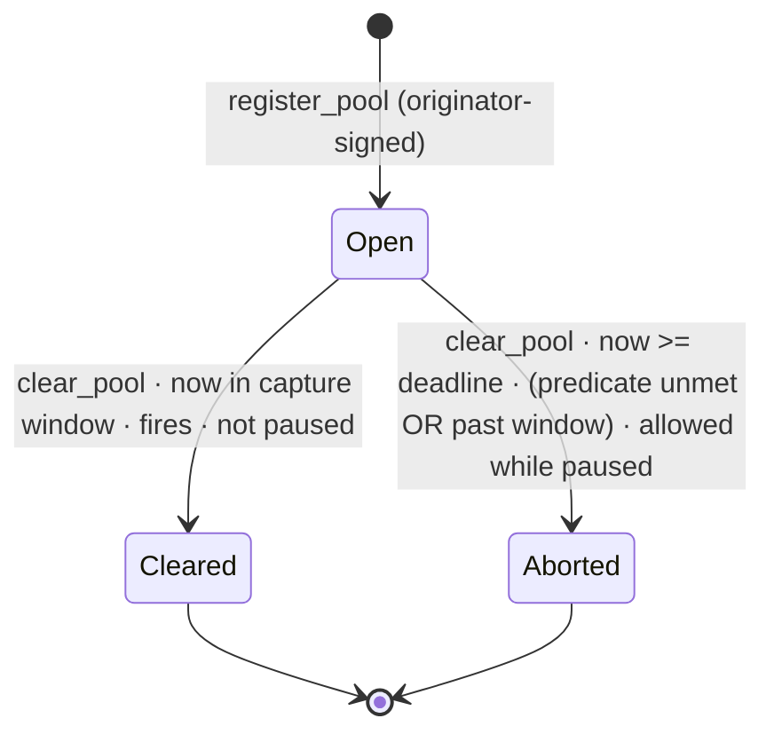
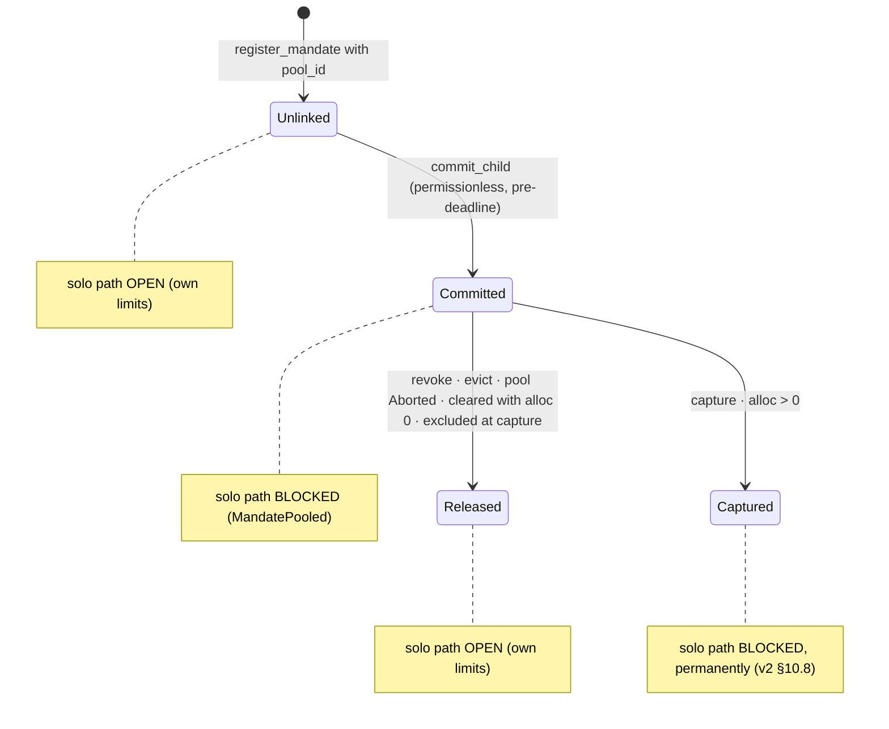

# Composite Mandates — Contract Architecture (implementation blueprint)

**Status:** ARCHITECTURE, build-ready. Scope is the smart contract only:
composite mandates (clearing pools, Stage 1, ThresholdFloor). No SDK, no CLI,
no deploy scripts, no admin/pause/fee spec (those are owned by
composites-design-v2.md §4.5/§5.2 and are referenced here only where the pool
path consumes them as interfaces).

**Precedence.** The decisions in composites-design-v2.md (D-A deadline auction,
D-B best-effort capture over the able set, D-C constructor admin, D-D terminal
release) are binding and inherited unchanged. This document adds the precision
an implementer needs: exact types, storage keys, state machines, the clearing
algorithm at pseudocode fidelity, entry-point precondition tables, an invariant
catalog, and a per-file build plan. The five places where this document
sharpens or corrects v2 are collected in §12 (R1..R5) so they are reviewable as
deltas, not buried.

---

## 1. Architecture in one paragraph

A `ClearingPool` is a single-resource auction: one merchant, one asset, one
threshold predicate, a flat set of member mandates, and a hard close time.
Child mandates are today's `Mandate` plus a pool binding and a monotone price
schedule; the schedule is the user's entire authorization for the pool path
(no per-capture agent signature exists or is needed). Between registration and
the deadline, commitment is a revocable offer. At the deadline the pool becomes
clearable by anyone: the contract filters members by objective eligibility,
computes the unique buyer-optimal uniform price from the eligible schedules,
derives the unique allocation, writes all state, then moves all legs in one
transaction. Every step of that computation is a pure function of same-ledger
on-chain state, so `simulate_clear` and `clear_pool` are bit-identical and the
originator holds no discretion anywhere in the pipeline. That equality is the
product: the organizer provably cannot skim.

## 2. Module map

Extends the existing one-way dependency discipline in `lib.rs` (no cycles):

```
lib → {registry, payment, pool} → storage → {mandate, pooltypes, error}
              └────────┴───────→ events (leaf)
pool → clearing → {mandate, pooltypes}   (pure; no storage, no env I/O, no clock)
```

| Module | Status | Responsibility |
|---|---|---|
| `mandate.rs` | extended | `Mandate` (+3 fields), `PoolState`, `SchedulePoint`, pure schedule helpers: `validate_schedule`, `demand`, `worst_case` |
| `pooltypes.rs` | new | `ClearingPool`, `ClearingKind`, `PoolStatus`, `ChildView`, `ClearOutcome`. Pure data, no logic |
| `clearing.rs` | new | the trust core: `clear(pool, views) -> ClearOutcome`. Pure, total, clock-free |
| `pool.rs` | new | pool lifecycle: `register_pool`, `commit_child`, `evict_child`, `clear_pool`, `simulate_clear`, getters. Owns `build_child_views` (the only place live token reads happen) and the capture |
| `storage.rs` | extended | `DataKey::Pool`, `DataKey::PoolMembers`, pool get/set/has, horizon-aware TTL bump |
| `registry.rs` | extended | pooled registration validation; revoke's pool bookkeeping |
| `payment.rs` | extended | `MandatePooled` guard on the solo path; `validate_mandate` reflects pool state |
| `error.rs` | extended | codes 11..31 (composite subset; see §9) |
| `events.rs` | extended | `pool_reg`, `child_com`, `child_rel`, `pool_clr`, `pool_abrt` |
| `lib.rs` | extended | thin dispatch for the 7 new entry points; module-graph doc comment updated |

Two structural rules an implementer must not break:

1. `clearing.rs` never touches `env.storage`, token clients, or the ledger
   clock. Its inputs are plain values. This is what makes the no-discretion
   equality (§7, I3) a provable property instead of a convention.
2. `pool.rs::build_child_views` is the single function that turns stored +
   live-token state into `Vec<ChildView>`. Both `clear_pool` and
   `simulate_clear` call it; neither has a private variant. All
   time-dependent logic (expiry, windows) lives in the builder and the entry
   points, never in `clear()` (R5).

## 3. Data model

### 3.1 `SchedulePoint` and the extended `Mandate` (`mandate.rs`)

```rust
#[contracttype]
pub struct SchedulePoint {
    pub unit_price: i128, // strictly ascending across the schedule, > 0, <= MAX_UNIT_PRICE
    pub max_qty: u128,    // strictly descending across the schedule, > 0, <= MAX_QTY
}

#[contracttype]
pub enum PoolState { Unlinked, Committed, Captured, Released }

pub struct Mandate {
    // ... all ten existing fields, unchanged, same order ...
    pub pool_id: Option<BytesN<32>>,       // None == standalone (today's behavior)
    pub price_schedule: Vec<SchedulePoint>, // empty when standalone
    pub pool_state: PoolState,             // Unlinked when standalone or never committed
}
```

`SchedulePoint` is a named struct rather than v2's `(i128, u128)` tuple (R3):
identical wire cost, but the generated TS bindings get named fields, and the
schedule invariants have somewhere to live in doc comments.

Schedule semantics (v2 §4.1, confirmed): an entry means "at uniform clearing
price `<= unit_price`, buy up to `max_qty` units." It is a demand curve;
quantity falls as price rises.

Pure helpers, all in `mandate.rs`, all total over validated schedules:

```rust
// register-time gate; every violation -> Error::ScheduleInvalid
pub fn validate_schedule(s: &Vec<SchedulePoint>) -> Result<(), Error>
// non-empty; len <= MAX_SCHEDULE_POINTS; prices strictly ascending, each in (0, MAX_UNIT_PRICE];
// qtys strictly descending, each in (0, MAX_QTY]

// quantity demanded at uniform price p: the max_qty of the FIRST entry
// (lowest price) with unit_price >= p; 0 if p exceeds every entry's price.
// [(5,3),(10,1)]: demand(5)=3, demand(7)=1, demand(10)=1, demand(11)=0.
pub fn demand(s: &Vec<SchedulePoint>, p: i128) -> u128

// largest leg any clearing price can produce = max over entries of
// unit_price * max_qty (checked; bounded by MAX_UNIT_PRICE * MAX_QTY).
// [(5,3),(10,1)]: max(15, 10) = 15.
pub fn worst_case(s: &Vec<SchedulePoint>) -> i128
```

### 3.2 `ClearingPool` (`pooltypes.rs`, stored under `DataKey::Pool`)

```rust
#[contracttype]
pub enum ClearingKind { ThresholdFloor, SpendCeiling, CapacityCeiling } // ships full; Stage 1 accepts only ThresholdFloor

#[contracttype]
pub enum PoolStatus { Open, Cleared, Aborted }

pub struct ClearingPool {
    pub originator: Address,     // signs register_pool; holds NO later power (§6)
    pub merchant: Address,
    pub asset: Address,
    pub kind: ClearingKind,
    pub threshold_qty: u128,
    pub threshold_value: u128,   // NET of fee to the merchant (v2 §4.5)
    pub min_child_value: u128,   // per-child worst_case floor (anti-dust)
    pub clearing_deadline: u64,  // unix seconds; capture window = [deadline, deadline + CAPTURE_WINDOW_SECS]
    pub fee_bps_pinned: u32,     // FeeRateBps read once at register_pool; capture never reads the live rate
    pub status: PoolStatus,
    pub member_count: u32,       // live Committed members while Open; frozen at terminal
}
```

No running aggregates (dropped in v2 §3.2, stays dropped): `simulate_clear` is
the preflight; a running sum is incoherent across prices and a checked-add DoS.

Member list: `DataKey::PoolMembers(pool_id) -> Vec<BytesN<32>>`, mandate ids in
commit order, max `MAX_POOL_MEMBERS`. The list mutates only while the pool is
`Open` (commit pushes; revoke/evict remove); once the pool is terminal it is
frozen as the gatecheck record of who was in at close.

### 3.3 `ChildView` and `ClearOutcome` (`pooltypes.rs`)

```rust
pub struct ChildView {
    pub mandate_id: BytesN<32>,
    pub schedule: Vec<SchedulePoint>,
    pub eligible: bool,  // §5.3; decided ONCE, before p* is known
    pub worst_case: i128,
}

pub struct ClearOutcome {
    pub fires: bool,
    pub clearing_price: i128,                 // 0 when !fires
    pub allocations: Vec<(BytesN<32>, u128)>, // (mandate_id, qty), mandate_id order, qty > 0 only
    pub total_qty: u128,
    pub gross_value: i128,                    // clearing_price * total_qty
    pub total_fee: i128,                      // sum of per-leg floored fees at fee_bps_pinned
    pub net_value: i128,                      // gross_value - total_fee; the value compared to threshold_value
}
```

### 3.4 Storage keys and TTL (`storage.rs`)

```rust
pub enum DataKey {
    Mandate(BytesN<32>),      // existing
    Pool(BytesN<32>),         // new, persistent
    PoolMembers(BytesN<32>),  // new, persistent
}
```

All time in protocol logic is unix seconds from `env.ledger().timestamp()`;
ledgers appear only in TTL math (R4). New helper:

```rust
// Bump key TTL to cover at least `horizon_secs` from now, using the 5s/ledger
// estimate with a 2x margin, floored at the existing TTL_EXTEND.
pub fn extend_to_horizon(env: &Env, key: &DataKey, horizon_secs: u64)
```

Policy (v2 §3.6, unchanged in substance): `register_pool` requires
`clearing_deadline + CAPTURE_WINDOW_SECS - now <= MAX_POOL_HORIZON_SECS`, else
`DeadlineTooFar`. Every pool touchpoint (`register_pool`, `commit_child`,
`evict_child`, `clear_pool`, pooled `revoke_mandate`) bumps the pool entry, the
member list, and the touched child to `deadline + CAPTURE_WINDOW_SECS - now`
via `extend_to_horizon`. A pool can never be archived inside its own live
window regardless of how quiet it goes.

## 4. State machines

Pool lifecycle:



Child `pool_state` (orthogonal to the existing `Status`, which keeps its exact
current semantics):



Exit semantics, stated bluntly because users will ask:

- **Before the deadline**, the only exit from `Committed` is `revoke_mandate`,
  which revokes the whole mandate (the vc_hash is spent; register a fresh
  mandate to continue solo). Commitment is a binding-but-revocable offer;
  there is deliberately no "un-commit but keep the mandate" path, because a
  free exit that preserves the mandate is a costless demand-inflation lever.
- **After the deadline**, no one is ever stranded: `clear_pool` is
  permissionless, its abort branch runs even while paused, and past
  `deadline + CAPTURE_WINDOW_SECS` only the abort branch is reachable. Any
  member can therefore always force their own `Released` terminal (invariant
  I6).

## 5. The clearing pipeline

### 5.1 Full lifecycle sequence

```mermaid
sequenceDiagram
    participant O as Originator
    participant U as User (each member)
    participant A as Anyone
    participant C as MandateRegistry
    participant T as SEP-41 token

    O->>C: register_pool(terms, nonce)  [signs; pins fee_bps]
    Note over C: pool_id = sha256(terms || nonce), status = Open
    U->>C: register_mandate(..., pool_id, schedule)  [signs terms]
    U->>T: approve(spender = C, amount)
    A->>C: commit_child(mandate_id)  [permissionless, objective checks]
    Note over C: pool_state = Committed, member list push
    Note over C: ... deadline passes (D-A: no capture before it) ...
    A->>C: clear_pool(pool_id)
    C->>T: allowance/balance reads (build_child_views)
    Note over C: clear() -> p*, allocations. ALL state written (CEI)
    C->>T: transfer_from(user_i -> merchant, leg_i - fee_i)  [per member]
    C->>T: transfer_from(user_i -> fee_recipient, fee_i)     [when fee_i > 0]
    Note over C: any transfer failure reverts everything; pool stays Open for retry in window
```

### 5.2 Pool id derivation (`register_pool`)

```
pool_id = sha256( (originator, merchant, asset, kind, threshold_qty,
                   threshold_value, min_child_value, clearing_deadline,
                   nonce).to_xdr(env) )
```

XDR of the tuple is the canonical encoding (deterministic, already implemented
by the SDK). The id commits to the terms: front-running the id with different
terms is impossible; `nonce` distinguishes identical-term pools.

### 5.3 Eligibility (computed in `build_child_views`, once, before p\*)

```
eligible = pool_state == Committed
        && status == Active
        && now < expiry
        && (max_amount - spent) >= worst_case                                   // R2
        && min(allowance(user -> contract, asset), balance(user, asset)) >= worst_case
        && trustline_authorized(asset, user)                                    // R6
```

R6 (added by the post-build adversarial review): a SAC trustline the issuer
deauthorized (froze) still reads a full balance and allowance but reverts on
`transfer_from`, so without this term a single frozen member would score
eligible and its leg would revert every capture retry, wedging a met pool for
its whole window. The probe calls the SAC's `authorized(id)` via
`try_invoke_contract`; tokens without the method (plain SEP-41) count as
authorized. The same probe runs in `commit_child`'s courtesy preflight and in
`evict_child`'s objective-ineligibility test, so a frozen member is excluded
deterministically and its slot is reclaimable.

The fourth line is new relative to v2 (R2): a child registered pooled may spend
solo while `Unlinked`, then commit; without the remaining-budget term, its
capture leg could push `spent` past `max_amount`, the capture assert would
revert, and since the child stays Committed-and-eligible every retry reverts
too, so one 1-stroop solo spend bricks the pool until the window lapses. With
the term, such a child is deterministically excluded exactly like an
expired or defunded one. The same predicate is the objective-ineligibility
test used by `evict_child`, and (minus the live reads' freshness caveat) the
commit-time courtesy preflight.

Using `worst_case` rather than the p\*-dependent leg keeps eligibility free of
fixed-point circularity: the filter runs once, before any price exists.
Allowance and balance are live cross-contract reads (`TokenClient::allowance`
/ `::balance`); they are reads, so performing them before the state writes
does not violate CEI.

### 5.4 `clear()` (pure, `clearing.rs`)

Inputs: the pool record and `Vec<ChildView>`. No clock (R5), no storage.

```
fn clear(pool, views) -> ClearOutcome:
    kids = views.filter(eligible), sorted by mandate_id ascending   // single tie-break
    if kids.is_empty(): return no_fire()

    breakpoints = ascending dedup of every kids[i].schedule unit_price
    prev = 0
    for b in breakpoints:
        // demand is constant on the price interval (prev, b]
        Q = sum_i demand(kids[i].schedule, b)                       // u128 checked
        if Q >= pool.threshold_qty and net_value(kids, b) >= pool.threshold_value:
            // minimal feasible price in (prev, b]: net_value is monotone
            // nondecreasing in p at constant Q (each leg's net rises by 0 or 1
            // per unit price step, never falls), so binary search is exact.
            lo, hi = prev + 1, b
            while lo < hi:
                mid = lo + (hi - lo) / 2
                if net_value(kids, mid) >= pool.threshold_value: hi = mid
                else: lo = mid + 1
            return fire(p* = lo, alloc_i = demand(kids[i].schedule, p*))
        prev = b
    return no_fire()

fn net_value(kids, p) -> i128:
    sum over kids with demand > 0 of:
        leg  = demand(kids[i].schedule, p) as i128 * p              // <= MAX_QTY * MAX_UNIT_PRICE
        fee  = leg * pool.fee_bps_pinned / BPS_DENOM                // floored
        leg - fee
```

Properties, each a test target:

- **Uniform price.** Every cleared child pays exactly p\* per unit, including
  children whose top schedule tier posted a higher price.
- **Buyer-optimal minimality (R1).** p\* is the true minimal integer price at
  which the pool is feasible, found by exact binary search inside the first
  feasible breakpoint interval. This supersedes v2 §4.4's derived-candidate
  formula (`ceil(threshold_value_gross / Q(b))`), which was an approximation:
  per-leg fee flooring makes the exact net at a price slightly higher than the
  formula's estimate, so the formula could land one or more units above the
  true minimum, and it produced a posted breakpoint rather than the true
  minimum when `threshold_value = 0`. On v2's canonical case (single child
  `[(10,10)]`, threshold_qty 10, threshold_value 60, fee 0) both give p\* = 6;
  the binary search is simply exact everywhere, at a bounded cost
  (`log2(MAX_UNIT_PRICE)` ≈ 50 iterations of an 8-leg sum).
  Scanning intervals in ascending order and returning the first feasible one
  is globally minimal because every price in an earlier interval is lower and
  was found infeasible.
- **No selection discretion.** Given the eligible set, (p\*, allocation) is a
  function. There is nothing left to choose, for anyone.
- **Complexity.** O(points · members · log(MAX_UNIT_PRICE)) with everything
  capped at 8; trivially inside any budget, verified anyway by §11's ceiling
  test.
- **Overflow-freedom.** `leg <= MAX_UNIT_PRICE * MAX_QTY = 1e24`; the pool sum
  `<= 8e24`; `leg * MAX_FEE_BPS <= 1e26`; all far below `i128::MAX` ≈ 1.7e38.
  Checked arithmetic asserts what the caps already guarantee; there is no
  user-facing `Overflow` error (v2 §6, kept).

### 5.5 Capture (`clear_pool`, the money branch)

Precondition gates in order: pool exists (`PoolNotFound`); status Open
(`PoolNotOpen`, doubling as the idempotency guard); `now >= clearing_deadline`
(`DeadlineNotReached`, D-A); then branch on window and predicate.

**Fires** (`now <= deadline + CAPTURE_WINDOW_SECS`, `clear()` fires, not
paused; paused capture returns `Paused`):

1. **Write everything first (CEI).** `pool.status = Cleared`. For each
   allocation: `spent += leg` (assert `<= max_amount`; unreachable given R2,
   asserted anyway), `seq += 1`, `pool_state = Captured`, `status = Exhausted`
   iff `spent == max_amount`. Every committed-but-not-allocated child
   (excluded, or eligible with `demand(p*) = 0`) gets `pool_state = Released`.
2. **Then transfer.** For each allocation in mandate_id order:
   `transfer_from(contract, user, merchant, leg - fee)` and, when `fee > 0`,
   `transfer_from(contract, user, fee_recipient, fee)`. Per-leg fee is floored
   at `fee_bps_pinned`, so the two legs sum exactly to `leg`: no dust, the
   contract never holds funds.
3. Emit one `pool_clr(clearing_price, allocation_root, net_value, total_fee)`.

Any single transfer failure reverts the entire transaction (Soroban
all-or-nothing): no sibling is charged, all state writes roll back, the pool
remains Open and retryable within the window. Because ineligible members were
filtered on live reads in the same ledger — including the R6 trustline
authorization probe, which covers the one persistent condition
(issuer-frozen trustline) that funds reads cannot see — the only way a leg
fails is a same-ledger race, which the retry absorbs.

Reentrancy stance: state is persisted before the first external transfer, so a
reentrant `clear_pool` from a malicious asset or fee recipient finds
`PoolNotOpen`. This is CEI on top of Soroban's host rule, and §11 requires the
evil-asset and evil-fee-recipient probes to assert it (extending the existing
`reentry_probe.rs` pattern).

**Aborts** (`clear()` does not fire, or `now > deadline + CAPTURE_WINDOW_SECS`):
`pool.status = Aborted`; every Committed child `pool_state = Released`; emit
`pool_abrt`. No transfers, no token reads needed, allowed while paused. The
window cap exists so a met-but-never-cleared pool cannot be captured months
later against unwatching participants.

`allocation_root` (unchanged from v2 §4.6):
`sha256( pool_id || p*_i128_BE16 || concat(mandate_id_32 || qty_u128_BE16) )`
over allocations in mandate_id order. The pool_id prefix stops cross-pool root
comparison.

### 5.6 `simulate_clear`

Read-only. Same gates minus the deadline gate (simulation is meaningful before
close as a "would it fire if it closed now" preflight; the returned outcome is
labeled by the ledger it ran in). Past the capture window it returns the
no-fire outcome without running the clearing math, because abort is the only
outcome `clear_pool` can still execute — a preflight that promised a fire
no capture could deliver would mislead third-party verifiers. Calls `build_child_views` then `clear()`,
returns the `ClearOutcome`. The no-discretion equality (I3) is scoped
same-ledger: in the clearing ledger, `simulate_clear` output equals what
capture executed, field for field, and §11 asserts both in one test
transaction.

## 6. Authorization model (who signs what, and why capture needs no one)

| Action | Auth | Rationale |
|---|---|---|
| `register_pool` | `require_auth(originator)` | binds the terms into the id; after this the originator holds no special power at all (clear is permissionless and deterministic) |
| `register_mandate` (pooled) | `require_auth(user)` | the user signs merchant, asset, schedule, expiry, pool binding: this IS the capture authorization |
| SEP-41 `approve` | user, on the token | funds authorization; allowance to the contract, never to any agent |
| `commit_child` | none (permissionless) | every check is objective on-chain state; the user already authorized the terms and can revoke until the deadline |
| `evict_child` | none | can only remove objectively-ineligible members (`MemberStillEligible` otherwise); pure garbage collection of squatted slots |
| `clear_pool` / `simulate_clear` | none | pure function of stored + live token state; caller pays gas |
| `revoke_mandate` | `require_auth(user)` | consent withdrawal, never blockable (works while paused) |

The child's `agent` field is untouched by the pool path. It exists on a pooled
mandate only so the child can spend solo while `Unlinked` or after `Released`.
There is no per-capture agent signature by design: the signed schedule plus
the allowance plus revocability-until-close is the complete consent chain, and
requiring N agent signatures at capture would hand every member a free
last-second veto (the exact griefing lever D-B removed).

## 7. Invariant catalog (what the test suite asserts, by name)

- **I1 Conservation.** Capture moves exactly `sum(leg_i)`; per child the
  merchant and fee legs sum to `leg_i`; the contract's own balance is zero
  before and after every entry point.
- **I2 Child bound.** For every captured child:
  `leg_i <= worst_case_i` and `spent' = spent + leg_i <= max_amount`. No child
  ever pays outside its signed schedule, and never above the price tier it
  posted for the quantity it received.
- **I3 No discretion.** Same ledger: `simulate_clear(pool)` equals the
  (price, allocations, per-leg amounts, root) that `clear_pool` executes.
- **I4 Uniform price.** All captured legs use the single p\*.
- **I5 Minimality.** No integer price below p\* is feasible for the eligible
  set (spot-checked by construction in tests; guaranteed by R1's search).
- **I6 No stranding.** From every reachable state, each pooled child can reach
  a terminal where it is spendable-solo or revoked, using only permissionless
  calls plus its own user's auth: revoke (any time), or `clear_pool` abort
  (any time past the window, even paused).
- **I7 Idempotency.** A terminal pool (`Cleared`/`Aborted`) rejects every
  mutating call with `PoolNotOpen`; capture cannot run twice.
- **I8 Solo conservation.** A standalone mandate (`pool_id = None`) has
  byte-identical stored-state behavior to the deployed contract on every path.
- **I9 Overflow-freedom.** Under §8 constants no clearing sum can overflow
  i128/u128; asserts, not user-facing errors.
- **I10 CEI.** No external transfer occurs before all state writes in the same
  entry point; reentrancy during a transfer observes terminal state.
- **I11 Determinism of order.** Committing the same children in any order
  yields the same `ClearOutcome` (mandate_id sort inside `clear()` is the only
  order that matters).

## 8. Constants (`lib.rs` or a `consts` block in `pooltypes.rs`)

```
MAX_POOL_MEMBERS     = 8            // single-tx capture ceiling; raise only with the §11 budget artifact
MAX_SCHEDULE_POINTS  = 8
MAX_UNIT_PRICE       = 1_000_000_000_000_000 (1e15, i128)
MAX_QTY              = 1_000_000_000 (1e9, u128)
CAPTURE_WINDOW_SECS  = 86_400       // R4: protocol time is unix seconds; ledgers are TTL-only
MAX_POOL_HORIZON_SECS= 30 * 86_400  // deadline + window must fit one TTL bump
BPS_DENOM            = 10_000       // shared with the fee workstream
```

`MAX_UNIT_PRICE * MAX_QTY = 1e24` and `MAX_POOL_MEMBERS * 1e24 = 8e24 <
i128::MAX` is the overflow-freedom argument (I9); the three constants move
together or not at all.

## 9. Errors (composite subset; codes 1..9 + slot 3 unchanged, 10/23/24 owned by admin+fee)

```
11 PoolNotFound          12 PoolNotOpen         13 ScheduleInvalid
14 PoolMerchantMismatch  15 PoolAssetMismatch   16 DeadlinePassed
17 ThresholdNotMet*      18 PoolFull            19 BadPoolState
20 MandatePooled         21 InsufficientFunds   25 NotPooled
26 ExpiryBeforeDeadline  27 BelowMinChild       28 DuplicateMember
29 DeadlineNotReached    30 DeadlineTooFar      31 MemberStillEligible
22 KindNotSupported
```

\* `ThresholdNotMet` is reserved for `simulate_clear`-style reporting if ever
surfaced as an error; the abort branch is a success (state flip + event), not
an error. Every precondition in §10's tables names its exact code, preserving
the suite's exact-typed-error convention.

## 10. Entry points: precondition → effect tables

### 10.1 `register_pool(originator, merchant, asset, kind, threshold_qty, threshold_value, min_child_value, clearing_deadline, nonce) -> BytesN<32>`

| Check (in order) | Error |
|---|---|
| `require_auth(originator)` | host revert |
| `kind == ThresholdFloor` | `KindNotSupported` |
| `threshold_qty > 0 \|\| threshold_value > 0` | `InvalidAmount` |
| `now < clearing_deadline` | `DeadlinePassed` |
| `clearing_deadline + CAPTURE_WINDOW_SECS - now <= MAX_POOL_HORIZON_SECS` | `DeadlineTooFar` |
| derived pool_id unused | `AlreadyExists` |

Effects: store pool (Open, member_count 0, `fee_bps_pinned = FeeRateBps`),
empty member list, TTL to horizon, emit `pool_reg`.

### 10.2 `register_mandate(..., pool_id: Option<BytesN<32>>, price_schedule: Vec<SchedulePoint>)`

Standalone (`None`): schedule must be empty (`ScheduleInvalid`); then exactly
today's path; `pool_state = Unlinked`.

Pooled (`Some(id)`), added after the existing checks:

| Check | Error |
|---|---|
| pool exists | `PoolNotFound` |
| pool Open | `PoolNotOpen` |
| `now < clearing_deadline` | `DeadlinePassed` |
| `merchant == pool.merchant` | `PoolMerchantMismatch` |
| `asset == pool.asset` | `PoolAssetMismatch` |
| `validate_schedule` passes | `ScheduleInvalid` |
| `worst_case <= max_amount` | `ScheduleInvalid` |
| `worst_case >= pool.min_child_value` | `BelowMinChild` |
| `expiry > clearing_deadline + CAPTURE_WINDOW_SECS` | `ExpiryBeforeDeadline` |

### 10.3 `commit_child(mandate_id)` (permissionless)

| Check | Error |
|---|---|
| mandate exists | `NotFound` |
| `pool_id.is_some()` | `NotPooled` |
| not Revoked / not expired | `MandateRevoked` / `MandateExpired` |
| `pool_state == Unlinked` | `BadPoolState` |
| pool Open | `PoolNotOpen` |
| `now < clearing_deadline` | `DeadlinePassed` |
| `member_count < MAX_POOL_MEMBERS` | `PoolFull` |
| no other Committed member of this pool with the same `user` | `DuplicateMember` |
| `(max_amount - spent) >= worst_case` and `min(allowance, balance) >= worst_case` | `InsufficientFunds` (courtesy preflight, NOT a reservation) |

Effects: `pool_state = Committed`, member push, `member_count += 1`, TTLs to
horizon, emit `child_com(mandate_id, worst_case)`.

### 10.4 `evict_child(pool_id, mandate_id)` (permissionless)

Pool Open (`PoolNotOpen`); member of this pool (`NotFound`/`BadPoolState`);
member objectively ineligible right now, i.e. fails any term of §5.3's
predicate (`MemberStillEligible` otherwise). Effects: remove from list,
`member_count -= 1`, `pool_state = Released`, emit `child_rel`. Not needed for
correctness (the clearing filter already excludes), only to reclaim squatted
`MAX_POOL_MEMBERS` slots before the deadline.

### 10.5 `clear_pool(pool_id)` / `simulate_clear(pool_id)`

Specified in §5.5/§5.6. One addition for completeness: capture with
`fee_bps_pinned > 0` and no fee recipient set is unreachable by construction
only if a recipient existed at pin time, so the capture branch re-checks
`fee_recipient` and fails `FeeRecipientNotSet` (24) before any state write if
pinned rate > 0 and the recipient was never set.

### 10.6 `revoke_mandate` (extended), `execute_payment` (guard), `validate_mandate` (honesty)

- `revoke_mandate`: unchanged core; if `pool_state == Committed` and pool Open,
  also remove from member list, `member_count -= 1`, `pool_state = Released`,
  emit `child_rel` alongside `revoke`. Captured children: purchase is final;
  revoke still marks Revoked (blocks nothing retroactively). Always works,
  including while paused.
- `execute_payment`: after loading, reject `pool_state ∈ {Committed, Captured}`
  with `MandatePooled`. `Unlinked`/`Released` spend solo within their own
  limits (D-D). Captured children stay blocked even with leftover budget
  (v2 §10.8: simplest safe rule, the leftover is locked to the pool).
- `validate_mandate`: returns `MandatePooled` for the same states, so the
  preflight never disagrees with the spend (v2 H4 stays fixed).

## 11. Test architecture (composite scope)

The full case list is v2 §9.3 and carries over verbatim; it slots into the
suite as follows, keeping the existing exact-typed-error and snapshot
conventions:

- `clearing.rs` unit tests (pure, no env): demand/worst_case vectors; uniform
  price; R1 minimality including the fee-floor slack case (a price the old
  formula would miss) and the `threshold_value = 0` case; interval-scan
  ordering; I11 order independence.
- `test.rs` additions: solo-path regression with `(None, vec![])` call sites
  (I8); `MandatePooled` guards; `validate_mandate` honesty.
- new `pool_test.rs`: lifecycle happy paths + every table row in §10 as a
  negative; the D-A timing set (pre-deadline `DeadlineNotReached`, at-deadline
  fires, past-window aborts-though-met); the D-B ability-to-pay set (allowance
  pulled, balance drained, one-user-two-pools, and R2's
  solo-spend-then-commit exclusion); atomicity (same-ledger race leg reverts
  all, retry succeeds); I3 no-discretion in one test tx; I6 stranding sweep;
  eviction/squatting; allocation_root recomputation.
- `reentry_probe.rs` extension: evil asset and evil fee recipient reentering
  `clear_pool` observe `PoolNotOpen` (I10).
- Resource ceiling: construct the full 8-member, 8-point, fee-on pool, clear
  it, assert within the Soroban test budget via `env.budget()`; the testnet
  `simulateTransaction` report goes to `security/` before
  `MAX_POOL_MEMBERS` may ever be raised (v2 §9.5, unchanged).

## 12. Refinements vs composites-design-v2.md (the only deltas; everything else is inherited)

- **R1 · Exact minimal-price search.** Replaces §4.4 step 3's derived-candidate
  formula with an exact binary search per breakpoint interval (§5.4). Rationale:
  net value is monotone in price at constant demand, so the search is exact
  where the ceil-formula was an estimate that per-leg fee flooring and the
  `threshold_value = 0` edge could push off the true minimum. Same result on
  v2's canonical p\* = 6 case; bounded ≤ ~50 iterations.
- **R2 · Remaining-budget eligibility term.** `(max_amount - spent) >=
  worst_case` added to the §5.3 filter, the commit preflight, and the evict
  criteria. Closes the solo-spend-while-Unlinked-then-commit capture brick
  (1-stroop cost to jam a pool for its whole window) and makes I2's assert
  genuinely unreachable instead of reachable-and-reverting.
- **R3 · `SchedulePoint` named struct** instead of `Vec<(i128, u128)>`. Wire
  cost identical; generated bindings and doc comments get names.
- **R4 · Seconds everywhere in protocol logic.** v2 §8 gave `CAPTURE_WINDOW`
  in ledgers while every deadline comparison uses `env.ledger().timestamp()`
  seconds. Pinned: `CAPTURE_WINDOW_SECS = 86_400`, `MAX_POOL_HORIZON_SECS`;
  ledgers survive only inside `storage.rs` TTL math (`extend_to_horizon`).
- **R5 · Clock-free `clear()`.** v2 passed `now` into the pure core; here all
  time logic lives in `build_child_views` and the entry-point gates, so the
  trust core has exactly one input class (values) and one output (the
  outcome), which is the cleanest possible statement of I3.

## 13. Build order (contract only, one redeploy batch)

1. `mandate.rs` + `pooltypes.rs` + `error.rs`: types, enums, schedule helpers,
   new codes. Pure; unit-testable immediately.
2. `clearing.rs` + its unit tests: the trust core lands green before anything
   touches storage.
3. `storage.rs`: new keys + `extend_to_horizon`.
4. `registry.rs` + `payment.rs` extensions: pooled registration, revoke
   bookkeeping, `MandatePooled` guards; existing 19-test suite updated to
   `(None, vec![])` and back to green (I8 checkpoint).
5. `pool.rs`: register/commit/evict, then `build_child_views` +
   `simulate_clear`, then the capture branch last (it composes everything).
6. `events.rs` + `lib.rs` dispatch; `pool_test.rs` negative sweep; reentry
   probes; resource-ceiling test; snapshot regeneration.
7. `npm run verify` gate; redeploy batched with the admin/pause/fee pass per
   the composite sequencing decision (one redeploy, one re-verify, one
   deployment-history entry).
