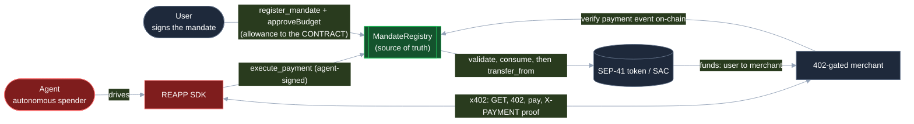
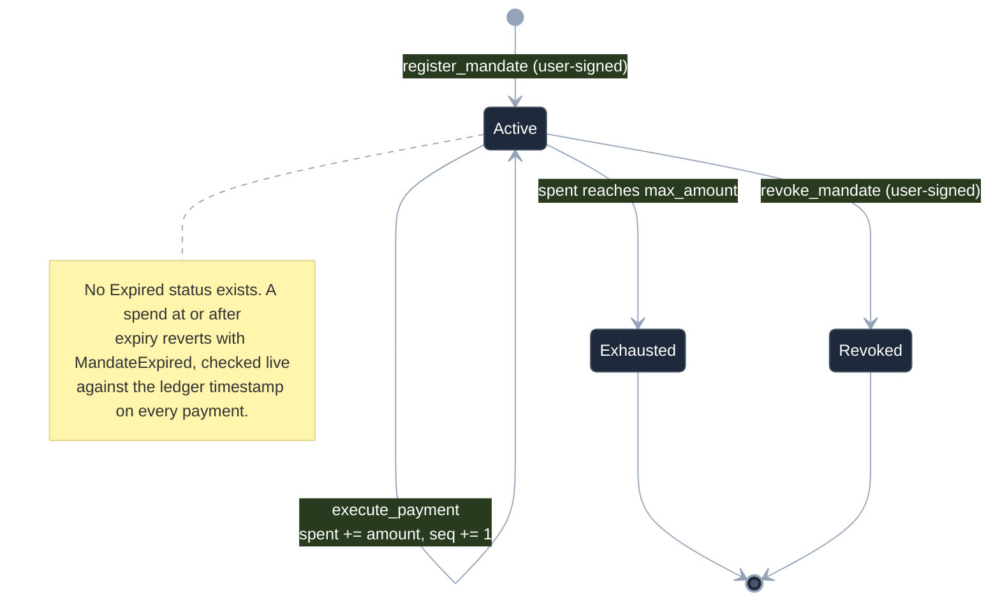
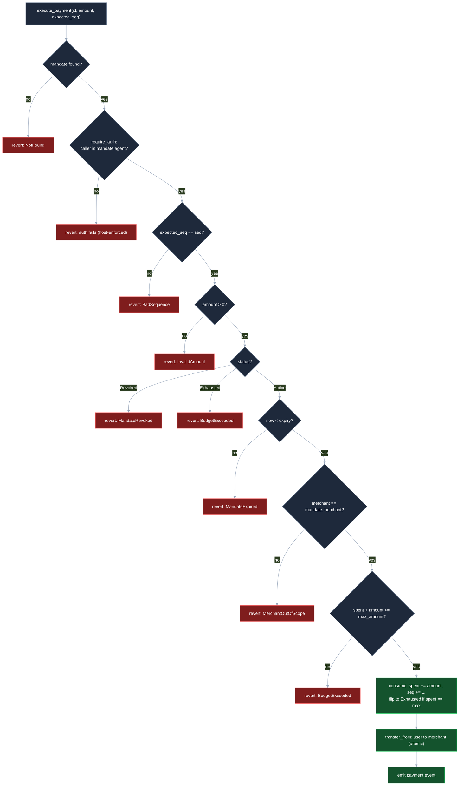

# REAPP Code Review

A complete code review in one file: a focused review up front (Part 1), then the exhaustive method-by-method reference (Part 2).

Snapshot: `reapp-protocol` at commit `4f5888a`, 2026-06-16. Every quoted code block in Part 2 is character-for-character identical to the source on disk, including the original code comments (some contain em-dashes; those belong to the code, not to this review). The review prose has none.

Scope: the Soroban `MandateRegistry` contract, `@reapp-sdk/core` (`index.ts`, `x402.ts`), and the demo plus reference apps (the 402-gated merchant, the ResearchAgent, the e2e orchestrator, the demo, and the on-chain gate checker). The reapp.live web app is documented separately after its 0.2.0 update.

## Contents

- **Part 1: The Review** (start here): verdict, architecture, what stops each attack, findings and watch-items, strengths.
- **Part 2: Reference**: every method, line by line.

---

# Part 1: The Review

## Verdict

The enforcement core is sound: every dollar moves through a single on-chain entry point that re-derives the agent, merchant, asset, and budget from stored state, so a buggy or hostile SDK cannot redirect funds, overspend, or replay a payment. The contract is the only thing that is trusted, and it is well-built (auth bound to the stored agent, checks-effects-interactions ordering, a tested reentrancy probe, overflow-checks turned on so arithmetic edges revert instead of wrapping). The two real gate check findings on the off-chain path (a forged `payment` event that bypassed access control, and a replay TOCTOU at the merchant) were found, fixed, and verified, and the remaining items are honest mainnet-hardening watch-items rather than open holes. This is testnet-grade and sound for the Tranche 1 milestone. The test-coverage gap earlier reviews flagged has since been closed: the merchant's `verifyOnChain` (the second security boundary) now has a unit suite, including a golden case decoded from a real on-chain payment and the forged-event rejection, and the `parse402` and `Agent.fetch` paths are covered too. The full clean-build gate (contract, SDK, and merchant) is green.

## How it is built

Three layers, each with a narrow job.

1. **The user signs a mandate.** Off-chain, the user signs two things: a mandate (agent, merchant scope, max budget, expiry) registered on-chain, and a SEP-41 allowance. Critically, the allowance spender is the **contract id**, never the agent or the SDK (`approveBudget` in `packages/sdk/src/index.ts`).
2. **The agent spends via x402.** When the agent hits a paid resource it gets an HTTP 402, parses the challenge, and calls `Agent.pay`. The SDK is plumbing: it reads the current sequence from chain and submits the spend. It holds no custody and enforces no limits.
3. **The contract enforces and consumes.** `execute_payment` takes only `{mandate_id, amount, expected_seq}`. It loads the mandate from storage, requires auth from the **stored** agent, re-validates status/expiry/scope/budget/sequence, advances `spent` and `seq`, then pulls user to merchant via `transfer_from` with the contract itself as spender.

The core invariant: **money moves only through `execute_payment`, the allowance is granted to the contract (not the agent or SDK), and the SDK is untrusted.** Because the payee and budget are read from stored state and never taken as call parameters at pay time, the worst a compromised SDK or a hostile merchant can do is fail; it cannot redirect funds or exceed the user-signed budget.



Green is the trusted enforcement layer (the contract is the source of truth). Red is untrusted (the SDK and the agent key, which can be buggy or stolen and still cannot exceed the mandate). The allowance is granted to the contract, never to the agent or SDK, which is the custody boundary.



## What stops each attack

| Threat | Mechanism that stops it | File |
| --- | --- | --- |
| Overspend (single or cumulative) | `m.spent + amount > m.max_amount` rejected with `BudgetExceeded` before any mutation | `contracts/mandate-registry/src/payment.rs` |
| Replay (stale or reused proof) | `expected_seq != mandate.seq` rejected with `BadSequence`, on top of Soroban's transport nonce; seq advanced before the external call | `contracts/mandate-registry/src/payment.rs` |
| Pay after revoke | status check rejects revoked mandates (`MandateRevoked`) | `contracts/mandate-registry/src/payment.rs` |
| Expired mandate | `env.ledger().timestamp() >= m.expiry` rejected with `MandateExpired`; symmetric with register-side check | `contracts/mandate-registry/src/payment.rs`, `registry.rs` |
| Wrong merchant | merchant derived from stored mandate, mismatch rejected with `MerchantOutOfScope`; payee is never a call parameter | `contracts/mandate-registry/src/payment.rs` |
| Stolen agent key (non-bound principal) | `mandate.agent.require_auth()` on the **stored** agent; a non-bound caller gets a host-level revert | `contracts/mandate-registry/src/payment.rs` |
| Buggy or malicious SDK | contract re-derives agent/merchant/asset/budget from state; SDK holds no allowance and supplies no recipient | `packages/sdk/src/index.ts`, `payment.rs` |
| Forged `payment` event at the merchant | `verifyOnChain` skips any event whose `StrKey.encodeContract(cid)` is not `mandateRegistryId`; the token's own transfer event is ignored (now unit-tested in `server.test.ts`) | `apps/fulfillment-agent/src/server.ts` |
| Reentrancy via a hostile token | state persisted before `transfer_from` (checks-effects-interactions); nested call hits the advanced seq and fails `BadSequence`; proven by `reentry_probe.rs` | `contracts/mandate-registry/src/payment.rs`, `reentry_probe.rs` |



Every gate is in the exact order `execute_payment` runs it: authorization first, then the sequence/replay guard, then the `check` predicate (amount, status, expiry, merchant scope, budget), then consume, then the atomic transfer. Any red box reverts the whole transaction, so there is never a partial spend.

## Findings and watch-items

Merged and deduped across the four reviewer lenses. Resolved gate check findings are included so the history is visible.

| Severity | Item | Location | Notes |
| --- | --- | --- | --- |
| Resolved | `verifyOnChain` (the second security boundary) now has automated tests | `apps/fulfillment-agent/src/server.ts`, `server.test.ts` | Fixed. The security decision was factored into the pure `selectPayment` (with `interpretEvents` / `extractContractEvents` for the XDR and a `ProofLedger` for the replay reservation) and is now covered by 17 tests: a golden case decoded from a real on-chain payment, the forged-event rejection (a payment-shaped event from a non-registry contract), wrong merchant, underpay, non-payment topic, no events, and the replay reservation. |
| Low | `Agent.fetch` reuses `init` on the paid retry: drains one-shot bodies and forces GET | `packages/sdk/src/index.ts` | Ergonomic, not a money bypass (the spend already settled correctly on-chain). A POST/PUT gated resource silently retries as GET; a consumed/streaming body resends empty. Carry `init.method` through and buffer the body, or document fetch as GET-style only. |
| Low | `decimals` defaults to 7 and is never validated against the asset's real on-chain decimals | `packages/sdk/src/index.ts` | Budget-bounded (user signs the same mis-scaled value), so no overcharge beyond intent, but a careless integrator on a non-7-decimal token gets the wrong budget. Mainnet: fetch decimals on-chain or require + validate. |
| Low | Custom `NetworkConfig.mandateRegistryId` silently redirects where the allowance is granted | `packages/sdk/src/index.ts`, `packages/stellar/src/token.ts` | Self-inflicted trust-critical config (default is the gate-checked testnet contract). Document `mandateRegistryId` as trust-critical; mainnet: allowlist published deployments or warn on mismatch. |
| Low | `fetch` pays whatever the untrusted 402 demands, capped only by total budget (no per-call ceiling) | `packages/sdk/src/index.ts` | A compromised merchant can over-charge one call up to the remaining budget; cannot exceed `max_amount` or redirect. Mainnet: optional per-call price ceiling. |
| Low | No asset allowlist: a user may register a mandate against an arbitrary token | `contracts/mandate-registry/src/registry.rs`, `payment.rs` | Blast radius is self-inflicted (user signs the mandate and the approval); reentrancy avenue already neutralized. Mainnet: SAC/asset allowlist in `register_mandate`. |
| Low | Budget add `m.spent + amount` can panic-revert on a near-`i128::MAX` amount | `contracts/mandate-registry/src/payment.rs` | Safe (revert, not wrap) under `overflow-checks`, but the surfaced error depends on prior spend: clean `BudgetExceeded` at `spent==0`, opaque host panic later. Optional: `checked_add` to a typed error for uniformity. |
| Resolved | `parse402` wire parser now tested | `packages/sdk/src/x402.test.ts` | Fixed. 7 tests cover every throw branch (non-JSON body, missing `accepts`, missing amount, missing `payTo`) plus the default-filling and the `amount` alias. |
| Resolved | `Agent.fetch` orchestration now has unit coverage | `packages/sdk/src/fetch.test.ts` | Fixed. 4 tests (global `fetch` stubbed, `pay` overridden) assert it returns non-402s unchanged without paying, pays once and retries with a well-formed `X-PAYMENT` proof, and refuses a 402 that names a different merchant or asset without paying. |
| Info | Allowance expiration window (~24h default) decoupled from the mandate's own expiry | `packages/stellar/src/token.ts` | Fails closed (lapsed allowance reverts the transfer). A long-expiry mandate stops working until re-approved. Mainnet: derive allowance expiry from mandate expiry. |
| Info | Signer shape exposes an unread `keypair` field; API also accepts a raw secret string | `packages/stellar/src/signer.ts`, `index.ts` | No leak today (closures do the signing, nothing logged/serialized). Hygiene: drop the dead field; prefer a `Keypair`/external-signer interface for mainnet. |
| Info | `seq` is `u32`; the 2^32-th spend on one mandate panic-reverts (does not wrap) | `contracts/mandate-registry/src/payment.rs` | Self-limiting and harmless under `overflow-checks`; budget would exhaust first. Document that saturation reverts so no one assumes a replay window. |
| Info | Exhausted flip uses equality (`spent == max_amount`) | `contracts/mandate-registry/src/payment.rs` | Sound given the budget check guarantees `spent` can only reach, never exceed, `max_amount`. `>=` would be equally correct and more robust to future edits. |
| Info | Expired and out-of-scope rogues not driven through the live stack | `scripts/e2e-testnet.mjs` | Both fully covered at the contract unit layer; completeness note, not a hole. Optionally round out the live demo to all five typed rejections. |
| Info | `gatecheck-mandate.mjs` (out-of-band gate checker) is untested and unasserted | `scripts/gatecheck-mandate.mjs` | Read-only diagnostic, not in the money path. Extract the pure ceiling/blocker scoring and unit-test the matrix. |
| Resolved | Merchant honored a forged `payment` event (Critical) | `apps/fulfillment-agent/src/server.ts` | Fixed: `verifyOnChain` binds the emitting contract id and skips non-registry events. Verified present and structured as `continue`, not an early accept. Keep the explanatory comment. |
| Resolved | Replay TOCTOU in the merchant's redeemed-proof set (Medium) | `apps/fulfillment-agent/src/server.ts` | Fixed: proof reserved synchronously with `redeemed.add(txHash)` before the `await`, released only on verification failure. Ordering verified. |
| Resolved | `toStroops` could two's-complement wrap past `i128::MAX` | `packages/sdk/src/index.ts` | Fixed: explicit `stroops > I128_MAX` throw. Never exploitable (contract re-validated), now caught loudly SDK-side. Unit-covered. |
| Resolved | `createIntentMandate` accepted NaN/fractional/oversized expiry | `packages/sdk/src/index.ts` | Fixed: positive-safe-integer + `MAX_EXPIRY` (within u64) validation. The hashed/sent value is never lossy. |
| Resolved | `decodePaymentProof` could yield a half-formed proof | `packages/sdk/src/x402.ts` | Fixed: rejects non-JSON/non-object/array/null and any non-string or empty required field, with a thorough adversarial test suite. |
| Resolved | Strict, symmetric expiry boundary | `contracts/mandate-registry/src/payment.rs`, `registry.rs` | Valid exactly while `now < expiry`; both sides tested. No off-by-one. |
| Resolved | Reentrancy proven against a hostile token | `contracts/mandate-registry/src/reentry_probe.rs` | `EvilToken` reenters mid-`transfer_from`; the test asserts `spent`/`seq` advance exactly once. The strongest single test in the suite. Keep it green. |

## Strengths

- **The contract is the only thing trusted.** `execute_payment` takes only `{mandate_id, amount, expected_seq}` and re-derives agent, merchant, asset, and budget from stored state, so a buggy or hostile SDK cannot redirect funds or exceed the mandate.
- **Auth is bound to the stored agent**, not a caller-supplied address, and unauthorized callers get a clean host-level revert (the `NotAuthorized` slot is intentionally reserved).
- **Validate-and-consume is atomic and correctly ordered.** State is persisted before the external `transfer_from`, and a real adversarial reentrancy test proves an evil token cannot double-spend.
- **Two layers of replay defense:** the mandate-level `expected_seq == seq` guard on top of Soroban's transport nonce, with the sequence advanced before the external call.
- **Custody never touches the SDK or agent:** the allowance spender is the contract id, and `transfer_from` uses `env.current_contract_address()` as spender.
- **`overflow-checks = true` plus `panic = abort`** turn every arithmetic edge (budget add, seq increment) into a safe revert rather than a silent wrap.
- **Strict, money-aware SDK parsing:** `toStroops` is ASCII-anchored and i128-bounded, and the wire decoders fail closed on malformed input, with the security boundary kept on-chain regardless.
- **The contract test suite is comprehensive** (19 green tests covering overspend, replay, expired, revoked, out-of-scope, zero amount, duplicate register, unknown mandate, exhausted, and the auth-revert cases), and the live x402 e2e makes a precise, falsifiable budget-enforcement assertion through the full HTTP stack.
- **Both security boundaries are now tested.** Beyond the contract suite, the merchant's `verifyOnChain` has 17 tests (including a golden case decoded from a real on-chain payment and the forged-event rejection), and the `parse402` and `Agent.fetch` wire and orchestration paths are unit-covered.
- **The gate checks are honest:** the critical and medium findings were found, fixed, and verified, with remaining items correctly classified as mainnet hardening rather than papered over.

## How to read Part 2

Part 2 is the line-by-line reference: every method and its behavior, argument by argument. Read these first, in roughly this order, to understand the enforcement core before the supporting plumbing. References are by name and file (line numbers shift, so they are omitted here).

1. **`execute_payment`** (`contracts/mandate-registry/src/payment.rs`): the single money path; the whole security model lives here.
2. **`check` / `validate_mandate`** (`contracts/mandate-registry/src/payment.rs`): the status/expiry/scope/budget gate and the mutate-then-transfer sequencing.
3. **`register_mandate`** (`contracts/mandate-registry/src/registry.rs`): how a mandate is created and why `spent=0`/`seq=0`/`status=Active` is forced.
4. **The `Error` enum** (`contracts/mandate-registry/src/error.rs`): the typed rejections, and why slot 3 (`NotAuthorized`) is deliberately reserved (auth is host-enforced).
5. **`reentry_probe.rs`** (`contracts/mandate-registry/src/reentry_probe.rs`): the adversarial token and the exact double-spend assertion.
6. **`Agent.pay`** (`packages/sdk/src/index.ts`): the only spend path; note it reads seq from chain and supplies no recipient.
7. **`Agent.fetch`** (`packages/sdk/src/index.ts`): the x402 retry loop and the explicitly-convenience pre-flight checks (see the body-reuse and method footguns above).
8. **`approveBudget` / `token.ts approve`** (`packages/sdk/src/index.ts`, `packages/stellar/src/token.ts`): where the allowance spender is set to the contract id.
9. **`toStroops`** (`packages/sdk/src/index.ts`): the money parser and the load-bearing i128 bound.
10. **`decodePaymentProof` / `parse402`** (`packages/sdk/src/x402.ts`): the wire-format guards, both now unit-tested (`x402.test.ts`).
11. **`verifyOnChain`** and its pure core **`selectPayment`** (`apps/fulfillment-agent/src/server.ts`): the merchant's second security boundary, the contract-id bind and the synchronous redeemed-proof reservation, now covered by `server.test.ts` (a golden real-data case plus the forged-event rejection).

---

# Part 2: Reference (every method, line by line)

The full mapping, in reading order. Each entry gives a location, a plain-English description, the exact source quoted verbatim from disk, and review notes on the security-critical lines.

## Smart contract: MandateRegistry

The MandateRegistry is REAPP's on-chain enforcement layer, a small Soroban smart contract that is the source of truth for what an agent is allowed to spend. A user signs an AP2 IntentMandate off-chain, that mandate is registered here, and when an agent pays for a 402 gated resource over x402 the agent calls into this contract to move the money. At consume time the contract enforces scope (which merchant), budget (cumulative spend versus max), expiry (a deadline timestamp), and replay (a monotonic sequence counter), so a compromised agent or a buggy SDK cannot exceed the signed mandate. The design is deliberately tiny because a small interface is reviewable, and money moves only through `execute_payment`, which validates and consumes the mandate atomically before transferring. The SDK is treated as untrusted; every check is re-run on-chain against stored state on every spend.

### Module map

| File | Role |
| --- | --- |
| `contracts/mandate-registry/src/lib.rs` | Contract entry points only: thin dispatch into the logic modules, no business logic. |
| `contracts/mandate-registry/src/registry.rs` | Mandate lifecycle: register and revoke (allowance funding model). |
| `contracts/mandate-registry/src/payment.rs` | The money path: validate, consume, and the SEP-41 token transfer. |
| `contracts/mandate-registry/src/mandate.rs` | The `Mandate` struct and `Status` enum (pure data, no logic). |
| `contracts/mandate-registry/src/storage.rs` | The only module that touches `env.storage`: keys, get/set, TTL. |
| `contracts/mandate-registry/src/error.rs` | Typed contract errors. |
| `contracts/mandate-registry/src/events.rs` | Event emitters for register, payment, and revoke. |
| `contracts/mandate-registry/src/reentry_probe.rs` | Test-only: a malicious token that reenters `execute_payment`. |
| `contracts/mandate-registry/src/test.rs` | Test-only: integration plus negative suite. |

### MandateRegistry (contract marker struct)
`contracts/mandate-registry/src/lib.rs:35`

What it does: This is the contract marker type. It is an empty unit struct annotated with `#[contract]`, and the `#[contractimpl] impl MandateRegistry` block hangs the five entry points off it. It carries no fields and holds no state; all contract state lives in `env.storage` keyed by `vc_hash`.

```rust
#[contract]
pub struct MandateRegistry;
```

Review notes:
- Empty unit struct with no fields, so there is nothing to validate here directly; it exists only as the Soroban contract type that the entry-point `impl` attaches to. Each of its five `#[contractimpl]` methods is reviewed individually below.
- The struct is `pub`, which is required so the generated client and the entry points are reachable. No instance data means no per-instance invariants to worry about; the only state is in persistent storage.

### register_mandate (entry point)
`contracts/mandate-registry/src/lib.rs:43`

What it does: This is the contract entry point that stores a user-signed mandate. It accepts only the authorized parameters and delegates straight to `registry::register_mandate`; the inner function sets `spent`, `seq`, and `status` itself so a caller cannot seed a tampered balance or status. It returns the mandate id, which is the `vc_hash` used as the storage key.

```rust
    /// Store a user-signed mandate from its authorized parameters. The contract
    /// sets `spent=0, seq=0, status=Active` itself. Authorized by `user`.
    /// Returns the mandate id (= `vc_hash`, the storage key).
    #[allow(clippy::too_many_arguments)]
    pub fn register_mandate(
        env: Env,
        user: Address,
        agent: Address,
        merchant: Address,
        asset: Address,
        max_amount: i128,
        expiry: u64,
        vc_hash: BytesN<32>,
    ) -> Result<BytesN<32>, Error> {
        registry::register_mandate(
            &env, user, agent, merchant, asset, max_amount, expiry, vc_hash,
        )
    }
```

Review notes:
- Pure dispatch: no logic lives here, which is the stated design (thin entry points). The real validation and the `user.require_auth()` happen in `registry::register_mandate`, reviewed below.
- The `vc_hash` is both the binding to the off-chain AP2 IntentMandate VC and the storage key. Reviewers should confirm callers cannot use this to overwrite an existing mandate; the inner function guards with `has_mandate` and returns `AlreadyExists`.
- Arguments are passed by value into the inner function; ordering of the eight arguments matters and is easy to transpose at a call site (for example, swapping `agent` and `merchant`). Worth flagging that there is no type-level distinction between the four `Address` parameters.

### validate_mandate (entry point)
`contracts/mandate-registry/src/lib.rs:61`

What it does: This is a read-only preflight that answers whether a spend would be permitted right now. Despite the name it consumes nothing, mutates no state, and requires no auth; it is a dry run for the SDK to get a clean typed error before paying. The authoritative consume happens only in `execute_payment`.

```rust
    /// Read-only preflight — would this spend be permitted right now? Mutates
    /// nothing and requires no auth; the authoritative consume happens only in
    /// `execute_payment`. (Named per the protocol spec; it is a dry-run.)
    pub fn validate_mandate(
        env: Env,
        mandate_id: BytesN<32>,
        amount: i128,
        merchant: Address,
    ) -> Result<(), Error> {
        payment::validate_mandate(&env, mandate_id, amount, merchant)
    }
```

Review notes:
- `validate_mandate` is a read-only dry run: it does not consume or reserve budget. A reviewer should confirm no caller relies on it to reserve or decrement budget, because it does not, and there is a TOCTOU gap between a successful preflight and a later `execute_payment` (state can change in between). Mitigated because `execute_payment` re-validates.
- No auth is required, so this is callable by anyone and leaks whether a given `mandate_id` exists and whether a given merchant/amount would pass. Consider whether that information disclosure is acceptable.

### execute_payment (entry point)
`contracts/mandate-registry/src/lib.rs:75`

What it does: This is the only money path and the single most security-critical entry point. It delegates to `payment::execute_payment`, which requires the agent's auth, enforces the replay guard via `expected_seq`, re-validates the mandate, advances `spent` and `seq`, and then performs the SEP-41 `transfer_from`. Any failure reverts the entire transaction so there is no partial spend.

```rust
    /// The only money path. Atomic: require_auth(agent) → replay guard
    /// (`expected_seq` == current `seq`, else `BadSequence`) → re-validate →
    /// advance spent+seq → SEP-41 transfer_from(user → merchant). Reverts on any
    /// failure. `expected_seq` is the mandate's current sequence (read from
    /// `get_mandate`), preventing duplicate/out-of-order consumption.
    pub fn execute_payment(
        env: Env,
        mandate_id: BytesN<32>,
        amount: i128,
        expected_seq: u32,
    ) -> Result<(), Error> {
        payment::execute_payment(&env, mandate_id, amount, expected_seq)
    }
```

Review notes:
- Critical path. All of the real enforcement is in `payment::execute_payment`. The entry point itself carries no checks, so any reviewer should scrutinize the delegate.
- The caller supplies both `amount` and `expected_seq`. The merchant is NOT a parameter here; it is read from stored mandate state, which is correct (the agent cannot redirect funds to a different payee). Confirm that this is intentional and that the merchant is never taken from caller input on the money path.

### revoke_mandate (entry point)
`contracts/mandate-registry/src/lib.rs:85`

What it does: This entry point lets the user withdraw consent by marking the mandate `Revoked`. It delegates to `registry::revoke_mandate`, which loads the mandate, requires the mandate's stored user to authorize, flips status, and persists.

```rust
    /// User withdraws consent; marks the mandate Revoked. Authorized by the user.
    pub fn revoke_mandate(env: Env, mandate_id: BytesN<32>) -> Result<(), Error> {
        registry::revoke_mandate(&env, mandate_id)
    }
```

Review notes:
- Authorization is enforced inside the delegate against `mandate.user.require_auth()`, the stored user, not a caller-supplied address. That is the right pattern; confirm no path lets a non-user revoke.
- Revoke is terminal for spending but does not refund or clear the SEP-41 allowance the user granted out of band. A reviewer should note the user must also reduce or revoke the token allowance separately to fully cut off funds, since the allowance lives in the token contract, not here.

### get_mandate (entry point)
`contracts/mandate-registry/src/lib.rs:90`

What it does: This is a read-only accessor that returns the stored `Mandate` for gate check or preflight. It delegates directly to `storage::get_mandate` and returns `NotFound` if the id is unknown.

```rust
    /// Read-only accessor for the stored mandate (gate check / preflight).
    pub fn get_mandate(env: Env, mandate_id: BytesN<32>) -> Result<Mandate, Error> {
        storage::get_mandate(&env, mandate_id)
    }
```

Review notes:
- No auth: the full mandate, including user, agent, merchant, asset, budget, spent, and `seq`, is world-readable. On-chain state is public anyway, so this is expected, but reviewers should confirm nothing sensitive is intended to be hidden.
- This is the canonical way for an agent to read the current `seq` before calling `execute_payment` with `expected_seq`. Confirm the SDK reads `seq` from here rather than guessing.

### register_mandate (logic)
`contracts/mandate-registry/src/registry.rs:24`

What it does: This is the actual register logic. It requires the user's authorization, validates that the amount is positive and the expiry is in the future, and rejects a duplicate id. It then constructs a fresh `Mandate` with `spent=0`, `seq=0`, and `status=Active`, persists it, emits the registered event, and returns the id.

```rust
/// Store a user-signed mandate. The caller supplies only the AUTHORIZED
/// parameters; the contract initializes `spent=0, seq=0, status=Active` so a
/// caller can never seed a tampered balance/status. Authorized by the user.
#[allow(clippy::too_many_arguments)]
pub fn register_mandate(
    env: &Env,
    user: Address,
    agent: Address,
    merchant: Address,
    asset: Address,
    max_amount: i128,
    expiry: u64,
    vc_hash: BytesN<32>,
) -> Result<BytesN<32>, Error> {
    user.require_auth();

    if max_amount <= 0 {
        return Err(Error::InvalidAmount);
    }
    if expiry <= env.ledger().timestamp() {
        return Err(Error::MandateExpired);
    }
    if storage::has_mandate(env, &vc_hash) {
        return Err(Error::AlreadyExists);
    }

    let mandate = Mandate {
        user: user.clone(),
        agent,
        merchant,
        asset,
        max_amount,
        spent: 0,
        expiry,
        seq: 0,
        status: Status::Active,
        vc_hash: vc_hash.clone(),
    };
    storage::set_mandate(env, &vc_hash, &mandate);
    events::mandate_registered(env, &vc_hash, &user);
    Ok(vc_hash)
}
```

Review notes:
- Authorization: `user.require_auth()` is the first line, before any state read or write. Correct ordering; the user must sign.
- Input validation: `max_amount <= 0` rejects zero and negatives, good. Note `i128` upper bound is not capped here, so a very large `max_amount` is allowed; budget overflow risk is deferred to `execute_payment` (see notes there).
- Expiry: `expiry <= now` is rejected, so a mandate must expire strictly in the future. This is symmetric with the consume-side check `now >= expiry`, meaning a mandate is valid strictly while `now < expiry`. Confirm that boundary symmetry is intended.
- Replay/overwrite protection: `has_mandate` guards against overwriting an existing mandate; without it a re-register could reset `spent` to 0 and enable unlimited re-spend. This is a critical invariant; ensure `has_mandate` and `set_mandate` use the same key derivation.
- The contract sets `spent`, `seq`, and `status` itself, so the caller cannot inject a tampered starting balance or a pre-Exhausted status. Good defense.
- The agent, merchant, and asset addresses are stored verbatim with no validation (no check that they are distinct, that asset is a real SEP-41 token, or that merchant is not the user). Worth flagging as accepted trust in the signed parameters.

### revoke_mandate (logic)
`contracts/mandate-registry/src/registry.rs:64`

What it does: This loads the mandate by id, requires the stored user to authorize, sets the status to `Revoked`, persists, and emits the revoked event. After this, any `execute_payment` will fail the status check with `MandateRevoked`.

```rust
/// Mark a mandate Revoked — the user withdraws consent. Authorized by the user.
pub fn revoke_mandate(env: &Env, mandate_id: BytesN<32>) -> Result<(), Error> {
    let mut mandate = storage::get_mandate(env, mandate_id.clone())?;
    mandate.user.require_auth();
    mandate.status = Status::Revoked;
    storage::set_mandate(env, &mandate_id, &mandate);
    events::mandate_revoked(env, &mandate_id);
    Ok(())
}
```

Review notes:
- Authorization is checked against `mandate.user`, the stored signer, after loading state. This is correct: only the original user can revoke. A reviewer should confirm there is no code path that mutates status without this `require_auth`.
- Idempotency: revoking an already-revoked mandate succeeds and re-emits the event. Also, an `Exhausted` mandate can be flipped to `Revoked`, which is harmless. Note revoke does not check expiry, so an expired mandate can still be revoked; that is benign.
- `NotFound` propagates via the `?` if the id is unknown, before any auth check, so a non-existent id reveals itself without needing auth. Acceptable but note the ordering: load happens before auth.

### check (private validation)
`contracts/mandate-registry/src/payment.rs:16`

What it does: This private function is the single source of enforcement truth. It validates the amount is positive, the status is `Active` (rejecting `Revoked` and `Exhausted`), the mandate is not expired, the merchant matches the stored scope, and the proposed cumulative spend does not exceed the budget. Both the preflight and the money path call it, and `execute_payment` re-runs it against stored state on every spend.

```rust
/// The single source of enforcement truth. Every check the protocol makes lives
/// here, and `execute_payment` re-runs it against stored state on every spend —
/// the SDK is never trusted to have validated.
fn check(env: &Env, m: &Mandate, amount: i128, merchant: &Address) -> Result<(), Error> {
    if amount <= 0 {
        return Err(Error::InvalidAmount);
    }
    match m.status {
        Status::Revoked => return Err(Error::MandateRevoked),
        Status::Exhausted => return Err(Error::BudgetExceeded),
        Status::Active => {}
    }
    // Expired at-or-after the expiry instant. Symmetric with register_mandate,
    // which requires expiry > now — a mandate is valid strictly while now < expiry.
    if env.ledger().timestamp() >= m.expiry {
        return Err(Error::MandateExpired);
    }
    if *merchant != m.merchant {
        return Err(Error::MerchantOutOfScope);
    }
    if m.spent + amount > m.max_amount {
        return Err(Error::BudgetExceeded);
    }
    Ok(())
}
```

Review notes:
- This is the heart of enforcement; scrutinize every branch. Order is: amount, status, expiry, merchant scope, budget.
- Amount validation: `amount <= 0` rejects zero and negatives, which prevents a negative-amount spend that could otherwise decrease `spent`. Important invariant.
- Status: the `match` is exhaustive over the three states, so adding a new `Status` variant later would force a compile error here, which is a good safety property. Confirm the `Exhausted` to `BudgetExceeded` mapping is the intended error code.
- Expiry: `now >= m.expiry` uses ledger timestamp, which is the block close time and is not attacker-controlled in any meaningful way on Soroban. The boundary is "dead at the expiry instant", symmetric with register.
- Merchant scope: `*merchant != m.merchant` enforces single-payee scope. On the money path the merchant passed in is the stored merchant (see `execute_payment`), so this branch is effectively always satisfied there; it is the preflight path where a caller-supplied merchant is meaningfully checked. Reviewers should confirm this is understood and that the money path never takes merchant from caller input.
- Budget and overflow: `m.spent + amount > m.max_amount`. This is an `i128 + i128` addition. Because `amount > 0` and `spent >= 0` are invariants, and `max_amount` is bounded by whatever was registered, overflow would require `spent + amount` to exceed `i128::MAX`. With realistic token amounts this cannot happen, but a maliciously huge `max_amount` at register time (which is allowed, see register notes) combined with a huge `amount` could in principle approach overflow. The addition is not written as `checked_add`, but the build profile makes this safe: the contract's own `Cargo.toml` sets `overflow-checks = true` under `[profile.release]` (`contracts/mandate-registry/Cargo.toml:17-19`), and the deployed wasm is built in release mode. So an `i128 + i128` overflow panics and reverts the whole transaction; it does NOT wrap, and no wrapped negative sum can pass the `> max_amount` check. A `checked_add` would make the intent explicit and would not depend on the profile setting, so it is still worth considering for defense in depth, but there is no live wrapping path with this configuration.

### validate_mandate (logic)
`contracts/mandate-registry/src/payment.rs:43`

What it does: This is the read-only preflight delegate. It loads the mandate (returning `NotFound` if missing) and runs `check` against it with the caller-supplied amount and merchant. It mutates nothing and requires no auth.

```rust
/// Read-only preflight (dry run): would a payment of `amount` to `merchant` be
/// permitted right now? Mutates nothing, requires no auth — the SDK calls this
/// for a clean typed error before paying. The authoritative consume + transfer
/// happens only in `execute_payment`.
pub fn validate_mandate(
    env: &Env,
    mandate_id: BytesN<32>,
    amount: i128,
    merchant: Address,
) -> Result<(), Error> {
    let mandate = storage::get_mandate(env, mandate_id)?;
    check(env, &mandate, amount, &merchant)
}
```

Review notes:
- Despite the name, no consumption and no auth. This is the one place the caller-supplied `merchant` is actually exercised against `check`'s scope branch, so it is a genuine preflight for "would my payment to this merchant pass".
- TOCTOU: a pass here does not guarantee `execute_payment` will pass later, because `seq`, `spent`, status, or the clock can change. The SDK must treat this as advisory. Confirm callers re-check via the real path.
- No rate limiting on this read; it is a cheap public query. Acceptable.

### execute_payment (logic)
`contracts/mandate-registry/src/payment.rs:63`

What it does: This is the only function that moves the user's funds, and it does so atomically. It loads the mandate, requires the bound agent to authorize, enforces the replay guard (`expected_seq` must equal stored `seq`), re-validates via `check` against stored state, advances `spent` and `seq`, flips to `Exhausted` when the budget is exactly used up, persists state before any external call, then performs the SEP-41 `transfer_from` from the contract (as approved spender) sending the user's funds to the merchant, and emits the payment event.

```rust
/// The only code path that moves the user's funds. Atomically, in one tx:
///   1. `require_auth(mandate.agent)` — caller must be the bound agent.
///   2. replay guard: `expected_seq` must equal the mandate's current `seq`
///      (mandate-layer protection on top of Soroban's transport nonce). A
///      duplicate or out-of-order spend fails with `BadSequence`.
///   3. re-validate scope / budget / expiry / status against stored state.
///   4. advance `spent` + `seq` (flip to `Exhausted` when the budget is used up).
///   5. SEP-41 `transfer_from(contract spender, user → merchant, amount)`.
///
/// Any failure reverts the whole transaction — no partial spend.
pub fn execute_payment(
    env: &Env,
    mandate_id: BytesN<32>,
    amount: i128,
    expected_seq: u32,
) -> Result<(), Error> {
    let mut mandate = storage::get_mandate(env, mandate_id.clone())?;
    mandate.agent.require_auth();

    if expected_seq != mandate.seq {
        return Err(Error::BadSequence);
    }

    let merchant = mandate.merchant.clone();
    check(env, &mandate, amount, &merchant)?;

    mandate.spent += amount;
    mandate.seq += 1;
    if mandate.spent == mandate.max_amount {
        mandate.status = Status::Exhausted;
    }
    storage::set_mandate(env, &mandate_id, &mandate);

    // The contract is the allowance holder (spender); the user approved it.
    let token = TokenClient::new(env, &mandate.asset);
    token.transfer_from(
        &env.current_contract_address(),
        &mandate.user,
        &merchant,
        &amount,
    );

    events::payment_executed(env, &mandate_id, &merchant, amount);
    Ok(())
}
```

Review notes:
- Authorization: `mandate.agent.require_auth()` ties the money path to the stored agent. The caller must be the bound agent; a compromised SDK acting as a different principal cannot pay. Critical line.
- Replay/sequence: `expected_seq != mandate.seq` rejects both stale (duplicate) and future (out-of-order) sequences with `BadSequence`. The `seq` is advanced exactly once per successful spend. This is the mandate-layer replay defense on top of Soroban's transport nonce. Confirm `seq` is `u32` and cannot realistically wrap (it would take 4 billion payments); still, `mandate.seq += 1` is an unchecked add in source, but with `overflow-checks = true` it would panic and revert at `u32::MAX` rather than wrap, which is an acceptable failure mode but worth noting.
- Merchant scope on the money path: `merchant` is taken from `mandate.merchant`, NOT from caller input. This means the `check` merchant branch always passes here by construction, and crucially the agent cannot redirect funds. This is the correct, security-positive design; confirm no future refactor lets caller input reach the transfer destination.
- Reentrancy and checks-effects-interactions: state is persisted via `set_mandate` BEFORE the external `token.transfer_from` call. So a malicious token reentering `execute_payment` during the transfer sees the already-advanced `seq` and would need to supply the new `seq` to pass the guard, but `check` and budget would still bound it; the reentry regression test (`reentry_probe.rs`) asserts `spent` and `seq` advance exactly once. This ordering is the key defense; flag any change that moves the transfer before the state write.
- Budget exhaustion: status flips to `Exhausted` only when `mandate.spent == mandate.max_amount` exactly. If a spend lands strictly below max, status stays `Active` (correct). The `check` budget branch already prevents `spent + amount > max_amount`, so `spent` can never exceed `max_amount`, meaning the `==` comparison is reachable precisely at full consumption. Reviewers should confirm there is no off-by-one where a final partial spend leaves a tiny residual budget unreachable; here any later spend up to the remainder is still allowed because status stays Active until exact equality.
- Overflow: `mandate.spent += amount` is unchecked in source, but the release profile's `overflow-checks = true` (`contracts/mandate-registry/Cargo.toml:17-19`) makes an overflow panic and revert rather than wrap. This is bounded by realistic amounts anyway and is only a theoretical overflow if `max_amount` was registered absurdly large. A `checked_add` plus a cap on `max_amount` at register time would still make the intent explicit and is worth considering.
- The token client is constructed from `mandate.asset`, which was set at register time and is not re-validated. A malicious or non-standard token at that address is trusted to behave; the reentry test covers the hostile-token case. The transfer return value is not inspected, but SEP-41 `transfer_from` panics on failure (e.g. insufficient allowance), which reverts the whole tx; the `insufficient_allowance_blocks_payment` test confirms this. Good, but note reliance on panic-revert rather than an explicit success check.

### Mandate (struct)
`contracts/mandate-registry/src/mandate.rs:7`

What it does: This is the pure-data record persisted per mandate. It captures the user (signer and allowance grantor), the agent (the only principal allowed to call `execute_payment`), the single allowed merchant, the SEP-41 asset, the budget `max_amount`, the cumulative `spent`, the `expiry` timestamp, the monotonic `seq`, the `status`, and the `vc_hash` that both binds to the off-chain VC and serves as the storage key.

```rust
#[contracttype]
#[derive(Clone, Debug, PartialEq)]
pub struct Mandate {
    /// Signer of the AP2 IntentMandate; grants the SEP-41 allowance.
    pub user: Address,
    /// The ONLY principal permitted to call `execute_payment`.
    pub agent: Address,
    /// MVP: single allowed payee (scope). T1: `Vec<Address>` or scope-hash.
    pub merchant: Address,
    /// SEP-41 / SAC contract id (USDC on testnet).
    pub asset: Address,
    /// Total budget authorized by the mandate.
    pub max_amount: i128,
    /// Cumulative consumed; invariant: `0 <= spent <= max_amount`.
    pub spent: i128,
    /// Ledger close timestamp (seconds) after which the mandate is dead.
    pub expiry: u64,
    /// Monotonic payment counter (mandate-level gate check / replay guard).
    pub seq: u32,
    pub status: Status,
    /// Hash binding to the off-chain AP2 IntentMandate VC; also the storage key.
    pub vc_hash: BytesN<32>,
}
```

Review notes:
- All fields are `pub`, which is required for `#[contracttype]` serialization and for the `get_mandate` accessor. Note that publicness plus on-chain storage means everything here is world-readable.
- The documented invariant `0 <= spent <= max_amount` is enforced operationally by `check` (rejects when `spent + amount > max_amount`) and by `register` (sets `spent=0`, `max_amount > 0`) plus `check`'s `amount > 0`. The struct itself enforces nothing; a reviewer should confirm every write path preserves the invariant. There is currently no constructor that guarantees it, only the discipline in `registry` and `payment`.
- `seq` is `u32` while amounts are `i128`. The `expected_seq` parameter on `execute_payment` is also `u32`, consistent. Confirm the off-chain SDK serializes `seq` the same way.
- `vc_hash` doubles as the storage key and the VC binding. Reviewers should confirm the off-chain hash is collision-resistant and that two distinct VCs cannot map to the same `vc_hash`, since that would collide storage.

### Status (enum)
`contracts/mandate-registry/src/mandate.rs:31`

What it does: This enum is the mandate state machine with three states. `Active` is the only spendable state, `Revoked` is set by the user withdrawing consent, and `Exhausted` is set automatically when the budget is fully consumed.

```rust
#[contracttype]
#[derive(Clone, Debug, PartialEq)]
pub enum Status {
    Active,
    Revoked,
    Exhausted,
}
```

Review notes:
- Only `Active` permits a spend; `check` maps `Revoked` to `MandateRevoked` and `Exhausted` to `BudgetExceeded`. The state machine is one-way in practice: `Active` to `Revoked` or `Active` to `Exhausted`, with no transition back to `Active`. Confirm no code path resets status to `Active` after the fact (none observed; only `register` sets `Active`, and `has_mandate` blocks re-register).
- Because the `match` in `check` is exhaustive, adding a variant forces a compile-time decision there, which is a desirable safety property.

### DataKey (enum)
`contracts/mandate-registry/src/storage.rs:15`

What it does: This enum defines the persistent storage key namespace. The single variant `Mandate(BytesN<32>)` keys each stored mandate by its `vc_hash`.

```rust
#[contracttype]
pub enum DataKey {
    Mandate(BytesN<32>),
}
```

Review notes:
- A single keyspace keyed by the 32-byte hash. Because the same `vc_hash` is the key for `has_mandate`, `get_mandate`, and `set_mandate`, key derivation is consistent across the module; this is the right place to centralize it.
- No instance/temporary storage is used, only persistent (see below). Reviewers should confirm persistent storage is the intended durability tier for a mandate that may outlive many ledgers.

### has_mandate
`contracts/mandate-registry/src/storage.rs:19`

What it does: This returns whether a mandate already exists for the given id, by checking persistent storage for the `DataKey::Mandate` key. It is used by `register_mandate` to reject duplicates.

```rust
pub fn has_mandate(env: &Env, id: &BytesN<32>) -> bool {
    env.storage()
        .persistent()
        .has(&DataKey::Mandate(id.clone()))
}
```

Review notes:
- This is the anti-overwrite guard for registration. Its correctness depends on using the same key construction as `set_mandate`; both build `DataKey::Mandate(id)`, so they match. Critical that these never diverge.
- One subtlety: if a mandate's persistent entry has expired out of storage (TTL lapsed) it would report `false`, allowing re-registration under the same `vc_hash`. The TTL is bumped on every `set_mandate` to 30 days, so a long-idle mandate could theoretically expire and be re-registered with `spent` reset. Flag this as an edge case worth confirming against expected mandate lifetimes.

### get_mandate
`contracts/mandate-registry/src/storage.rs:25`

What it does: This loads a `Mandate` from persistent storage by id and returns `Error::NotFound` if it is absent. It is the single read primitive used by every other module that needs mandate state.

```rust
pub fn get_mandate(env: &Env, id: BytesN<32>) -> Result<Mandate, Error> {
    let key = DataKey::Mandate(id);
    env.storage()
        .persistent()
        .get::<DataKey, Mandate>(&key)
        .ok_or(Error::NotFound)
}
```

Review notes:
- Clean `Option` to `Result` conversion via `ok_or(Error::NotFound)`. No panic on a missing key; the typed error propagates. Good.
- This read does NOT extend the TTL. Only `set_mandate` bumps TTL. A reviewer should consider whether a read-heavy, write-light mandate could approach TTL expiry without a refresh; mitigated because spends call `set_mandate`.
- Takes `id` by value (not by reference), which forces a clone at some call sites; minor, not a correctness issue.

### set_mandate
`contracts/mandate-registry/src/storage.rs:33`

What it does: This persists a `Mandate` under its id and extends the persistent TTL so the entry survives well past a typical mandate's life. It is the only write primitive and is called by register, revoke, and execute_payment.

```rust
pub fn set_mandate(env: &Env, id: &BytesN<32>, mandate: &Mandate) {
    let key = DataKey::Mandate(id.clone());
    env.storage().persistent().set(&key, mandate);
    env.storage()
        .persistent()
        .extend_ttl(&key, TTL_THRESHOLD, TTL_EXTEND);
}
```

Review notes:
- Every write also bumps TTL by `TTL_EXTEND` (30 days of ledgers) when below `TTL_THRESHOLD` (1 day). This keeps active mandates alive but means a mandate that stops being written can eventually expire from storage. See the `has_mandate` note about re-registration after expiry.
- The TTL constants assume roughly 5-second ledgers; if network ledger cadence changes, the wall-clock TTL changes. Worth noting the assumption is hard-coded in `DAY_IN_LEDGERS`.
- No access control here; safety relies entirely on callers (`register`/`revoke`/`execute_payment`) having done their `require_auth` first. Since `storage` is an internal module not exposed as a contract entry point, that is acceptable, but a reviewer should confirm no future entry point calls `set_mandate` without an auth check.

### Error (enum)
`contracts/mandate-registry/src/error.rs:14`

What it does: This defines the contract's typed error codes returned across the entry points. Each variant has a stable explicit `u32` discriminant. Slot 3 is intentionally reserved because authorization failures are host-enforced via `require_auth` and surface as a transaction revert rather than a typed error, so there is deliberately no `NotAuthorized` variant.

```rust
#[contracterror]
#[derive(Copy, Clone, Debug, PartialEq, Eq)]
#[repr(u32)]
pub enum Error {
    AlreadyExists = 1,
    NotFound = 2,
    // 3 = (reserved; was NotAuthorized — auth is host-enforced via require_auth)
    MandateExpired = 4,
    MandateRevoked = 5,
    BudgetExceeded = 6,
    MerchantOutOfScope = 7,
    BadSequence = 8,
    InvalidAmount = 9,
}
```

Review notes:
- Explicit, stable discriminants are important for ABI stability across deploys; reviewers should ensure these numbers are never reused or reordered, and that off-chain decoders map them identically. Slot 3 is reserved precisely to keep later codes stable.
- The deliberate absence of a `NotAuthorized` code means clients must distinguish a host-level revert (auth failure) from a typed contract error. Confirm the SDK and tests handle the `Err(Err(_))` host-revert shape (the test suite does, via `set_auths(&[])` and asserting `is_err()`).
- `BudgetExceeded` is overloaded: it is returned both for an over-budget single or cumulative spend and for spending against an `Exhausted` status. That is semantically reasonable but means the error alone does not distinguish the two; flag if clients need to tell them apart.

### mandate_registered (event)
`contracts/mandate-registry/src/events.rs:6`

What it does: This emits the registration event when `register_mandate` stores a mandate. The topic is the symbol `register` plus the user address, and the data payload is the mandate id.

```rust
/// `register_mandate` stored a mandate. topic: ("register", user) data: mandate_id
pub fn mandate_registered(env: &Env, mandate_id: &BytesN<32>, user: &Address) {
    env.events().publish(
        (symbol_short!("register"), user.clone()),
        mandate_id.clone(),
    );
}
```

Review notes:
- Indexing by user in the topic lets off-chain consumers filter mandates per user. Confirm downstream indexers rely on this exact topic shape, since changing it is a breaking event-ABI change.
- The mandate id (`vc_hash`) is published in the clear; that is public on-chain anyway.

### payment_executed (event)
`contracts/mandate-registry/src/events.rs:14`

What it does: This emits the payment event after funds move in `execute_payment`. The topic is the symbol `payment` plus the merchant address, and the data payload is the tuple of mandate id and amount.

```rust
/// `execute_payment` moved funds. topic: ("payment", merchant) data: (mandate_id, amount)
pub fn payment_executed(env: &Env, mandate_id: &BytesN<32>, merchant: &Address, amount: i128) {
    env.events().publish(
        (symbol_short!("payment"), merchant.clone()),
        (mandate_id.clone(), amount),
    );
}
```

Review notes:
- Emitted AFTER `set_mandate` and AFTER the `transfer_from` in `execute_payment`, so the event reflects a committed spend; on revert (failed transfer) the event is rolled back too. Good ordering for a gate check trail.
- The event reports `amount` but not the running `spent` or new `seq`; an indexer wanting cumulative state must read the mandate or sum events. Note this is a design choice, not a bug.

### mandate_revoked (event)
`contracts/mandate-registry/src/events.rs:22`

What it does: This emits the revocation event from `revoke_mandate`. The topic is just the symbol `revoke` (no indexed address) and the data payload is the mandate id.

```rust
/// `revoke_mandate` revoked a mandate. topic: ("revoke",) data: mandate_id
pub fn mandate_revoked(env: &Env, mandate_id: &BytesN<32>) {
    env.events()
        .publish((symbol_short!("revoke"),), mandate_id.clone());
}
```

Review notes:
- Unlike register and payment, this topic does NOT include the user or merchant address, only the `revoke` symbol. Consumers cannot filter revocations by user at the topic level; they must inspect the data id and cross-reference. Flag this asymmetry in case downstream tooling expects an indexed address here.
- Because `revoke_mandate` is idempotent, this event can fire more than once for the same mandate if revoke is called repeatedly. Indexers should treat it as at-least-once.

### Test-only modules

`contracts/mandate-registry/src/reentry_probe.rs` defines `EvilToken`, a mock SEP-41 token whose `transfer_from` reenters `execute_payment` with the advanced sequence (`seq` 1) to attempt a double-spend during the outer payment's transfer. The single test `reentrancy_via_evil_token` registers a mandate against this evil asset, fires one payment, and asserts that `spent` and `seq` advanced exactly once (`10_000_000`, `1`), proving the checks-effects-interactions ordering plus the sequence guard block reentry. It is one test, and it is the dedicated reentrancy regression.

`contracts/mandate-registry/src/test.rs` is the integration and section 10 negative suite, built around a `World` harness that registers a real Stellar asset, funds the user, and approves the registry as the SEP-41 spender. It contains 18 tests covering the happy path (every method end to end, with balances actually moving), a spend-equals-transferred property, the negative cases (duplicate register, unknown mandate, single and cumulative overspend, expired, revoked, out-of-scope merchant, zero amount, past expiry), replay and out-of-order sequence rejection, the auth suite (register, execute, and revoke each reverting at the host layer without auth), and defense-in-depth state-machine cases (exhausted-then-rejected and an insufficient-allowance block). Together with the one reentry test in `reentry_probe.rs`, the contract ships 19 tests.

---

## SDK: reapp-sdk core

This component is the high level TypeScript client developers use to drive REAPP's mandate-validated agent payments. A user signs an AP2-style IntentMandate, an agent pays for a 402-gated resource via x402, and the Soroban MandateRegistry enforces scope, budget, expiry, and replay at consume time, so a compromised agent or SDK cannot exceed the mandate. The SDK is explicitly UNTRUSTED infrastructure: it never holds the allowance (only the contract and the SEP-41 token do), and every spend is re-validated and consumed on-chain by `execute_payment`. The `index.ts` module is the high level API surface (mandate creation, registration, budget approval, the agent factory, payment, and revocation), while `x402.ts` is an isolated wire-format adapter that knows the HTTP shape of the 402 challenge and the `X-PAYMENT` settlement proof, kept separate so the protocol can track moving x402 versions without touching the contract or the agent.

### Module map

| File | Role |
| --- | --- |
| `packages/sdk/src/index.ts` | High level API: build and hash an IntentMandate, register it, approve the budget, bind an agent, execute and retry mandate-validated payments, revoke. |
| `packages/sdk/src/x402.ts` | x402 wire-format adapter: parse the 402 challenge, encode and strictly decode the `X-PAYMENT` settlement proof, and define the wire types. |

### CreateIntentMandateInput
`packages/sdk/src/index.ts:25`

What it does: This is the input shape a caller fills in to describe a mandate before it is hashed and registered. It carries the three party addresses (user, agent, merchant), the asset, a human-readable max amount, an expiry in Unix seconds, and two optional fields (token decimals and an explicit nonce). The optional fields let callers override the Stellar default of 7 decimals and supply a deterministic nonce instead of the auto-generated one.

```ts
export interface CreateIntentMandateInput {
  user: string;
  agent: string;
  merchant: string;
  asset: string;
  /** Human amount, e.g. "5.00". */
  maxAmount: string;
  /** Unix seconds after which the mandate is dead. */
  expiry: number;
  /** Token decimals (default 7, matching Stellar assets). */
  decimals?: number;
  /** Optional explicit nonce; defaults to a unique value so ids don't collide. */
  nonce?: string;
}
```

Review notes:
- `maxAmount` is a string by contract, which is the correct choice for money (avoids float drift), but it is only validated later inside `toStroops`; nothing here constrains it.
- `expiry` is a JS `number`, so it is subject to `Number.isInteger` and range checks in `createIntentMandate`. Reviewers should confirm those checks are the only entry point that populates this field.
- All four address fields are plain `string` with no format validation at the type level. A malformed `user`, `agent`, or `merchant` (e.g. not a valid Stellar address) would only fail when the contract call is built or submitted, not here.
- `decimals` and `nonce` are optional; a caller-supplied `nonce` is the only way to get deterministic ids, which matters for any test or idempotency logic.

### IntentMandate
`packages/sdk/src/index.ts:40`

What it does: This is the materialized mandate object returned by `createIntentMandate` after the canonical hash is computed. It holds both the hex string id and the raw `idBuffer` (the on-chain `vc_hash`), the three parties and asset, the budget already converted to stroops as a `bigint`, the expiry, and the resolved decimals. Downstream methods (`registerMandate`, `approveBudget`, `revokeMandate`, and the `Agent`) consume this object directly.

```ts
export interface IntentMandate {
  /** Canonical hash hex — the on-chain mandate id (`vc_hash`). */
  id: string;
  idBuffer: Buffer;
  user: string;
  agent: string;
  merchant: string;
  asset: string;
  /** Budget in stroops. */
  maxAmount: bigint;
  expiry: number;
  decimals: number;
}
```

Review notes:
- `id` (hex) and `idBuffer` (raw bytes) must always represent the same hash; they are produced together in `createIntentMandate`, but any code that constructs an `IntentMandate` by hand could desynchronize them, which would silently target the wrong on-chain mandate.
- `maxAmount` here is already in stroops as a `bigint`, distinct from the human string in the input type. Confusing the two units is an easy and dangerous mistake; reviewers should check every consumer treats this as stroops.
- `expiry` remains a JS `number` (not `bigint`); it is converted with `BigInt(mandate.expiry)` only at `registerMandate` time. The safety of that conversion rests on the `MAX_EXPIRY` bound applied at creation.
- The interface exposes `idBuffer: Buffer`, so the object is not trivially JSON-serializable round-trip without care.

### SignerInput
`packages/sdk/src/index.ts:54`

What it does: A minimal options shape that carries a signer, accepted either as a `Keypair` or a raw secret string. It is the second argument to the user-signed lifecycle calls (`registerMandate`, `approveBudget`, `revokeMandate`).

```ts
export interface SignerInput {
  signer: Keypair | string;
}
```

Review notes:
- Accepting a secret as a plain `string` means callers may pass raw secret seeds through the API. Reviewers should confirm secrets are never logged, serialized, or attached to errors anywhere in the call chain.
- The union with `Keypair` is resolved by the `asKeypair` helper, which calls `Keypair.fromSecret` on strings; a malformed secret throws there, not here.

### DEFAULT_DECIMALS, I128_MAX, MAX_EXPIRY (module constants)
`packages/sdk/src/index.ts:58`

What it does: These three internal constants encode the numeric invariants the SDK enforces before sending anything on-chain. `DEFAULT_DECIMALS` is the Stellar-standard 7. `I128_MAX` is the largest value the contract's i128 amount field can hold, used to reject over-large amounts. `MAX_EXPIRY` bounds the expiry to the largest exactly-representable JS integer, which keeps the value lossless when hashed and sent as u64.

```ts
const DEFAULT_DECIMALS = 7;
/** The contract stores amounts as i128. Anything larger cannot fit. */
const I128_MAX = 2n ** 127n - 1n;
/** expiry is Unix seconds (a JS number). Bound it to the largest integer a
 *  number represents exactly, which is astronomically beyond any real timestamp
 *  yet well under u64 — so the value the SDK hashes and sends is never lossy. */
const MAX_EXPIRY = Number.MAX_SAFE_INTEGER;
```

Review notes:
- `I128_MAX = 2n ** 127n - 1n` is the signed i128 maximum. The contract amount field is i128 (signed), so this is the correct ceiling; reviewers should confirm the contract indeed treats amounts as signed and that negative values are impossible to reach via `toStroops` (the regex blocks the leading minus).
- `MAX_EXPIRY = Number.MAX_SAFE_INTEGER` (about 9.007e15) is well under `u64::MAX`, so the u64 encoder cannot wrap. The bound is conservative and safe; the only subtlety is that it is far larger than any realistic timestamp, so it does not catch nonsensical-but-in-range far-future expiries (that is the contract's and user's concern, not the SDK's).
- These are module-private (`const`, not exported), so apps cannot tamper with them. Good. The only validation gap is that `DEFAULT_DECIMALS` is a fixed 7 while the asset's real decimals are not checked against the chain; a mismatch between assumed and actual token decimals would produce a wrong stroop amount.

### toStroops
`packages/sdk/src/index.ts:73`

What it does: Converts a human decimal amount string into stroops as a `bigint`, strictly. It accepts only a non-negative decimal (validated by regex), rejects more fraction digits than `decimals`, pads or truncates the fraction to exactly `decimals` places, computes the integer stroop value, and rejects any result that exceeds `I128_MAX`. This is the single money-parsing chokepoint, designed to fail loudly rather than ever produce a wrong on-chain value.

```ts
export function toStroops(human: string, decimals = DEFAULT_DECIMALS): bigint {
  const s = String(human).trim();
  if (!/^\d+(\.\d+)?$/.test(s)) {
    throw new Error(`Invalid amount ${JSON.stringify(human)}: expected a non-negative decimal like "5.00".`);
  }
  const dot = s.indexOf(".");
  const whole = dot === -1 ? s : s.slice(0, dot);
  const frac = dot === -1 ? "" : s.slice(dot + 1);
  if (frac.length > decimals) {
    throw new Error(`Amount ${JSON.stringify(human)} has more than ${decimals} decimal places.`);
  }
  const fracPadded = (frac + "0".repeat(decimals)).slice(0, decimals);
  const stroops = BigInt(whole) * 10n ** BigInt(decimals) + BigInt(fracPadded || "0");
  // The ScVal i128 encoder does NOT range-check — an over-large value would
  // silently two's-complement wrap into a wrong (even negative) on-chain amount.
  // Reject it here so the SDK fails loudly instead.
  if (stroops > I128_MAX) {
    throw new Error(`Amount ${JSON.stringify(human)} is too large to fit the contract's i128 amount field.`);
  }
  return stroops;
}
```

Review notes:
- The regex `^\d+(\.\d+)?$` is anchored and rejects negatives, signs, scientific notation, whitespace inside, empty strings, and a bare `.` or trailing `.`. `trim()` is applied first, so leading/trailing whitespace is tolerated. This is the core input-validation boundary for money; reviewers should confirm there is no other path that reaches the i128 encoder bypassing this.
- The over-large check (`stroops > I128_MAX`) is the integer-overflow guard. The inline comment is the key security rationale: the downstream ScVal i128 encoder does not range-check, so without this an over-large value would two's-complement wrap to a wrong or negative on-chain amount. Critical line; do not remove.
- `decimals` is a parameter and could be passed as 0 or a large number. With `decimals = 0`, any fractional input is rejected by the `frac.length > decimals` check, which is correct. A negative `decimals` would make `"0".repeat(decimals)` throw (RangeError) and `10n ** BigInt(decimals)` throw for negative exponent; reviewers may want an explicit guard, though in practice `decimals` comes from the validated mandate.
- `BigInt(fracPadded || "0")` defends against an empty padded fraction; with the regex and padding this branch is effectively always the padded string, but the `|| "0"` is a harmless belt-and-suspenders.
- Note the value is never checked for being below a minimum (e.g. zero amount). `"0"` and `"0.00"` parse to `0n` and would be accepted here; whether a zero-stroop payment is meaningful is a contract-level concern, but reviewers should be aware the SDK does not reject it.
- `String(human).trim()` coerces non-string inputs; a non-string passed in TS-violating JS would be stringified first, then regex-checked, so it still fails closed.

### asKeypair (internal helper)
`packages/sdk/src/index.ts:95`

What it does: Normalizes a signer that may be a `Keypair` or a secret string into a `Keypair`. If given a string it calls `Keypair.fromSecret`; otherwise it returns the keypair as-is. Used by every user-signed lifecycle method and the agent factory.

```ts
const asKeypair = (s: Keypair | string): Keypair =>
  typeof s === "string" ? Keypair.fromSecret(s) : s;
```

Review notes:
- `Keypair.fromSecret` throws on a malformed or wrong-type secret, which is the correct fail-closed behavior; reviewers should confirm that thrown error does not echo the secret back.
- The `typeof s === "string"` branch means anything not a string is assumed to be a valid `Keypair`; a malformed object that is not a real `Keypair` would pass through and only fail at signing time. Type safety relies on the TS signature here.

### Agent (class) and its constructor
`packages/sdk/src/index.ts:100`

What it does: `Agent` is the object an application uses to actually spend against a registered mandate. It is constructed with a network config, the `IntentMandate`, and the agent's `Keypair`, all stored as private readonly fields. Its only powers are `pay` and `fetch`, and both route every spend through the contract's `execute_payment`, so the agent cannot exceed the mandate.

```ts
/** An agent bound to a registered mandate. Its only power is `pay`, and every
 *  payment is enforced on-chain against the mandate. */
export class Agent {
  constructor(
    private readonly net: NetworkConfig,
    private readonly mandate: IntentMandate,
    private readonly agentKeypair: Keypair,
  ) {}
```

Review notes:
- All three fields are `private readonly`, so the mandate and keypair cannot be swapped after construction. Good for the "least power" design.
- The constructor performs no validation that `mandate.agent` corresponds to `agentKeypair`'s public key. A caller could bind the wrong agent key to a mandate; the mismatch would only surface when the contract rejects the agent's signature at `execute_payment`. Reviewers may consider whether an early local check would improve the failure mode (it is not a security hole, since the contract is authoritative, but it is a usability footgun).
- The agent holds the agent secret key in memory for its lifetime. Standard for a signer, but worth noting for any environment where the SDK runs in an untrusted context.

### Agent.pay
`packages/sdk/src/index.ts:110`

What it does: Executes one mandate-validated payment of a human `amount`. It builds an agent-signed registry client, reads the mandate's current on-chain state to obtain the latest `seq`, then calls `execute_payment` with the mandate id, the stroop amount, and that sequence as `expected_seq`. It signs and sends the transaction, unwraps the result (throwing a contextual error if the contract rejected it), and returns the transaction hash.

```ts
  /** Execute a mandate-validated payment of `amount` (human, e.g. "1.00").
   *  Reads the current sequence, then calls the contract's `execute_payment`
   *  (agent-signed). Throws if the contract rejects it. Returns the tx hash. */
  async pay(amount: string): Promise<string> {
    const signer = keypairSigner(this.agentKeypair, this.net.networkPassphrase);
    const client = registryClient(this.net, signer);
    const current = (await client.get_mandate({ mandate_id: this.mandate.idBuffer })).result.unwrap();
    const at = await client.execute_payment({
      mandate_id: this.mandate.idBuffer,
      amount: toStroops(amount, this.mandate.decimals),
      expected_seq: current.seq,
    });
    const sent = await at.signAndSend();
    try {
      sent.result.unwrap();
    } catch (e) {
      throw new Error(
        `payment rejected by contract for mandate ${this.mandate.id}: ${e instanceof Error ? e.message : String(e)}`,
      );
    }
    return sent.sendTransactionResponse?.hash ?? "";
  }
```

Review notes:
- Replay and sequencing: `expected_seq: current.seq` is a read-then-write pattern. The SDK reads `seq` and passes it back; the contract must enforce that `expected_seq` matches its stored sequence and increment on success (optimistic concurrency). This is the SDK side of replay protection. Reviewers should verify the contract rejects a stale `expected_seq`, because between the `get_mandate` read and the `execute_payment` submission another payment could land, in which case this transaction should fail rather than double-spend. The correctness of the whole anti-replay scheme depends on the contract, not this line.
- Budget, expiry, scope, revoke: none of these are checked locally in `pay`. That is by design (the contract is the enforcer), and the `try/catch` surfaces the contract's rejection. Reviewers should confirm the error message it constructs does not leak anything sensitive; it includes only `this.mandate.id` (a public hash) and the contract error message.
- `current.seq` is taken from an unwrapped `get_mandate`; if the mandate does not exist or is revoked, `unwrap()` throws before `execute_payment`. Good fail-closed path, though the error there is not wrapped in the friendly message (it propagates raw).
- The amount is converted via `toStroops(amount, this.mandate.decimals)`, so all the `toStroops` overflow and validation guarantees apply to the spend amount. Importantly the per-call amount is NOT checked against `this.mandate.maxAmount` locally; the contract enforces the budget. That is acceptable given the trust model, but reviewers should be sure the contract truly tracks cumulative spend against `max_amount`, not just per-call.
- Return value: `sent.sendTransactionResponse?.hash ?? ""`. On a successful unwrap, returning an empty string when the hash is absent is a silent ambiguity; a caller that treats `""` as a valid tx hash (it later feeds the hash into the `X-PAYMENT` proof in `fetch`) could present a proof with an empty `txHash`. Reviewers should consider whether an empty hash after a successful send should instead throw. Note `decodePaymentProof` would reject an empty `txHash` on the receiving side, but `fetch` here does not re-validate before sending.
- Reentrancy: this is async TS, not on-chain code; the relevant concern is concurrent calls to `pay` on the same mandate racing on `seq`. Two overlapping `pay` calls would both read the same `seq` and one must lose at the contract. Confirm the contract makes that deterministic.

### Agent.fetch
`packages/sdk/src/index.ts:142`

What it does: Performs the full x402 round-trip. It GETs the URL; if the response is not 402 it returns it unchanged. On a 402 it parses the payment requirement, fails fast if the merchant (`payTo`) does not match the mandate's merchant or if a named asset differs, settles on-chain by delegating to `pay`, then retries the request with an `X-PAYMENT` settlement proof header built from the requirement and the resulting tx hash.

```ts
  /**
   * x402 round-trip. GET `url`; if the server answers 402 Payment Required, read
   * the payment requirement, settle it on-chain via `execute_payment` (the same
   * path as `pay`), and retry the request with an `X-PAYMENT` settlement proof.
   * Returns the final `Response`.
   *
   * The contract is the enforcer; `fetch` never bypasses it. The payment always
   * goes through `pay` -> `execute_payment`, so a revoked, expired, out-of-scope,
   * or over-budget request is rejected on-chain and `fetch` throws. The 402 body
   * is only a hint: the merchant independently verifies the on-chain payment
   * before serving the resource.
   */
  async fetch(url: string, init?: RequestInit): Promise<Response> {
    const first = await fetch(url, init);
    if (first.status !== 402) return first;

    const required = await parse402(first);
    // Fail fast on an obviously-wrong challenge before spending. This is a
    // convenience check, NOT the security boundary: the contract re-validates
    // merchant scope and budget on-chain, and the merchant re-verifies the payment.
    if (required.payTo !== this.mandate.merchant) {
      throw new Error(
        `x402: the 402 names merchant ${required.payTo}, not this mandate's merchant ${this.mandate.merchant}`,
      );
    }
    if (required.asset && required.asset !== this.mandate.asset) {
      throw new Error(`x402: the 402 names a different asset than this mandate's`);
    }

    // Settle on-chain. Throws if the contract rejects (budget, expiry, revoke, scope).
    const txHash = await this.pay(required.amount);

    const headers = new Headers(init?.headers);
    headers.set(
      X_PAYMENT_HEADER,
      encodePaymentProof({
        scheme: required.scheme,
        network: required.network,
        txHash,
        mandateId: this.mandate.id,
        amount: required.amount,
      }),
    );
    return fetch(url, { ...init, method: init?.method ?? "GET", headers });
  }
```

Review notes:
- Merchant scope: the `required.payTo !== this.mandate.merchant` check is the local fail-fast for merchant scope, explicitly documented as a convenience and not the security boundary. The real enforcement is on-chain. Reviewers should confirm the contract independently binds the payment to the mandate's merchant, since this client-side check can be bypassed by a tampered SDK.
- Asset scope: the asset check is conditional on `required.asset` being non-empty (`required.asset && ...`). If the 402 omits the asset, the SDK proceeds and pays in the mandate's asset. That is reasonable, but reviewers should note a merchant could send a 402 with no asset to avoid the local check; the contract still constrains the asset, so this is not exploitable beyond a confusing UX.
- The amount paid comes straight from `required.amount` (the server-supplied 402 value), passed to `pay`. A malicious or buggy server could request any amount up to the mandate budget; the budget cap is the only protection, enforced on-chain. There is no local cap against `mandate.maxAmount` before paying. This is the intended trust model but is worth a reviewer's explicit attention.
- The retry reuses `init` spread (`{ ...init, method: init?.method ?? "GET", headers }`). If the original request had a body or non-GET method, the body is preserved via the spread but `method` defaults to GET only when unset. Reviewers should check that a request body is not consumed by the first `fetch` (a streamed body could already be drained); a re-sent body that was a one-shot stream would fail on retry.
- The first `fetch(url, init)` is sent without payment. For a non-idempotent endpoint, the unpaid first request still hits the server (expected for the 402 handshake), but reviewers should be aware the endpoint is invoked twice on the paid path.
- `parse402(first)` is awaited on the original response; inside it clones the response, so reading the body here does not prevent returning `first` on the non-402 path (that path returns before parsing). Good.
- `txHash` flows directly from `pay` into the proof. Per the `pay` note, an empty-string hash would be encoded into the proof here without a guard; the server-side `decodePaymentProof` would reject it, but the client would still have spent on-chain and then send an invalid proof. Reviewers should weigh adding a non-empty `txHash` assertion before building the header.

### reapp.createIntentMandate
`packages/sdk/src/index.ts:181`

What it does: Builds an AP2-style IntentMandate and computes its canonical id with no chain calls. It validates the expiry, resolves decimals, derives a nonce if none was supplied, builds a canonical JSON string in a fixed field order, hashes it to produce the `idBuffer` and hex `id`, and returns the full `IntentMandate` with the budget converted to stroops. The exact field order of the canonical JSON defines the mandate id and must stay stable.

```ts
  /** Build an AP2-style IntentMandate and its canonical id (no chain calls). */
  createIntentMandate(input: CreateIntentMandateInput, net: NetworkConfig = TESTNET): IntentMandate {
    void net;
    // expiry is sent on-chain as u64. Validate it here so a NaN, fractional, or
    // out-of-range value fails loudly with a clear message instead of throwing
    // cryptically at BigInt() or silently wrapping at the u64 encoder.
    if (!Number.isInteger(input.expiry) || input.expiry <= 0 || input.expiry > MAX_EXPIRY) {
      throw new Error(`expiry must be a positive integer of Unix seconds (got ${input.expiry}).`);
    }
    const decimals = input.decimals ?? DEFAULT_DECIMALS;
    // Nonce keeps ids distinct in normal use; the CONTRACT (not the SDK) is the
    // real uniqueness authority (AlreadyExists), so timestamp+random suffices —
    // don't "upgrade" it expecting security from it.
    const nonce = input.nonce ?? `${Date.now()}:${Math.random().toString(36).slice(2)}`;
    const maxAmount = String(input.maxAmount).trim();
    // CRITICAL: this field order defines the canonical hash (the mandate id).
    // Changing order/values changes every id — keep it stable.
    const canonical = JSON.stringify({
      user: input.user,
      agent: input.agent,
      merchant: input.merchant,
      asset: input.asset,
      maxAmount,
      expiry: input.expiry,
      nonce,
    });
    const idBuffer = hash(Buffer.from(canonical, "utf8"));
    return {
      id: idBuffer.toString("hex"),
      idBuffer,
      user: input.user,
      agent: input.agent,
      merchant: input.merchant,
      asset: input.asset,
      maxAmount: toStroops(maxAmount, decimals),
      expiry: input.expiry,
      decimals,
    };
  },
```

Review notes:
- Expiry validation is the integer/overflow guard for the timestamp: `!Number.isInteger(input.expiry) || input.expiry <= 0 || input.expiry > MAX_EXPIRY`. This rejects NaN, fractional, zero, negative, and out-of-range values before they reach `BigInt()` or the u64 encoder. Solid. One thing to note: it does not reject an expiry already in the past; a past expiry produces a valid but immediately-dead mandate, which the contract will reject at consume time. That is acceptable but reviewers should know the SDK does not pre-empt it.
- Canonical hashing: the field order in the JSON is the mandate id definition and is flagged CRITICAL in-code. Reviewers must treat any change to key order, key names, or value formatting as an id-breaking change. The hash binds `user`, `agent`, `merchant`, `asset`, `maxAmount` (the trimmed human string, not stroops), `expiry`, and `nonce`. Two subtle points: (1) the hash commits to the human `maxAmount` string, so `"5"` and `"5.00"` hash to different ids even though they convert to the same stroops; (2) `decimals` is NOT part of the canonical hash, so two mandates that differ only in `decimals` would collide on id while converting `maxAmount` to different stroop budgets. Reviewers should confirm the contract stores and enforces the budget it receives at `register_mandate` and does not rely on re-deriving it from the hash, otherwise a decimals mismatch is a real concern.
- Nonce: `${Date.now()}:${Math.random().toString(36).slice(2)}` is explicitly documented as NOT a security primitive; uniqueness is the contract's `AlreadyExists`. `Math.random()` is not cryptographically secure, but since the id collision protection is on-chain, this is acceptable. Reviewers should not be misled into thinking the nonce provides unforgeability.
- The hash uses `hash(...)` from `@stellar/stellar-sdk` (SHA-256 over the UTF-8 canonical bytes). Confirm the contract computes/expects the same hash domain so the `vc_hash` matches.
- `void net;` discards the network argument; mandate creation is offline. Fine, but the parameter is retained for signature symmetry. No network-dependent value enters the id, which is correct.
- `maxAmount = String(input.maxAmount).trim()` is trimmed before hashing AND before `toStroops`, so the hashed string and the converted stroops use the same normalized value. Good consistency, but note the hash stores the trimmed-but-otherwise-raw string (e.g. leading zeros like `"05.00"` would hash differently from `"5.00"` yet convert to the same stroops). The `toStroops` regex permits leading zeros, so this is a real (if minor) id-aliasing surface.

### reapp.registerMandate
`packages/sdk/src/index.ts:221`

What it does: Registers the mandate on-chain with a user-signed transaction. It builds a user-signed registry client and calls `register_mandate`, passing the parties, asset, stroop budget, the expiry converted to `BigInt`, and the `vc_hash` (the mandate id buffer). It signs, sends, unwraps the result (throwing on contract rejection), and returns the tx hash.

```ts
  /** Register the mandate on-chain (user-signed). */
  async registerMandate(
    mandate: IntentMandate,
    opts: SignerInput,
    net: NetworkConfig = TESTNET,
  ): Promise<string> {
    const signer = keypairSigner(asKeypair(opts.signer), net.networkPassphrase);
    const client = registryClient(net, signer);
    const at = await client.register_mandate({
      user: mandate.user,
      agent: mandate.agent,
      merchant: mandate.merchant,
      asset: mandate.asset,
      max_amount: mandate.maxAmount,
      expiry: BigInt(mandate.expiry),
      vc_hash: mandate.idBuffer,
    });
    const sent = await at.signAndSend();
    sent.result.unwrap();
    return sent.sendTransactionResponse?.hash ?? "";
  },
```

Review notes:
- Authorization: this must be user-signed, and the signer comes from `opts.signer`. There is no local check that `opts.signer`'s public key equals `mandate.user`. If a caller signs with the wrong key, the contract should reject (it must require the user's auth on `register_mandate`). Reviewers should confirm the contract enforces that the registering signer is the mandate's `user`, since the SDK does not.
- The registered values (`max_amount`, `expiry`, `vc_hash`, parties, asset) are taken from the `mandate` object, which was produced by `createIntentMandate`. Critically, the contract receives `max_amount` and `expiry` as explicit fields, NOT re-derived from `vc_hash`. This means the on-chain budget and expiry are whatever the SDK sends; a tampered SDK could register a `max_amount` that does not match the value committed in `vc_hash`. Reviewers should verify whether the contract re-validates the hash against the supplied fields, otherwise the canonical hash does not bind the budget on-chain.
- `BigInt(mandate.expiry)` is safe because `expiry` was bounded by `MAX_EXPIRY` at creation; for any value created through `createIntentMandate` this cannot overflow u64. A hand-built mandate bypassing that check is the only risk.
- `sent.result.unwrap()` is called without a try/catch here (unlike `pay`), so a contract rejection propagates the raw error. Acceptable, but the error message is less contextual than `pay`'s.
- Return of `?? ""` on a missing hash is the same silent-empty pattern noted elsewhere; for `registerMandate` the empty string is less dangerous since it is not fed into a proof.

### reapp.approveBudget
`packages/sdk/src/index.ts:243`

What it does: Grants the MandateRegistry contract a SEP-41 token allowance up to the mandate budget, user-signed. It delegates entirely to `token.approve`, passing the network, the asset contract id, the user keypair, the registry contract id as the spender, and the stroop budget as the allowance amount. This is what lets the contract later pull funds at `execute_payment`.

```ts
  /** Grant the contract a SEP-41 allowance up to the mandate budget (user-signed). */
  async approveBudget(
    mandate: IntentMandate,
    opts: SignerInput,
    net: NetworkConfig = TESTNET,
  ): Promise<string> {
    return token.approve(
      net,
      mandate.asset,
      asKeypair(opts.signer),
      net.mandateRegistryId,
      mandate.maxAmount,
    );
  },
```

Review notes:
- Allowance amount equals `mandate.maxAmount` (the full budget). This is the SEP-41 spending cap the contract relies on as a second line of defense: even a contract bug could not pull more than the approved allowance. Reviewers should confirm this is the intended ceiling and that the allowance is per-mandate-budget, not unlimited.
- The spender is `net.mandateRegistryId`. It is essential this is the correct, gate-checked registry contract id; approving the wrong spender would grant an allowance to an unintended contract. Reviewers should verify `net.mandateRegistryId` is trustworthy and matches the registry the agent actually pays through.
- This approval is asset-scoped to `mandate.asset` only, which is good (it does not blanket-approve other assets).
- SEP-41 allowances are typically cumulative or overwriting depending on the token implementation. Reviewers should understand whether re-approving for a second mandate on the same asset stacks or replaces the allowance, since multiple live mandates sharing an asset could otherwise let total approved spend exceed any single budget. The expiry of the allowance (ledger-based) is set inside `token.approve` and is not visible here; reviewers should check that file separately to ensure the allowance does not outlive the mandate by an unbounded margin.
- No local check that `opts.signer` is the mandate `user`; the token contract requires the owner's auth to set an allowance, so the chain enforces it.

### reapp.revokeMandate
`packages/sdk/src/index.ts:258`

What it does: Revokes the mandate on-chain with a user-signed transaction, after which `pay` is rejected by the contract. It builds a user-signed registry client, calls `revoke_mandate` with the mandate id buffer, signs, sends, unwraps the result, and returns the tx hash.

```ts
  /** Revoke the mandate (user-signed). After this, `pay` is rejected on-chain. */
  async revokeMandate(
    mandate: IntentMandate,
    opts: SignerInput,
    net: NetworkConfig = TESTNET,
  ): Promise<string> {
    const signer = keypairSigner(asKeypair(opts.signer), net.networkPassphrase);
    const client = registryClient(net, signer);
    const at = await client.revoke_mandate({ mandate_id: mandate.idBuffer });
    const sent = await at.signAndSend();
    sent.result.unwrap();
    return sent.sendTransactionResponse?.hash ?? "";
  },
```

Review notes:
- Authorization: revocation must be restricted to the mandate's user (or another authorized party). The SDK passes only `mandate_id`, so the contract alone decides who may revoke. Reviewers MUST confirm the contract requires the `user`'s auth on `revoke_mandate`; otherwise anyone could revoke another user's mandate (a denial-of-service / griefing vector). This is a critical authorization invariant living entirely in the contract.
- Revocation is a kill switch for a compromised agent; its latency matters. There is a race window between an in-flight `pay` and a `revoke_mandate` landing; ordering is resolved on-chain by sequence/state. Reviewers should confirm that once revoked, all subsequent `execute_payment` calls fail deterministically.
- `sent.result.unwrap()` propagates raw errors (no friendly wrapper); revoking a non-existent or already-revoked mandate would throw from here.

### reapp.agent (factory)
`packages/sdk/src/index.ts:272`

What it does: Binds an agent to a registered mandate, returning an `Agent` instance. It normalizes the signer to a `Keypair` via `asKeypair` and constructs the `Agent` with the network, the mandate, and the agent keypair.

```ts
  /** Bind an agent to a registered mandate. */
  agent(
    opts: { mandate: IntentMandate; signer: Keypair | string },
    net: NetworkConfig = TESTNET,
  ): Agent {
    return new Agent(net, opts.mandate, asKeypair(opts.signer));
  },
```

Review notes:
- As with the `Agent` constructor, there is no local check that the supplied signer's public key matches `mandate.agent`. A mismatch is caught only at `execute_payment` by the contract's agent-auth requirement. Reviewers should confirm that requirement exists, since this factory is the place a wrong agent key would slip in.
- `asKeypair(opts.signer)` will throw on a malformed secret string before an `Agent` is ever returned, which is a clean fail-closed behavior.
- The factory accepts a raw secret string for the agent, same secret-handling caveat as `SignerInput`.

### reapp (object) and re-exports
`packages/sdk/src/index.ts:177` (also re-exports at `packages/sdk/src/index.ts:21` and `packages/sdk/src/index.ts:23`)

What it does: `reapp` is the default high level namespace object that bundles `testnet` plus the five API methods (`createIntentMandate`, `registerMandate`, `approveBudget`, `revokeMandate`, `agent`). The module also re-exports the typed contract `Errors` enum from `@reapp-sdk/stellar` so apps can branch on specific failures, and re-exports the entire x402 adapter so the wire-format helpers and types are available from the package root.

```ts
// Re-export the typed contract errors so apps can branch on them (e.g. Errors[6] is BudgetExceeded).
export { Errors } from "@reapp-sdk/stellar";
// Re-export the x402 wire-format adapter (parse402, proof encode/decode, header, types).
export * from "./x402.js";
```

```ts
export const reapp = {
  testnet: TESTNET,
```

Review notes:
- `Errors` is re-exported so callers can branch on typed contract errors (the header comment cites `Errors[6]` as `BudgetExceeded`). Reviewers should confirm the numeric mapping is stable across contract redeploys, since apps may hardcode indices.
- `export * from "./x402.js"` widens the public surface to include everything x402 exports, including `decodePaymentProof` (which is primarily a server-side concern). That is intentional for merchant-side use, but reviewers should note the SDK package exposes both the paying and verifying halves.
- `reapp.testnet = TESTNET` pins the default network. Every method also accepts a `net` override defaulting to `TESTNET`. Reviewers should be sure that for any mainnet usage the caller explicitly passes a mainnet config; the defaults are testnet throughout, which is the safer default but a silent footgun if a caller forgets to override for production.

### X_PAYMENT_HEADER
`packages/sdk/src/x402.ts:21`

What it does: The lowercase HTTP header name (`x-payment`) that carries the base64 settlement proof on the paid retry. It is the single source of truth for the header name, used both when the agent sets the header in `fetch` and when a server reads it.

```ts
/** Header carrying the settlement proof on the paid retry. */
export const X_PAYMENT_HEADER = "x-payment";
```

Review notes:
- HTTP header names are case-insensitive, and `Headers.set` normalizes them, so the lowercase value is fine on both ends. Reviewers should just confirm any server-side reader also uses this constant (or a case-insensitive lookup) rather than a hardcoded differently-cased string.
- The header value is untrusted on its own (the proof is a settlement proof verified against the chain), which the module docstring states explicitly.

### PaymentRequired (type)
`packages/sdk/src/x402.ts:24`

What it does: The parsed shape of a single 402 payment requirement, derived from one entry of the x402 `accepts` array. It carries the settlement scheme, network id, human amount, asset contract id, the merchant `payTo` address, the gated resource, and an optional informational `contract` id (the MandateRegistry).

```ts
/** One payment requirement, parsed from a 402 `accepts` entry. */
export interface PaymentRequired {
  /** Settlement scheme, e.g. "reapp-soroban". */
  scheme: string;
  /** Network id, e.g. "stellar-testnet". */
  network: string;
  /** Price as a human decimal string, e.g. "1.00" (from `maxAmountRequired`). */
  amount: string;
  /** SEP-41 / SAC contract id of the asset to pay in. */
  asset: string;
  /** The merchant address that must be paid (`payTo`). */
  payTo: string;
  /** The gated resource this requirement is for. */
  resource: string;
  /** The MandateRegistry contract id (informational). */
  contract?: string;
}
```

Review notes:
- Every field except `contract` is a required `string`, but the values originate from an untrusted server response and are stringified in `parse402`, so the type guarantees presence, not validity. `amount` in particular flows into a real on-chain spend via `Agent.fetch -> pay`, so its trustworthiness is bounded only by the on-chain budget.
- `payTo` is the field `Agent.fetch` checks against the mandate merchant; its correctness as a scope check depends on the contract re-binding the merchant. `asset` is checked only when non-empty.
- `contract` is marked informational and is not used for enforcement; reviewers should ensure nothing downstream trusts it for routing a payment.

### PaymentProof (type)
`packages/sdk/src/x402.ts:42`

What it does: The settlement proof an agent presents after paying on-chain, carried base64-encoded in the `X-PAYMENT` header. It holds the scheme, network, the `execute_payment` transaction hash, the mandate id the payment consumed (for server cross-check), and the human amount paid.

```ts
/** The settlement proof the agent presents after paying on-chain. */
export interface PaymentProof {
  scheme: string;
  network: string;
  /** The on-chain `execute_payment` transaction hash. */
  txHash: string;
  /** The mandate the payment consumed, for the server to cross-check. */
  mandateId: string;
  /** The amount paid, as a human decimal string. */
  amount: string;
}
```

Review notes:
- All five fields are required strings and are exactly the fields `decodePaymentProof` enforces as non-empty. The proof is only meaningful when the server independently verifies `txHash` (and ideally `mandateId`, `amount`, and `payTo`) against the chain; the type itself provides no integrity.
- A server should not trust `amount` or `mandateId` from this object alone; it must reconcile them with the on-chain transaction. Reviewers should confirm the merchant-side verification (outside these files) does that reconciliation, since a malicious agent fully controls these strings.

### parse402
`packages/sdk/src/x402.ts:55`

What it does: Parses a 402 `Response` body into the first `PaymentRequired`. It clones and JSON-parses the body (throwing a clear error if it is not JSON), reads the `accepts` array and takes its first entry, requires a non-empty amount and `payTo`, then returns a normalized requirement with sensible defaults for scheme, network, asset, and resource, plus the optional `extra.contract`.

```ts
/** Parse a 402 response body into its first payment requirement. Throws if the
 *  body is not a well-formed x402 challenge. */
export async function parse402(res: Response): Promise<PaymentRequired> {
  let body: unknown;
  try {
    body = await res.clone().json();
  } catch {
    throw new Error("x402: the 402 response body was not valid JSON");
  }
  const accepts = (body as { accepts?: unknown[] })?.accepts;
  const a = Array.isArray(accepts) ? (accepts[0] as Record<string, unknown>) : undefined;
  if (!a) throw new Error("x402: the 402 response carried no `accepts` payment requirement");
  const amount = String(a.maxAmountRequired ?? a.amount ?? "");
  const payTo = String(a.payTo ?? "");
  if (!amount) throw new Error("x402: the payment requirement is missing an amount");
  if (!payTo) throw new Error("x402: the payment requirement is missing `payTo` (the merchant)");
  const extra = (a.extra ?? {}) as Record<string, unknown>;
  return {
    scheme: String(a.scheme ?? "reapp-soroban"),
    network: String(a.network ?? "stellar-testnet"),
    amount,
    asset: String(a.asset ?? ""),
    payTo,
    resource: String(a.resource ?? ""),
    contract: extra.contract ? String(extra.contract) : undefined,
  };
}
```

Review notes:
- Input validation: the body is untrusted (server-controlled). `res.clone().json()` is wrapped to convert a non-JSON body into a clear error rather than an unhandled rejection. The clone is important so the original response body remains readable by the caller; reviewers should confirm cloning a 402 body has no adverse effect (it does not, for a buffered body).
- Only `accepts[0]` is used; additional requirements are ignored. Reviewers should note the SDK silently picks the first option and does not let the agent choose among multiple `accepts` entries (e.g. different assets/prices). Not a security issue, but a behavioral limitation.
- `amount` is taken from `maxAmountRequired` falling back to `amount`, then `String(...)`. Because it is stringified from arbitrary JSON, a numeric `maxAmountRequired` becomes a string; an object or array would stringify to `"[object Object]"` or a comma-joined value, which would then fail `toStroops` downstream rather than here. The only emptiness guard is `if (!amount)`. Reviewers may want stricter validation that `amount` is a numeric string at parse time, though `toStroops` is the real gate before spend.
- The empty-string checks for `amount` and `payTo` use truthiness; `"0"` is truthy, so a `"0"` amount passes parse (and then `toStroops` accepts it as `0n`). Reviewers aware of the zero-amount question from `toStroops` should track it here too.
- Defaults: scheme defaults to `"reapp-soroban"` and network to `"stellar-testnet"`. The testnet default for `network` is a silent assumption; on a mainnet deployment a 402 omitting `network` would be parsed as testnet, which could mislead. Reviewers should confirm the agent/contract path validates network elsewhere.
- `payTo` is the merchant scope value later checked in `Agent.fetch`; its presence is enforced here, but its correctness (matching the real on-chain merchant) is the contract's job.
- `extra.contract` is read defensively (`extra.contract ? ... : undefined`) and is informational only.

### encodePaymentProof
`packages/sdk/src/x402.ts:82`

What it does: Serializes a `PaymentProof` to JSON and base64-encodes it for the `X-PAYMENT` header. It is the counterpart to `decodePaymentProof` and is called by `Agent.fetch` when building the paid-retry header.

```ts
/** Encode a settlement proof for the `X-PAYMENT` header. */
export function encodePaymentProof(p: PaymentProof): string {
  return Buffer.from(JSON.stringify(p), "utf8").toString("base64");
}
```

Review notes:
- No validation is performed on `p` before encoding; it trusts the typed `PaymentProof`. Since `Agent.fetch` constructs the object inline (and can pass an empty `txHash` from `pay`), an invalid proof can be encoded here without complaint. The strictness lives only in `decodePaymentProof` on the receiving side.
- `JSON.stringify` will drop `undefined` fields and could throw on a `BigInt` field, but all `PaymentProof` fields are strings, so this is not reachable through the typed path. Reviewers should keep the proof type string-only to preserve that.
- Base64 (not base64url) is used; reviewers should confirm the header value survives transport unmodified and that the decoder uses the matching alphabet (`Buffer.from(header, "base64")` does, so they match).

### PROOF_FIELDS (internal constant)
`packages/sdk/src/x402.ts:87`

What it does: The list of the five string fields every settlement proof must carry, used by `decodePaymentProof` to enforce that a decoded object has each one as a non-empty string. Declared `as const` so it is a readonly tuple of literal field names.

```ts
/** The five string fields every settlement proof must carry. */
const PROOF_FIELDS = ["scheme", "network", "txHash", "mandateId", "amount"] as const;
```

Review notes:
- This list must stay in sync with the `PaymentProof` type; if a field is added to the type but not here, `decodePaymentProof` would not enforce it. Reviewers should treat the two as a paired invariant.
- It is module-private, so apps cannot weaken the required-field set.

### decodePaymentProof
`packages/sdk/src/x402.ts:96`

What it does: Decodes an `X-PAYMENT` header value back into a `PaymentProof`, with hardened validation. It base64-decodes to a UTF-8 string, JSON-parses it (throwing on invalid JSON), rejects anything that is not a plain non-null, non-array object, then requires each of the five `PROOF_FIELDS` to be a non-empty string before returning the typed proof. The docstring stresses this is a strict wire-format guard so callers get a clean `PaymentProof` or a clear error, never a half-formed object, while the on-chain check remains the real boundary.

```ts
export function decodePaymentProof(header: string): PaymentProof {
  const json = Buffer.from(header, "base64").toString("utf8");
  let parsed: unknown;
  try {
    parsed = JSON.parse(json);
  } catch {
    throw new Error("x402: the X-PAYMENT header was not valid JSON");
  }
  if (typeof parsed !== "object" || parsed === null || Array.isArray(parsed)) {
    throw new Error("x402: the X-PAYMENT proof was not a JSON object");
  }
  const p = parsed as Record<string, unknown>;
  for (const field of PROOF_FIELDS) {
    const v = p[field];
    if (typeof v !== "string" || v.length === 0) {
      throw new Error(`x402: the X-PAYMENT proof is missing or has a non-string \`${field}\``);
    }
  }
  return {
    scheme: p.scheme as string,
    network: p.network as string,
    txHash: p.txHash as string,
    mandateId: p.mandateId as string,
    amount: p.amount as string,
  };
}
```

Review notes:
- Input validation hardening: this is the strictest guard in the package and the one that processes attacker-controlled input (a header from any HTTP client). It rejects non-JSON, then null/array/non-object payloads, then any missing or non-string or empty field. This is the right shape for a wire-format guard and prevents `undefined`/`null` property access downstream. Good.
- The `typeof parsed !== "object" || parsed === null || Array.isArray(parsed)` triple-check correctly closes the JS footguns where `typeof null === "object"` and arrays are objects. Reviewers should keep all three conditions.
- `Buffer.from(header, "base64")` is lenient: it does not throw on invalid base64, it silently ignores non-alphabet characters and decodes what it can. So a garbage header does not fail at decode but later at JSON.parse or the field checks. That is acceptable (it still fails closed), but reviewers should be aware there is no explicit base64-validity error; a malformed header yields the JSON error message, which is slightly misleading but harmless.
- Critically, this validates only structure and field presence, NOT authenticity. A well-formed proof with a fabricated `txHash`/`mandateId`/`amount` passes every check here. The docstring is explicit that the on-chain verification is the real boundary. Reviewers must ensure the merchant-side code actually verifies `txHash` against the chain and reconciles `mandateId`/`amount`/merchant; this function alone gives no security against forged-but-well-formed proofs.
- No length cap on the header or fields; an extremely large header would be decoded and parsed in full. Reviewers running this server-side may want an upstream size limit to avoid a DoS via a huge `X-PAYMENT` value.
- Returns a freshly constructed object with only the five known fields, dropping any extra properties on the input. Good (it does not pass through unexpected fields).

---

## Demo and reference apps

This component is the runnable reference and demonstration layer of REAPP: a 402-gated reference merchant, a consumer agent that buys gated resources, and three scripts that exercise the whole stack against live Stellar testnet. The flow it shows is the core REAPP safety story end to end. A user signs an AP2 IntentMandate, an agent pays for a 402-gated resource over x402 by settling `execute_payment` through the Soroban MandateRegistry, and the contract enforces scope (which merchant), budget (max amount), expiry, and replay (sequence) at consume time. The point these files make load-bearing is that the agent and the SDK are untrusted: a compromised agent or SDK cannot exceed the mandate because the limit lives in the contract, and the merchant independently re-verifies every payment against the chain before serving anything. The gate checker script proves the same property from the outside by reading mandate state straight from the registry and reporting the true spendable headroom from chain state alone.

### Module map

| File | Role |
| --- | --- |
| `apps/fulfillment-agent/src/server.ts` | Reference 402-gated merchant; serves resources only after independently verifying the payment on-chain. |
| `apps/consumer-agent/src/research-agent.ts` | Reference consumer (ResearchAgent); buys sources via `agent.fetch`, surfacing contract rejections as block reasons. |
| `scripts/e2e-x402.ts` | Live testnet x402 round-trip; three paid sources, the fourth blocked by the contract budget. |
| `playbook/demo.ts` | Thin wrapper that runs the canonical on-chain happy-path plus rogue-rejection demo script. |
| `scripts/gatecheck-mandate.mjs` | Independent on-chain gate checker; reads mandate, allowance, and balance, reports true spendable amount. |

### ServerOptions
`apps/fulfillment-agent/src/server.ts:46`

What it does: The public configuration type for the reference merchant server. It carries the merchant's Stellar address (the address that payments must land at to unlock a resource) and an optional listening port. It is the only input surface a caller of `startServer` has.

```ts
export interface ServerOptions {
  /** The merchant's Stellar address (G...). Payments must land here to unlock. */
  merchant: string;
  /** Port to listen on. Default 8402. */
  port?: number;
}
```

Review notes:
- `merchant` is the trust anchor for the entire verification path; every payment is matched against it in `verifyOnChain`. A wrong or attacker-supplied merchant address here would let payments to a different account unlock goods.
- Type allows any string; the `G...` invariant is only enforced later inside `startServer`, not at the type level.
- No field binds the asset or the contract id here; those come from `TESTNET` constants, so this type cannot be used to point the merchant at an arbitrary registry.

### send
`apps/fulfillment-agent/src/server.ts:53`

What it does: A small helper that writes a JSON HTTP response with a given status code, body, and optional extra headers. It sets a fixed JSON content type and serializes the body. Every response from the server goes through it.

```ts
function send(res: ServerResponse, status: number, body: unknown, headers: Record<string, string> = {}): void {
  res.writeHead(status, { "content-type": "application/json; charset=utf-8", ...headers });
  res.end(JSON.stringify(body));
}
```

Review notes:
- `body` is `unknown` and passed straight to `JSON.stringify`; a body containing a `BigInt` would throw inside `JSON.stringify`, which here would surface only if an unserializable value reached it (the current call sites pass strings/numbers, so amounts are not stringified through this path).
- Caller-supplied `headers` are spread after the content type, so a caller could in principle override the content type; all current call sites pass no override or none at all.
- No explicit error handling around `res.end`; a write to a closed socket would reject elsewhere.

### challenge
`apps/fulfillment-agent/src/server.ts:59`

What it does: Builds the x402 challenge object returned with a 402 response. It tells the agent exactly how to pay: scheme, network, max amount, asset, the merchant `payTo` address, the resource path, and the registry contract id in `extra`. This is the only instruction an unpaid request ever receives.

```ts
/** The x402 challenge for a resource: pay `DEFAULT_PRICE` to `merchant` in XLM. */
function challenge(resource: string, merchant: string) {
  return {
    x402Version: 1,
    accepts: [
      {
        scheme: "reapp-soroban",
        network: "stellar-testnet",
        maxAmountRequired: DEFAULT_PRICE,
        asset: TESTNET.nativeSac,
        payTo: merchant,
        resource,
        extra: { contract: TESTNET.mandateRegistryId },
      },
    ],
  };
}
```

Review notes:
- `maxAmountRequired` is the display price `DEFAULT_PRICE` ("1.00"), while the actual enforcement threshold in `verifyOnChain` is `PRICE_STROOPS` (10_000_000n). A reviewer should confirm these two constants stay in sync; they are defined independently and could drift.
- `payTo` is echoed from the `merchant` argument, so the challenge advertises the same address the server will later verify against. Good: a single source of truth per request.
- `resource` is the request path, reflected back into the challenge body; it is a server-derived path (`url.pathname`), not raw user input, limiting reflection concerns.
- No nonce or expiry is embedded in the challenge itself; replay protection lives entirely in the `redeemed` set and on-chain sequence, not in the challenge.

### extractContractEvents
`apps/fulfillment-agent/src/server.ts:79`

What it does: A pure helper that pulls the contract events out of a transaction's result meta, handling both protocol versions: V4 (protocol 23 and later) carries events per operation, V3 nests them under `sorobanMeta`. It returns an empty array if neither shape is present, so a caller never has to reason about the meta version.

```ts
/** Pull contract events out of a transaction's result meta across protocol
 *  versions: V4 (protocol 23+) carries them per operation, V3 nests them under
 *  sorobanMeta. Returns an empty array if neither shape is present. */
export function extractContractEvents(meta: xdr.TransactionMeta): xdr.ContractEvent[] {
  try {
    return meta.v4().operations().flatMap((op) => op.events());
  } catch {
    try {
      return meta.v3().sorobanMeta()?.events() ?? [];
    } catch {
      return [];
    }
  }
}
```

Review notes:
- The V4-then-V3 ladder fails closed: any decode error yields `[]`, which downstream is treated as "no payment event" (deny), never as a pass.
- Now an exported, independently testable unit; the golden test in `server.test.ts` runs it against a real testnet transaction's meta.

### interpretEvents
`apps/fulfillment-agent/src/server.ts:106`

What it does: Decodes raw `xdr.ContractEvent`s into a flat, network-free `DecodedEvent` shape (emitting contract id as a strkey, the two topics, the i128 amount). It is the only place that touches XDR, deliberately kept thin so the security decision (`selectPayment`) is a pure function over plain data that can be tested without constructing XDR by hand.

```ts
/** A contract event flattened to a network-free shape, so the matching logic can
 *  be tested without constructing XDR by hand. */
export interface DecodedEvent {
  /** Strkey contract id of the emitter, or null if the event carries none. */
  contractId: string | null;
  /** First topic; the registry's payment event uses the symbol "payment". */
  topic0: unknown;
  /** Second topic; the registry's payment event uses the merchant address. */
  topic1: unknown;
  /** The i128 amount from the event data ([mandate_id, amount]), or null. */
  amount: bigint | null;
}

/** Decode raw contract events into {@link DecodedEvent}s. This is the only place
 *  that touches XDR; it is kept thin so the security decision below stays pure. */
export function interpretEvents(events: xdr.ContractEvent[]): DecodedEvent[] {
  return events.map((ev) => {
    const cid = ev.contractId();
    const contractId = cid ? StrKey.encodeContract(cid as unknown as Buffer) : null;
    let topic0: unknown;
    let topic1: unknown;
    let amount: bigint | null = null;
    try {
      const v0 = ev.body().v0();
      const topics = v0.topics();
      if (topics[0]) topic0 = scValToNative(topics[0]);
      if (topics[1]) topic1 = scValToNative(topics[1]);
      const data = scValToNative(v0.data()) as unknown;
      if (Array.isArray(data) && data.length >= 2) {
        amount = BigInt(data[1] as bigint | number | string);
      }
    } catch {
      // A malformed event leaves the fields unset; selectPayment skips it.
    }
    return { contractId, topic0, topic1, amount };
  });
}
```

Review notes:
- A malformed event is caught and returned with unset fields rather than throwing, so one bad event cannot crash the whole verification; `selectPayment` then skips it.
- `amount` is set only when the data decodes to an array of at least two elements, matching the registry's `(mandate_id, amount)` payload; anything else leaves it null and is treated as no-amount (skipped).

### selectPayment
`apps/fulfillment-agent/src/server.ts:142`

What it does: The merchant's security decision, pure and fully testable. Given decoded events and a `PaymentCheck` (merchant, trusted registry id, price), it returns the paid amount only if some event was emitted by the real MandateRegistry, carries topic `payment`, paid this exact merchant, and met the price. Every way a forged or wrong payment is rejected lives in this one function.

```ts
/** What a valid payment must satisfy for this merchant. */
export interface PaymentCheck {
  /** The merchant address that must be paid. */
  merchant: string;
  /** Strkey of the trusted MandateRegistry. Events from any other contract are ignored. */
  registryId: string;
  /** Minimum amount (stroops) that unlocks the resource. */
  priceStroops: bigint;
}

/** The security decision, pure and fully testable: is there a `payment` event,
 *  emitted by the trusted registry, that paid THIS merchant at least the price?
 *  Every way a forged or wrong payment is rejected lives here. */
export function selectPayment(
  decoded: DecodedEvent[],
  cfg: PaymentCheck,
): { ok: true; amount: bigint } | { ok: false; reason: string } {
  if (decoded.length === 0) {
    return { ok: false, reason: "transaction carried no Soroban contract events" };
  }
  for (const ev of decoded) {
    // SAFETY (the load-bearing check): only honor events emitted by the real
    // MandateRegistry. Topics and data are attacker-controllable, so a forged
    // ("payment", merchant, amount) event from any other contract (for example
    // the token's own "transfer" event in the same transaction) must be ignored.
    if (ev.contractId !== cfg.registryId) continue;
    if (ev.topic0 !== "payment") continue;
    if (String(ev.topic1) !== cfg.merchant) continue; // paid someone else: not our sale
    if (ev.amount === null) continue;
    if (ev.amount < cfg.priceStroops) {
      return { ok: false, reason: `paid ${ev.amount} stroops, below the price` };
    }
    return { ok: true, amount: ev.amount };
  }
  return { ok: false, reason: "no payment event to this merchant in that transaction" };
}
```

Review notes:
- This is the load-bearing access-control check, and it is now the most-tested function in the merchant: `server.test.ts` exercises the forged-emitter rejection, wrong merchant, underpay, non-payment topic, the no-events case, and a forged sibling event alongside a genuine one.
- The contract-id bind (`ev.contractId !== cfg.registryId`) is the fix for the original critical gate check finding. A payment-shaped event from the token contract (or any attacker contract) is skipped, not honored.
- Deny by default: anything that does not positively match continues to the next event, and an exhausted loop returns a deny.

### ProofLedger
`apps/fulfillment-agent/src/server.ts:170`

What it does: Tracks redeemed payment proofs and reserves them atomically. `reserve` is synchronous (it checks and adds in one step), so two concurrent requests with the same proof cannot both pass during an `await` window. A failed verification calls `release`, so a transient RPC lag does not permanently burn a real payment.

```ts
/** Tracks redeemed payment proofs and reserves them atomically. `reserve` is
 *  synchronous so two concurrent requests with the same proof cannot both pass
 *  during an await window (TOCTOU); a failed verification `release`s the proof so
 *  a transient RPC lag does not permanently burn a real payment. */
export class ProofLedger {
  private readonly redeemed = new Set<string>();
  /** Reserve `txHash`. Returns false if it was already reserved. */
  reserve(txHash: string): boolean {
    if (this.redeemed.has(txHash)) return false;
    this.redeemed.add(txHash);
    return true;
  }
  /** Release a previously reserved `txHash` (used when verification fails). */
  release(txHash: string): void {
    this.redeemed.delete(txHash);
  }
  /** Whether `txHash` is currently reserved. */
  has(txHash: string): boolean {
    return this.redeemed.has(txHash);
  }
}
```

Review notes:
- `reserve` collapses the old check-then-add into one synchronous call, which is what closes the replay TOCTOU window (the second resolved gate check finding). The class makes that invariant explicit and unit-testable.
- In-memory only: a real merchant persists this; a process restart clears it and re-opens prior payments to replay. The production caveat from the original `redeemed` set still applies.

### startServer
`apps/fulfillment-agent/src/server.ts:188`

What it does: The exported entry point that constructs and starts the merchant HTTP server. It validates the merchant address, sets up the Soroban RPC client, a `ProofLedger` for redeemed proofs, and the `PaymentCheck` config (merchant, trusted registry id, price), and defines the nested `verifyOnChain` and `handle` functions before listening on the port. It returns the server handle, the resolved port, and the base URL. This is the function callers (the e2e script, standalone run) invoke.

```ts
export function startServer(opts: ServerOptions): { server: Server; port: number; url: string } {
  const merchant = opts.merchant.trim();
  if (!merchant.startsWith("G")) {
    throw new Error("startServer: `merchant` must be a Stellar address (G...)");
  }
  const port = opts.port ?? 8402;
  const soroban = new rpc.Server(TESTNET.rpcUrl, { allowHttp: TESTNET.rpcUrl.startsWith("http://") });

  // Redeemed proofs. A real merchant persists this; in-memory is fine for a
  // single-process demo. Without it, one on-chain payment could unlock forever.
  const ledger = new ProofLedger();
  const check: PaymentCheck = {
    merchant,
    registryId: TESTNET.mandateRegistryId,
    priceStroops: PRICE_STROOPS,
  };
```

Review notes:
- Address validation is a prefix check only (`startsWith("G")`); it does not verify a valid StrKey-encoded ed25519 public key. A malformed `G...` string would pass this gate and only fail later when matched against an actual on-chain event. Consider `StrKey.isValidEd25519PublicKey`.
- `allowHttp` is gated on the RPC URL scheme, which is correct: plain HTTP is only allowed when the URL is itself HTTP.
- The redeemed-proof state is now a `ProofLedger` (still per-process in-memory). A real merchant must persist this; a restart clears it and re-opens every prior payment to replay. This is the key production caveat.
- The function exposes the raw `Server` handle to the caller, so lifecycle (close) is the caller's responsibility; the e2e script never closes it and relies on process exit.

### verifyOnChain
`apps/fulfillment-agent/src/server.ts:210`

What it does: The merchant's on-chain verification, now a thin I/O wrapper. Given a claimed transaction hash, it validates the hash format, reads the transaction from Soroban RPC (polling briefly for RPC lag), confirms it succeeded, then hands the work to the pure helpers: extract the events, decode them, and let `selectPayment` make the security decision. It never trusts the caller; it decodes the chain. It returns the amount paid or a specific failure reason.

```ts
  /** Independently verify, against the chain, that `txHash` is a successful
   *  `execute_payment` that paid THIS merchant at least the price. Never trusts
   *  the caller: it reads the transaction, then matches the registry's payment
   *  event (topics: "payment", merchant; data: mandate_id, amount) through the
   *  pure {@link selectPayment} so the security decision is unit-tested. */
  async function verifyOnChain(txHash: string): Promise<{ ok: true; amount: bigint } | { ok: false; reason: string }> {
    if (!/^[0-9a-f]{64}$/i.test(txHash)) return { ok: false, reason: "proof is not a transaction hash" };

    // The payment settles before the agent retries, but RPC can lag a beat; poll briefly.
    let tx = await soroban.getTransaction(txHash);
    for (let i = 0; tx.status === "NOT_FOUND" && i < 15; i += 1) {
      await new Promise((r) => setTimeout(r, 1000));
      tx = await soroban.getTransaction(txHash);
    }
    if (tx.status !== "SUCCESS") return { ok: false, reason: `transaction is ${tx.status}, not SUCCESS` };

    return selectPayment(interpretEvents(extractContractEvents(tx.resultMetaXdr)), check);
  }
```

Review notes:
- The security decision no longer lives inline here; it was extracted into the pure `selectPayment` (and `interpretEvents` / `extractContractEvents`), which is what made the load-bearing forged-event check unit-testable. This wrapper is now just I/O: hash check, RPC poll, status gate, then delegate.
- Input validation: the txHash is regex-checked to be exactly 64 hex chars before any RPC call, preventing malformed input from entering the RPC path. Good first gate.
- The polling loop runs up to 15 iterations of 1s for `NOT_FOUND`; any other non-SUCCESS status (e.g. `FAILED`) exits immediately. The bound is fixed, so it cannot hang.
- The `check` config (merchant, registry id, price) is captured once in `startServer`, so the same trusted parameters apply to every request.
- The amount-summing, merchant-scope, and contract-binding considerations now live with `selectPayment` above; replay is handled by the caller via the `ProofLedger` in `handle`.

### handle
`apps/fulfillment-agent/src/server.ts:224`

What it does: The per-request HTTP handler. It routes `/source/:id`, returns 402 with a challenge when there is no payment proof, decodes the `X-PAYMENT` header, reserves the proof through the `ProofLedger` before the async verification (one synchronous step that both rejects replays and closes the TOCTOU window), calls `verifyOnChain`, and serves the resource only on a verified payment. On verification failure it releases the reserved proof so a transient RPC lag does not permanently burn a real payment.

```ts
  async function handle(req: IncomingMessage, res: ServerResponse): Promise<void> {
    const url = new URL(req.url ?? "/", `http://localhost:${port}`);
    const match = url.pathname.match(/^\/source\/([a-z]+)$/);
    if (!match) return send(res, 404, { error: "not found" });

    const id = match[1]!;
    const source = CATALOG[id];
    if (!source) return send(res, 404, { error: `unknown source "${id}"` });

    const proofHeader = req.headers[X_PAYMENT_HEADER];
    // No payment yet: answer 402 with the challenge. The only thing an unpaid
    // request ever gets.
    if (!proofHeader || typeof proofHeader !== "string") {
      return send(res, 402, challenge(url.pathname, merchant));
    }

    // A payment was claimed. Decode it, verify it ON-CHAIN, and refuse replays.
    let txHash: string;
    try {
      txHash = decodePaymentProof(proofHeader).txHash;
    } catch {
      return send(res, 402, { error: "malformed X-PAYMENT proof", ...challenge(url.pathname, merchant) });
    }
    // Reserve the proof synchronously, BEFORE the async verification, so two
    // concurrent requests with the same proof cannot both pass during the await
    // window (TOCTOU). A verification failure releases it, so a transient RPC lag
    // does not permanently burn a real payment.
    if (!ledger.reserve(txHash)) {
      return send(res, 402, { error: "this payment was already redeemed", ...challenge(url.pathname, merchant) });
    }
    const verdict = await verifyOnChain(txHash);
    if (!verdict.ok) {
      ledger.release(txHash);
      return send(res, 402, { error: `payment not verified on-chain: ${verdict.reason}`, ...challenge(url.pathname, merchant) });
    }

    send(res, 200, { source: id, name: source.name, data: source.data, settledTx: txHash });
  }
```

Review notes:
- Replay/TOCTOU: `ledger.reserve(txHash)` checks and adds synchronously before the `await verifyOnChain`, closing the window where two concurrent requests with the same proof could both pass. This is the critical concurrency invariant, it is correctly ordered, and it is now unit-tested via `ProofLedger`. The compensating `ledger.release` on failure prevents a transient RPC lag from burning a valid payment, with the trade-off that a non-transient failure also frees the proof, allowing retries with the same (invalid) proof. Acceptable since invalid proofs never unlock, but worth flagging.
- Replay across the success boundary: once verification succeeds the proof stays reserved in the `ProofLedger`, so a verified proof cannot be reused. Correct.
- Input validation: route regex `/^\/source\/([a-z]+)$/` restricts ids to lowercase letters, and the `CATALOG[id]` lookup gates to known sources, so prototype-pollution-style keys (`__proto__`) cannot match the `[a-z]+` capture and would 404. Good.
- Header handling: `req.headers[X_PAYMENT_HEADER]` may be `string | string[] | undefined`; the `typeof proofHeader !== "string"` check rejects the array case (duplicate headers) by returning a 402 challenge. A reviewer should confirm that treating duplicate headers as "no payment" is the intended behavior (it fails closed).
- Error path on malformed proof returns 402 with the challenge merged, not a 400; this is intentional x402 semantics but means a malformed proof is indistinguishable in status code from an unpaid request.
- The 200 response leaks `settledTx` (the verified hash) back to the client; this is the same hash the client already supplied, so no new secret is disclosed.
- No authentication beyond payment: anyone who can present a valid, unredeemed, on-chain proof paying this merchant gets the resource. That is the intended x402 model.

### Standalone runner
`apps/fulfillment-agent/src/server.ts:187`

What it does: The bottom-of-file guard that lets the server run directly with `tsx src/server.ts`. It reads the merchant from the `REAPP_MERCHANT` environment variable and the port from `PORT`, starts the server, and logs the listening URL. It only runs when the module is the process entry point.

```ts
// Run standalone: `REAPP_MERCHANT=G... tsx src/server.ts`
if (import.meta.url === `file://${process.argv[1]}`) {
  const merchant = (process.env.REAPP_MERCHANT ?? "").trim();
  const { url } = startServer({ merchant, port: Number(process.env.PORT ?? 8402) });
  console.log(`fulfillment-agent listening on ${url}  merchant=${merchant}`);
}
```

Review notes:
- The entry-point guard compares `import.meta.url` to `file://${process.argv[1]}`; this is a common pattern but can be fragile across path encodings (spaces, symlinks). For a demo it is fine.
- An empty/missing `REAPP_MERCHANT` becomes `""`, which fails the `startsWith("G")` check inside `startServer` and throws a clear error rather than starting an unconfigured server. Good fail-closed default.
- `Number(process.env.PORT ?? 8402)` would yield `NaN` for a non-numeric `PORT`; `server.listen(NaN)` would pick a random port rather than erroring. Minor, demo-only concern.

### Tests (server.test.ts)
`apps/fulfillment-agent/src/server.test.ts`

What it does: The merchant's automated test suite (17 tests). It proves the verification pipeline against both real and adversarial inputs without a live network. A golden fixture (`fixtures/payment-meta.json`) is a real, successful `execute_payment` captured from testnet via Soroban RPC; the suite decodes it end to end (`extractContractEvents` then `interpretEvents`) and confirms `selectPayment` accepts the real payment to this merchant and rejects the same transaction for any other merchant. The remaining tests drive `selectPayment` directly over synthetic `DecodedEvent`s, plus `ProofLedger` directly.

Review notes:
- Forged-event rejection is locked in: a `payment`-shaped event with the right merchant and amount, but emitted by a non-registry contract, is rejected. That is exactly the original critical gate check finding, now a permanent regression test.
- The negative matrix covers wrong merchant, underpayment (with the "below the price" reason), a non-payment topic, an event with no decodable amount, no events at all, and a forged sibling event sitting next to a genuine one (the real two-event shape a payment transaction emits).
- `ProofLedger` is tested directly: reserve-once then block-the-replay, release then reserve-again, and independent tracking of distinct proofs.
- Because the golden case is decoded from a real transaction, a future change that breaks the V4 meta extraction or the topic and amount decode fails the test, not just synthetic assumptions.

### BuyResult
`apps/consumer-agent/src/research-agent.ts:20`

What it does: The public result type for a single source purchase attempt. It records the source id, whether it succeeded, the resource name/data when served, the settlement transaction hash, and a human block reason when the purchase did not yield the resource. It is the per-source return shape of `buyResearch`.

```ts
export interface BuyResult {
  id: string;
  ok: boolean;
  /** Source name + data, when the purchase succeeded and the resource was served. */
  name?: string;
  data?: string;
  /** The on-chain settlement transaction the merchant verified. */
  txHash?: string;
  /** Why the purchase did not yield the resource (contract rejection or server refusal). */
  blockedReason?: string;
}
```

Review notes:
- `ok` is the single source of truth for success; `name`/`data`/`txHash` are only meaningful when `ok` is true, and `blockedReason` only when false. The type does not enforce that mutual exclusivity (no discriminated union), so a consumer must trust the producer to set them consistently.
- No field carries the amount paid, so callers cannot reconcile spend from the result alone; the e2e script instead reconciles via the merchant balance delta.

### blockReason
`apps/consumer-agent/src/research-agent.ts:33`

What it does: Maps a raw contract rejection message to a short human-readable reason by matching the contract error code substrings. It translates `#6` to budget exceeded, `#5` to revoked, `#4` to expired, and `#7` to merchant out of scope, defaulting to a generic on-chain rejection. This is how the agent turns a thrown contract error into a user-facing label.

```ts
/** Map a contract rejection message to a short, human reason. */
export function blockReason(msg: string): string {
  if (msg.includes("#6")) return "budget exceeded";
  if (msg.includes("#5")) return "mandate revoked";
  if (msg.includes("#4")) return "mandate expired";
  if (msg.includes("#7")) return "merchant out of scope";
  return "rejected on-chain";
}
```

Review notes:
- This is string-substring matching on error codes, which is brittle: it relies on the contract error format embedding `#6`, `#5`, etc. If the SDK changes how it surfaces errors, every branch silently falls through to the generic default. A reviewer should confirm these codes match the contract's `Errors` enum (the gate checker uses `Errors[2]` for NotFound, so the registry has a numbered error table to cross-check against).
- Substring matching could misfire: a message that incidentally contains `#6` for an unrelated reason would be mislabeled "budget exceeded". Order matters too; `#6` is checked before `#4`, so a message containing both would resolve to the first matched branch.
- The e2e script asserts `blockedReason === "budget exceeded"`, so the exact string here is a contract between this function and the test. Any rename breaks the e2e pass condition silently.

### BuyEvent
`apps/consumer-agent/src/research-agent.ts:41`

What it does: The public event type emitted during the buy loop for live progress reporting. It signals one of three phases (buying, paid, blocked) for a given source id, optionally carrying the settlement hash or the block reason. The e2e and demo scripts subscribe to it to print progress.

```ts
export interface BuyEvent {
  type: "buying" | "paid" | "blocked";
  id: string;
  txHash?: string;
  reason?: string;
}
```

Review notes:
- The event is purely informational; no control flow depends on the consumer handling it (`onEvent` is optional). Safe to ignore.
- `txHash` is only set on `paid` and `reason` only on `blocked`; the type does not enforce this pairing, so subscribers must guard (the e2e script uses `e.txHash!` on the `paid` branch, trusting the producer).

### buyResearch
`apps/consumer-agent/src/research-agent.ts:53`

What it does: The exported consumer driver. It constructs a `reapp.agent` from the mandate and the agent's signing secret, then walks the source ids sequentially, buying each via `agent.fetch`. On a successful 2xx it records the served resource; on a non-2xx it records the merchant's refusal message; on a thrown error (a contract rejection) it records the mapped block reason. Payments are intentionally sequential because the mandate's on-chain sequence increments per spend and two payments must not race.

```ts
export async function buyResearch(opts: {
  serverUrl: string;
  sourceIds: string[];
  mandate: IntentMandate;
  agentSecret: string;
  onEvent?: (e: BuyEvent) => void;
}): Promise<BuyResult[]> {
  const agent = reapp.agent({ mandate: opts.mandate, signer: opts.agentSecret });
  const results: BuyResult[] = [];

  for (const id of opts.sourceIds) {
    const url = `${opts.serverUrl.replace(/\/$/, "")}/source/${id}`;
    opts.onEvent?.({ type: "buying", id });
    try {
      const res = await agent.fetch(url);
      if (res.ok) {
        const body = (await res.json()) as { name: string; data: string; settledTx: string };
        results.push({ id, ok: true, name: body.name, data: body.data, txHash: body.settledTx });
        opts.onEvent?.({ type: "paid", id, txHash: body.settledTx });
      } else {
        // The on-chain payment happened but the merchant refused the proof (e.g.
        // replay, or it verified the chain and was not satisfied). Surface it.
        const body = (await res.json().catch(() => ({}))) as { error?: string };
        const reason = body.error ?? `merchant responded ${res.status}`;
        results.push({ id, ok: false, blockedReason: reason });
        opts.onEvent?.({ type: "blocked", id, reason });
      }
    } catch (e) {
      // `fetch` throws when the contract rejects the payment (budget, expiry,
      // revoke, scope). This is the protocol working, not an error to retry.
      const reason = blockReason(e instanceof Error ? e.message : String(e));
      results.push({ id, ok: false, blockedReason: reason });
      opts.onEvent?.({ type: "blocked", id, reason });
    }
  }

  return results;
}
```

Review notes:
- Sequence/replay safety: the `for` loop is strictly sequential (`await` per iteration), which the comment ties to the on-chain sequence incrementing per spend. If a caller parallelized this, two payments could race and one would fail `BadSequence`. The sequential structure is the invariant; reviewers should ensure no future refactor introduces `Promise.all`.
- The agent never holds or moves the budget itself; it only calls `agent.fetch`, and the SDK settles `execute_payment`. The contract is the leash. This is the central safety claim and the code honors it: there is no direct token transfer here.
- Trust boundary on success body: `res.json()` is cast to `{ name, data, settledTx }` without validation. A malicious or buggy merchant could return arbitrary content; the agent trusts the served data. Since the resource is what was paid for, this is acceptable, but the cast is unchecked.
- Error vs refusal distinction: a non-2xx (`!res.ok`) is treated as a merchant refusal (e.g. replay), while a thrown `fetch` is treated as a contract rejection. This split is correct given the merchant returns 402 for unverified payments and the SDK throws on contract failure. Note that a thrown error has already had money potentially NOT move (contract rejected before transfer), whereas a 402 refusal can mean money DID move on-chain but the merchant would not honor the proof. The blocked-result shape does not distinguish these two financially different cases.
- `res.json().catch(() => ({}))` on the error branch defends against a non-JSON error body, defaulting to an empty object and then a generic reason. Good defensive parsing.
- `serverUrl.replace(/\/$/, "")` strips a single trailing slash; a URL with multiple trailing slashes would retain extras, producing a malformed path. Minor.
- The agent secret is passed straight into `reapp.agent` as `signer`; it is held only in memory for the loop. No logging of the secret here. Confirm the SDK does not log it downstream.

### e2e sgr / c / RULE / log / field / tx / die / sleep / fund / xlm (script helpers)
`scripts/e2e-x402.ts:24`

What it does: A block of terminal-formatting and small utility helpers for the e2e script: ANSI color wrappers, a horizontal rule, logging shims, an explorer-link formatter, a fatal-error printer, a sleep, a friendbot funder, and a stroops-to-XLM formatter. They are presentational and operational glue, not protocol logic, except `fund` (which funds testnet keys) and `xlm` (amount display).

```ts
const TTY = Boolean(process.stdout.isTTY) && !process.env.NO_COLOR;
const sgr = (n: number | string) => (s: unknown) => (TTY ? `\x1b[${n}m${s}\x1b[0m` : String(s));
const c = { bold: sgr(1), dim: sgr(2), red: sgr(31), green: sgr(32), yellow: sgr(33), magenta: sgr(35), cyan: sgr(36), gray: sgr(90), link: sgr("4;36") };
const RULE = (p = c.gray) => p("─".repeat(64));
const log = (...a: unknown[]) => console.log(...a);
const field = (l: string, v: unknown) => log(`     ${c.gray("·")} ${c.dim(l.padEnd(13))} ${v}`);
const tx = (h: string) => c.link(`https://stellar.expert/explorer/testnet/tx/${h}`);
const die = (m: string) => { console.error(`\n${c.red("✖")} ${c.red(m)}`); exit(1); };
const sleep = (ms: number) => new Promise((r) => setTimeout(r, ms));
const fund = (pub: string) => fetch(`https://friendbot.stellar.org/?addr=${pub}`).then(() => true).catch(() => false);
const xlm = (stroops: bigint) => `${(Number(stroops) / 1e7).toFixed(2)} XLM`;
```

Review notes:
- `fund` swallows all errors and resolves `true` on success / `false` on rejection, but `.then(() => true)` returns `true` regardless of HTTP status (a 400 from friendbot still resolves the fetch). So `fund` reports success even when funding effectively failed; the script compensates with a fixed `sleep(3000)` and downstream balance checks rather than asserting `fund` returned true. Worth flagging: funding is not actually verified here.
- `xlm` converts a `bigint` through `Number`, which loses precision above 2^53 stroops; for demo amounts (single-digit XLM) this is safe, but it is a lossy display helper, not a settlement calculation.
- `die` calls `exit(1)` directly, so any helper-level fatal short-circuits the whole process.
- The explorer link is hardcoded to stellar.expert testnet, consistent with the project's explorer preference.

### main (e2e-x402)
`scripts/e2e-x402.ts:39`

What it does: The full live testnet x402 round-trip. It creates fresh user, agent, and merchant keypairs, funds them, has the user sign a 3 XLM mandate (register plus approve), starts the merchant server, and runs `buyResearch` over four sources. Three settle on-chain and the fourth is rejected by the contract for budget. It then reconciles the merchant balance delta and asserts the exact pass condition: three paid, one blocked with "budget exceeded", and exactly 3 XLM (30000000n stroops) moved.

```ts
async function main() {
  const user = Keypair.random();
  const agent = Keypair.random();
  const merchant = Keypair.random();
  const asset = TESTNET.nativeSac;

  log("");
  log(RULE(c.magenta));
  log(`  ${c.bold(c.magenta("REAPP"))}  ${c.dim("·")}  ${c.bold("x402 round-trip e2e")} ${c.dim("— live testnet, no mocks")}`);
  log(RULE(c.magenta));
  field("contract", c.yellow(TESTNET.mandateRegistryId));
  field("user", c.yellow(user.publicKey()));
  field("agent", c.yellow(agent.publicKey()));
  field("merchant", c.yellow(merchant.publicKey()));

  log(`\n${c.cyan("▸")} ${c.bold("Fund actors (friendbot)")}`);
  await Promise.all([fund(user.publicKey()), fund(agent.publicKey()), fund(merchant.publicKey())]);
  await sleep(3000);
  log(`     ${c.green("✓")} funded`);

  log(`\n${c.cyan("▸")} ${c.bold("User signs a 3 XLM mandate (register + approve)")}`);
  const mandate = reapp.createIntentMandate({
    user: user.publicKey(), agent: agent.publicKey(), merchant: merchant.publicKey(),
    asset, maxAmount: BUDGET, expiry: Math.floor(Date.now() / 1000) + 3600,
  });
  const reg = await reapp.registerMandate(mandate, { signer: user.secret() });
  const appr = await reapp.approveBudget(mandate, { signer: user.secret() });
  field("mandate", c.dim(mandate.id));
  field("register", tx(reg));
  field("approve", tx(appr));

  log(`\n${c.cyan("▸")} ${c.bold("Start the 402-gated merchant")}`);
  const { url } = startServer({ merchant: merchant.publicKey(), port: 8402 });
  field("merchant API", c.link(url));
  field("price", "1.00 XLM / source");
  const merchBefore = await token.balance(TESTNET, asset, merchant.publicKey()).catch(() => 0n);

  log(`\n${c.cyan("▸")} ${c.bold("ResearchAgent buys sources via agent.fetch(url)")}`);
  log(`     ${c.dim("budget covers 3; the contract blocks the 4th")}\n`);

  const results = await buyResearch({
    serverUrl: url,
    sourceIds: SOURCES,
    mandate,
    agentSecret: agent.secret(),
    onEvent: (e) => {
      if (e.type === "buying") log(`  ${c.cyan("→")} GET /source/${e.id}  ${c.dim("(402 Payment Required, pay 1 XLM)")}`);
      if (e.type === "paid") log(`     ${c.green("✓ paid + unlocked")}  ${tx(e.txHash!)}`);
      if (e.type === "blocked") log(`     ${c.red("✖ blocked on-chain:")} ${c.red(e.reason ?? "")}`);
    },
  });

  const merchAfter = await token.balance(TESTNET, asset, merchant.publicKey()).catch(() => 0n);
  const earned = merchAfter - merchBefore;
  const paid = results.filter((r) => r.ok);
  const blocked = results.filter((r) => !r.ok);

  log(`\n${RULE(c.magenta)}`);
  log(`  ${c.bold("Resources received")} ${c.dim(`(${paid.length}/${SOURCES.length})`)}`);
  for (const r of paid) log(`  ${c.green("•")} ${c.bold(r.name)}: ${c.dim(r.data ?? "")}`);
  for (const r of blocked) log(`  ${c.red("•")} ${r.id}: ${c.red("locked —")} ${c.dim(r.blockedReason ?? "")}`);
  log(RULE(c.magenta));
  field("merchant earned", c.green(xlm(earned)) + c.dim(" (paid by the user, through the contract)"));

  // The deliverable: 3 paid+received, the 4th blocked by the contract, exactly
  // 3 XLM moved to the merchant (asserted as a delta, robust to friendbot's grant).
  const pass =
    paid.length === 3 &&
    blocked.length === 1 &&
    blocked[0]?.blockedReason === "budget exceeded" &&
    earned === 30000000n;

  log("");
  log(RULE(pass ? c.green : c.red));
  log(`  ${pass ? c.green("✦") : c.red("✖")} ${c.bold("x402 E2E")}  ${c.dim(pass ? "round-trip works; budget enforced through the HTTP layer" : "FAILED")}`);
  log(RULE(pass ? c.green : c.red));
  log("");
  exit(pass ? 0 : 1);
}
```

Review notes:
- Budget enforcement is the deliverable: the pass condition asserts exactly `earned === 30000000n` (3 XLM in stroops) as a `bigint` equality, which is precise and not subject to float rounding. This is the strongest single assertion in the file and correctly proves the contract blocked the fourth payment.
- The budget delta is computed as `merchAfter - merchBefore`, robust to friendbot's grant to the merchant (the comment notes this). Good: it does not assume a zero starting balance.
- `blocked[0]?.blockedReason === "budget exceeded"` couples this assertion to the exact string returned by `blockReason`; a rename in the consumer silently fails the e2e (this is the intended canary but is a hidden cross-file contract).
- Funding is not verified (see `fund` notes); the script relies on `sleep(3000)` plus the balance reads with `.catch(() => 0n)`. If friendbot is slow or rate-limited, `merchBefore`/`merchAfter` default to 0n on error, which could distort the `earned` delta and produce a misleading pass/fail. Reviewers should consider that a failed balance read silently becomes 0n.
- Hardcoded `port: 8402` means a second concurrent run, or a stale listener, would `EADDRINUSE`; the server is never closed before `exit`, relying on process teardown.
- Fresh random keypairs per run make the test reproducible and isolated, with no shared state. Good for a no-mocks live test.
- `agent.secret()` is passed into `buyResearch`; it exists only for the test run on ephemeral keys, so secret exposure is low risk here.
- `e.txHash!` non-null assertion in `onEvent` trusts that `paid` events always carry a hash; the producer guarantees this, but it is an unchecked assertion.

### main entry (e2e-x402)
`scripts/e2e-x402.ts:119`

What it does: Invokes `main` and routes any rejection to `die`, which prints a red error and exits with code 1. It is the top-level error boundary for the script.

```ts
main().catch((e) => die(String(e instanceof Error ? e.message : e)));
```

Review notes:
- All unhandled rejections funnel to a non-zero exit, so CI correctly fails on any thrown error. Good fail-closed boundary.
- Only the message is printed (not the stack); for debugging a live testnet failure a reviewer might want the full stack, but this keeps output clean.

### demo wrapper
`playbook/demo.ts:14`

What it does: A thin wrapper that runs the canonical on-chain demo. It resolves the path to `scripts/e2e-testnet.mjs` relative to itself, spawns it synchronously as a child `node` process inheriting stdio (and forwarding CLI args), and exits with the child's status. All the happy-path plus rogue-rejection logic and narration live in the spawned script, not here.

```ts
import { spawnSync } from "node:child_process";
import path from "node:path";
import { fileURLToPath } from "node:url";

const here = path.dirname(fileURLToPath(import.meta.url));
const e2e = path.resolve(here, "..", "scripts", "e2e-testnet.mjs");

const res = spawnSync("node", [e2e, ...process.argv.slice(2)], { stdio: "inherit" });
process.exit(res.status ?? 1);
```

Review notes:
- The spawned path is computed from `__dirname` via `import.meta.url`, not from user input, so there is no argument-injection vector into the script path itself. CLI args are forwarded as an array (`...process.argv.slice(2)`), which `spawnSync` passes as argv without shell interpolation, so there is no shell-injection risk.
- `res.status ?? 1` exits 1 when the child has a null status (e.g. killed by signal), failing closed. Good.
- It does not validate that `e2e-testnet.mjs` exists before spawning; a missing target would surface as a spawn error and a non-zero/None status, which becomes exit 1. Acceptable.
- `stdio: "inherit"` means the demo's full narration and any secrets it logs pass straight through to the terminal; this wrapper adds no redaction. The security of the demo rests entirely in the spawned script (out of scope for this file).

### gatecheck / sgr / c / RULE / die / xlm (script helpers)
`scripts/gatecheck-mandate.mjs:38`

What it does: The gate checker's terminal-formatting and fatal-error helpers, plus `xlm`, the amount formatter. `xlm` renders a stroops value as a trimmed decimal XLM string with the raw stroops in parentheses. `die` prints a red error and exits non-zero.

```ts
const TTY = Boolean(stdout.isTTY) && !process.env.NO_COLOR;
const sgr = (n) => (s) => (TTY ? `\x1b[${n}m${s}\x1b[0m` : String(s));
const c = {
  bold: sgr(1), dim: sgr(2), red: sgr(31), green: sgr(32), yellow: sgr(33),
  blue: sgr(34), magenta: sgr(35), cyan: sgr(36), gray: sgr(90), link: sgr("4;36"),
};
const RULE = (p = c.gray) => p("─".repeat(64));
const die = (m) => { console.error(`\n${c.red("✖")} ${c.red(m)}\n`); exit(1); };
const xlm = (stroops) => `${(Number(stroops) / 1e7).toFixed(7).replace(/0+$/, "").replace(/\.$/, ".0")} (${stroops} stroops)`;
```

Review notes:
- `xlm` always shows the raw `stroops` alongside the decimal, so even though the decimal goes through lossy `Number` conversion, the exact integer is preserved in the output. This is the right pattern for a gate checker: the authoritative value (stroops) is never rounded away.
- The decimal portion can lose precision for very large balances via `Number(stroops) / 1e7`, but the parenthetical stroops keeps the gate check honest.
- `die` exits 1 on any fatal; the gate checker's normal exits are 0 (see `main`), so a non-zero exit unambiguously signals a read failure, not an unspendable mandate.

### parseArgs
`scripts/gatecheck-mandate.mjs:48`

What it does: Parses the gate checker CLI arguments into a structured object: a `--json` flag, a `--source` public key, and the positional mandate id. The source defaults to `REAPP_BURNER_PUBLIC_KEY` from the environment when not passed. The first non-flag argument becomes the mandate id.

```ts
function parseArgs(args) {
  const out = { json: false, source: process.env.REAPP_BURNER_PUBLIC_KEY?.trim() || "", id: "" };
  for (let i = 0; i < args.length; i += 1) {
    const a = args[i];
    if (a === "--json") out.json = true;
    else if (a === "--source") { out.source = args[i + 1]; i += 1; }
    else if (!a.startsWith("-") && !out.id) out.id = a;
  }
  return out;
}
```

Review notes:
- `--source` consumes the next argument without checking it exists; `--source` as the final arg sets `out.source = undefined`, which later fails the `source.startsWith("G")` guard in `main` (it would throw on `undefined.startsWith` first). A reviewer should note `args[i + 1]` is not bounds-checked, so a trailing `--source` could throw a TypeError before the friendly `die`.
- Only the first non-flag token is taken as the id (`!out.id` guard); extra positional args are ignored silently.
- The source defaults from the environment, so an operator can omit `--source`; the value is validated downstream, not here.
- No validation of the id format in this function; that is deferred to `main`'s hex regex. Good separation, but means `parseArgs` returns unvalidated strings.

### readOnlySigner
`scripts/gatecheck-mandate.mjs:61`

What it does: Constructs a read-only signer object for simulation-only contract reads. It exposes a public key but its `signTransaction` and `signAuthEntry` both throw, guaranteeing the gate checker can never sign or send a transaction. This enforces the gate checker's read-only invariant at the SDK boundary.

```ts
/** A read-only "signer": a real, funded source account for simulation. get_mandate
 *  and the SEP-41 reads never sign, so signTransaction is never invoked. */
function readOnlySigner(publicKey) {
  const refuse = async () => { throw new Error("gate check is read-only; it never signs or sends"); };
  return { publicKey, keypair: null, signTransaction: refuse, signAuthEntry: refuse };
}
```

Review notes:
- This is a strong defense-in-depth control: even if a code path accidentally tried to sign, the signer throws, so the gate checker cannot mutate chain state. The invariant "a gate check never moves money" is enforced structurally, not just by convention.
- `keypair: null` ensures no private key material is held at all. Good: the gate checker never needs and never possesses a secret.
- The refuse function is async and throws, so any await on it rejects; confirm the SDK awaits the signer (it does for simulation paths that never call it, and would reject loudly if it did).

### allowance
`scripts/gatecheck-mandate.mjs:67`

What it does: Reads a SEP-41 token `allowance(from, spender)` value purely by simulation, without signing or sending. It builds a transaction calling the token contract's `allowance` method, simulates it via RPC, and returns the decoded i128 result. This is how the gate checker learns the on-chain allowance the user granted the registry contract.

```ts
/** SEP-41 allowance(from, spender) -> i128, read by simulation (no signing). */
async function allowance(net, tokenId, from, spender, source) {
  const server = new rpc.Server(net.rpcUrl, { allowHttp: net.rpcUrl.startsWith("http://") });
  const acct = await server.getAccount(source);
  const op = new Contract(tokenId).call(
    "allowance",
    new Address(from).toScVal(),
    new Address(spender).toScVal(),
  );
  const tx = new TransactionBuilder(acct, { fee: "100000", networkPassphrase: net.networkPassphrase })
    .addOperation(op)
    .setTimeout(60)
    .build();
  const sim = await server.simulateTransaction(tx);
  if (rpc.Api.isSimulationError(sim)) throw new Error(`allowance sim failed: ${sim.error}`);
  return scValToNative(sim.result.retval);
}
```

Review notes:
- The read is simulation-only (`simulateTransaction`), never submitted, so it cannot move funds or consume the source account's sequence on-chain. This upholds the read-only invariant.
- `simulateTransaction` errors are surfaced as a thrown `Error`; the caller wraps this in a try/catch and treats failure as "unreadable for this asset" rather than crashing. Good: a non-SAC asset degrades gracefully.
- `Address(from)` / `Address(to)` will throw if `from`/`spender` are not valid addresses; `from` is `m.asset`-paired `m.user` (on-chain values), and `spender` is the registry id, so these come from trusted chain reads, not raw user input.
- The result is returned via `scValToNative` and later coerced to `BigInt`; the i128 decode preserves full precision before the BigInt conversion. No precision loss in the allowance path.
- `allowHttp` is correctly gated on the URL scheme, matching the server. Fee and timeout are simulation-only and never paid.

### main (gatecheck-mandate)
`scripts/gatecheck-mandate.mjs:84`

What it does: The gate checker's core. It parses args, validates the mandate id and source, reads the mandate straight from the MandateRegistry, then independently reads the SEP-41 allowance to the contract and the user's balance. It computes the true spendable headroom as the minimum of remaining budget, allowance, and balance, but zeroes it when the mandate is revoked, expired, or exhausted. It then prints either JSON or a formatted report. The honest answer is that any single blocker (status, expiry, no budget, no allowance, no balance) makes the mandate unspendable regardless of the others.

```ts
async function main() {
  const { id, source, json } = parseArgs(argv.slice(2));
  const net = TESTNET;

  if (!id) die("usage: node scripts/gatecheck-mandate.mjs <mandate-id-hex> [--source <PUBKEY>] [--json]");
  if (!/^[0-9a-fA-F]{64}$/.test(id)) die(`mandate id must be 64 hex chars (a 32-byte sha256); got ${JSON.stringify(id)}`);
  if (!source || !source.startsWith("G")) die("need a funded testnet source account for the read: pass --source <PUBKEY> or set REAPP_BURNER_PUBLIC_KEY in .env");

  const mandateId = Buffer.from(id, "hex");
  const registry = registryClient(net, readOnlySigner(source));

  let m;
  try {
    m = (await registry.get_mandate({ mandate_id: mandateId })).result.unwrap();
  } catch (e) {
    const msg = e instanceof Error ? e.message : String(e);
    if (/#2\b/.test(msg) || /NotFound/i.test(msg)) {
      die(`no mandate ${id} on ${net.mandateRegistryId} — ${Errors[2].message}`);
    }
    die(`failed to read mandate from the contract: ${msg}`);
  }

  const status = m.status.tag; // Active | Revoked | Exhausted
  const max = BigInt(m.max_amount);
  const spent = BigInt(m.spent);
  const remaining = max - spent;
  const expiry = Number(m.expiry);
  const nowSec = Math.floor(Date.now() / 1000);
  const expired = nowSec >= expiry;

  // Independent on-chain ceilings the agent is actually bounded by.
  let allow = null;
  let userBal = null;
  try { allow = BigInt(await allowance(net, m.asset, m.user, net.mandateRegistryId, source)); } catch { /* asset may not be a SAC we can read */ }
  try { userBal = BigInt(await token.balance(net, m.asset, m.user)); } catch { /* ignore */ }

  // The numeric headroom across the three independent on-chain limits.
  const ceilings = [remaining];
  if (allow !== null) ceilings.push(allow);
  if (userBal !== null) ceilings.push(userBal);
  const numericCeiling = ceilings.reduce((a, b) => (b < a ? b : a));

  const blockers = [];
  if (status === "Revoked") blockers.push("mandate is REVOKED");
  if (status === "Exhausted") blockers.push("mandate is EXHAUSTED (budget fully spent)");
  if (expired) blockers.push(`mandate EXPIRED at ${new Date(expiry * 1000).toISOString()}`);
  if (remaining <= 0n) blockers.push("no budget remaining");
  if (allow !== null && allow <= 0n) blockers.push("no SEP-41 allowance to the contract");
  if (userBal !== null && userBal <= 0n) blockers.push("user has no balance of the asset");
  const spendable = blockers.length === 0;
  // The honest answer: a revoked/expired/exhausted mandate can move nothing,
  // even if budget and allowance remain. The contract is the gate.
  const canMoveNow = spendable ? numericCeiling : 0n;

  if (json) {
    console.log(JSON.stringify({
      network: "testnet",
      contract: net.mandateRegistryId,
      mandateId: id,
      status, user: m.user, agent: m.agent, merchant: m.merchant, asset: m.asset,
      maxAmount: max.toString(), spent: spent.toString(), remaining: remaining.toString(),
      seq: Number(m.seq), expiry, expired,
      allowanceToContract: allow === null ? null : allow.toString(),
      userBalance: userBal === null ? null : userBal.toString(),
      numericCeiling: numericCeiling.toString(),
      canMoveNow: canMoveNow.toString(),
      spendable, blockers,
    }, null, 2));
    exit(spendable ? 0 : 0); // a read is a successful read regardless of spendability
    return;
  }

  const statusColor = status === "Active" ? c.green : status === "Exhausted" ? c.yellow : c.red;
  console.log("");
  console.log(RULE(c.magenta));
  console.log(`  ${c.bold(c.magenta("REAPP"))}  ${c.dim("·")}  ${c.bold("mandate gate check")} ${c.dim("— read straight from the contract, no app trust")}`);
  console.log(RULE(c.magenta));
  const f = (l, v) => console.log(`  ${c.gray("·")} ${c.dim(`${l}`.padEnd(18))} ${v}`);
  f("network", "testnet");
  f("contract", c.yellow(net.mandateRegistryId));
  f("explorer", c.link(`https://stellar.expert/explorer/testnet/contract/${net.mandateRegistryId}`));
  f("mandate id", c.dim(id));
  console.log(RULE());
  f("status", statusColor(status));
  f("user", m.user);
  f("agent", m.agent);
  f("merchant", m.merchant);
  f("asset", m.asset);
  console.log(RULE());
  f("budget (max)", xlm(max));
  f("spent", xlm(spent));
  f("remaining", (remaining > 0n ? c.green : c.red)(xlm(remaining)));
  f("payments (seq)", String(Number(m.seq)));
  f("expiry", `${new Date(expiry * 1000).toISOString()} ${expired ? c.red("(EXPIRED)") : c.green("(valid)")}`);
  console.log(RULE());
  f("allowance → contract", allow === null ? c.dim("unreadable for this asset") : (allow > 0n ? c.green : c.red)(xlm(allow)));
  f("user balance", userBal === null ? c.dim("unreadable for this asset") : xlm(userBal));
  f("agent can move now", c.bold((canMoveNow > 0n ? c.green : c.red)(xlm(canMoveNow))));
  console.log(c.dim(`  ${" ".repeat(20)} 0 if revoked/expired/exhausted; else min(remaining, allowance, balance) — from chain state alone`));
  console.log(RULE());
  if (spendable) {
    console.log(`  ${c.green("✦")} ${c.bold(c.green("SPENDABLE"))}, up to ${c.bold(xlm(canMoveNow))} to ${c.dim(m.merchant)}`);
  } else {
    console.log(`  ${c.red("✖")} ${c.bold(c.red("NOT SPENDABLE"))}`);
    for (const b of blockers) console.log(`     ${c.red("·")} ${b}`);
  }
  console.log(RULE(c.magenta));
  console.log("");
  exit(0);
}
```

Review notes:
- Source of truth: the mandate is read via `registry.get_mandate(...).result.unwrap()`, straight from the contract, with `readOnlySigner` guaranteeing no mutation. This is the gate checker's central claim and it is honored: nothing trusts an app-reported value.
- Expiry check: `expired = nowSec >= expiry` uses the local clock (`Date.now()`), not ledger time. A skewed gate checker clock could mislabel expiry. The contract itself uses ledger time at enforcement, so this gate checker view can diverge slightly from what the contract would do at the boundary. Worth flagging as a known approximation.
- Budget/overflow: `max`, `spent`, `remaining`, `allow`, `userBal` are all `BigInt`, so the `min` reduction and subtraction are exact with no integer overflow or float rounding. `remaining = max - spent` could go negative only if `spent > max`, which the `remaining <= 0n` blocker then catches; a negative `remaining` would also be the `min` and would drive `numericCeiling` negative, but `spendable` is already false in that case so `canMoveNow` becomes 0n. The logic fails safe.
- The honest-answer invariant: `canMoveNow = spendable ? numericCeiling : 0n` correctly reports zero for any revoked/expired/exhausted/no-budget/no-allowance/no-balance condition even if other ceilings look healthy. This is the right conservative posture for a gate checker: it never overstates spendable headroom.
- Graceful degradation: allowance and balance reads are each wrapped in try/catch and default to `null` ("unreadable for this asset"). When null, they are excluded from both the ceiling `min` and the blocker checks. A reviewer should note this means an asset whose allowance is genuinely zero but unreadable would NOT raise the "no allowance" blocker, so `canMoveNow` could be overstated when reads fail. The tool cannot distinguish "unreadable" from "zero" and errs toward showing the budget ceiling. This is the one place the gate checker could report a higher `canMoveNow` than the chain would actually permit.
- Error mapping: a `#2` / `NotFound` mandate read is mapped to a friendly message using `Errors[2].message`, cross-referencing the contract error table. Other read failures get a generic die. Good specificity.
- Input validation: id is validated as 64 hex chars before `Buffer.from(id, "hex")`, preventing a malformed buffer; source is validated as `G...`. Both fail closed via `die`.
- The JSON branch has `exit(spendable ? 0 : 0)` (always 0), intentionally: a successful read is a success regardless of spendability. The redundant ternary is harmless but a reviewer may note it could be simplified to `exit(0)`.
- No secret is ever used or logged; the gate checker only needs a funded source public key for simulation. Strong read-only posture throughout.

### main entry (gatecheck-mandate)
`scripts/gatecheck-mandate.mjs:195`

What it does: Runs `main` and routes any rejection to `die`, printing a red error and exiting non-zero. It is the top-level error boundary for the gate checker.

```ts
main().catch((e) => die(String(e instanceof Error ? e.message : e)));
```

Review notes:
- All unhandled rejections become a non-zero exit, so any read failure that escapes the inner try/catch still fails loudly rather than printing a partial, misleading report.
- Only the message is surfaced, not the stack; for a gate-checking tool a reviewer might prefer the stack on unexpected failures, but the clean output is consistent with the rest of the script.
