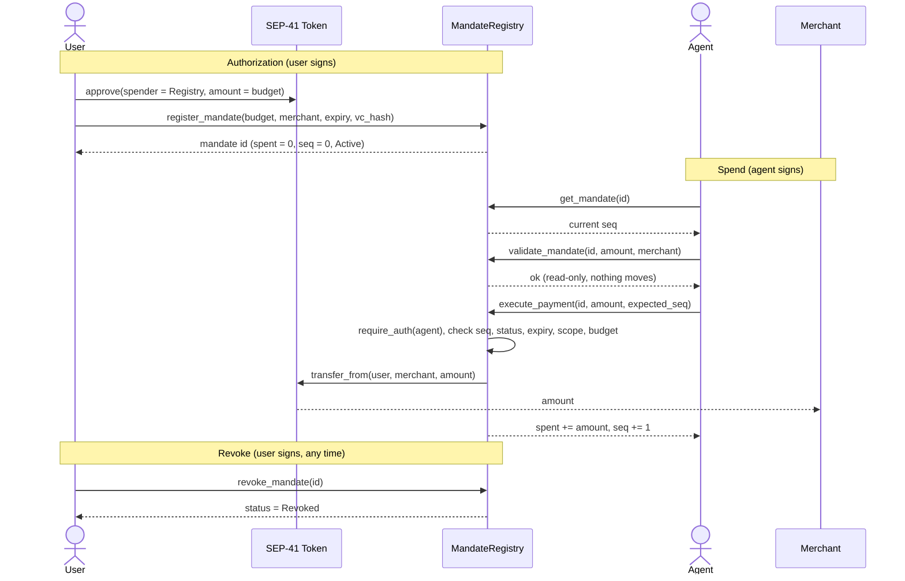
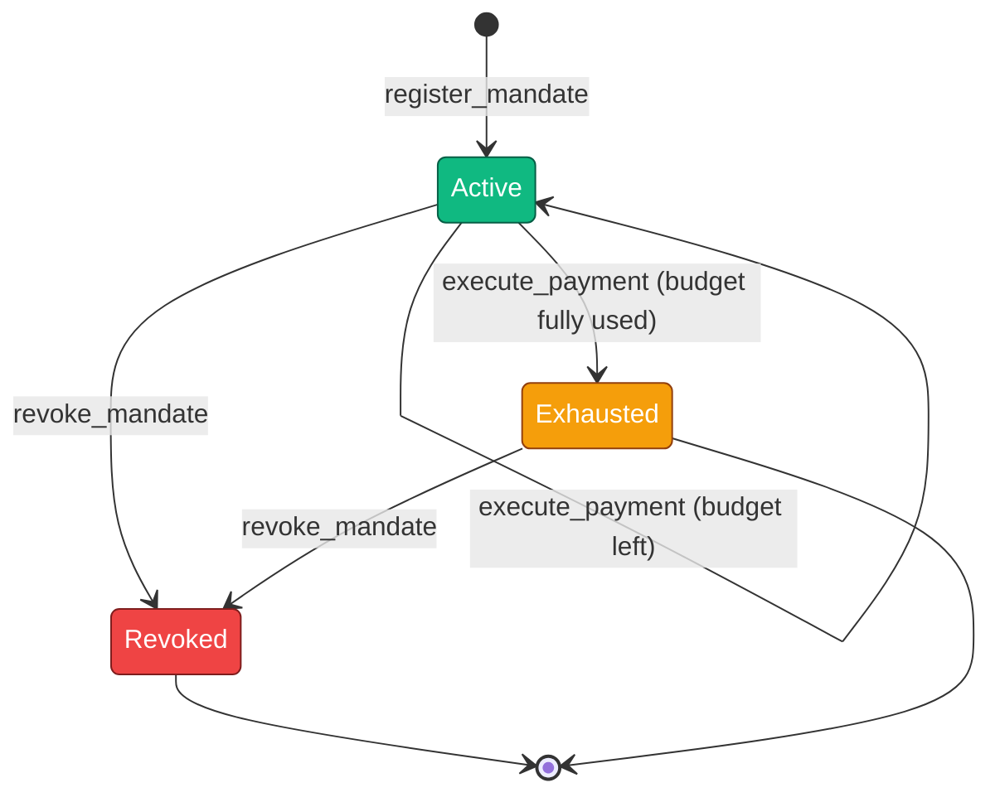

# Simple MandateRegistry on Stellar Testnet

[](https://github.com/reapp-protocol/reapp-protocol/actions/workflows/ci.yml)
[](https://stellar.expert/explorer/testnet/contract/CB4KOTLGMM5JEPFPU6QBJLADIBP3RSGUX44FOYTFRICNXKKFPYIW7ZOA)

> This document records the source-verified simple MandateRegistry deployment on Stellar testnet: [`CB4KOTLGMM5JEPFPU6QBJLADIBP3RSGUX44FOYTFRICNXKKFPYIW7ZOA`](https://stellar.expert/explorer/testnet/contract/CB4KOTLGMM5JEPFPU6QBJLADIBP3RSGUX44FOYTFRICNXKKFPYIW7ZOA). The workspace SDK config now points at the composite deployment; this page preserves the simple contract's identity, verification, and historical on-chain activity.

> **Release.** MandateRegistry Soroban contract deployed on testnet. Contract
> live on testnet with `register_mandate`, `validate_mandate`,
> `execute_payment`, and `revoke_mandate` callable. Integration tests passing,
> including negative cases for unauthorized callers and overspend attempts.

This document explains the simple contract in plain English, documents every method,
and records its historical on-chain activity.

## What it is

MandateRegistry is a small Soroban smart contract that holds spending mandates and
is the only thing allowed to move the money. A user sets a budget for an agent to
spend at one merchant. The contract checks every payment against that budget,
on-chain, before any funds move. If the check fails, no money moves.

The limit lives inside the contract, in the money path. It is not in the app and
not in the SDK. That is the whole point. A limit checked in app or SDK code is only
as trustworthy as that code, but a limit checked inside the contract holds even when
the app is wrong, the SDK has a bug, or the agent's key is stolen. The SDK is
treated as untrusted. The contract is the source of truth.

| Fact | Value |
|---|---|
| Network | Stellar testnet |
| Contract id | [`CB4KOTLGMM5JEPFPU6QBJLADIBP3RSGUX44FOYTFRICNXKKFPYIW7ZOA`](https://stellar.expert/explorer/testnet/contract/CB4KOTLGMM5JEPFPU6QBJLADIBP3RSGUX44FOYTFRICNXKKFPYIW7ZOA) |
| WASM hash | `4eb1b943…d8c69e` |
| Deployed | 2026-06-19 02:34:12 UTC by [`GA2B…L4XH`](https://stellar.expert/explorer/testnet/account/GA2B3YY27OY6AWT2VXMXUDBSAHVOLU2ST6QWJJJLOIGDQHJDXO4RL4XH) |
| Source | Source-verified on StellarExpert: [`reapp-protocol-contracts`](https://github.com/reapp-protocol/reapp-protocol-contracts) @ commit `d1a2e3e` |
| Explorer | [stellar.expert contract page](https://stellar.expert/explorer/testnet/contract/CB4KOTLGMM5JEPFPU6QBJLADIBP3RSGUX44FOYTFRICNXKKFPYIW7ZOA) |

The contract is small on purpose. A small interface is a reviewable interface.

## How it works, in plain English

Picture an AI assistant that shops for you. You never hand it your wallet. Instead you set rules at the bank: "my assistant can spend up to 5 coins, only at this one store, until Friday." The **bank is the smart contract**: it holds the rules and is the only thing allowed to actually move your money. The assistant can ask, but the bank decides.

The five methods are just the things people can ask the bank:

- 🔵 **`register_mandate`** sets the rules: who can spend, how much, where, and until when. You also tell the bank it may pull up to that amount from your account, so the assistant never holds the keys to your money; the bank does.
- 🟠 **`execute_payment`** is the assistant asking the bank to pay the store. The bank re-checks every rule first (right assistant? right store? under budget? not expired? not a repeat?) and only then moves the money. This is the only way a single coin ever moves.
- 🟢 **`validate_mandate`** is a "would this be allowed?" dry run, like checking your balance before you swipe. Nothing actually happens.
- 🔵 **`revoke_mandate`** is your kill switch: cancel the assistant's spending at any time, and every later attempt is denied.
- 🟢 **`get_mandate`** lets anyone look up the rules and how much has been spent, like reading the card statement.

The point: the assistant never holds your money and never controls the limit. The bank does, and it enforces the rules on every single payment. So even if the assistant goes rogue, or the app running it is hacked, it cannot overspend, pay the wrong store, or drain your account. The bank simply says no.

In REAPP terms: you are the **user**, the assistant is the **agent**, the bank is the **MandateRegistry** contract, the store is the **merchant**, and the rules are the **mandate**.

## What it stores: the Mandate

Each mandate is one record, stored under its own id (a 32-byte hash). It holds:

| Field | Plain English |
|---|---|
| `user` | The person who owns the funds and signs the mandate |
| `agent` | The only account allowed to spend against this mandate |
| `merchant` | The single account that may be paid |
| `asset` | The SEP-41 token to spend. The contract accepts any token; the live testnet runs use native XLM (its Stellar Asset Contract, [`CDLZ…CYSC`](https://stellar.expert/explorer/testnet/contract/CDLZFC3SYJYDZT7K67VZ75HPJVIEUVNIXF47ZG2FB2RMQQVU2HHGCYSC)) |
| `max_amount` | The total budget the agent may spend |
| `spent` | How much has been spent so far (starts at 0) |
| `expiry` | A time after which the mandate is dead |
| `seq` | A counter that goes up by one on every payment (stops replays) |
| `status` | `Active`, `Revoked`, or `Exhausted` |
| `vc_hash` | The mandate id, which links to the off-chain signed intent |

A mandate's `status` moves through three states:

- **Active**: the agent can spend.
- **Exhausted**: the full budget has been spent. No more payments.
- **Revoked**: the user withdrew consent. No more payments.

## The methods, one by one

The contract has five methods. Two are read-only and need no signature; three
change state and require a specific signer.

> **Key:** 🟢 read-only, no signature · 🔵 user-signed · 🟠 agent-signed, moves money

| Method | Signer | Changes state | What it does |
|---|---|---|---|
| 🔵 `register_mandate` | User | ✅ | Creates a mandate |
| 🟢 `validate_mandate` | None | ➖ | Preflight check before paying |
| 🟠 `execute_payment` | Agent | ✅ | The only path that moves money |
| 🔵 `revoke_mandate` | User | ✅ | Cancels a mandate |
| 🟢 `get_mandate` | None | ➖ | Reads a mandate |

---

### 🔵 `register_mandate(user, agent, merchant, asset, max_amount, expiry, vc_hash)`

Creates a new mandate. Moves no money.

| | |
|---|---|
| **Signer** | the user |
| **Checks** | budget is positive (`InvalidAmount`), expiry is in the future (`MandateExpired`), the id is not already taken (`AlreadyExists`) |
| **Sets** | `spent = 0`, `seq = 0`, `status = Active` (set by the contract, so a caller cannot seed a fake balance or status) |
| **Returns** | the mandate id |
| **After** | the user separately signs a SEP-41 `approve` so the contract can later pull funds |

---

### 🟢 `validate_mandate(mandate_id, amount, merchant)`

A read-only dry run that answers one question: would a payment of `amount` to
`merchant` be allowed right now?

| | |
|---|---|
| **Signer** | none, anyone can call it |
| **Effect** | none, it changes nothing on-chain |
| **Use** | the SDK calls it for a clean typed answer before paying |
| **Note** | it consumes nothing; the real consume happens only in `execute_payment` |

---

### 🟠 `execute_payment(mandate_id, amount, expected_seq)`

The only path that moves money.

| | |
|---|---|
| **Signer** | the agent only, enforced by Soroban's `require_auth`. Any other caller's transaction is reverted at the host level, so no funds move |
| **Atomicity** | the steps below run in one transaction. If any step fails the whole transaction reverts, so there is no partial spend |

Steps:

1. require the agent's signature
2. check `expected_seq` equals the mandate's current `seq`, else `BadSequence` (blocks replays and out-of-order spends)
3. re-check amount, status, expiry, merchant scope, and budget against stored state
4. add `amount` to `spent`, raise `seq` by one, and flip status to `Exhausted` if the budget is now fully used
5. move `amount` from user to merchant with the token's `transfer_from`

---

### 🔵 `revoke_mandate(mandate_id)`

The user's kill switch.

| | |
|---|---|
| **Signer** | the user |
| **Effect** | marks the mandate `Revoked`; after this, every `execute_payment` is rejected with `MandateRevoked` |

---

### 🟢 `get_mandate(mandate_id)`

A read-only lookup.

| | |
|---|---|
| **Signer** | none, anyone can call it |
| **Returns** | the stored mandate (status, spent, seq, and the rest) |
| **Use** | gatecheck, and reading the current `seq` before paying |

## What it refuses

Every payment passes through one set of checks. These are the rejections the
contract enforces on-chain, which no agent or SDK can get around:

| Error | Code | Meaning |
|---|---|---|
| `AlreadyExists` | 1 | A mandate with that id already exists |
| `NotFound` | 2 | No mandate with that id |
| `MandateExpired` | 4 | The mandate's expiry has passed |
| `MandateRevoked` | 5 | The user revoked the mandate |
| `BudgetExceeded` | 6 | The payment would push spend past the budget |
| `MerchantOutOfScope` | 7 | The payee is not the mandate's merchant |
| `BadSequence` | 8 | A replayed or out-of-order payment |
| `InvalidAmount` | 9 | A non-positive amount |

There is no code 3. Unauthorized callers are stopped by Soroban's `require_auth`,
which reverts the transaction at the network level, so it never reaches a
contract error code.

## The flow



## Mandate lifecycle



## Integration tests

The contract ships with a Rust test suite that runs against a Soroban test
environment. It passes 19 of 19, and `cargo clippy` is clean. GitHub Actions runs
`cargo fmt` and the test suite (the negatives included) on every push, so a change
that breaks them cannot land.

```
cd contracts/mandate-registry && cargo test
test result: ok. 19 passed; 0 failed; 0 ignored
```

The requirements name two negative paths. Both are covered by dedicated tests.

**Unauthorized callers**

| Test | What it proves |
|---|---|
| `execute_requires_agent_auth` | Without the bound agent's signature, `execute_payment` reverts and no funds move |
| `register_requires_user_auth` | Only the user can register a mandate |
| `revoke_requires_user_auth` | Only the user can revoke a mandate |

**Overspend**

| Test | What it proves |
|---|---|
| `overspend_single_rejected` | A single payment over the budget is rejected with `BudgetExceeded` |
| `overspend_cumulative_rejected` | Several payments that add up past the budget are rejected |

The full suite, grouped by what it covers:

| Area | Tests |
|---|---|
| Happy path | `happy_path_runs_every_method`, `property_spent_equals_transferred` |
| Unauthorized callers | `execute_requires_agent_auth`, `register_requires_user_auth`, `revoke_requires_user_auth` |
| Overspend | `overspend_single_rejected`, `overspend_cumulative_rejected` |
| Replay and ordering | `replay_stale_seq_rejected`, `out_of_order_seq_rejected` |
| Lifecycle | `revoked_mandate_rejected`, `expired_mandate_rejected`, `exhausted_status_then_rejected`, `register_with_past_expiry_rejected` |
| Scope and input | `out_of_scope_merchant_rejected`, `duplicate_register_rejected`, `unknown_mandate_not_found`, `zero_amount_rejected` |
| Token safety | `insufficient_allowance_blocks_payment`, `reentry_probe::reentrancy_via_evil_token` |

These run on every push through the CI workflow. That matches the Stellar feedback
that the negative tests should run continuously from the first release, not be
added at the end.

## On-chain activity

Every call below is on the source-verified contract `CB4KOTLG…7ZOA`, each linking to its transaction on stellar.expert. Amounts are in XLM (1 XLM = 10,000,000 stroops); the mandate id is shortened.

| Time (UTC) | Caller | Call | What happened |
|---|---|---|---|
| 2026-06-19 02:34:12 | `GA2B…L4XH` | [create contract](https://stellar.expert/explorer/testnet/tx/14f0f5b6c6745d0907c6a92e072e9d2ef3e172627d4dc08d5e39ec1c18d706b8) | Deployed the source-verified MandateRegistry from WASM `4eb1b943…` |
| 2026-06-19 03:52:07 | `GBE3…VNBG` | [register_mandate](https://stellar.expert/explorer/testnet/tx/c45ca03c96f5d6627a716cda7ed83610c5b0d495860f15bb7a3668bc6bb0bbdd) | New mandate `0a65…`: agent `GBPZ…JTHV`, budget 5 XLM |
| 2026-06-19 03:52:17 | `GBPZ…JTHV` | [execute_payment](https://stellar.expert/explorer/testnet/tx/237a3832b1ec05901745e97db3dafc61cd553871e16738bbb9dfec5c0404b01a) | Agent paid 1 XLM (seq 0); funds moved from user to merchant |
| 2026-06-19 03:52:27 | `GBE3…VNBG` | [revoke_mandate](https://stellar.expert/explorer/testnet/tx/fd2fb6a5fc7c795ae89eb26eef4734954eec8eb9583d230e642c442098034625) | User revoked the mandate |

### What this shows

- **A full lifecycle on the source-verified contract**: `register_mandate`, then `execute_payment` (1 XLM moved on-chain), then `revoke_mandate`, all successful, with the read-only `get_mandate` used to read state.
- **The contract is the source of truth**: the SEP-41 allowance is approved for the contract, not the agent, and `execute_payment` is the only path that moves funds.

The rejection paths (overspend, replay, pay-after-revoke, and unauthorized callers) are proven by the 19/19 Rust suite and the end-to-end run, and are enforced on-chain by the typed errors (`BudgetExceeded`, `BadSequence`, `MandateRevoked`) and host-level `require_auth`.

## Source verification

The contract is source-verified on StellarExpert: its on-chain bytecode is matched
to the published source. The contract page shows a verified-source badge linking to
the [`reapp-protocol-contracts`](https://github.com/reapp-protocol/reapp-protocol-contracts)
repository at the exact commit it was built from.

- On-chain wasm hash: `4eb1b943…d8c69e`
- Verified source: `reapp-protocol-contracts` @ commit `d1a2e3e`, path `contracts/mandate-registry`
- Build: produced by the StellarExpert build workflow with a pinned, reproducible toolchain, then deployed from that exact release artifact

Anyone can confirm the deployed bytecode hash:

```
stellar contract fetch --id CB4KOTLGMM5JEPFPU6QBJLADIBP3RSGUX44FOYTFRICNXKKFPYIW7ZOA --network testnet --out-file onchain.wasm
shasum -a 256 onchain.wasm
```

The hash is `4eb1b943…d8c69e`, and the [contract page](https://stellar.expert/explorer/testnet/contract/CB4KOTLGMM5JEPFPU6QBJLADIBP3RSGUX44FOYTFRICNXKKFPYIW7ZOA) shows the verified-source link to the repository.

## Deployment history

The simple contract was iterated on testnet before the source-verified deploy.
Earlier instances were throwaway testnet builds, are **unverified**, and are
superseded. Listed here for the full record.

| Deploy | Contract id | WASM hash | Created | Status |
|---|---|---|---|---|
| Early build | [`CB2LY7XI…H3RD`](https://stellar.expert/explorer/testnet/contract/CB2LY7XIGP7324LTFWUWV5K54AKNCERCUC2N67TKGTCPK4Y2TVVYH3RD) | `a58290d7…` | 2026-06-09 | Superseded · unverified · before the reentrancy regression test (18 tests) |
| e2e iteration | [`CA3X76MR…SBQCL`](https://stellar.expert/explorer/testnet/contract/CA3X76MRIEHP7LVY6H4FIAOTRQYLSMD6NXUMVM5ZR56EOCCWMT6SBQCL) | `59298a08…` | 2026-06-09 | Superseded · unverified · the testnet hardening runs (19 tests) |
| **Source-verified simple** | [`CB4KOTLG…7ZOA`](https://stellar.expert/explorer/testnet/contract/CB4KOTLGMM5JEPFPU6QBJLADIBP3RSGUX44FOYTFRICNXKKFPYIW7ZOA) | `4eb1b943…` | 2026-06-19 | **Live · source-verified · preserved as the simple contract record** |

Each deploy is a fresh contract id with its own bytecode hash; the earlier two are
left on testnet for transparency and carry no funds or active mandates.

## Security gatecheck

Internal adversarial gatecheck on 2026-06-10: a 12-agent sweep across six attack
surfaces (arithmetic and overflow, authorization, replay and sequencing, token
interaction and reentrancy, state and storage, and logic and economics), with every
finding independently re-verified against the code. This is the project's own review
gate, not a third-party security review.

**Verdict: airtight-ship, 0 confirmed defects.**

Why it holds:

- `require_auth` binds to the stored agent, not a caller-supplied address.
- State is written before the external `transfer_from` (checks, effects, interactions order), so there is no reentrancy window. A regression test using a hostile token (`reentry_probe::reentrancy_via_evil_token`) locks this in.
- The SEP-41 allowance is an independent hard ceiling beneath the contract's own budget check.
- `overflow-checks` is on in the release profile, so the `spent` and `seq` arithmetic panic-reverts rather than wraps.
- `register_mandate` forces `spent = 0`, `seq = 0`, `status = Active`, so a caller cannot seed tampered state.

Three items are deferred to mainnet hardening and are not testnet blockers: an asset
allowlist, aligning storage TTL with the mandate expiry, and revisiting the
`validate_mandate` name.

## Release Checklist

Every clause of the contract release, with where it is proven.

| Clause | Status | Evidence |
|---|---|---|
| MandateRegistry deployed and live on testnet | Met | Upgradeable simple contract [`CC6JMPDH…CRWE`](https://stellar.expert/explorer/testnet/contract/CC6JMPDHRPBR2HBLJKRCIKV54HXDV2RFXDKW6MALQKWM6JEAJQHICRWE), release `0.2.0`, WASM `13f7023d…8552b`. Hosted release bytes and the on-chain executable are identical. |
| `register_mandate` callable | Met | Live on-chain; tests `happy_path_runs_every_method`, `register_requires_user_auth` |
| `validate_mandate` callable | Met | Read-only dry run by design (mutates nothing); exercised as the e2e preflight before each `execute_payment`, as documented above |
| `execute_payment` callable | Met | Live on-chain, 1 XLM moved (confirmed on Horizon); tests `happy_path_runs_every_method`, `property_spent_equals_transferred` |
| `revoke_mandate` callable | Met | Live on-chain; tests `revoked_mandate_rejected`, `revoke_requires_user_auth` |
| Integration tests passing | Met | The current simple release runs 25 tests and the composite release runs 62 through the contract repository gate check on every push. |
| Negatives: unauthorized callers | Met | `execute_requires_agent_auth`, `register_requires_user_auth`, `revoke_requires_user_auth`; mirrored on-chain by the rejected `GDNV…5ARS` payment |
| Negatives: overspend | Met | `overspend_single_rejected`, `overspend_cumulative_rejected` |

The contract release is met on every clause.

## Mapping to Stellar's feedback

Stellar gave seven pieces of feedback. Some are addressed now and some belong to
mainnet hardening. This table is honest about what is live today and what remains
future work, so nothing is oversold.

| Feedback | Targets | Status now | Notes |
|---|---|---|---|
| 1. Decouple mandate logic from the x402 wire format | Cross-cutting | Addressed | MandateRegistry takes plain Soroban types and imports no HTTP shape. The replaceable adapter lives in the SDK and middleware. |
| 2. Threat model, data flow diagrams, and negative suite as release gates | Cross-cutting | Addressed for testnet; immutable-mainnet gate remains open | See [`security/threat-model.md`](../security/threat-model.md) and [`security/data-flow.md`](../security/data-flow.md). Negative tests run continuously in both repositories. |
| 3. 2-of-3 multisig and timelock, with documented key management | Pre-mainnet control | Timelock live; custody migration documented | Current testnet administration is one signer. The mandatory 2-of-3 migration, rotation, loss recovery, and immutable-release procedure is in [`security/upgrade-authority.md`](../security/upgrade-authority.md). |
| 4. Negative tests in CI from the first release | Current testnet release | Addressed | Unauthorized callers, expired mandates, overspend, replay, pause behavior, and unauthorized upgrade lifecycle calls run in CI. |
| 5. Protocol-enforced limits; the SDK cannot bypass the on-chain check | Current testnet release | Addressed | `execute_payment` re-validates against stored state on every call and is the only money path. The SDK holds no allowance and is treated as untrusted, so a buggy or skipped SDK check cannot exceed the mandate |
| 6. Exemplary reference consumer and fulfillment agents | Current testnet release | Addressed | The consumer uses `agent.fetch()` and the Express fulfillment agent independently verifies and consumes settlement before serving. `npm run agents:testnet` runs both. |
| 7. Live failure-mode drills and a UX writeup | Current testnet release | Addressed | `npm run drills:testnet` covers autonomous in-scope spend plus revocation, merchant downtime after settlement, and expiry between quote and settlement. See [`docs/live-failure-drills.md`](live-failure-drills.md). |
