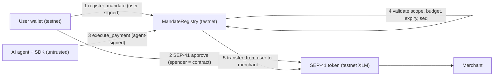
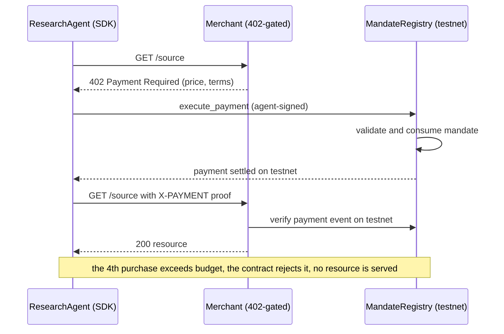
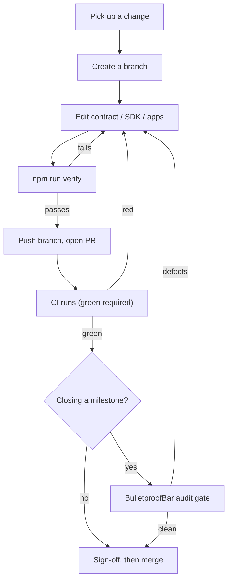
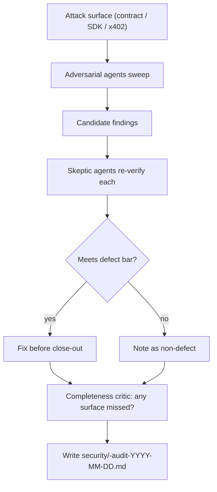
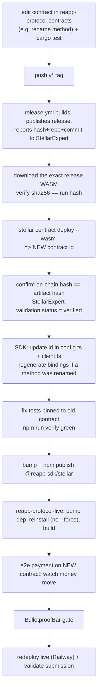
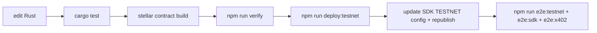
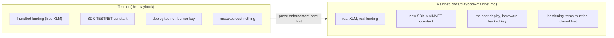

# REAPP Protocol Playbook (Testnet)

This is the operating manual for working against **Stellar testnet**. It covers
everything a team member needs to change the contract, build and publish the
SDK, run the reference apps, prove the flow on testnet, run the security audit,
and push work that stays green. If you are new here, read "Core invariant",
"What is pinned to testnet", and "One time setup" first, then jump to the recipe
that matches your task.

> **This is the testnet playbook.** Every contract id, account, RPC, passphrase,
> funding step, and explorer link below is testnet. The mainnet counterpart
> will live in `docs/playbook-mainnet.md` and will differ in important ways (no
> friendbot funding, real value at risk, a separate `MAINNET` network config,
> hardware-backed keys, and the deferred hardening items from the audits). See
> "Going to mainnet" at the end for the preview. **Never reuse a testnet key,
> contract id, or burner secret on mainnet.**

> **Status today:** Tranche 1 is complete (Steps 1, 2, 3). `MandateRegistry` is
> live on **testnet**, `@reapp-sdk/stellar` and `@reapp-sdk/core` are published
> to npm pointed at the **testnet** deployment, and the full x402 round trip
> runs on testnet. We are not on mainnet yet.

---

## Core invariant

Money moves only through `MandateRegistry.execute_payment`, which validates and
consumes a mandate before it transfers. The user grants the SEP-41 token
allowance to the **contract**, never to the agent or the SDK. The SDK is
untrusted. The contract is the source of truth. A compromised agent or a buggy
SDK cannot exceed the mandate's scope, budget, expiry, or replay guard.

This invariant is identical on testnet and mainnet. The difference is only the
network the contract is deployed to and the value the tokens carry. On testnet
the XLM is free (friendbot), so the cost of a mistake is zero. That is the point
of testnet: prove the enforcement holds before any real value is involved.



The HTTP layer (x402) sits on top of the same enforcement. The agent asks for a
resource, gets a `402 Payment Required`, pays on-chain, and retries with proof.
The budget is enforced through the contract, not the merchant.



---

## What is pinned to testnet

This is the most important section for understanding the testnet vs mainnet
split. Different parts of the system reach testnet in different ways. Some read
the network from your local env file, and some are hardwired to the SDK's `TESTNET`
constant and will ignore the local env file entirely. Know which is which before you touch
anything network related.

| Surface | How it reaches testnet | What changes for mainnet |
|---|---|---|
| Contract deploy (`scripts/deploy.mjs`, `npm run deploy:testnet`) | Reads `SOROBAN_RPC_URL` and `NETWORK_PASSPHRASE` from the local env file. Hardcodes testnet explorer links (`stellar.expert`). Assumes a funded testnet account. | Point the local env file at mainnet RPC and passphrase, swap the explorer base, and deploy from a hardware-backed key rather than a burner. The script name itself (`deploy:testnet`) signals scope. |
| `npm run e2e:testnet` (`scripts/e2e-testnet.mjs`) | Reads RPC, passphrase, contract id, and keys from the local env file. Funds fresh accounts via **friendbot**. | Friendbot does not exist on mainnet. Real accounts must be funded with real XLM. There is no auto-funding. |
| SDK network config (`packages/stellar/src/config.ts`, the `TESTNET` constant) | Hardcodes the testnet contract id, native SAC, RPC, and passphrase. | Add a `MAINNET` `NetworkConfig` and pass it explicitly as the last argument to `reapp.*` calls, or publish an SDK build that defaults to it. |
| `npm run e2e:sdk`, `npm run e2e:x402`, `npm run audit` | Import the SDK `TESTNET` constant directly. **They ignore the network values in the local env file** and always hit the testnet contract baked into the SDK. They fund via friendbot. | These must select the `MAINNET` config. Updating the local env file alone does nothing for them. |
| `npm run keys:derive-freighter` | Network agnostic. Pure BIP39 key derivation. | Same mechanism, but never reuse a testnet burner secret on mainnet. |

The practical trap: if you deploy a **new** contract and update
`MANDATE_REGISTRY_CONTRACT_ID` in the local env file, only `npm run e2e:testnet` picks it up.
`npm run e2e:sdk`, `npm run e2e:x402`, and `npm run audit` will keep hitting the
old contract id baked into the published SDK until you update
`packages/stellar/src/config.ts`, rebuild, and (if you want others to get it)
republish. See "I changed the contract" for the full sequence.

---

## Repository layout

```
contracts/mandate-registry/   Rust / soroban-sdk, the enforcement contract (live on testnet, audited)
packages/stellar/             @reapp-sdk/stellar, typed Soroban layer + TESTNET config + SEP-41 helpers
packages/sdk/                 @reapp-sdk/core, thin untrusted client + Agent.fetch (x402)
apps/fulfillment-agent/       reference 402-gated merchant: verifies payment on testnet before serving
apps/consumer-agent/          reference ResearchAgent: buys sources via agent.fetch, budget enforced on testnet
scripts/                      deploy (testnet), e2e (testnet), audit (testnet), key derivation, verify gate
scripts/e2e-testnet.mjs       npm run demo, the on-chain "aha" on testnet (happy path + rogue rejections)
security/                     dated audit records (contract, SDK, x402)
docs/                         deliverable write-ups, this playbook, and the full code review
.github/workflows/ci.yml      CI: Rust contract job + TypeScript workspaces job
.githooks/pre-push            local pre-push gate that runs npm run verify
```

---

## Prerequisites

Install these once on your machine. Versions matter where noted.

- **Rust** (stable, 1.85 or newer so the `wasm32v1-none` target is available).
  Install with `rustup`.
- **Stellar CLI** (`stellar`). Install with `cargo install --locked stellar-cli`
  or `brew install stellar-cli`. This is what builds and deploys the contract.
- **Node.js 22** (matches CI). Use `nvm` or Homebrew.
- **npm** (ships with Node).

Sanity check that the toolchain is on your PATH:

```bash
rustc --version
stellar --version
node --version
npm --version
```

On macOS the scripts look for `stellar` and `cargo` in `~/.cargo/bin` and
`/opt/homebrew/bin`. If `which stellar` finds nothing, the build, deploy, and
e2e scripts will fail. The deploy script's own error messages point at
`brew install stellar-cli` and `https://rustup.rs` if either tool is missing.

---

## One time setup

Run these in order, from the repo root, after cloning.

Install dependencies for every workspace:

```bash
npm install
```

Enable the pre-push gate so no push can fail CI:

```bash
git config core.hooksPath .githooks
```

Create your local testnet environment file from the template:

```bash
cp .env.example .env
```

The local env file is git-ignored and is for **hot testnet keys only**. Never reuse
a testnet key on mainnet and never commit real values. The template already
carries the testnet RPC and passphrase.

Derive your testnet burner secret key from a Freighter seed phrase. Set
`REAPP_BURNER_PUBLIC_KEY` in the local env file first, then run:

```bash
npm run keys:derive-freighter
```

The script prompts for the seed phrase at runtime (hidden input, never stored),
scans BIP39 account indexes for the public key you set, and prints the matching
secret. Paste that into `REAPP_BURNER_SECRET_KEY`. Widen the scan or override
the target key with flags:

```bash
npm run keys:derive-freighter -- --scan=50 --public=G...
```

Fund your testnet burner account via friendbot (the e2e scripts fund their own
fresh accounts, but a key you set by hand needs funding):

```bash
curl "https://friendbot.stellar.org/?addr=YOUR_G_ADDRESS"
```

Friendbot is a testnet-only faucet. On mainnet there is no equivalent; you fund
with real XLM.

After this, `MANDATE_REGISTRY_CONTRACT_ID` in the local env file should point at the live
testnet contract (see "Smart contract" below). The current testnet value is
`CB4KOTLGMM5JEPFPU6QBJLADIBP3RSGUX44FOYTFRICNXKKFPYIW7ZOA`.

---

## Environment variables (testnet)

All scripts read a single env file at the repo root. The "Read by" column tells
you exactly which scripts consume each variable, so you know what actually
matters. Several variables are read only by the env-driven scripts (deploy and
the testnet e2e); the SDK-driven scripts use the baked-in `TESTNET` constant.

| Variable | Read by | Notes |
|---|---|---|
| `STELLAR_NETWORK` | nothing today | Declared in `.env.example` and reserved for the mainnet split, but no current script reads it. Keep it `testnet` for clarity. The network is actually selected by the values below and by the SDK `TESTNET` constant. |
| `SOROBAN_RPC_URL` | `deploy:testnet`, `e2e:testnet` | Testnet RPC. `https://soroban-testnet.stellar.org`. |
| `NETWORK_PASSPHRASE` | `deploy:testnet`, `e2e:testnet` | `Test SDF Network ; September 2015`. |
| `REAPP_BURNER_PUBLIC_KEY` | `deploy:testnet`, `e2e:testnet`, `keys:derive-freighter`, `audit` | Your testnet public key (`G...`). For the auditor it is the funded account used for read-only RPC simulation. |
| `REAPP_BURNER_SECRET_KEY` | `deploy:testnet`, `e2e:testnet`, `e2e:sdk` | Your testnet secret key (`S...`, 56 chars). Signs register, approve, and deploy. Never commit. |
| `MANDATE_REGISTRY_CONTRACT_ID` | `e2e:testnet` (written by `deploy:testnet`) | The deployed testnet contract id (`C...`). Note: `e2e:sdk`, `e2e:x402`, and `audit` ignore this and use the SDK `TESTNET` constant instead. |
| `USDC_SAC_CONTRACT_ID` | nothing today | SEP-41 USDC placeholder, unused. Leave blank for XLM demos. |
| `NO_COLOR` | all scripts (optional) | Set to `1` to drop ANSI colors from output (useful for log parsing). |

The reference apps read two extra variables at start time:

| Variable | Required | Purpose |
|---|---|---|
| `REAPP_MERCHANT` | yes (apps) | Merchant Stellar address (`G...`) the fulfillment agent collects to. |
| `PORT` | no | Merchant listen port. Defaults to `8402`. |

---

## The daily loop

Every change follows the same path. The gate that protects `main` is
`npm run verify`, which mirrors CI. Milestone close-outs add the BulletproofBar
audit gate on top.



Rule: **every push must be green.** Run `npm run verify` before you push. The
pre-push hook runs it for you once enabled. Do not push or merge without
sign-off.

---

## Smart contract

The contract lives in `contracts/mandate-registry/`. It is Rust on
`soroban-sdk` v22, built to the `wasm32v1-none` target. The public surface
(register, get, validate and consume, execute payment, revoke) is typed in
`packages/stellar/src/client.ts`; the canonical signatures and error variants
are in `src/lib.rs` and `src/error.rs`. The contract source is network agnostic;
the same WASM can be deployed to testnet or mainnet. Only the deployment target
and the funding differ.

### Build

```bash
stellar contract build --manifest-path contracts/mandate-registry/Cargo.toml
```

This produces the artifact at
`contracts/mandate-registry/target/wasm32v1-none/release/mandate_registry.wasm`.
Use `stellar contract build`, not `cargo build`. Plain cargo will not emit the
`wasm32v1-none` target or the Soroban metadata. If the target is missing, add
it once with `rustup target add wasm32v1-none`.

### Test

```bash
cd contracts/mandate-registry
cargo test
```

There are 19 tests: the happy path that runs every method, a property test
(`spent` equals `transferred`), the negative suite (overspend single and
cumulative, replay, expiry, revoke, out of scope merchant, bad auth, zero
amount, duplicate register, unknown mandate), and a reentrancy regression
against a malicious SEP-41 token. The negative suite is a Stellar directive: it
runs from commit one and must never be reordered or bolted on at the end.

### Deploy to testnet

The full pipeline is one command:

```bash
npm run deploy:testnet
```



```mermaid
flowchart LR
  Src["contract source"] --> Build["stellar contract build (wasm32v1-none)"]
  Build --> Wasm["mandate_registry.wasm"]
  Wasm --> Deploy["npm run deploy:testnet"]
  Deploy --> Env["read RPC + passphrase from the local env file"]
  Env --> Sign["sign with REAPP_BURNER_SECRET_KEY"]
  Sign --> Chain["Stellar testnet"]
  Chain --> Id["contract id written to the local env file"]
  Id --> Cfg["update SDK TESTNET config, republish (see SDK section)"]
```

How `scripts/deploy.mjs` targets testnet, in detail:

- It resolves the local env file from the repo root (cwd-proof), then reads
  `SOROBAN_RPC_URL` and `NETWORK_PASSPHRASE`. Those two values are what actually
  point the deploy at testnet, so they must be the testnet RPC and passphrase.
  The script aborts if either is unset.
- It checks for the `stellar` CLI and `cargo`, then runs `stellar contract build`
  and locates the freshest `.wasm` under `target/**/release/`.
- It reads the deployer secret from `REAPP_BURNER_SECRET_KEY`, or prompts for it
  with hidden input if unset. The secret must start with `S` and be exactly 56
  characters, otherwise the script exits immediately. The secret is masked in
  all printed commands.
- It runs `stellar contract deploy --wasm <wasm> --source-account <secret>
  --rpc-url <rpc> --network-passphrase <passphrase>`, captures stdout, and takes
  the last `C...` match as the contract id.
- It writes that id back into the local env file as `MANDATE_REGISTRY_CONTRACT_ID` and
  prints a `stellar.expert` explorer link. The explorer base and the
  link normalization are hardcoded to testnet inside the script.
- The deployer account must already be funded with **testnet** XLM (use
  friendbot during setup).

This is why a mainnet deploy is a separate path, not just a different env file:
the explorer links, the funding assumption, and the script name are all testnet
shaped. The mainnet playbook will document the mainnet deploy procedure.

### Verify the live testnet bytecode matches source

To confirm what is on testnet is what is in the repo:

```bash
stellar contract fetch --id CB4KOTLGMM5JEPFPU6QBJLADIBP3RSGUX44FOYTFRICNXKKFPYIW7ZOA --network testnet --out-file onchain.wasm
stellar contract build --manifest-path contracts/mandate-registry/Cargo.toml
```

Then compare the hash of `onchain.wasm` against the freshly built artifact.

### Testnet contract facts

| Item | Value |
|---|---|
| Live testnet contract id | `CB4KOTLGMM5JEPFPU6QBJLADIBP3RSGUX44FOYTFRICNXKKFPYIW7ZOA` |
| Native XLM SAC (testnet) | `CDLZFC3SYJYDZT7K67VZ75HPJVIEUVNIXF47ZG2FB2RMQQVU2HHGCYSC` |
| Testnet RPC | `https://soroban-testnet.stellar.org` |
| Testnet passphrase | `Test SDF Network ; September 2015` |
| soroban-sdk | v22 |
| Contract page | https://stellar.expert/explorer/testnet/contract/CB4KOTLGMM5JEPFPU6QBJLADIBP3RSGUX44FOYTFRICNXKKFPYIW7ZOA |

Use stellar.expert for the contract page, activity, and single transactions; the
testnet e2e and deploy scripts print stellar.expert links throughout.

### Behavior to preserve

These are load-bearing. Do not regress them:

- State first, transfer second. `spent` and `seq` are persisted before the
  external `transfer_from`, which is what blocks reentrancy double spend even
  with a hostile token.
- `register_mandate` initializes `spent = 0`, `seq = 0`, `status = Active`. A
  caller cannot seed tampered state.
- `execute_payment` takes an `expected_seq` that must equal the mandate's
  current seq, or it fails with `BadSequence`. This is the per-mandate replay
  guard, separate from Soroban's transport nonce.
- Authorization is host enforced via `require_auth()`, so an unauthorized
  caller gets a host revert, not a typed contract error.
- Storage TTL auto-extends 30 days on every mandate access.
- The allowance model is intentional: the user runs SEP-41 `approve` with the
  contract as spender after registering. The contract never calls `approve`, it
  later calls `transfer_from` against that allowance. Escrow is a documented
  contingency, not implemented in the MVP.

---

## SDK

Two published packages, ESM with TypeScript types:

| Package | Version | Role |
|---|---|---|
| `@reapp-sdk/stellar` | 0.1.1 | Soroban client, typed `MandateRegistry` bindings, the `TESTNET` `NetworkConfig`, `keypairSigner`, SEP-41 `token.approve` / `token.balance`. |
| `@reapp-sdk/core` | 0.2.0 | High level untrusted client: `createIntentMandate`, `registerMandate`, `approveBudget`, `revokeMandate`, and the `agent` factory with `pay` and `fetch`. |

`@reapp-sdk/core` depends on `@reapp-sdk/stellar`. The testnet contract id,
native SAC, RPC, and passphrase are baked into `packages/stellar/src/config.ts`
as the `TESTNET` constant. This is the single source of network truth for the
SDK and for every SDK-driven script (`e2e:sdk`, `e2e:x402`, `audit`). There is
no `MAINNET` constant yet; adding one is the first step of the mainnet bring-up.

To target a network other than the published default, build a custom
`NetworkConfig` and pass it as the last argument to the `reapp.*` calls rather
than editing the constant in place.

### Build and test

Build order matters. Stellar first, then everything that depends on it:

```bash
npm run build -w @reapp-sdk/stellar
npm run build --workspaces --if-present
```

The root `npm run build` already does both in the right order. Run the tests
with:

```bash
npm test
```

### Publish to npm

Publishing is ordered: `@reapp-sdk/stellar` must land on npm before
`@reapp-sdk/core`, because core references it by version. Both declare
`publishConfig.access: public`, but pass the flag explicitly anyway.

Bump the version, then from a clean build:

```bash
npm run verify
```

Publish the stellar layer:

```bash
cd packages/stellar
npm publish --access public
```

Publish core (only after stellar is live on npm):

```bash
cd packages/sdk
npm publish --access public
```

You need `npm login` first. Because the published SDK carries the `TESTNET`
contract id, anyone who installs it points at our testnet deployment by default.
If you redeploy the contract and get a new id, update
`packages/stellar/src/config.ts`, bump and republish `@reapp-sdk/stellar`, then
bump and republish `@reapp-sdk/core`. Until you do, installed copies keep
hitting the old contract.

---

## Reference apps

Two reference implementations show the safe pattern end to end against testnet.
They are private workspace packages (not published).

Start the merchant (fulfillment agent). It serves 402-gated sources at 1.00
testnet XLM each and verifies payment on testnet before serving:

```bash
cd apps/fulfillment-agent
REAPP_MERCHANT=G... npm run start
```

It listens on port `8402` by default. Override with `PORT`. Run its tests with
`npm run test` from the same directory (covers the 402 challenge, on-chain
payment verification, and replay protection).

Run the consumer (ResearchAgent). It signs and registers a mandate, then buys
sources through `agent.fetch`, with the budget enforced on testnet:

```bash
cd apps/consumer-agent
REAPP_MERCHANT=G... npm run start
```

The merchant tracks payment proofs in memory only. A production merchant must
persist them to prevent replay.

---

## End to end and demo (testnet)

Everything below runs against live testnet with no mocks. Note which scripts
read the local env file and which use the SDK `TESTNET` constant:

- `npm run demo` and `npm run e2e:testnet` read the contract id and network from
  the local env file. The contract must be deployed and `MANDATE_REGISTRY_CONTRACT_ID` set,
  or they fail with a "contract not set" error.
- `npm run e2e:sdk` and `npm run e2e:x402` use the published SDK `TESTNET`
  constant and ignore the network values in the local env file. They always hit the testnet
  contract baked into the SDK.

All of them fund their fresh accounts via friendbot, which is testnet only.

| Command | What it proves on testnet |
|---|---|
| `npm run demo` | The on-chain aha. User authorizes, agent pays, 1 XLM moves on testnet, then the contract rejects the rogue cases (overspend, replay, pay after revoke). Wraps the testnet e2e. |
| `npm run e2e:testnet` | Production grade contract flow with real testnet accounts and the real XLM SEP-41 asset. Ensures the native SAC, funds agent and merchant via friendbot, approves the contract as spender, registers, gets, validates and consumes, executes payment, checks balances, revokes, and confirms revoke blocks payment. |
| `npm run e2e:sdk` | The published `@reapp-sdk/core` surface doing the full flow on testnet: `createIntentMandate`, `registerMandate`, `approveBudget`, `agent.pay`, an over-budget pay that is rejected, revoke, and a post-revoke pay that is rejected. 8 of 8 checks. |
| `npm run e2e:x402` | The full x402 round trip on testnet. Starts a local 402 merchant on port 8402, the ResearchAgent buys 1 XLM sources against a 3 XLM mandate, three settle on-chain, the fourth is rejected by the budget so no resource is served. |

A clean from-scratch run of either SDK or x402 e2e:

```bash
npm install && npm run build && npm run e2e:sdk
npm install && npm run build && npm run e2e:x402
```

Notes that bite people:

- Friendbot rate limits rapid funding. `e2e:sdk` sleeps after funding to let the
  ledger confirm.
- The Stellar CLI caches named identities under `~/.stellar/keys/`. The testnet
  e2e creates `reapp-agent` and `reapp-merchant` and reuses them on later runs.
- `npm run e2e:x402` binds port 8402. Free the port first.

---

## Security audit (testnet)

Security is a gating deliverable, not a closing artifact. We audit before a
milestone closes, not after deploy. Two layers:

### 1. The on-chain mandate auditor

`npm run audit` reads a mandate straight from the testnet contract and verifies
its spending limits. It trusts no app or SDK claim. It is read only and never
signs or sends a transaction. It is hardwired to the SDK `TESTNET` constant
(`const net = TESTNET` in `scripts/audit-mandate.mjs`), so it always reads from
the testnet deployment regardless of your env file network values. Auditing a
mainnet mandate will require a `MAINNET` config and a script change.

```bash
npm run audit -- <mandate-id-hex>
```

The mandate id is exactly 64 hex characters (a 32-byte SHA256 hash). Useful
flags:

```bash
npm run audit -- <mandate-id-hex> --json
npm run audit -- <mandate-id-hex> --source G...
```

It reports three independent on-chain ceilings (remaining budget, SEP-41
allowance to the contract, user token balance) and the true spendable amount,
which is the minimum of the three. Spendable is zero if the mandate is revoked,
expired, exhausted, or lacks allowance or balance, even when remaining budget is
positive. It needs a funded **testnet** source account for RPC simulation, from
`REAPP_BURNER_PUBLIC_KEY` or `--source`.

A worked example using the live Step 2 testnet mandate:

```bash
npm run audit -- 2e7c7b8746beb91486fce40685a2656616851c07a93087146e6f0f8b5b5d4513
```

### 2. The BulletproofBar audit gate

BulletproofBar is our multi-agent adversarial sweep, run per milestone before
close-out. A pool of agents (12 to 31 per surface in the runs so far) attacks
one surface, candidate findings are re-verified by independent skeptic agents,
and a completeness critic checks that no surface was missed. A finding only
counts as a defect if it moves wrong on-chain values, leaks custody, bypasses
contract enforcement, leaks a secret, or compromises a published package.



Records live in `security/` and are named
`security/<component>-audit-YYYY-MM-DD.md`. The three on record:

| Record | Surface | Result |
|---|---|---|
| `security/audit-2026-06-10.md` | MandateRegistry contract | 0 confirmed defects |
| `security/sdk-audit-2026-06-15.md` | `@reapp-sdk` packages | 0 confirmed defects |
| `security/x402-audit-2026-06-16.md` | x402 merchant + round trip | 1 critical and 1 medium found and fixed |

Each record also lists deferred mainnet hardening items (for example an asset
allowlist, a per-call price ceiling, and stored dedup of x402 proofs). These are
testnet-acceptable but **mainnet blockers**: closing them is required before any
public or multi-instance mainnet deploy. When you close a milestone, run the
gate, fix every defect that meets the bar, and write a new dated record.

---

## CI, the verify gate, and git hooks

These are network agnostic. The contract tests run against the local Soroban
test host, not testnet, so CI never touches the network.

### npm run verify

This is the local CI-equivalent gate. It is stricter than CI (it adds clippy and
forces a clean workspace build). Run it before every push.

```bash
npm run verify
```

It runs, in order, and stops at the first failure:

1. `cargo fmt --all -- --check` in `contracts/mandate-registry`
2. `cargo clippy --all-targets -- -D warnings` in `contracts/mandate-registry`
3. `cargo test` in `contracts/mandate-registry`
4. removes `packages/sdk/dist` and `packages/stellar/dist`, then `npm run build`
5. `npm test`

It needs your local `node_modules` present (run `npm install` first) because it
does not run `npm ci`.

### The pre-push hook

`.githooks/pre-push` simply runs `npm run verify`. It does not run by default
after a clone. Enable it once:

```bash
git config core.hooksPath .githooks
```

### CI

`.github/workflows/ci.yml` runs on every push and every pull request, with no
branch filter, across two jobs:

- **contract** (Rust): `cargo fmt --all -- --check` then `cargo test` with the
  `wasm32-unknown-unknown` target installed.
- **packages** (TypeScript, Node 22): `npm ci`, `npm run build`, `npm test`.

CI does not run clippy, so `npm run verify` catches clippy issues that CI would
not. Green CI is required to merge.

---

## Git and release conventions

- **Branch per change.** Do not commit straight to `main`. Open a PR, get CI
  green, get sign-off, then merge. Do not push or merge without explicit okay.
- **Commit style.** Conventional commits, scoped where it helps, for example
  `docs(step-1): ...`, `test: ...`, `feat(contract): ...`.
- **Commit message rules.** No `Co-Authored-By` trailer. Do not mention Claude,
  Anthropic, or any AI tool in commit messages or PR text.
- **Prose style.** REAPP writing is human and direct. No em dashes or en dashes.
  Avoid AI-tell phrasing.
- **Tranche cadence.** Work ships in tranche steps. Each step has a write-up in
  the matching deliverable doc in `docs/` (`mandate-registry-contract.md`,
  `reapp-sdk-npm.md`, `x402-roundtrip.md`) with the verified on-chain evidence
  (test counts, e2e counts, contract and mandate ids). Update the relevant doc when
  a step closes.
- **Defer cosmetic changes.** Do not reopen a shipped tranche for a
  non-functional change (a method rename, a comment tweak). Fold it into the
  next tranche's redeploy and version cycle.

---

## Source-verified deploys and contract cutover (internal runbook)

INTERNAL. This is the canonical process for redeploying the contract while keeping
the StellarExpert "verified source" link, and cutting the change through the SDK,
npm, and the live demo. Use it any time a redeploy is required: a contract method
rename, an SDK rename or republish, or any change to the contract source.

### Why this is its own process

The local-build deploy in "I changed the contract" below produces an UNVERIFIED
contract. StellarExpert only shows the source link when the on-chain WASM hash
equals the hash produced by its build workflow, and that match is fragile:

- The WASM hash is `sha256` of the compiled bytes. It depends only on the source
  and the build toolchain (Rust, soroban-sdk, the `stellar` CLI version, target,
  optimize). It does not depend on the repo name, the folder, or GitHub. Copying
  the same source elsewhere builds the same hash.
- The official build workflow pins a specific `stellar` CLI version. Building the
  identical source with a different CLI version locally yields a different hash.
  We hit exactly this: a local CLI 26.x build and the workflow's 25.1.0 build of
  the same source produced different hashes.
- The contract has no upgrade entrypoint, so its bytecode is immutable. Any
  source change means a new deploy and a new contract id. You cannot re-verify an
  already-deployed contract that was deployed from a local build.

The golden rule that falls out of this: **deploy the exact artifact the workflow
built** (download it from the GitHub release). Never deploy a local rebuild.

Source lives in a dedicated PUBLIC repo, `reapp-protocol-contracts`, so the
private monorepo history stays private while only the contract source is exposed.
StellarExpert matches by hash regardless of which repo built it, so a dedicated
public repo is clean and sufficient.

### Flow



### Phase 1, build and verify the new contract (public repo)

1. In `reapp-protocol-contracts/contracts/mandate-registry`, make the change. For
   a method rename, update `src` and the contract tests, then run `cargo test`.
2. Commit and push to the public repo.
3. Push a `v*` tag. The `release.yml` (StellarExpert `soroban-build-workflow`)
   compiles, publishes a GitHub release with the optimized WASM, and reports the
   hash, repo, and commit to StellarExpert. Read the run log for the line
   `Wasm Hash:` and record it.
4. Download the exact artifact and confirm its hash:

   ```bash
   gh release download <tag> --repo reapp-protocol/reapp-protocol-contracts --pattern '*.wasm' --dir release-artifact
   shasum -a 256 release-artifact/*.wasm
   ```

   The hash must equal the run's `Wasm Hash`.
5. Deploy that artifact with a funded testnet identity:

   ```bash
   stellar contract deploy --wasm release-artifact/<file>.wasm --source <key> --network testnet
   ```

   Record the new contract id it prints. The deploy log will confirm it used the
   same wasm hash.
6. Verify on-chain. Fetch the deployed WASM and confirm its hash equals the
   artifact, then confirm StellarExpert shows it verified:

   ```bash
   stellar contract info interface --id <new-id> --network testnet
   curl -s https://api.stellar.expert/explorer/testnet/contract/<new-id>
   ```

   The StellarExpert response must show `validation.status: verified` with the
   repo and commit, and the interface must expose the renamed method (and no
   longer expose the old name).

### Phase 2, cut the change through consumers

7. SDK id. Update `packages/stellar/src/config.ts` `mandateRegistryId` and
   `packages/stellar/src/client.ts` `contractId` to the new id. If a method was
   renamed, regenerate the TypeScript bindings against the new contract so the
   binding name matches the on-chain name, otherwise calls to the old binding
   name fail at runtime:

   ```bash
   stellar contract bindings typescript --contract-id <new-id> --network testnet --output-dir packages/stellar/src
   ```

   Then `npm run build`.
8. Fix tests pinned to the old contract. Golden fixtures recorded from the old
   contract will not match a new id. Either regenerate the fixture from a real tx
   on the new contract, or assert the golden tests against a clearly labeled
   historical-emitter constant while synthetic tests keep using the live config
   id. Run `npm run verify` until green.
9. Publish. Bump `@reapp-sdk/stellar` (you cannot republish an existing version),
   `cd packages/stellar`, `npm publish`. `@reapp-sdk/core` only needs a republish
   if it embeds the id or the renamed method; if it reads the id from stellar at
   runtime, it does not.
10. Live demo. In `reapp-protocol-live`, bump the `@reapp-sdk/stellar` dependency
    and reinstall. Never use `npm install --force` here, it downgrades Next 15 to
    9. Then `npm run build`.
11. Prove it works. A fresh deploy has zero transaction history, so "it compiles"
    is not "it works". Run a real `register` then `execute_payment` against the
    new contract (`npm run e2e:testnet`, `npm run e2e:sdk`) and confirm funds move
    and the payment event is emitted by the new registry.
12. Run the BulletproofBar gate on every changed surface and fix findings.
13. Only then redeploy the live site (Railway) and validate end to end.

### Gotchas we hit, and the fix

| Symptom | Cause and fix |
|---|---|
| Release workflow ends in `startup_failure` (0s) | The caller workflow needs a `permissions:` block (`id-token`, `contents`, `attestations` write). The repo's default token is read-only. |
| Build dir is literally `[contracts/mandate-registry]` | `relative_path` must be a plain string for a single-contract call, not a JSON array. The array form is only for the matrix variant. |
| Attestation step fails, "feature not available, make repo public" | The source repo must be PUBLIC. It also must be public for verification to mean anything. |
| Workflow hash does not match a local build | Toolchain drift (different `stellar` CLI version). Deploy the workflow's artifact, not a local rebuild. |
| `npm publish` rejects "cannot publish over existing version" | Bump the version first. |
| Live demo still hits the old contract | It resolves the SDK from its lockfile. Bump the dep and reinstall (no `--force`). |
| Golden or e2e tests fail right after cutover | They were pinned to the old contract id or method. Update or regenerate them. |

### Greenlight gate before submitting

Do not flip the live site or call the cutover done until all of these are green:

1. BulletproofBar audit passes on every changed surface, zero confirmed blockers.
2. New contract verified on StellarExpert, on-chain hash equals the artifact hash,
   interface exposes the new method name.
3. A real `register` then `execute_payment` on the new contract succeeded: money
   moved and the payment event came from the new registry.
4. Nothing at runtime calls a renamed binding; the published package carries the
   new id.
5. The live demo builds against the new SDK and its money path uses only methods
   whose signatures did not change.

---

## Recipes

### I changed the contract



1. Edit the Rust. Keep the negative suite intact and state-before-transfer
   ordering.
2. `cd contracts/mandate-registry && cargo test`.
3. `stellar contract build --manifest-path contracts/mandate-registry/Cargo.toml`.
4. `npm run verify`.
5. `npm run deploy:testnet` (this rewrites `MANDATE_REGISTRY_CONTRACT_ID` in
   the local env file).
6. Update `packages/stellar/src/config.ts` `TESTNET.mandateRegistryId` to the
   new id, then bump and republish `@reapp-sdk/stellar` and `@reapp-sdk/core`.
   Remember: `e2e:sdk`, `e2e:x402`, and `audit` will keep using the old id until
   you do this and rebuild.
7. Re-run `npm run e2e:testnet`, `npm run e2e:sdk`, and `npm run e2e:x402` to
   confirm the live flow against the new deployment.

### I changed the SDK

1. Edit under `packages/stellar/src` or `packages/sdk/src`.
2. `npm run build` then `npm test`.
3. `npm run verify`.
4. `npm run e2e:sdk` and `npm run e2e:x402` against live testnet.
5. To release: bump versions, then publish stellar before core (see SDK
   section).

### I want to cut an SDK release

1. `npm run verify` from a clean tree.
2. Bump `@reapp-sdk/stellar`, `cd packages/stellar`, `npm publish --access public`.
3. Bump `@reapp-sdk/core` (point its dependency at the new stellar version),
   `cd packages/sdk`, `npm publish --access public`.

### I want to audit a live testnet mandate

```bash
npm run audit -- <64-hex-mandate-id>
```

Add `--json` for machine output or `--source G...` to pick the simulation
account.

### I am closing a milestone

1. Land all code with CI green.
2. Run the BulletproofBar gate on the changed surfaces.
3. Fix every finding that meets the defect bar.
4. Write `security/<component>-audit-YYYY-MM-DD.md`.
5. Update the matching deliverable doc in `docs/` with the verified evidence.

### I am onboarding a new developer

Send them to "Prerequisites", "What is pinned to testnet", and "One time setup",
then have them run `npm run demo`. Seeing 1 testnet XLM move and the rogue cases
get rejected on-chain is the fastest way to understand the invariant.

---

## Troubleshooting

| Symptom | Cause and fix |
|---|---|
| `which stellar` finds nothing | Install the Stellar CLI and ensure `~/.cargo/bin` or `/opt/homebrew/bin` is on PATH. The deploy script points at `brew install stellar-cli`. |
| Build produces no WASM / wrong target | Use `stellar contract build`, not `cargo build`. Add the target with `rustup target add wasm32v1-none`. |
| Deploy aborts: RPC or passphrase unset | `SOROBAN_RPC_URL` and `NETWORK_PASSPHRASE` must be set in the local env file (testnet values). |
| Deploy exits immediately on the secret | `REAPP_BURNER_SECRET_KEY` must start with `S` and be exactly 56 chars. |
| `e2e:testnet` / `demo` fail with "contract not set" | Deploy first; `MANDATE_REGISTRY_CONTRACT_ID` must be filled in the local env file. |
| `e2e:sdk` / `e2e:x402` / `audit` still hit the old contract | They use the SDK `TESTNET` constant, not the local env file. Update `config.ts`, rebuild, and (for others) republish. |
| e2e:x402 fails on startup | Port 8402 is in use. Free it. |
| Funding fails intermittently | Friendbot rate limit. Wait and retry; the scripts sleep to let the ledger confirm. |
| `npm run verify` fails before any build | `node_modules` missing. Run `npm install` (verify does not run `npm ci`). |
| Auditor says "need a funded testnet source account" | Set `REAPP_BURNER_PUBLIC_KEY` or pass `--source G...`; the account must exist on testnet. |
| Auditor says "mandate id must be 64 hex chars" | The id is a 32-byte hash in hex; check length. |
| `npm publish` is rejected | Run `npm login`; publish `@reapp-sdk/stellar` before `@reapp-sdk/core`. |

---

## Going to mainnet

The mainnet procedure will live in `docs/playbook-mainnet.md`. This section is the
preview so you know what carries over and what does not. The core invariant, the
contract source, the test suite, `npm run verify`, CI, and the git conventions
are all unchanged. What changes is everything network and value related:



Concretely, the mainnet bring-up will require:

- A `MAINNET` `NetworkConfig` in `packages/stellar/src/config.ts` with the
  mainnet RPC, passphrase, the deployed mainnet contract id, and the mainnet
  native SAC. `e2e:sdk`, `e2e:x402`, and `audit` must select it instead of
  `TESTNET`.
- A mainnet deploy path (the current `deploy.mjs` is testnet shaped: testnet
  explorer links, friendbot funding assumption, and a burner secret in the local env file).
  Mainnet should deploy from a hardware-backed or otherwise hardened key, not a
  hot burner sitting in the local env file.
- Real funding. There is no friendbot on mainnet. Accounts hold real XLM.
- The deferred hardening items from the audit records closed and re-audited (the
  asset allowlist, the per-call price ceiling, stored dedup of x402 proofs, and
  anything else flagged as mainnet-only in `security/`).
- A fresh BulletproofBar gate against the mainnet configuration before launch.

Until all of that is done and signed off, stay on testnet.
