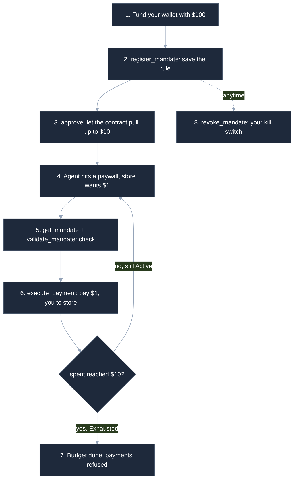

# REAPP for Marketing: The Non-Technical Guide 🧠💸

> A simple story: an **AI agent** does research for you and buys the articles it needs, while a smart contract makes sure it can only ever spend what you allowed.
>
> Read the **steps** for the story. Each step has an **🔧 Under the hood** line naming the real smart-contract method behind it, also in plain English. Marketing can skip those lines; the story still makes sense.

---

## 🗺️ The whole flow at a glance

---

## 🪜 The steps

### 👛 Step 1: You add money to a wallet
You set up **Freighter** (a Stellar wallet) and load it with **$100** of free testnet coins. It is your money, controlled only by you.
> 🔧 **Under the hood:** a normal Stellar account, funded by **Friendbot** (the testnet faucet). No smart contract yet.

### 📝 Step 2: You set the spending rule
You set the rule: this agent, **$10** max, **one** store, an expiry date. You sign it, and the contract saves it as 🟢 **Active** with **$0** spent.
> 🔧 **Under the hood:** 🔵 **`register_mandate`** (you sign). It checks the budget is positive, the expiry is in the future, and the id is not already taken, then sets `spent = 0, seq = 0, status = Active` itself, so nobody can fake a balance.

### 🔑 Step 3: You let the contract pull up to $10
You sign an **allowance**: the contract may pull up to **$10** from your wallet. It goes to the contract, **never the agent**, and the money stays in your wallet for now.
> 🔧 **Under the hood:** 🔵 a SEP-41 **`approve`** on the token, with the contract as the spender, up to the budget. This is what lets the contract pull funds later.

### 🚧 Step 4: The agent hits a paywall
The agent tries to buy an article, and the store replies: **"pay $1 first."**
> 🔧 **Under the hood:** an HTTP **`402`** with an x402 challenge (how much, to whom, which token). In the SDK, **`Agent.fetch(url)`** sees the 402. No contract call yet.

### 🔍 Step 5: The agent checks before paying
The agent reads the rule and asks "would $1 to this store be allowed right now?" Nothing moves.
> 🔧 **Under the hood:** 🟢 **`get_mandate`** reads the rule (status, spent, seq) and 🟢 **`validate_mandate`** is a read-only dry run. Neither needs a signature, and neither changes anything.

### 💸 Step 6: The agent pays through the contract
The agent asks to pay. The contract re-checks every rule, then moves **$1 from you straight to the store**. This is the **only** way money ever moves.
> 🔧 **Under the hood:** 🟠 **`execute_payment`** (the agent signs). In one all-or-nothing transaction it checks the order counter, status, expiry, store, and budget, adds to `spent`, raises the counter, and sends the money from you to the store. The store re-verifies the payment on-chain before serving.

### 📊 Step 7: It repeats until $10 is used up
Each article is another $1. The contract counts up to **$10** and never past it. At $10 the rule turns 🔴 **Exhausted** and the next payment is refused.
> 🔧 **Under the hood:** each `execute_payment` raises `spent`. When `spent` hits the budget, `status` becomes **Exhausted**, and the next call fails with **`BudgetExceeded`**.

### 🛑 Step 8: You can cancel any time
You can kill the rule whenever you want, and every later payment is refused.
> 🔧 **Under the hood:** 🔵 **`revoke_mandate`** (you sign) sets `status = Revoked`; later payments fail with **`MandateRevoked`**. The contract also auto-refuses the wrong store, an expired rule, and repeat payments.

---

## 🧰 The five methods, in plain English

> **Key:** 🟢 read-only, no signature · 🔵 you sign · 🟠 agent signs, moves money

| Method | Who signs | What it does |
| --- | --- | --- |
| 🔵 `register_mandate` | You | Saves the rule: who can spend, how much, where, until when. Sets spent to 0, status Active. |
| 🔵 `approve` (token) | You | Lets the contract pull up to the budget from your wallet. Goes to the contract, never the agent. |
| 🟢 `validate_mandate` | No one | A "would this be allowed?" dry run. Read-only, nothing happens. |
| 🟠 `execute_payment` | Agent | The **only** thing that moves money. Re-checks every rule, then pays the store from your wallet. |
| 🟢 `get_mandate` | No one | Looks up the rule and how much has been spent. Read-only. |
| 🔵 `revoke_mandate` | You | Your kill switch. Cancels the rule so no more payments go through. |

## 🚫 What the contract refuses

Enforced on every payment. No agent or app can get around them.

| Refusal | Meaning |
| --- | --- |
| `BudgetExceeded` | The payment would go over the budget |
| `MerchantOutOfScope` | The payment is to the wrong store |
| `MandateExpired` | The rule's expiry date has passed |
| `MandateRevoked` | You cancelled the rule |
| `BadSequence` | A repeat or out-of-order payment |
| `InvalidAmount` | A zero or negative amount |

---

## 🛡️ The one thing to remember

The agent **never holds your money** and **never controls the limit**. The contract does, and it checks the rules on every single payment. The worst a rogue agent or a hacked app can do is get told **no**.
