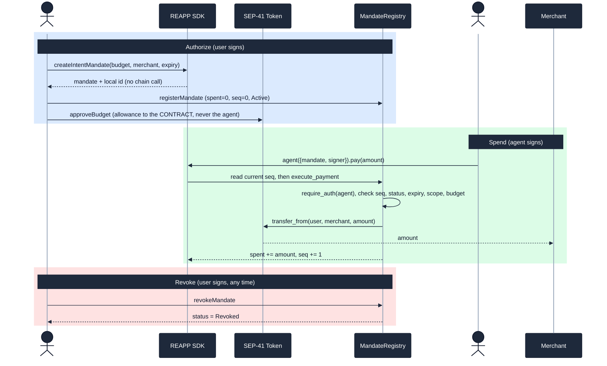
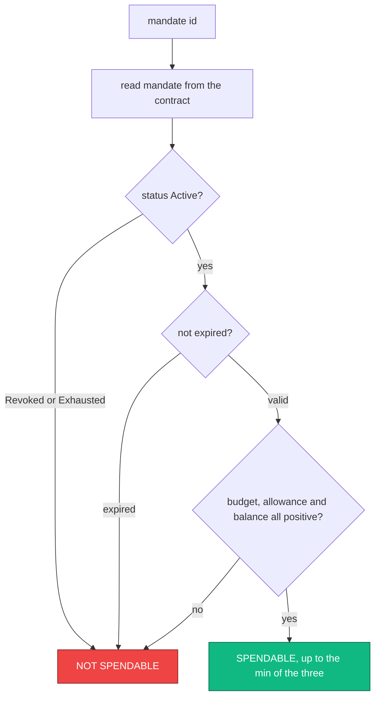

# Tranche 1, Step 2: The REAPP SDK on npm

> **Deliverable.** REAPP SDK core package published to npm. Package installable
> via npm. Developers can create an agent, connect to the testnet contract, and
> execute a mandate-validated payment in under 10 lines of code.

This document shows the published packages, the under-10-line flow running live on
testnet, the API in full, an independent on-chain gate check tool built on the published
SDK, and the adversarial security gate check of the SDK itself. Every on-chain claim
links to its transaction and was re-checked against Horizon, Stellar's canonical
API.

## What it is

The REAPP SDK is the client a developer uses to drive agent payments on Stellar.
It does one job: it lets a user author a spending mandate, and lets an agent spend
against that mandate, while the [MandateRegistry contract](https://github.com/reapp-protocol/reapp-protocol/blob/main/docs/mandate-registry-contract.md)
enforces every limit on-chain.

The SDK is untrusted by design. It never holds funds, and it never enforces the
limit. If the SDK has a bug, or the agent key is stolen, the contract still rejects
anything outside the mandate: overspending, paying the wrong merchant, replaying a
payment, or paying after the user revokes. This is the same principle as Step 1,
now carried all the way to the developer surface: the contract is the source of
truth, and the SDK is a thin, replaceable client on top of it.

It ships as two packages so an integrator takes only what they need.

| Package | npm | What it is |
|---|---|---|
| `@reapp-sdk/core` | [npmjs.com/package/@reapp-sdk/core](https://www.npmjs.com/package/@reapp-sdk/core) | The high-level client. Create an agent and run a mandate-validated payment in under 10 lines. |
| `@reapp-sdk/stellar` | [npmjs.com/package/@reapp-sdk/stellar](https://www.npmjs.com/package/@reapp-sdk/stellar) | The low-level Soroban layer: typed MandateRegistry bindings, network config, a signing adapter, and SEP-41 helpers. |

Both are live on npm under the public, owned `@reapp-sdk` scope, Apache-2.0, ESM
with TypeScript types, and each ships only its built `dist`. Hosted docs:
[reapp.live/docs](https://reapp.live/docs).

> **Versions.** `@reapp-sdk/core` 0.2.0 and `@reapp-sdk/stellar` 0.1.3 are the
> currently published, installable releases. `core` 0.2.0 is the gate-checked build:
> the SDK gate check below hardened it with two low-severity input bounds (`toStroops`
> i128 and `createIntentMandate` expiry). A fresh `npm install @reapp-sdk/core`
> pulls 0.2.0, confirmed by a clean-install smoke test against the live registry.

## Install

```
npm install @reapp-sdk/core @stellar/stellar-sdk
```

`@stellar/stellar-sdk` is a direct dependency you also import yourself for `Keypair`.
`@reapp-sdk/core` pulls in `@reapp-sdk/stellar` automatically.

## The under-10-line flow

The REAPP integration is four calls (`createIntentMandate`, `registerMandate`,
`approveBudget`, and `agent().pay`), well under 10 lines, taking you from nothing to a
settled, mandate-validated payment on testnet. The block below also shows the imports
and key setup so it is a complete, runnable example.

```ts
import { reapp } from "@reapp-sdk/core";
import { Keypair } from "@stellar/stellar-sdk";

const user = Keypair.fromSecret(USER_SECRET);    // owns the funds, signs the mandate
const agent = Keypair.fromSecret(AGENT_SECRET);  // the autonomous spender

const mandate = reapp.createIntentMandate({
  user: user.publicKey(),
  agent: agent.publicKey(),
  merchant: MERCHANT_ADDRESS,
  asset: reapp.testnet.nativeSac,                 // native XLM as a SEP-41 token
  maxAmount: "5.00",                              // total budget the agent may spend
  expiry: Math.floor(Date.now() / 1000) + 3600,
});

await reapp.registerMandate(mandate, { signer: user });  // store the mandate on-chain
await reapp.approveBudget(mandate, { signer: user });     // SEP-41 allowance to the contract
const hash = await reapp.agent({ mandate, signer: agent }).pay("1.00"); // agent-signed payment
```

After `pay` returns, one real payment has settled on testnet and `hash` is its
transaction hash. The default network is the live, gate-checked MandateRegistry from
Step 1, so no configuration is needed to run against the real contract.

## How it works

Three signers, one contract. The user authorizes, the agent spends, and the
contract is the gate every payment passes through.



1. `createIntentMandate` builds the mandate and its canonical id locally, with no network call. The id is a hash of the mandate fields and becomes the on-chain storage key.
2. `registerMandate` writes the mandate, signed by the user. The contract sets `spent`, `seq`, and `status` itself, so a caller cannot seed tampered state.
3. `approveBudget` grants a SEP-41 allowance up to the budget. The allowance goes to the contract, never to the agent or the SDK. This is the custody boundary.
4. `pay` calls `execute_payment`, signed by the agent. The contract re-checks the agent, sequence, merchant scope, expiry, and remaining budget, advances `spent` and `seq`, and transfers the funds in one atomic step. If any check fails, the call reverts and `pay` throws.

## The API

`@reapp-sdk/core` is small on purpose. The full surface:

| Call | Signer | Chain | What it does |
|---|---|---|---|
| `reapp.createIntentMandate(input)` | none | no | Build the mandate and its id locally, no chain call. The default nonce makes each id unique; pass an explicit `nonce` for a deterministic id. |
| `reapp.registerMandate(mandate, { signer })` | user | yes | Store the mandate on-chain. Returns the tx hash. |
| `reapp.approveBudget(mandate, { signer })` | user | yes | Grant the contract a SEP-41 allowance up to the budget. |
| `reapp.agent({ mandate, signer }).pay(amount)` | agent | yes | `agent(...)` binds a payment client to the registered mandate; `.pay` reads the current sequence, then calls `execute_payment`. Throws if the contract rejects it. |
| `reapp.revokeMandate(mandate, { signer })` | user | yes | Mark the mandate revoked. After this, every `pay` is rejected on-chain. |
| `toStroops(human, decimals?)` | none | no | Strict decimal-to-stroops conversion. Rejects anything ambiguous. |
| `Errors` | none | no | Typed contract error codes, re-exported so you can branch on a rejection. |

`signer` accepts a `Keypair` or a raw secret string. Amounts are decimal strings
(`"5.00"`, `"0.01"`), never floats, and the SDK rejects anything ambiguous so you
never round money by accident. Each `reapp.*` call takes an optional trailing
`NetworkConfig` (it defaults to testnet); `pay` inherits its network from `agent()`.
`@reapp-sdk/stellar` exposes the lower layer
(`TESTNET`, `registryClient`, `keypairSigner`, `token`, the typed `Client` and
`Mandate`) for direct, typed access to the contract.

## What the contract refuses

A rejection on any call maps to a typed code. These are the guarantees a compromised
agent or SDK cannot get around, because they are enforced on-chain.

| Code | Name | Cause |
|---|---|---|
| `Errors[1]` | AlreadyExists | A mandate with that id is already registered |
| `Errors[2]` | NotFound | No mandate with that id |
| `Errors[4]` | MandateExpired | The payment happened at or after `expiry` |
| `Errors[5]` | MandateRevoked | The user revoked the mandate |
| `Errors[6]` | BudgetExceeded | The spend would push `spent` past `maxAmount` |
| `Errors[7]` | MerchantOutOfScope | The payee is not the mandate's merchant |
| `Errors[8]` | BadSequence | A replayed or out-of-order payment |
| `Errors[9]` | InvalidAmount | A non-positive amount |

## Proof: the flow live on testnet, no mocks

`npm run e2e:sdk` drives the full flow through the SDK surface (the workspace build
of the exact code published as 0.2.0) against the live contract, with fresh
friendbot-funded agent and merchant keypairs and real XLM. The run below is the
canonical evidence for this deliverable, and every transaction is independently
re-checked against Horizon in the next section.

- **Run:** 2026-06-19, 03:52:07 to 03:52:27 UTC (ledgers 3,165,567 to 3,165,571)
- **Contract:** [`CB4KOTLGMM5JEPFPU6QBJLADIBP3RSGUX44FOYTFRICNXKKFPYIW7ZOA`](https://stellar.expert/explorer/testnet/contract/CB4KOTLGMM5JEPFPU6QBJLADIBP3RSGUX44FOYTFRICNXKKFPYIW7ZOA)
- **Mandate:** `0a65…d6b6`
- **Actors:** user [`GBE3…VNBG`](https://stellar.expert/explorer/testnet/account/GBE3PH4ZYVYUXZWZL4YJP22H5J46U6VQVF6SYNJ3GGU3RHBN4M77VNBG) · agent [`GBPZ…JTHV`](https://stellar.expert/explorer/testnet/account/GBPZN5O3KU7NKFMIPK6JO4GS4NT5GOFZTPFC5NW75CU7VHAXC6I3JTHV) · merchant `GCRE…2RZG`

| SDK call | On-chain | Result |
|---|---|---|
| `registerMandate` | [tx `c45ca03c…`](https://stellar.expert/explorer/testnet/tx/c45ca03c96f5d6627a716cda7ed83610c5b0d495860f15bb7a3668bc6bb0bbdd) | user-signed, ledger 3,165,567, `successful: true` |
| `approveBudget` | [tx `7f4a9773…`](https://stellar.expert/explorer/testnet/tx/7f4a9773d2db3300e2469ba6042c67b012ed648c619d88ddc76d1b736566114f) | user-signed SEP-41 allowance to the contract, ledger 3,165,568, `successful: true` |
| `agent.pay("1.00")` | [tx `237a3832…`](https://stellar.expert/explorer/testnet/tx/237a3832b1ec05901745e97db3dafc61cd553871e16738bbb9dfec5c0404b01a) | **agent-signed**, ledger 3,165,569, `successful: true`, **+1 XLM moved** (merchant 10000 to 10001) |
| `agent.pay("10.00")` over budget | rejected at simulation | `BudgetExceeded`, no tx |
| `revokeMandate` | [tx `fd2fb6a5…`](https://stellar.expert/explorer/testnet/tx/fd2fb6a5fc7c795ae89eb26eef4734954eec8eb9583d230e642c442098034625) | user-signed, ledger 3,165,571, `successful: true` |
| `agent.pay("1.00")` after revoke | rejected at simulation | `MandateRevoked`, no tx |

**The e2e harness passed all 8 of its checks.** The single most important line: the payment was signed by the
agent (`GBPZ…JTHV`), a different key from the user (`GBE3…VNBG`) who authorized the
mandate. The user grants the allowance to the contract, and the agent can only ask
the contract to spend within the mandate. Overspend and post-revoke payment are
refused by the contract, so by design they never become transactions.

### Independent confirmation

Every transaction above was re-verified straight against Horizon
(`horizon-testnet.stellar.org/transactions/<hash>`): the four method calls return
`successful: true` with the ledger numbers shown, and the payment operation is an
agent-signed `invoke_host_function` against the MandateRegistry. The merchant's
balance read back as exactly `10001.0000000` XLM, a clean `+1` over its 10,000 XLM
friendbot start.

## The gate check tool: `npm run audit`

The repo ships an independent, on-chain gate-check tool, built entirely on the published
`@reapp-sdk/stellar` surface. It is the repo script `npm run audit`
(`scripts/audit-mandate.mjs`), not a binary bundled in the npm package, so any
developer can reproduce it against their own mandates. The whole point of REAPP is
that the limit lives in the contract, not the app or the SDK, and this tool proves it
from the outside. Given any mandate id, it reads the mandate straight from the
MandateRegistry, plus the live SEP-41 allowance and the user's balance, and reports
the true amount the agent can still spend, trusting no application claim.

```
npm run audit -- <mandate-id-hex>
```

It reads the mandate through the published `@reapp-sdk/stellar` surface, never a
cached or app-reported value, and prints a verdict by this logic:



Two live examples from this deliverable:

**A spendable mandate** (`b818f60b…`, active, registered and approved on testnet):

```
  · status             Active
  · budget (max)       5.0 (50000000 stroops)
  · spent              0.0 (0 stroops)
  · remaining          5.0 (50000000 stroops)
  · allowance → contract 5.0 (50000000 stroops)
  · agent can move now 5.0 (50000000 stroops)
  ✦ SPENDABLE, up to 5.0 to GAEF…3CLS
```

**A blocked mandate** (`0a65…`, the run above, after revoke):

```
  · status             Revoked
  · budget (max)       5.0 (50000000 stroops)
  · spent              1.0 (10000000 stroops)
  · remaining          4.0 (40000000 stroops)
  · allowance → contract 4.0 (40000000 stroops)
  · agent can move now 0.0 (0 stroops)
  ✖ NOT SPENDABLE
     · mandate is REVOKED
```

The second case is the thesis in one screen. The mandate still has 4 XLM of budget
and 4 XLM of standing allowance, yet the agent can move nothing, because the contract
marked it revoked. An outside party reads that truth directly from the chain. The
"agent can move now" figure is `min(remaining budget, live allowance, balance)`, and
zero whenever the mandate is revoked, expired, or exhausted. The allowance is the
live on-chain SEP-41 allowance from the user to the contract, which is exactly why an
gate-check tool reads it rather than believing an interface.

## Security gate check of the SDK

A BulletproofBar adversarial sweep on 2026-06-15: 31 agents across 8 attack surfaces
(amount and money math, custody boundary, SDK-cannot-bypass-the-contract, mandate-id
canonicalization, network-config integrity, secret and signer handling, error
surfacing, and supply-chain hygiene). Every candidate finding was independently
re-verified against the source by a separate skeptic, several reproduced empirically,
then a completeness critic looked for missed surfaces.

**Verdict: airtight for testnet. 22 candidate findings, 0 confirmed defects, 0 testnet
blockers.** Full record: [`security/sdk-audit-2026-06-15.md`](https://github.com/reapp-protocol/reapp-protocol/blob/main/security/sdk-audit-2026-06-15.md).

What the gate check confirmed holds:

- The SDK has exactly one money path (`execute_payment`), holds no allowance, and supplies no recipient at pay time, so it cannot redirect funds or move more than the mandate.
- `pay` re-reads the sequence from chain on every call and trusts no local limit; the contract re-validates everything atomically.
- No secret is logged, serialized, or placed in any error message.
- Both published packages ship `dist` only, run no install scripts, and contain no secrets.

Two real but low-severity input-bound gaps were found and fixed in `@reapp-sdk/core`
0.2.0 during this pass: `toStroops` now rejects amounts that do not fit i128, and
`createIntentMandate` now requires `expiry` to be a positive integer no greater than
`Number.MAX_SAFE_INTEGER` (well within u64). Neither was
exploitable, because the contract already rejects the dangerous outcomes, but the fix
makes the SDK fail loudly on its own. The remaining items are info-level confirmations
or pre-mainnet hardening (decimals source of truth, allowance window alignment, exact
dependency pinning), documented in the gate check record.

## Deliverable checklist

| Clause | Status | Evidence |
|---|---|---|
| SDK core package published to npm | Met | [`@reapp-sdk/core`](https://www.npmjs.com/package/@reapp-sdk/core) and [`@reapp-sdk/stellar`](https://www.npmjs.com/package/@reapp-sdk/stellar) live on npm, public scope, Apache-2.0 |
| Package installable via npm | Met | `npm install @reapp-sdk/core @stellar/stellar-sdk`; ships `dist` with types, pulls `@reapp-sdk/stellar` automatically, no install scripts |
| Create an agent | Met | `reapp.agent({ mandate, signer })`, bound to a registered mandate |
| Connect to the testnet contract | Met | Defaults to the live MandateRegistry `CB4KOTLG…7ZOA` with no configuration |
| Execute a mandate-validated payment | Met | `agent.pay("1.00")` moved 1 XLM live ([tx `237a3832…`](https://stellar.expert/explorer/testnet/tx/237a3832b1ec05901745e97db3dafc61cd553871e16738bbb9dfec5c0404b01a)), Horizon-confirmed |
| Under 10 lines of code | Met | The REAPP integration is four calls, well under 10 lines (imports and key setup aside); proven end to end by `npm run e2e:sdk` (8/8) |

The Step 2 deliverable is met on every clause.

## Mapping to Stellar's feedback

Step 2 is where the SDK-facing feedback lands. This is honest about what is addressed
now and what is later work.

| Feedback | Targets | Status now | Notes |
|---|---|---|---|
| 5. Protocol-enforced limits; the SDK cannot bypass the on-chain check | Tranche 1 | Addressed and independently gate-checked | The SDK holds no allowance, exposes one money path, supplies no recipient at pay time, and re-reads state every call. The BulletproofBar SDK gate check confirmed 0 defects against exactly this property, and `reapp gate check` lets anyone verify it on-chain. |
| 1. Decouple mandate logic from the x402 wire format | Cross-cutting | Addressed at the SDK layer | The SDK takes plain Soroban types and an AP2-style mandate; it knows nothing about x402, so the wire format can change without touching it. The x402 flow itself is later work. |
| 6. Exemplary reference agents; show the safe pattern, warn against unsafe ones | Tranche 2 | Partially addressed | The SDK README and the under-10-line flow show the safe pattern (mandate plus on-chain enforcement), and `reapp gate check` demonstrates verifying rather than trusting. The full reference consumer and fulfillment agents are Tranche 2. |
| 4. Negative tests in CI from Tranche 1 | Tranche 1 | Addressed | The contract negative suite runs in CI on every push; the SDK e2e proves overspend and post-revoke rejection live on testnet. |
| 2, 3, 7. Threat model and DFDs, multisig and key management, live failure drills | Tranche 3 | Future work | The SDK gate check contributes an early threat-model artifact for the client layer. The formal documents, upgrade governance, and failure-mode drills are Tranche 3. |

## Reproduce it yourself

```bash
npm install @reapp-sdk/core @stellar/stellar-sdk
```

```bash
git clone https://github.com/reapp-protocol/reapp-protocol && cd reapp-protocol
npm install && npm run build
npm run e2e:sdk                                   # 8/8 live on testnet through the SDK
npm run audit -- 0a65c12bddf62e55bf86ad0d9733b908360728785bb858c8320dfb7e4e81d6b6
```

The first block installs the published SDK. The second runs the full on-chain flow
through the SDK against the live contract (printing fresh explorer links for every
step), then gate checks the revoked mandate from this document straight from the chain.
