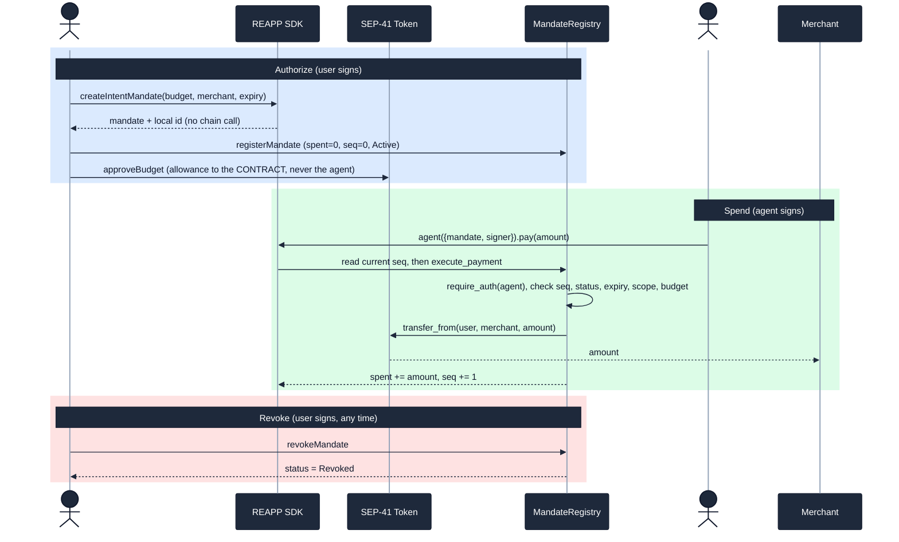
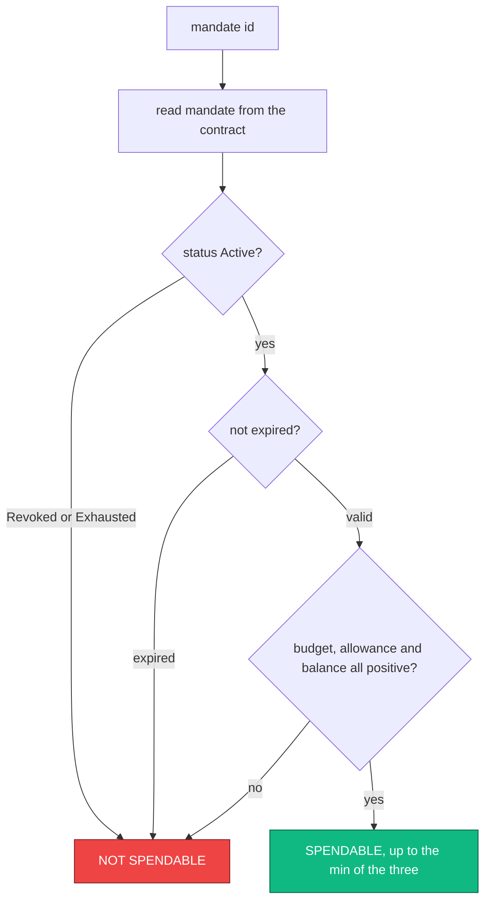

# The REAPP SDK on npm

> **Release.** REAPP SDK core package published to npm. Package installable
> via npm. Developers can create an agent, connect to the testnet contract, and
> execute a mandate-validated payment in under 10 lines of code.

This document shows the published packages, the under-10-line flow running live on
testnet, the API in full, an independent on-chain gatecheck tool built on the published
SDK, and the adversarial security gatecheck of the SDK itself. Every on-chain claim
links to its transaction and was re-checked against Horizon, Stellar's canonical
API.

## What it is

The REAPP SDK is the client a developer uses to drive agent payments on Stellar.
It does one job: it lets a user author a spending mandate, and lets an agent spend
against that mandate, while the [MandateRegistry contract](https://github.com/reapp-protocol/reapp-protocol/blob/main/docs/mandate-registry-contract.md)
enforces every limit on-chain.

The SDK is untrusted by design. It never holds funds, and it never enforces the
limit. If the SDK has a bug, or the agent key is stolen, the contract still rejects
anything outside the mandate: overspending, paying the wrong merchant, replaying a
payment, or paying after the user revokes. This is the same principle as the contract release,
now carried all the way to the developer surface: the contract is the source of
truth, and the SDK is a thin, replaceable client on top of it.

It ships as three SDK packages so an integrator takes only what they need, plus a
separate command-line package for the complete testnet workflow.

| Package | npm | What it is |
|---|---|---|
| `@reapp-sdk/core` | [npmjs.com/package/@reapp-sdk/core](https://www.npmjs.com/package/@reapp-sdk/core) | The high-level client. Create an agent and run a mandate-validated payment in under 10 lines. |
| `@reapp-sdk/stellar` | [npmjs.com/package/@reapp-sdk/stellar](https://www.npmjs.com/package/@reapp-sdk/stellar) | The low-level Soroban layer: typed MandateRegistry bindings, network config, a signing adapter, and SEP-41 helpers. |
| `@reapp-sdk/ap2` | [npmjs.com/package/@reapp-sdk/ap2](https://www.npmjs.com/package/@reapp-sdk/ap2) | A version-pinned, fail-closed AP2 v0.2.0 IntentMandate bridge into the contract-facing REAPP mandate. |
| `reapp-protocol-cli` | [npmjs.com/package/reapp-protocol-cli](https://www.npmjs.com/package/reapp-protocol-cli) | The testnet CLI: initialize a project, create burner accounts, register a mandate, approve its budget, and make agent-signed payments. |

All four releases are live on npm under the owned REAPP package names, Apache-2.0,
ESM with TypeScript types where applicable, and each ships only its built output. Hosted docs:
[reapp.live/docs](https://reapp.live/docs).

> **Versions.** `@reapp-sdk/stellar` 0.2.0, `@reapp-sdk/core` 0.2.2,
> `@reapp-sdk/ap2` 0.1.0, and `reapp-protocol-cli` 0.1.1 are the currently
> published releases.
> The Stellar binding was generated from the exact simple-contract 0.2.0 release
> WASM and defaults to the current testnet contract. Clean temporary projects
> installed the exact releases, imported the SDKs, compiled the published AP2
> declarations in strict ESM mode, reproduced the pinned AP2 hash vector, confirmed
> the 32-byte `vc_hash` and configured contract ID, and ran `reapp --version`.

## Install

```
npm install @reapp-sdk/core @stellar/stellar-sdk
```

`@stellar/stellar-sdk` is a direct dependency you also import yourself for `Keypair`.
`@reapp-sdk/core` pulls in `@reapp-sdk/stellar` automatically.

Install the AP2 bridge when an external AP2 intent must be bound to the on-chain
REAPP mandate:

```
npm install @reapp-sdk/ap2 @stellar/stellar-sdk
```

`@reapp-sdk/ap2` is pinned to the AP2 v0.2.0 sample IntentMandate data model. It
supports one Stellar merchant, an explicit asset and budget, and a future
whole-second expiry. It fails closed on cart-confirmation, SKU, refundability, and
multi-merchant semantics that MandateRegistry cannot enforce. The AP2 canonical
payload hash is bound into REAPP's existing `vc_hash` construction without changing
ids produced directly by `@reapp-sdk/core`; x402 remains a separate wire adapter.

## The under-10-line flow

The REAPP integration is four calls (`createIntentMandate`, `registerMandate`,
`approveBudget`, and `agent().pay`), well under 10 lines, taking you from nothing to a
settled, mandate-validated payment on testnet. The block below also shows the imports
and key setup so it is a complete, runnable example.

```ts
import { reapp } from "@reapp-sdk/core";
import { Keypair } from "@stellar/stellar-sdk";

const user = Keypair.fromSecret(USER_SECRET);    // owns the funds, signs the mandate
const agent = Keypair.fromSecret(AGENT_SECRET);  // the autonomous spender

const mandate = reapp.createIntentMandate({
  user: user.publicKey(),
  agent: agent.publicKey(),
  merchant: MERCHANT_ADDRESS,
  asset: reapp.testnet.nativeSac,                 // native XLM as a SEP-41 token
  maxAmount: "5.00",                              // total budget the agent may spend
  expiry: Math.floor(Date.now() / 1000) + 3600,
});

await reapp.registerMandate(mandate, { signer: user });  // store the mandate on-chain
await reapp.approveBudget(mandate, { signer: user });     // SEP-41 allowance to the contract
const hash = await reapp.agent({ mandate, signer: agent }).pay("1.00"); // agent-signed payment
```

After `pay` returns, one real payment has settled on testnet and `hash` is its
transaction hash. The default network is the live, gatechecked MandateRegistry,
so no configuration is needed to run against the real contract.

## How it works

Three signers, one contract. The user authorizes, the agent spends, and the
contract is the gate every payment passes through.



1. `createIntentMandate` builds the mandate and its canonical id locally, with no network call. The id is a hash of the mandate fields and becomes the on-chain storage key.
2. `registerMandate` writes the mandate, signed by the user. The contract sets `spent`, `seq`, and `status` itself, so a caller cannot seed tampered state.
3. `approveBudget` approves a SEP-41 allowance up to the budget. The allowance goes to the contract, never to the agent or the SDK. This is the custody boundary.
4. `pay` calls `execute_payment`, signed by the agent. The contract re-checks the agent, sequence, merchant scope, expiry, and remaining budget, advances `spent` and `seq`, and transfers the funds in one atomic step. If any check fails, the call reverts and `pay` throws.

## The API

`@reapp-sdk/core` is small on purpose. The full surface:

| Call | Signer | Chain | What it does |
|---|---|---|---|
| `reapp.createIntentMandate(input)` | none | no | Build the mandate and its id locally, no chain call. The default nonce makes each id unique; pass an explicit `nonce` for a deterministic id. |
| `reapp.registerMandate(mandate, { signer })` | user | yes | Store the mandate on-chain. Returns the tx hash. |
| `reapp.approveBudget(mandate, { signer })` | user | yes | Approve the contract for a SEP-41 allowance up to the budget. |
| `reapp.agent({ mandate, signer }).pay(amount)` | agent | yes | `agent(...)` binds a payment client to the registered mandate; `.pay` reads the current sequence, then calls `execute_payment`. Throws if the contract rejects it. |
| `reapp.revokeMandate(mandate, { signer })` | user | yes | Mark the mandate revoked. After this, every `pay` is rejected on-chain. |
| `toStroops(human, decimals?)` | none | no | Strict decimal-to-stroops conversion. Rejects anything ambiguous. |
| `Errors` | none | no | Typed contract error codes, re-exported so you can branch on a rejection. |

`signer` accepts a `Keypair` or a raw secret string. Amounts are decimal strings
(`"5.00"`, `"0.01"`), never floats, and the SDK rejects anything ambiguous so you
never round money by accident. Each `reapp.*` call takes an optional trailing
`NetworkConfig` (it defaults to testnet); `pay` inherits its network from `agent()`.
`@reapp-sdk/stellar` exposes the lower layer
(`TESTNET`, `registryClient`, `keypairSigner`, `token`, the typed `Client` and
`Mandate`) for direct, typed access to the contract.

## What the contract refuses

A rejection on any call maps to a typed code. These are the guarantees a compromised
agent or SDK cannot get around, because they are enforced on-chain.

| Code | Name | Cause |
|---|---|---|
| `Errors[1]` | AlreadyExists | A mandate with that id is already registered |
| `Errors[2]` | NotFound | No mandate with that id |
| `Errors[4]` | MandateExpired | The payment happened at or after `expiry` |
| `Errors[5]` | MandateRevoked | The user revoked the mandate |
| `Errors[6]` | BudgetExceeded | The spend would push `spent` past `maxAmount` |
| `Errors[7]` | MerchantOutOfScope | The payee is not the mandate's merchant |
| `Errors[8]` | BadSequence | A replayed or out-of-order payment |
| `Errors[9]` | InvalidAmount | A non-positive amount |
| `Errors[10]` | Paused | A money-moving call while the contract is paused |
| `Errors[11]` | UpgradeNotScheduled | No upgrade is pending |
| `Errors[12]` | UpgradeNotReady | The fixed upgrade delay has not elapsed |
| `Errors[13]` | UpgradeAlreadyScheduled | An upgrade is already pending |
| `Errors[14]` | UpgradeRequiresPause | Upgrade execution was attempted before pausing |

## Proof: run the flow live on testnet, no mocks

`npm run e2e:sdk` drives the full flow through the SDK surface against the current
`TESTNET.mandateRegistryId`. The harness funds fresh user, agent, and merchant
keypairs, registers a mandate, approves the contract allowance, settles an
agent-signed payment, proves overspend and post-revoke rejection, and prints fresh
StellarExpert links for every transaction.

No fixed mandate id is stored here. The repo should prove the current contract config,
not preserve stale example ids from an older run.

## The gatecheck tool: `npm run gatecheck`

The repo ships an independent, on-chain gatecheck tool, built entirely on the published
`@reapp-sdk/stellar` surface. It is the repo script `npm run gatecheck`
(`scripts/gatecheck-mandate.mjs`), not a binary bundled in the npm package, so any
developer can reproduce it against their own mandates. The whole point of REAPP is
that the limit lives in the contract, not the app or the SDK, and this tool proves it
from the outside. Given any mandate id, it reads the mandate straight from the
MandateRegistry, plus the live SEP-41 allowance and the user's balance, and reports
the true amount the agent can still spend, trusting no application claim.

```
npm run gatecheck -- <mandate-id-hex>
```

It reads the mandate through the published `@reapp-sdk/stellar` surface, never a
cached or app-reported value, and prints a verdict by this logic:



To create a fresh example instead of trusting a saved one:

```bash
npm run e2e:sdk
npm run gatecheck -- <mandate-id-printed-by-e2e>
```

The "agent can move now" figure is `min(remaining budget, live allowance, balance)`,
and zero whenever the mandate is revoked, expired, or exhausted. The allowance is the
live on-chain SEP-41 allowance from the user to the contract, which is exactly why
the gatecheck tool reads it rather than believing an interface.

## Security gatecheck of the SDK

A BulletproofBar adversarial sweep on 2026-06-15: 31 agents across 8 attack surfaces
(amount and money math, custody boundary, SDK-cannot-bypass-the-contract, mandate-id
canonicalization, network-config integrity, secret and signer handling, error
surfacing, and supply-chain hygiene). Every candidate finding was independently
re-verified against the source by a separate skeptic, several reproduced empirically,
then a completeness critic looked for missed surfaces.

**Verdict: airtight for testnet. 22 candidate findings, 0 confirmed defects, 0 testnet
blockers.** Full record: [`security/sdk-gatecheck-2026-06-15.md`](https://github.com/reapp-protocol/reapp-protocol/blob/main/security/sdk-gatecheck-2026-06-15.md).

What the gatecheck confirmed holds:

- The SDK has exactly one money path (`execute_payment`), holds no allowance, and supplies no recipient at pay time, so it cannot redirect funds or move more than the mandate.
- `pay` re-reads the sequence from chain on every call and trusts no local limit; the contract re-validates everything atomically.
- No secret is logged, serialized, or placed in any error message.
- All three published packages ship built output only, run no install scripts, and contain no secrets.

Two real but low-severity input-bound gaps were found and fixed in `@reapp-sdk/core`
0.2.0 during this pass: `toStroops` now rejects amounts that do not fit i128, and
`createIntentMandate` now requires `expiry` to be a positive integer no greater than
`Number.MAX_SAFE_INTEGER` (well within u64). Neither was
exploitable, because the contract already rejects the dangerous outcomes, but the fix
makes the SDK fail loudly on its own. The remaining items are info-level confirmations
or pre-mainnet hardening (decimals source of truth, allowance window alignment, exact
dependency pinning), documented in the gatecheck record.

## Release Checklist

| Clause | Status | Evidence |
|---|---|---|
| SDK packages published to npm | Met | [`@reapp-sdk/stellar@0.2.0`](https://www.npmjs.com/package/@reapp-sdk/stellar/v/0.2.0), [`@reapp-sdk/core@0.2.2`](https://www.npmjs.com/package/@reapp-sdk/core/v/0.2.2), [`@reapp-sdk/ap2@0.1.0`](https://www.npmjs.com/package/@reapp-sdk/ap2/v/0.1.0), and [`reapp-protocol-cli@0.1.1`](https://www.npmjs.com/package/reapp-protocol-cli/v/0.1.1) are public npm releases |
| Packages installable via npm | Met | Clean temporary projects installed the exact releases, imported the SDKs, reproduced the AP2 hash vector and `vc_hash`, compiled strict TypeScript declarations, verified the configured contract and typed failures, and ran CLI version `0.1.1` |
| Create an agent | Met | `reapp.agent({ mandate, signer })`, bound to a registered mandate |
| Connect to the testnet contract | Met | Defaults to the current MandateRegistry `CC6JMPDH…CRWE` with no configuration |
| Execute a mandate-validated payment | Met | `agent.pay("1.00")` settles through `execute_payment`; prove it fresh with `npm run e2e:sdk` |
| Under 10 lines of code | Met | The REAPP integration is four calls, well under 10 lines (imports and key setup aside); proven end to end by `npm run e2e:sdk` |

The SDK release is met on every clause.

## Mapping to Stellar's feedback

This is where the SDK-facing feedback lands. This is honest about what is addressed
now and what is later work.

| Feedback | Targets | Status now | Notes |
|---|---|---|---|
| 5. Protocol-enforced limits; the SDK cannot bypass the on-chain check | Current testnet release | Addressed and independently gate checked | The SDK holds no allowance, exposes one money path, supplies no recipient at pay time, and re-reads state every call. The BulletproofBar SDK gate check confirmed 0 defects against exactly this property, and `reapp gatecheck` lets anyone verify it on-chain. |
| 1. Decouple mandate logic from the x402 wire format | Cross-cutting | Addressed at the SDK layer | The version-pinned AP2 bridge maps intent into the core mandate without importing the x402 adapter. The x402 request/response shape can evolve without changing MandateRegistry or AP2 binding. |
| 6. Exemplary reference agents; show the safe pattern, warn against unsafe ones | Composite/reference-app release | Partially addressed | The SDK README and the under-10-line flow show the safe pattern (mandate plus on-chain enforcement), and `reapp gatecheck` demonstrates verifying rather than trusting. The full reference consumer and fulfillment agents live with the reference-app surface. |
| 4. Negative tests in CI from the first release | Current testnet release | Addressed | The contract negative suite runs in CI on every push; the SDK e2e proves overspend and post-revoke rejection live on testnet. |
| 2, 3, 7. Threat model and DFDs, multisig and key management, live failure drills | Mainnet hardening | Future work | The SDK gatecheck contributes an early threat-model artifact for the client layer. The formal documents, upgrade governance, and failure-mode drills belong to mainnet hardening. |

## Reproduce it yourself

```bash
npm install @reapp-sdk/core @stellar/stellar-sdk
```

```bash
git clone https://github.com/reapp-protocol/reapp-protocol && cd reapp-protocol
npm install && npm run build
npm run e2e:sdk                                   # live testnet through the SDK
npm run gatecheck -- <mandate-id-printed-by-e2e>
```

The first block installs the published SDK. The second runs the full on-chain flow
through the SDK against the live contract, prints fresh explorer links, and prints
the exact gatecheck command for the mandate it just created.
