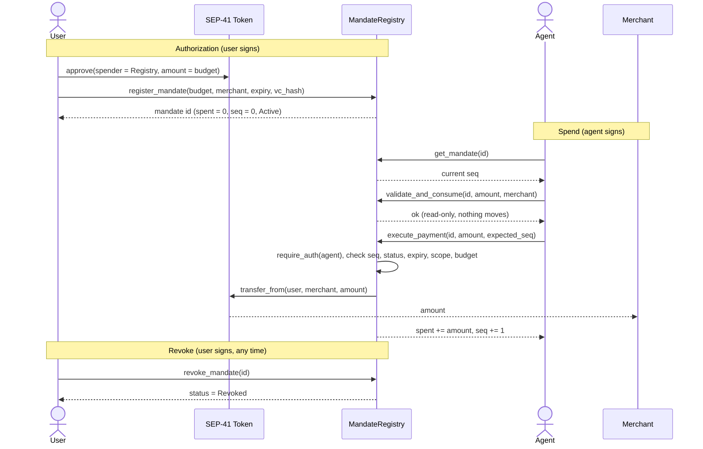
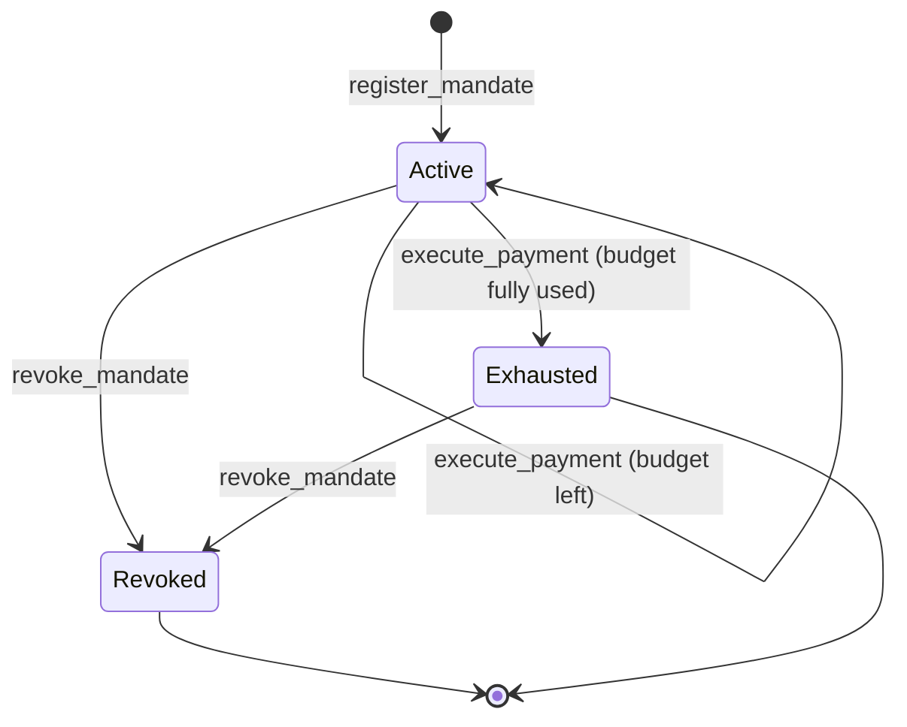

# Tranche 1, Step 1: MandateRegistry on Stellar Testnet

> **Deliverable.** MandateRegistry Soroban contract deployed on testnet. Contract
> live on testnet with `register_mandate`, `validate_and_consume`,
> `execute_payment`, and `revoke_mandate` callable. Integration tests passing,
> including negative cases for unauthorized callers and overspend attempts.

This document explains the contract in plain English, documents every method, and
shows every transaction it has handled on-chain.

## What it is

MandateRegistry is a small Soroban smart contract that holds spending mandates and
is the only thing allowed to move the money. A user sets a budget for an agent to
spend at one merchant. The contract checks every payment against that budget,
on-chain, before any funds move. If the check fails, no money moves.

The limit lives inside the contract, in the money path. It is not in the app and
not in the SDK. That is the whole point: a limit checked in app or SDK code is only
as trustworthy as that code, but a limit checked inside the contract holds even if
the app is wrong, the SDK has a bug, or the agent's key is stolen. The SDK is
treated as untrusted. The contract is the source of truth.

| Fact | Value |
|---|---|
| Network | Stellar testnet |
| Contract id | `CA3X76MRIEHP7LVY6H4FIAOTRQYLSMD6NXUMVM5ZR56EOCCWMT6SBQCL` |
| WASM hash | `59298a08…cf80a1ce` |
| Deployed | 2026-06-09 22:50:57 UTC by `GBE3…VNBG` |
| Explorer | [stellar.expert contract page](https://stellar.expert/explorer/testnet/contract/CA3X76MRIEHP7LVY6H4FIAOTRQYLSMD6NXUMVM5ZR56EOCCWMT6SBQCL) |

The contract is small on purpose. A small interface is an auditable interface.

## What it stores: the Mandate

Each mandate is one record, stored under its own id (a 32-byte hash). It holds:

| Field | Plain English |
|---|---|
| `user` | The person who owns the funds and signs the mandate |
| `agent` | The only account allowed to spend against this mandate |
| `merchant` | The single account that may be paid |
| `asset` | The SEP-41 token to spend. The contract accepts any token; the live testnet runs use native XLM (its Stellar Asset Contract, `CDLZ…CYSC`) |
| `max_amount` | The total budget the agent may spend |
| `spent` | How much has been spent so far (starts at 0) |
| `expiry` | A time after which the mandate is dead |
| `seq` | A counter that goes up by one on every payment (stops replays) |
| `status` | `Active`, `Revoked`, or `Exhausted` |
| `vc_hash` | The mandate id, which links to the off-chain signed intent |

A mandate's `status` moves through three states:

- **Active**: the agent can spend.
- **Exhausted**: the full budget has been spent. No more payments.
- **Revoked**: the user withdrew consent. No more payments.

## The methods, one by one

Five methods. Two change state and need a signature (`register_mandate`,
`revoke_mandate`), one moves money and needs the agent's signature
(`execute_payment`), and two are read-only (`validate_and_consume`, `get_mandate`).

### `register_mandate(user, agent, merchant, asset, max_amount, expiry, vc_hash)`

Creates a new mandate.

- **Who signs:** the user.
- **Checks:** budget is positive (else `InvalidAmount`), expiry is in the future (else `MandateExpired`), and the id is not already taken (else `AlreadyExists`).
- **Sets:** `spent = 0`, `seq = 0`, `status = Active`. The contract sets these itself, so a caller cannot seed a fake balance or status.
- **Returns:** the mandate id.
- **Note:** registering moves no money. The user separately signs a SEP-41 `approve` so the contract can later pull funds.

### `validate_and_consume(mandate_id, amount, merchant)`

A read-only dry run that answers one question: would a payment of `amount` to
`merchant` be allowed right now?

- **Who signs:** no one. Anyone can call it.
- **Effect:** none. It changes nothing on-chain.
- **Use:** the SDK calls it for a clean typed answer before paying.
- **Note:** despite the name it consumes nothing. The real consume happens only in `execute_payment`.

### `execute_payment(mandate_id, amount, expected_seq)`

The only path that moves money. Only the mandate's **agent** may call it, enforced
by Soroban's `require_auth`. Any other caller is rejected by the network before the
contract logic even runs. In one atomic transaction it:

1. requires the agent's signature
2. checks `expected_seq` equals the mandate's current `seq`, else `BadSequence` (this blocks replays and out-of-order spends)
3. re-checks amount, status, expiry, merchant scope, and budget against stored state
4. adds `amount` to `spent`, raises `seq` by one, and flips status to `Exhausted` if the budget is now fully used
5. moves `amount` from user to merchant with the token's `transfer_from`

If any step fails, the whole transaction reverts. There is no partial spend.

### `revoke_mandate(mandate_id)`

The user's kill switch.

- **Who signs:** the user.
- **Effect:** marks the mandate `Revoked`. After this, every `execute_payment` is rejected with `MandateRevoked`.

### `get_mandate(mandate_id)`

A read-only lookup.

- **Who signs:** no one. Anyone can call it.
- **Returns:** the stored mandate (status, spent, seq, and the rest).
- **Use:** audit, and reading the current `seq` before paying.

## What it refuses

Every payment passes through one set of checks. These are the rejections the
contract enforces on-chain, which no agent or SDK can get around:

| Error | Code | Meaning |
|---|---|---|
| `AlreadyExists` | 1 | A mandate with that id already exists |
| `NotFound` | 2 | No mandate with that id |
| `MandateExpired` | 4 | The mandate's expiry has passed |
| `MandateRevoked` | 5 | The user revoked the mandate |
| `BudgetExceeded` | 6 | The payment would push spend past the budget |
| `MerchantOutOfScope` | 7 | The payee is not the mandate's merchant |
| `BadSequence` | 8 | A replayed or out-of-order payment |
| `InvalidAmount` | 9 | A non-positive amount |

There is no code 3. Unauthorized callers are stopped by Soroban's `require_auth`,
which reverts the transaction at the network level, so it never reaches a
contract error code.

## The flow



## Mandate lifecycle



## Integration tests

The contract ships with a Rust test suite that runs against a Soroban test
environment. It passes 19 of 19, with `cargo clippy` clean. The suite runs in CI on
every push, so a change that breaks any check cannot land.

```
cd contracts/mandate-registry && cargo test
test result: ok. 19 passed; 0 failed; 0 ignored
```

The deliverable names two negatives. Both are covered by dedicated tests.

**Unauthorized callers**

| Test | What it proves |
|---|---|
| `execute_requires_agent_auth` | Without the bound agent's signature, `execute_payment` reverts and no funds move |
| `register_requires_user_auth` | Only the user can register a mandate |
| `revoke_requires_user_auth` | Only the user can revoke a mandate |

**Overspend**

| Test | What it proves |
|---|---|
| `overspend_single_rejected` | A single payment over the budget is rejected with `BudgetExceeded` |
| `overspend_cumulative_rejected` | Several payments that add up past the budget are rejected |

The full suite, grouped by what it covers:

| Area | Tests |
|---|---|
| Happy path | `happy_path_runs_every_method`, `property_spent_equals_transferred` |
| Unauthorized callers | `execute_requires_agent_auth`, `register_requires_user_auth`, `revoke_requires_user_auth` |
| Overspend | `overspend_single_rejected`, `overspend_cumulative_rejected` |
| Replay and ordering | `replay_stale_seq_rejected`, `out_of_order_seq_rejected` |
| Lifecycle | `revoked_mandate_rejected`, `expired_mandate_rejected`, `exhausted_status_then_rejected`, `register_with_past_expiry_rejected` |
| Scope and input | `out_of_scope_merchant_rejected`, `duplicate_register_rejected`, `unknown_mandate_not_found`, `zero_amount_rejected` |
| Token safety | `insufficient_allowance_blocks_payment`, `reentry_probe::reentrancy_via_evil_token` |

These run on every push through the CI workflow. That matches the Stellar feedback
that the negative tests should run continuously in CI from Tranche 1, not be added
at the end.

## Every transaction on-chain

Read from the [stellar.expert contract activity](https://stellar.expert/explorer/testnet/contract/CA3X76MRIEHP7LVY6H4FIAOTRQYLSMD6NXUMVM5ZR56EOCCWMT6SBQCL),
oldest first. Amounts are shown in XLM (1 XLM = 10,000,000 stroops). Mandate ids
are shortened.

| Time (UTC) | Caller | Call | What happened |
|---|---|---|---|
| 2026-06-09 22:50:57 | `GBE3…VNBG` | create contract | Deployed MandateRegistry from WASM `59298a08…` |
| 2026-06-09 22:51:37 | `GBE3…VNBG` | register_mandate | New mandate `cqRd…`: agent `GA2B…`, merchant `GC3S…`, budget 5 XLM |
| 2026-06-09 22:51:47 | `GA2B…L4XH` | execute_payment | Agent paid 1 XLM on `cqRd…` (seq 0) |
| 2026-06-09 22:51:57 | `GBE3…VNBG` | revoke_mandate | User revoked `cqRd…` |
| 2026-06-10 01:55:42 | `GBE3…VNBG` | register_mandate | New mandate `e+j1…`: agent `GBLO…`, merchant `GCQP…`, budget 5 XLM |
| 2026-06-10 01:55:52 | `GBLO…CIGB` | execute_payment | Agent paid 1 XLM on `e+j1…` (seq 0) |
| 2026-06-10 01:55:57 | `GBE3…VNBG` | revoke_mandate | User revoked `e+j1…` |
| 2026-06-10 04:58:51 | `GD52…JVB6` | register_mandate | Independent account: new mandate `UrGa…`, agent `GBJO…`, budget 3 XLM |
| 2026-06-10 04:59:11 | `GBJO…WOZ6` | execute_payment | Agent paid 1 XLM on `UrGa…` (seq 0) |
| 2026-06-10 14:39:20 | `GDJU…YICB` | register_mandate | Independent account: new mandate `Rwu/…`, agent `GDZN…`, budget 3 XLM |
| 2026-06-10 14:44:51 | `GCHM…J6KX` | register_mandate | Independent account: new mandate `2E23…`, agent `GBAN…`, budget 3 XLM |
| 2026-06-10 14:49:36 | `GAZM…TAVO` | register_mandate | Independent account: new mandate `tbkM…`, agent `GDEK…`, budget 3 XLM |
| 2026-06-10 14:50:31 | `GDEK…CUFO` | execute_payment | Agent paid 1 XLM on `tbkM…` (seq 0) |
| 2026-06-10 14:50:51 | `GDEK…CUFO` | execute_payment | Agent paid 1 XLM on `tbkM…` (seq 1) |
| 2026-06-10 14:51:11 | `GDEK…CUFO` | execute_payment | Agent paid 1 XLM on `tbkM…` (seq 2). Budget now fully used |
| 2026-06-10 19:51:28 | `GBE3…VNBG` | register_mandate | New mandate `dKGH…`: agent `GA2B…`, merchant `GC3S…`, budget 5 XLM |
| 2026-06-10 19:51:38 | `GA2B…L4XH` | execute_payment | Agent paid 1 XLM on `dKGH…` (seq 0) |
| 2026-06-10 19:51:48 | `GBE3…VNBG` | revoke_mandate | User revoked `dKGH…` |
| 2026-06-10 20:05:44 | `GBE3…VNBG` | register_mandate | New mandate `NTSB…`: agent `GA2B…`, merchant `GC3S…`, budget 5 XLM |
| 2026-06-10 20:05:54 | `GA2B…L4XH` | execute_payment | Agent paid 1 XLM on `NTSB…` (seq 0) |
| 2026-06-10 20:06:04 | `GBE3…VNBG` | revoke_mandate | User revoked `NTSB…` |
| 2026-06-10 20:08:14 | `GBE3…VNBG` | register_mandate | New mandate `4Asq…`: agent set to the user, budget 1 XLM (set up for the unauthorized test) |
| 2026-06-10 20:08:24 | `GBE3…VNBG` | validate_and_consume | Read-only preflight on `4Asq…` for 0.5 XLM. Nothing moved |
| 2026-06-10 20:11:15 | `GDNV…5ARS` | execute_payment | An account that is not the agent tried to pay on `4Asq…`. Rejected on-chain by `require_auth`. The transaction failed |

### What this history shows

- **All four methods run live**: `register_mandate`, `validate_and_consume`, `execute_payment`, and `revoke_mandate` all appear, plus the read-only `get_mandate`.
- **Independent accounts use it**: mandates were registered and paid by accounts that are not ours (`GD52…`, `GBJO…`, `GDJU…`, `GCHM…`, `GAZM…`, `GDEK…`). The contract is publicly live, not a private fixture.
- **Multi-payment within budget works**: on mandate `tbkM…`, the agent made three payments at seq 0, 1, and 2, each accepted, until the 3 XLM budget was used up. The `seq` counter advances exactly as designed.
- **An unauthorized caller is rejected on-chain**: `GDNV…5ARS` tried `execute_payment` on a mandate it was not the agent for. Soroban's `require_auth` reverted it, and the transaction failed.

Overspend, replay, and pay-after-revoke are also rejected on-chain, proven by the
negative tests above and by the contract's typed errors (`BudgetExceeded`,
`BadSequence`, `MandateRevoked`).

## Bytecode verification

The contract enforcing payments on testnet is the exact source in this repository,
proven by hash (Soroban explorers do not yet have a "verified source" badge):

- On-chain wasm, fetched with `stellar contract fetch`: `59298a08…cf80a1ce`
- Source rebuilt with `stellar contract build`: `59298a08…cf80a1ce`

The two are identical. Build with `stellar contract build`, the same command the
deploy uses. Raw `cargo build` produces a different hash because it skips Soroban's
metadata embedding and the wasm-opt step.

```
stellar contract fetch --id CA3X76MRIEHP7LVY6H4FIAOTRQYLSMD6NXUMVM5ZR56EOCCWMT6SBQCL --network testnet --out-file onchain.wasm
stellar contract build --manifest-path contracts/mandate-registry/Cargo.toml
shasum -a 256 onchain.wasm target/wasm32v1-none/release/mandate_registry.wasm
```

## Security audit

Independently audited on 2026-06-10: a 12-agent adversarial sweep across six attack
surfaces (arithmetic and overflow, authorization, replay and sequencing, token
interaction and reentrancy, state and storage, and logic and economics), with every
finding re-verified against the code.

**Verdict: airtight-ship, 0 confirmed defects.**

Why it holds:

- `require_auth` binds to the stored agent, not a caller-supplied address.
- State is written before the external `transfer_from` (checks, effects, interactions order), so there is no reentrancy window. A regression test using a hostile token (`reentry_probe::reentrancy_via_evil_token`) locks this in.
- The SEP-41 allowance is an independent hard ceiling beneath the contract's own budget check.
- `overflow-checks` is on in the release profile, so the `spent` and `seq` arithmetic panic-reverts rather than wraps.
- `register_mandate` forces `spent = 0`, `seq = 0`, `status = Active`, so a caller cannot seed tampered state.

Deferred to mainnet hardening, and not testnet blockers: an asset allowlist, aligning
storage TTL with the mandate expiry, and revisiting the `validate_and_consume` name.

## Deliverable checklist

Every clause of the Tranche 1 Step 1 deliverable, with where it is proven.

| Clause | Status | Evidence |
|---|---|---|
| MandateRegistry deployed and live on testnet | Met | Contract `CA3X76MR…BQCL`, WASM `59298a08…`, deployed 2026-06-09. The same id is hard-coded in the SDK config (`packages/stellar`). The activity table lists 23 live calls, including from independent third-party accounts |
| `register_mandate` callable | Met | Live on-chain; tests `happy_path_runs_every_method`, `register_requires_user_auth` |
| `validate_and_consume` callable | Met | Live on-chain (2026-06-10 20:08:24). Read-only dry run by design, as documented above |
| `execute_payment` callable | Met | Live on-chain, 1 XLM moved (confirmed on Horizon); tests `happy_path_runs_every_method`, `property_spent_equals_transferred` |
| `revoke_mandate` callable | Met | Live on-chain; tests `revoked_mandate_rejected`, `revoke_requires_user_auth` |
| Integration tests passing | Met | `cargo test` 19 of 19, green in CI on every push |
| Negatives: unauthorized callers | Met | `execute_requires_agent_auth`, `register_requires_user_auth`, `revoke_requires_user_auth`; mirrored on-chain by the rejected `GDNV…5ARS` payment |
| Negatives: overspend | Met | `overspend_single_rejected`, `overspend_cumulative_rejected` |

The Step 1 deliverable is met on every clause.

## Mapping to Stellar's feedback

Stellar gave seven pieces of feedback. Most of it points at Tranche 2 and Tranche
3. This table is honest about which parts Step 1 addresses now and which are future
work, so nothing is oversold.

| Feedback | Targets | Status now | Notes |
|---|---|---|---|
| 1. Decouple mandate logic from the x402 wire format | Cross-cutting | Addressed at the contract layer | MandateRegistry takes plain Soroban types and knows nothing about x402, so it adapts to x402 v0.2 or v0.3 without a redesign. The x402 flow itself is later work and is not built yet |
| 2. Threat model, data flow diagrams, and negative suite as gating deliverables | Tranche 3 | Negative suite done; threat model and diagrams not yet written | The negative test suite runs in CI from the first commit. The formal threat model and data flow diagrams are Tranche 3 documents and do not exist yet |
| 3. 2-of-3 multisig and timelock, with documented key management | Tranche 3 | Not started | The contract has no upgrade path or admin today, so there is nothing to govern yet. Multisig, timelock, and key documentation are mainnet work |
| 4. Negative tests in CI from Tranche 1 | Tranche 1 | Addressed for every applicable case | Unauthorized callers, expired, overspend, and replay all run in CI from the first commit. Unauthorized upgrades have no test because there is no upgrade mechanism yet |
| 5. Protocol-enforced limits; the SDK cannot bypass the on-chain check | Tranche 1 | Addressed | `execute_payment` re-validates against stored state on every call and is the only money path. The SDK holds no allowance and is treated as untrusted, so a buggy or skipped SDK check cannot exceed the mandate |
| 6. Exemplary reference consumer and fulfillment agents | Tranche 2 | Not started | Both reference agents are stubs today. The safe pattern is shown in the SDK and its documentation |
| 7. Live failure-mode drills and a UX writeup | Tranche 3 | Partial | The core paths plus overspend and revoke have live testnet evidence. The named drills (merchant downtime mid-transaction, expiry mid-flow) and their UX writeup are future work |
