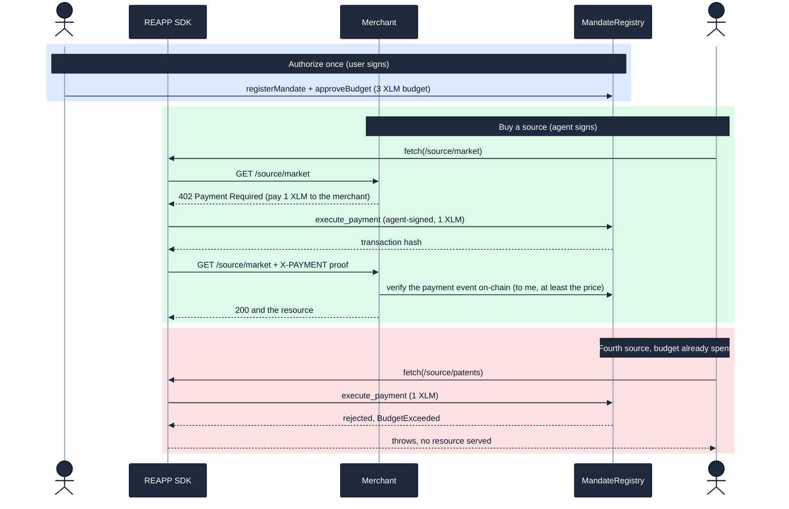

# x402 Payment Round-Trip on Testnet

> **Release.** x402 testnet payment round-trip working end to end.
> `Agent.fetch(url)` receives a 402, validates the mandate, signs the XDR, pays,
> and receives the resource. Reviewers can reproduce the full ResearchAgent
> scenario on testnet using the SDK.

This document shows the new `Agent.fetch` x402 client, the reference 402-gated
merchant that verifies payment on-chain, the ResearchAgent that buys data with it,
and the full round-trip running live on testnet. Every on-chain claim links to its
transaction and was re-checked against Horizon.

> **Published.** `@reapp-sdk/core` 0.2.0 is live on [npm](https://www.npmjs.com/package/@reapp-sdk/core) with `Agent.fetch`. `npm install @reapp-sdk/core @stellar/stellar-sdk` is all a reviewer needs to use the x402 client; the full ResearchAgent scenario also reproduces from source (see Reproduce).

## What it is

x402 is HTTP 402 Payment Required, used as a real payment handshake: an agent asks
for a resource, the server answers "pay first", the agent pays, and the server
serves the resource. This release wires that handshake to REAPP, so the payment is a
mandate-validated, on-chain `execute_payment` rather than a trusted off-chain claim.

The round-trip, end to end:

1. The agent calls `agent.fetch(url)`.
2. The merchant answers `402` with an x402 challenge: the price, the asset, and the merchant to pay.
3. The SDK pays on-chain through `MandateRegistry.execute_payment` (agent-signed), exactly as `pay` does. The contract enforces scope, budget, expiry, and replay.
4. The SDK retries the request with an `X-PAYMENT` settlement proof (the transaction hash).
5. The merchant verifies that payment on-chain before serving the resource.

Two properties make this safe, and they map directly to the Stellar feedback:

- **The SDK cannot bypass the contract.** `fetch` never treats the 402 as authorization. The payment always routes through `execute_payment`, so a revoked, expired, over-budget, or out-of-scope request is rejected on-chain and `fetch` throws. The budget is enforced through the HTTP layer, not around it.
- **The wire format is decoupled.** All x402 HTTP shape lives in one module (`packages/sdk/src/x402.ts`). The mandate logic and the contract know nothing about x402, so the protocol can track x402 v0.2 and v0.3 by changing only that file.

| Fact | Value |
|---|---|
| Network | Stellar testnet |
| Contract | [`CBALARHTO5D7JLWHZ5KST4QNIRC64JI5H3DQDHMIUBSRLLOVS6FCWOQX`](https://stellar.expert/explorer/testnet/contract/CBALARHTO5D7JLWHZ5KST4QNIRC64JI5H3DQDHMIUBSRLLOVS6FCWOQX) (the current composite MandateRegistry) |
| SDK | `@reapp-sdk/core` 0.2.0 on npm, adds `Agent.fetch(url)`, built on the SDK `pay` path |
| Asset | native XLM (a real SEP-41 token via its SAC) |

## The round-trip



## `Agent.fetch`

```ts
import { reapp } from "@reapp-sdk/core";

const agent = reapp.agent({ mandate, signer: agentKey });
const res = await agent.fetch("https://merchant.example/source/market");
const data = await res.json(); // the resource, paid for on-chain
```

| Behavior | Detail |
|---|---|
| Not a 402 | `fetch` returns the response unchanged. No payment happens. |
| A 402 | parse the requirement, check the merchant and asset against the mandate, pay on-chain, retry with the `X-PAYMENT` proof, return the served response. |
| Contract rejects the payment | `fetch` throws (the 4th purchase above). No resource. |
| The merchant rejects the proof | the served response is whatever the merchant returns (a second 402). |

The pre-pay checks in `fetch` (merchant, asset) are a convenience to fail fast. They
are not the security boundary: the contract re-validates merchant scope and budget
on-chain, and the merchant independently re-verifies the payment.

## The reference merchant (the safe pattern)

`apps/fulfillment-agent` is a 402-gated HTTP API written to be the first thing a
developer reads. Its rule: **never trust the client's claim; verify on-chain.** Given
an `X-PAYMENT` proof it reads the transaction from Soroban RPC and confirms, before
serving anything, that:

1. the transaction succeeded;
2. it carries a `payment` event **emitted by the real MandateRegistry contract** (not some other contract);
3. that event paid **this** merchant;
4. the amount is at least the price;
5. the proof has not been redeemed before (replay protection, reserved before the async check).

The file also names the unsafe shortcuts a developer might invent (trusting the
header, checking only "a tx succeeded", skipping the contract-id or merchant check,
not tracking spent proofs) and rejects each one.

## The ResearchAgent

`apps/consumer-agent` buys premium sources to answer a question. It holds no budget
and moves no money itself: every purchase is `agent.fetch(sourceUrl)`. The mandate
caps the spend at 3 XLM, so the agent buys three sources and the contract blocks the
fourth. The agent then works with what it could afford. The agent is untrusted; the
contract is the leash.

## Proof: run the round-trip live on testnet, no mocks

`npm run e2e:x402` funds fresh actors, signs a 3 XLM mandate, starts the merchant,
and runs the ResearchAgent against the current `TESTNET.mandateRegistryId`. It prints
fresh StellarExpert links for the user-signed authorization calls and each
agent-signed payment.

The expected result is 3 of 4 sources served, the 4th blocked by the contract, and
the merchant earning exactly 3 XLM. The budget holds through the HTTP layer because
every x402 payment still routes through `execute_payment`.

## Security gatecheck

A BulletproofBar adversarial sweep on 2026-06-16: 23 agents across six attack
surfaces (merchant on-chain verification, replay and double-spend, `fetch` cannot
bypass the contract, x402 wire-format parsing, the consumer agent pattern, and
correctness), every finding independently re-verified against the code.

The gatecheck found and we fixed a **critical** access-control bug before sign-off, an
honest record kept here on purpose:

| Found by the gatecheck | Fixed |
|---|---|
| The merchant verified the `payment` event's topic and amount but not which contract emitted it. Any contract could publish a forged `("payment", merchant, price)` event and unlock the resource for free. | The merchant now requires the event to be emitted by the MandateRegistry (`StrKey.encodeContract(ev.contractId()) == mandateRegistryId`). Verified on-chain: the token's `transfer` event is correctly ignored, only the registry's `payment` event is honored. |
| Replay check ran before the async on-chain verification, leaving a TOCTOU window for concurrent reuse. | The proof is reserved synchronously before the await, and released only on a verification failure. |

Full record: [`security/x402-gatecheck-2026-06-16.md`](https://github.com/reapp-protocol/reapp-protocol/blob/main/security/x402-gatecheck-2026-06-16.md).
After the fixes the surface passed a follow-up gatecheck clean for testnet. The remaining items
(per-call price ceiling, binding a payment to a specific resource, deriving the price
from the asset decimals) are mainnet-hardening notes, not testnet blockers.

## Release Checklist

| Clause | Status | Evidence |
|---|---|---|
| x402 round-trip working end to end | Met | `npm run e2e:x402`, 3 of 4 sources served live, [tx `b4d749b2…`](https://stellar.expert/explorer/testnet/tx/b4d749b258b618465b8dfecc63d0deaad7c86ddeb14b48850bb217a80defb57b) and the table above |
| `Agent.fetch(url)` receives a 402 | Met | the merchant answers 402; `fetch` parses it (`x402.ts` `parse402`) |
| validates the mandate | Met | `fetch` checks merchant and asset; the contract re-validates scope, budget, expiry, replay on-chain |
| signs the XDR and pays | Met | agent-signed `execute_payment`, three payments confirmed on Horizon |
| receives the resource | Met | three sources served after the merchant verified each payment on-chain |
| reproducible ResearchAgent scenario on testnet via the SDK | Met | `npm run e2e:x402`, fresh friendbot actors, zero setup |

## Mapping to Stellar's feedback

| Feedback | Targets | Status now |
|---|---|---|
| 1. Decouple mandate logic from the x402 wire format | Current testnet release | Addressed. All x402 HTTP shape is isolated in `x402.ts`; the mandate and contract know nothing about it, so x402 v0.2 or v0.3 touches only that file. |
| 5. The SDK cannot bypass the on-chain check | Current testnet release | Addressed and gatechecked. `fetch` always settles through `execute_payment`; the merchant independently verifies the payment on-chain and the emitting contract. |
| 6. Reference agents exemplary, warn against unsafe patterns | Current testnet release | Addressed. The merchant and ResearchAgent are commented as first-read examples and name the unsafe shortcuts they reject. The gatecheck hardened the merchant's verification. |
| 4. Negative tests in CI from the first release | Current testnet release | The contract negative suite runs in CI on every push; the x402 e2e proves the budget block live. |
| 7. Live failure-mode drills | Current testnet release | Addressed. `npm run drills:testnet` proves autonomous in-scope spend plus revocation, merchant downtime after settlement with receipt-only recovery, and quote-before-expiry with settlement-after-expiry. See [`live-failure-drills.md`](live-failure-drills.md). |
| 2. Threat model and data flows as release gates | Cross-cutting | Addressed. See the active [`threat model`](../security/threat-model.md) and [`data flow`](../security/data-flow.md); the final immutable-mainnet gates remain intentionally open. |
| 3. Multisig, key rotation, and loss recovery | Pre-mainnet control | Documented honestly. Current testnet authority is one signer; the required 2-of-3 migration and recovery procedures are in [`upgrade-authority.md`](../security/upgrade-authority.md). |

## Reproduce it yourself

```bash
git clone https://github.com/reapp-protocol/reapp-protocol
cd reapp-protocol
npm ci
npm run agents:testnet
```

The run funds fresh testnet actors, signs a 3 XLM mandate, starts the 402-gated
merchant, and drives the ResearchAgent through the full round-trip, printing a fresh
explorer link for every on-chain payment. Three sources are served and the fourth is
rejected on-chain.
