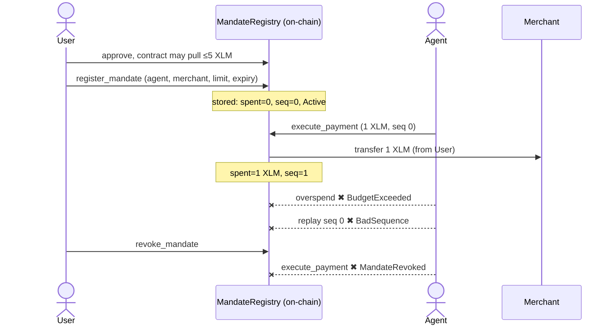

# Step 1: MandateRegistry: Audited & Airtight ✅

> **Deliverable:** *MandateRegistry Soroban contract deployed on testnet with
> `register_mandate`, `validate_and_consume`, `execute_payment`, and
> `revoke_mandate` callable. Integration tests passing, including negative cases
> for unauthorized callers and overspend attempts.*

**Status: complete, independently audited, and verified live on testnet.** This
is the close-out for Step 1; the SDK is next.

## Honest record: the first pass did *not* clear. This version does

We held ourselves to an airtight bar, and the **first pass had real gaps**. We
found them, fixed them, then had the contract independently audited:

| First pass (rejected) | Now (airtight) |
|---|---|
| Replay protection was **dead code**, `seq` incremented but was never checked; `BadSequence` unused | ✅ `execute_payment(expected_seq)` enforces the sequence; replay → `BadSequence`, proven on-chain |
| `NotAuthorized` was a dead typed error | ✅ removed; unauthorized = Soroban host `require_auth` revert (correct pattern) |
| `cargo fmt` failed; CI couldn't go green | ✅ fmt clean, **0 clippy warnings**, tests 16 → **18** |
| The "aha" demo (`playbook/demo.ts`) was a stub | ✅ real runnable: `npm run demo` runs the full on-chain flow |

## Independent audit: verdict: `airtight-ship`

A **12-agent adversarial sweep** across 6 attack surfaces (arithmetic/overflow,
authorization, replay/sequencing, token-reentrancy, state/storage,
logic/economic). **Every finding was independently re-verified against the code.**
Result: **5 candidates, 0 confirmed defects.**

Auditor-confirmed strengths:
- `require_auth` binds to the **stored** agent, never a caller argument.
- State is written **before** `transfer_from` → no reentrancy window.
- The SEP-41 allowance is an **independent hard ceiling**.
- `overflow-checks=true` → math panic-reverts, never wraps.

_(Full record: [`security/audit-2026-06-10.md`](../security/audit-2026-06-10.md). The 3 deferred items are mainnet-hardening notes, not testnet blockers.)_

## Proof: live on testnet, no mocks (9/9)

Contract [`CA3X76MR…BQCL`](https://testnet.stellarchain.io/contracts/CA3X76MRIEHP7LVY6H4FIAOTRQYLSMD6NXUMVM5ZR56EOCCWMT6SBQCL).
Native XLM as a real SEP-41 token; friendbot-funded agent + merchant.

> **9/9 on-chain, fully airtight.** The rogue replay returned `Error(Contract, #8) = BadSequence` (the guard we built, working live), and the post-revoke payment returned `#5 = MandateRevoked`.



| Step | What happened | On-chain |
|---|---|---|
| approve | User authorizes the **contract** as spender (≤5 XLM) | [tx](https://testnet.stellarchain.io/tx/c0199a31161439ac91be8e55cbb87b3e97c85686a32cad00c6fc4aefdb5e88ff) |
| register_mandate | User signs the rule (≤5 XLM, this merchant, until expiry) | [tx](https://testnet.stellarchain.io/tx/1cfbbd1936c703f165541bcd30b78d8b1d0c8b5fcdf4c8c70b270e5ee9d627d9) |
| execute_payment | **Agent** pays → **1 XLM** moves (merchant 10005 → 10006) | [tx](https://testnet.stellarchain.io/tx/bb3380e5000b01b0f630c4395e2c796d1df09d87ec60ab3c588833b698c39945) |
| rogue overspend | asks for 10 XLM → **rejected** `BudgetExceeded` | _refused at simulation_ |
| rogue replay | resubmits a spent seq → **rejected** `BadSequence` | _refused at simulation_ |
| revoke_mandate | user withdraws consent | [tx](https://testnet.stellarchain.io/tx/ce581ea9506bfa9b0cc11f025dcf2a6ddfccd3013d4798727812cacc400b5da2) |
| revoked → blocked | agent tries again → **rejected** `MandateRevoked` | _refused at simulation_ |

## Reproduce it yourself

```bash
cd contracts/mandate-registry && cargo test --release   # 18/18
cargo clippy --all-targets                               # 0 warnings
cd ../.. && npm run e2e:testnet                          # 9/9 live on testnet
```

## Shipping to GitHub

```bash
git init
git add -A                       # .env is git-ignored, no secrets committed
git commit -m "Tranche 1 / Step 1: MandateRegistry: audited, airtight on testnet"
git branch -M main
git remote add origin git@github.com:reapp-protocol/reapp-protocol.git
git push -u origin main
```

**Step 1 is closed. Next: `@reapp-sdk/core`.**
