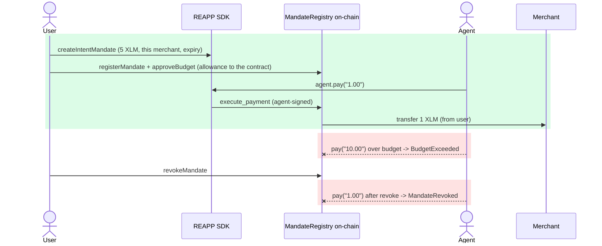

# Step 2: REAPP SDK Published, Audited, Airtight

> **Deliverable.** *REAPP SDK core package published to npm. Package installable
> via npm. Developers can create an agent, connect to the testnet contract, and
> execute a mandate-validated payment in under 10 lines of code.*

**Status: complete, published, independently audited, and verified live on testnet.**
This is the close-out for Step 2. The full deliverable writeup is
[`docs/tranche-1-step-2.md`](../docs/tranche-1-step-2.md); the clause-by-clause
on-chain proof is [`tranche-1-step-2-verified.md`](tranche-1-step-2-verified.md).

## What shipped

| Package | npm | Role |
|---|---|---|
| `@reapp-sdk/core` | [live](https://www.npmjs.com/package/@reapp-sdk/core) | High-level client. Create an agent, run a mandate-validated payment in under 10 lines. |
| `@reapp-sdk/stellar` | [live](https://www.npmjs.com/package/@reapp-sdk/stellar) | Low-level Soroban layer: typed bindings, network config, signing, SEP-41 helpers. |

Both are public scope, Apache-2.0, ESM with TypeScript types, and ship `dist` only.
The under-10-line flow runs against the live, audited MandateRegistry from Step 1 with
no configuration.

Published and installable today: `@reapp-sdk/core` 0.1.2 (the audited build) and
`@reapp-sdk/stellar` 0.1.1. The audit below hardened `core` with two low-severity
input bounds; 0.1.2 is live on npm, confirmed by a clean-install smoke test against
the registry.

## Honest record: the audit found two real gaps, this version fixes them

We held the SDK to the same airtight bar as the contract and ran an independent
adversarial audit before calling it done. The audit confirmed the architecture is
sound, and it found two real low-severity input-bound gaps. Both are now fixed in
`@reapp-sdk/core` 0.1.2.

| Found by the audit | Now (fixed in 0.1.2) |
|---|---|
| `toStroops` returned an unbounded `BigInt`; an amount past i128 max would silently wrap at the ScVal encoder | `toStroops` rejects any amount that does not fit i128, failing loudly instead |
| `createIntentMandate` did not validate `expiry`; a NaN, fractional, or out-of-range value threw cryptically or wrapped at the u64 encoder | `createIntentMandate` requires `expiry` to be a positive integer of Unix seconds no greater than `Number.MAX_SAFE_INTEGER` (well within u64) |

Neither was exploitable, because the contract already rejects the dangerous outcomes,
but the fix makes the SDK honor the strictness it promises and fail on its own.

## Independent audit: verdict airtight for testnet

A BulletproofBar adversarial sweep on 2026-06-15: 31 agents across 8 attack surfaces
(amount and money math, custody boundary, SDK-cannot-bypass-the-contract, mandate-id
canonicalization, network-config integrity, secret and signer handling, error
surfacing, supply-chain hygiene). Every finding was independently re-verified against
the source, several reproduced empirically, then a completeness critic checked for
missed surfaces.

**Result: 22 candidates, 0 confirmed defects, 0 testnet blockers.**

Auditor-confirmed strengths:

- One money path (`execute_payment`); the SDK holds no allowance and supplies no recipient at pay time, so it cannot redirect funds or exceed the mandate.
- `pay` re-reads the sequence from chain every call and trusts no local limit; the contract re-validates everything atomically.
- No secret is logged, serialized, or placed in any error message.
- Both packages ship `dist` only, run no install scripts, and contain no secrets.

Full record: [`security/sdk-audit-2026-06-15.md`](../security/sdk-audit-2026-06-15.md).
The remaining items (decimals source of truth, allowance window alignment, exact
dependency pinning) are pre-mainnet hardening, not testnet blockers.

## Proof: live on testnet, no mocks (8/8)

Contract [`CA3X76MR…BQCL`](https://stellar.expert/explorer/testnet/contract/CA3X76MRIEHP7LVY6H4FIAOTRQYLSMD6NXUMVM5ZR56EOCCWMT6SBQCL).
Native XLM as a real SEP-41 token; friendbot-funded agent and merchant.



| Step | What happened | On-chain |
|---|---|---|
| registerMandate | user signs the mandate (5 XLM, this merchant, until expiry) | [tx](https://stellar.expert/explorer/testnet/tx/67d6706be748d4673a44e6cbec3a1fdc02bbc62e8f10b5265879d7577e3fe06d) |
| approveBudget | user grants the **contract** the SEP-41 allowance | [tx](https://stellar.expert/explorer/testnet/tx/997510facc2d746ecc3f22c7162d8059c7f081e0b99adc681cc93c83c8d4e89a) |
| agent.pay("1.00") | **agent** pays, **1 XLM** moves (merchant 10000 to 10001) | [tx](https://stellar.expert/explorer/testnet/tx/29dc4d724e59c0b7a34c10b7d4e8c4c1038035026859f256163fecb3be5bb4d9) |
| overspend | agent asks for 10 XLM, **rejected** `BudgetExceeded` | refused at simulation |
| revokeMandate | user withdraws consent | [tx](https://stellar.expert/explorer/testnet/tx/299f88f9090e956cd5e02873cf85fefa0aaf9ae60a1e11de45a4f22db94510e2) |
| revoked then blocked | agent tries again, **rejected** `MandateRevoked` | refused at simulation |

## The audit tool

The repo ships an independent on-chain auditor, `npm run audit`
(`scripts/audit-mandate.mjs`), built entirely on the published `@reapp-sdk/stellar`
surface. It reads a mandate straight from the contract, plus the live allowance and
balance, and reports the true spendable ceiling, trusting no application claim. On the
revoked mandate above it prints `agent can move now 0.0` and
`NOT SPENDABLE: mandate is REVOKED`, even though 4 XLM of budget and allowance remain.
The limit lives in the contract, and anyone can verify it.

```bash
npm run audit -- <mandate-id-hex>
```

## Reproduce it yourself

```bash
npm install @reapp-sdk/core @stellar/stellar-sdk     # the published SDK
npm run e2e:sdk                                       # 8/8 live on testnet through the SDK
npm run audit -- <mandate-id-hex>                     # audit any mandate from the chain
```

**Step 2 is closed. Next: Tranche 2, the reference consumer and fulfillment agents
and the x402 flow.**
