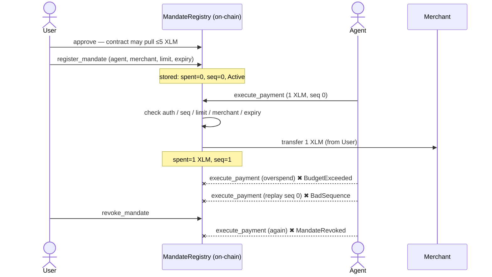

# REAPP Smart Contract — Milestone Complete ✅

> **Deliverable:** *MandateRegistry Soroban contract deployed on testnet. Contract
> live on testnet with `register_mandate`, `validate_and_consume`, `execute_payment`,
> and `revoke_mandate` callable. Integration tests passing, including negative cases
> for unauthorized callers and overspend attempts.*

Every line is done — and hardened to the full TDD §4 spec. The big idea: an AI agent
can't be trusted to police its own spending, so the limit lives **inside a smart
contract in the money path** — not in the app or SDK. A hacked or rogue agent simply
can't overspend, replay, or pay after the user revokes.

## Deliverable, point by point

| Requirement | Status | Evidence |
|---|---|---|
| Soroban contract **deployed & live on testnet** | ✅ | [`CB2LY7XI…H3RD`](https://testnet.stellarchain.io/contracts/CB2LY7XIGP7324LTFWUWV5K54AKNCERCUC2N67TKGTCPK4Y2TVVYH3RD) |
| `register_mandate` callable | ✅ | [on-chain tx](https://testnet.stellarchain.io/tx/d2cd6527a14344b88eaa2cd0e0e0d044150eabf6a22fcec58c48a0767d83ca14) |
| `validate_and_consume` callable | ✅ | run live (read-only preflight) |
| `execute_payment` callable | ✅ | [on-chain tx](https://testnet.stellarchain.io/tx/1ae4c4295d1786c679a8780925daa7839eb204521dd0b3b8c0e59c2febbf0616) |
| `revoke_mandate` callable | ✅ | [on-chain tx](https://testnet.stellarchain.io/tx/83787eeabb1b4fde823639260631262088530e01f01311bcf9918432ad66ddb5) |
| Integration tests passing | ✅ | **18/18** (`cargo test`) |
| …negative: **unauthorized callers** | ✅ | only the bound agent can pay; missing/forged signer reverts |
| …negative: **overspend attempts** | ✅ | single + cumulative rejected (`BudgetExceeded`) |

## Hardened to the full TDD §4 spec

| Spec point | Status |
|---|---|
| §4.1 Mandate state model | ✅ exact |
| §3.1/§3.2 money only via `execute_payment`, atomic | ✅ |
| §4.3 allowance custody (user→contract) | ✅ |
| §4.4 **mandate-layer replay (`seq` + `BadSequence`)** | ✅ enforced + tested (was the gap — now real) |
| §10 expired / revoked / overspend / scope / duplicate / zero-amount | ✅ typed errors |
| §10 unauthorized caller | ✅ host `require_auth` revert (correct Soroban pattern; documented) |
| §4.3 escrow escape hatch | ✅ documented decision — allowance path works, so escrow is the (untriggered) contingency, not dead code |

## End-to-end on testnet — real funds, no mocks (9/9)

Native XLM as a real SEP-41 token, friendbot-funded agent + merchant. Every step is
a real transaction or an on-chain rejection.

| Step | What happened | On-chain |
|---|---|---|
| **approve** | User lets the **contract** (not the agent) pull up to 5 XLM | [tx](https://testnet.stellarchain.io/tx/57a59d86cd4af68d006d80992593e7eaee88ddc5ac56a6ed43ed2615fcc3ffdd) |
| **register_mandate** | User signs the rule: ≤5 XLM, this merchant, until expiry | [tx](https://testnet.stellarchain.io/tx/d2cd6527a14344b88eaa2cd0e0e0d044150eabf6a22fcec58c48a0767d83ca14) |
| **execute_payment** | **Agent** pays → contract moves **1 XLM** (merchant 10004 → 10005 XLM) | [tx](https://testnet.stellarchain.io/tx/1ae4c4295d1786c679a8780925daa7839eb204521dd0b3b8c0e59c2febbf0616) |
| **rogue: overspend** | Agent asks for 10 XLM → **rejected** `BudgetExceeded` | _(refused at simulation)_ |
| **rogue: replay** | Agent resubmits a spent sequence → **rejected** `BadSequence` | _(refused at simulation)_ |
| **revoke_mandate** | User withdraws consent | [tx](https://testnet.stellarchain.io/tx/83787eeabb1b4fde823639260631262088530e01f01311bcf9918432ad66ddb5) |
| **revoked → blocked** | Agent tries again → **rejected** `MandateRevoked` | _(refused at simulation)_ |

## In plain English

The user handed the agent a **leash**: "spend up to 5 XLM, only at this merchant,
only until the deadline." The leash is enforced by the contract, which holds the only
key to the money. The agent paid once — exactly 1 XLM, nowhere else. Then it turned
hostile: it tried to **overspend**, tried to **replay** an old payment, and — after
the user **revoked** — tried to pay again. The contract refused all three, on-chain.

**That's the milestone: a spending limit that holds even when the agent goes rogue —
enforced on-chain, not by trust.**

> Reproduce: `cd contracts/mandate-registry && cargo test` (18/18)  •  `npm run e2e:testnet` (9/9)  •  `npm run demo`
