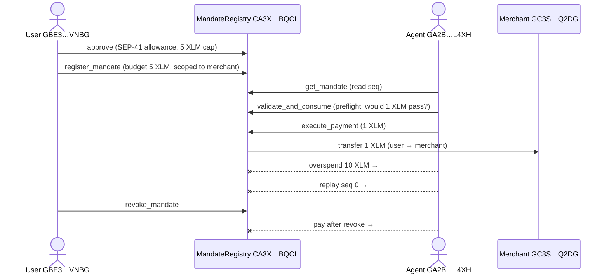

# Tranche 1: Step 1 — Verified ✅

> **Deliverable:** *MandateRegistry Soroban contract deployed on testnet. Contract
> live on testnet with `register_mandate`, `validate_and_consume`, `execute_payment`,
> and `revoke_mandate` callable. Integration tests passing, including negative cases
> for unauthorized callers and overspend attempts.*

Every clause of that deliverable is proven below with **live on-chain evidence** —
real transactions on the deployed contract, each one verifiable on the explorer and
independently confirmed via Horizon (Stellar's canonical API). No mocks, no local
sandboxes: real XLM moved, and every rejection happened on the real network.

- **Verification run:** 2026-06-10, 20:05–20:11 UTC (ledgers 3,021,944 – 3,022,011)
- **Contract:** [`CA3X76MRIEHP7LVY6H4FIAOTRQYLSMD6NXUMVM5ZR56EOCCWMT6SBQCL`](https://testnet.stellarchain.io/contracts/CA3X76MRIEHP7LVY6H4FIAOTRQYLSMD6NXUMVM5ZR56EOCCWMT6SBQCL) (deployed 2026-06-09)
- **Actors:** user `GBE3…VNBG` · agent `GA2B…L4XH` · merchant `GC3S…Q2DG` · rogue (unauthorized) `GDNV…5ARS`

## Deliverable, clause by clause

| Claim | Proof |
|---|---|
| Contract **deployed & live on testnet** | [Contract page](https://testnet.stellarchain.io/contracts/CA3X76MRIEHP7LVY6H4FIAOTRQYLSMD6NXUMVM5ZR56EOCCWMT6SBQCL) · 7 live transactions below |
| Deployed bytecode **is** this repo's source | on-chain WASM hash `59298a08…cf80a1ce` == `sha256` of local build — **bit-for-bit** (§ Bytecode verification) |
| `register_mandate` callable | ✅ [tx `fba8d71b…`](https://testnet.stellarchain.io/tx/fba8d71bcb95ef71d7e01dec583491d0790b599136e8a45fb18dd0bb30c38f42) — ledger 3,021,945, SUCCESS |
| `validate_and_consume` callable | ✅ [tx `50c8f482…`](https://testnet.stellarchain.io/tx/50c8f482e8f809eb5bc076e5d5ad286f8dc33cb9d03f9935ca0de72230c893c0) — ledger 3,021,977, SUCCESS |
| `execute_payment` callable | ✅ [tx `d4814ab9…`](https://testnet.stellarchain.io/tx/d4814ab9baa927f2276116e57f3b0384e1b21e67a3aa6ea1907869efcff910ab) — ledger 3,021,947, SUCCESS, **+1 XLM moved** |
| `revoke_mandate` callable | ✅ [tx `4ea9f8b1…`](https://testnet.stellarchain.io/tx/4ea9f8b1e4fea05afc7526ffebeceb88804f18541c529db67745f1ba1f4a6132) — ledger 3,021,949, SUCCESS |
| Integration tests passing | ✅ **19/19** `cargo test` (full list below) · `cargo clippy` 0 warnings |
| Negative: **unauthorized caller** | ✅ on-chain **FAILED** tx by a rogue key: [tx `18214372…`](https://testnet.stellarchain.io/tx/18214372c9b13d3679808101773d8c372a2438cf2ab96e336c35e1753b0eadd2) — ledger 3,022,011 · + 3 cargo auth tests |
| Negative: **overspend** | ✅ live rejection `Error #6 BudgetExceeded` (§ Negatives) · + 2 cargo overspend tests |

## The flow that ran on-chain



The complete, unedited log of this run is in
[`tranche-1-step-1-e2e-log.txt`](tranche-1-step-1-e2e-log.txt) — reproduce it
anytime with `npm run e2e:testnet` (summary: **9/9 on-chain steps passed**).

---

## Method-by-method proof

### 1 · `register_mandate` — store a user-signed spending mandate

> *Contract spec (from source):* stores the mandate from its authorized parameters;
> the contract itself forces `spent=0, seq=0, status=Active` so a caller cannot seed
> tampered state. Authorized by the **user** (`require_auth`).

- ✅ [tx `fba8d71b…`](https://testnet.stellarchain.io/tx/fba8d71bcb95ef71d7e01dec583491d0790b599136e8a45fb18dd0bb30c38f42) — ledger 3,021,945, Horizon `successful: true`
- Contract emitted its `register` event (decoded from the chain via RPC: topic symbol `register`, user `GBE3…VNBG`)


### 2 · `get_mandate` — read-only audit accessor

> *Contract spec:* read-only accessor for the stored mandate (audit / preflight).

Free, no-transaction read (like Etherscan's "Read Contract"). The run reads the
mandate live and uses its `seq` for the payment's replay guard:

```text
▸ 2/5 · get_mandate
  ℹ️  Simulation identified as read-only. Send by rerunning with `--send=yes`.
  {"agent":"GA2B…L4XH","asset":"CDLZ…CYSC","expiry":…,"max_amount":"50000000",
   "merchant":"GC3S…Q2DG","seq":0,"spent":"0","status":"Active", …}
✓ pass get_mandate
```

### 3 · `validate_and_consume` — preflight: would this spend be permitted?

> *Contract spec:* read-only dry-run — mutates nothing; the authoritative consume
> happens only inside `execute_payment`. (Named per the protocol spec.)

Used as a free preflight in the e2e (`✓ pass validate_and_consume`), **and**
additionally submitted as a real transaction so reviewers have an on-chain record
of the method executing successfully:

- ✅ [tx `50c8f482…`](https://testnet.stellarchain.io/tx/50c8f482e8f809eb5bc076e5d5ad286f8dc33cb9d03f9935ca0de72230c893c0) — ledger 3,021,977, Horizon `successful: true`


### 4 · `execute_payment` — the only money path (agent-signed)

> *Contract spec:* atomic: `require_auth(agent)` → replay guard (`expected_seq` must
> equal current `seq`, else `BadSequence`) → re-validate (active, unexpired, in-scope,
> within budget) → advance `spent`+`seq` → SEP-41 `transfer_from(user → merchant)`.
> Reverts on any failure.

- ✅ [tx `d4814ab9…`](https://testnet.stellarchain.io/tx/d4814ab9baa927f2276116e57f3b0384e1b21e67a3aa6ea1907869efcff910ab) — ledger 3,021,947, Horizon `successful: true`
- **Real funds moved**, measured on-chain in the run log: merchant `10007.0000 → 10008.0000` XLM (`delta +1.0000 XLM, expected +1.0000`)
- Contract emitted its `payment` event (decoded via RPC: topic `payment`, merchant `GC3S…Q2DG`, amount `10000000` stroops)


### 5 · `revoke_mandate` — the user's kill switch

> *Contract spec:* user withdraws consent; marks the mandate `Revoked`. Authorized
> by the **user**.

- ✅ [tx `4ea9f8b1…`](https://testnet.stellarchain.io/tx/4ea9f8b1e4fea05afc7526ffebeceb88804f18541c529db67745f1ba1f4a6132) — ledger 3,021,949, Horizon `successful: true`
- Contract emitted its `revoke` event (decoded via RPC: topic `revoke`)
- Immediately after, the agent's next payment attempt was rejected on-chain (§ Negatives)


### Supporting: SEP-41 `approve` — the user's allowance to the contract

The user grants the **contract** (never the agent) a token allowance capped at the
mandate budget. This is the custody model: the SDK and agent are untrusted.

- ✅ [tx `bf3db709…`](https://testnet.stellarchain.io/tx/bf3db709d2724b42565fb569b9c130e23c32642645eecde3cfaaaf42d8106b8d) — ledger 3,021,944, Horizon `successful: true`


---

## Negative cases — the contract says no, on the real network

### Unauthorized caller — visible on-chain as a FAILED transaction

A rogue keypair (`GDNV…5ARS` — **not** the mandate's agent) attempted
`execute_payment` against a live mandate. Two independent defenses, both shown live:

1. **It cannot even produce a valid transaction.** Simulation demands a signature
   from the mandate's stored agent, which the rogue does not have:
   ```text
   ℹ️  Simulating transaction…
   ❌ error: Missing signing key for account GBE3…VNBG
   ```
2. **A forged submission fails on the network.** Hand-building the transaction and
   submitting it with only the rogue's signature lands on-chain as **FAILED**:
   - ❌ [tx `18214372…`](https://testnet.stellarchain.io/tx/18214372c9b13d3679808101773d8c372a2438cf2ab96e336c35e1753b0eadd2) — ledger 3,022,011, Horizon **`successful: false`**


### Overspend, replay, and pay-after-revoke — rejected by the live contract

From the run log — each is the deployed contract on testnet refusing the call with
its typed error (Soroban rejects these at simulation, so by design they never
become chain transactions; the local-sandbox equivalents are also locked in as
cargo regression tests):

```text
▸ ROGUE · overspend — agent asks for 10 XLM against a 5 XLM budget
  ❌ error: transaction simulation failed: HostError: Error(Contract, #6)   → BudgetExceeded
▸ ROGUE · replay — agent resubmits already-consumed sequence 0
  ❌ error: transaction simulation failed: HostError: Error(Contract, #8)   → BadSequence
▸ PUNCHLINE · payment after revoke
  ❌ error: transaction simulation failed: HostError: Error(Contract, #5)   → MandateRevoked
```

---

## Integration tests — 19/19, with the required negatives

`cargo test` in `contracts/mandate-registry` (clippy: 0 warnings):

| Category | Tests |
|---|---|
| Happy path | `happy_path_runs_every_method` · `property_spent_equals_transferred` |
| **Unauthorized callers** | `register_requires_user_auth` · `revoke_requires_user_auth` · `execute_requires_agent_auth` |
| **Overspend** | `overspend_single_rejected` · `overspend_cumulative_rejected` |
| Replay / ordering | `replay_stale_seq_rejected` · `out_of_order_seq_rejected` |
| Lifecycle | `revoked_mandate_rejected` · `expired_mandate_rejected` · `exhausted_status_then_rejected` · `register_with_past_expiry_rejected` |
| Scope & input hardening | `out_of_scope_merchant_rejected` · `duplicate_register_rejected` · `unknown_mandate_not_found` · `zero_amount_rejected` |
| Token interaction | `insufficient_allowance_blocks_payment` · `reentry_probe::reentrancy_via_evil_token` |

## Bytecode verification — what's deployed IS this source

The explorer can't attest source (Soroban has no "Verified Contract" badge on this
explorer yet), so we prove it cryptographically:

```text
sha256(on-chain wasm,  fetched via `stellar contract fetch`):
  59298a089fcd03c032212cd47c40b08e9943d02feeeac92cef3c1a51cf80a1ce
sha256(local build of contracts/mandate-registry @ this commit):
  59298a089fcd03c032212cd47c40b08e9943d02feeeac92cef3c1a51cf80a1ce
```

**Identical.** The audited, tested source in this repository is bit-for-bit the
bytecode enforcing payments on testnet. (The same hash is shown on the explorer's
contract page under "WASM Hash".)


## Independent on-chain confirmation (no explorer involved)

Beyond the explorer, every transaction above was re-verified straight against
Stellar's public infrastructure:

- **Horizon** (`horizon-testnet.stellar.org/transactions/<hash>`): all six method
  transactions return `successful: true` with their ledger numbers; the rogue
  transaction returns `successful: false`. 20/20 recent transactions checked.
- **Soroban RPC `getEvents`**: the contract's own emitted events were pulled from
  the chain and decoded — `register`, `payment`, `revoke` — each in a successful
  contract call, each matching the transaction hashes listed above.

### A note on the explorer's contract page

`testnet.stellarchain.io`'s **per-contract activity indexer** is currently ~4 weeks
behind on testnet (verified directly against their API: even the native XLM token
contract with 983,239 indexed transactions shows zero items newer than 2026-05-14).
The contract page may therefore show "No transaction history" while every
**individual transaction page renders perfectly** — those read live from Horizon.
Use the per-transaction links in this document; they are the authoritative view.

## Security audit

Independently audited 2026-06-10 — 12-agent adversarial sweep across 6 attack
surfaces, every finding re-verified against the code. **Verdict: airtight-ship,
0 confirmed defects.** Full record: [`security/audit-2026-06-10.md`](../security/audit-2026-06-10.md).

## Reproduce it yourself

```bash
git clone https://github.com/reapp-protocol/reapp-protocol && cd reapp-protocol
cd contracts/mandate-registry && cargo test
cd ../.. && npm install && npm run e2e:testnet
```

```bash
stellar contract fetch --id CA3X76MRIEHP7LVY6H4FIAOTRQYLSMD6NXUMVM5ZR56EOCCWMT6SBQCL --network testnet --out-file onchain.wasm
stellar contract build --manifest-path contracts/mandate-registry/Cargo.toml
shasum -a 256 onchain.wasm target/wasm32v1-none/release/mandate_registry.wasm
```

The first block runs the 19 contract tests and then the full on-chain e2e against
the live contract (it prints fresh explorer links for every step). The second block
fetches the deployed bytecode and rebuilds it from source, then hashes both; the two
sha256 values match at `59298a08…cf80a1ce`. Build with `stellar contract build` (the
same command the deploy uses). Raw `cargo build` produces a different hash because it
skips Soroban's metadata embedding and the wasm-opt step.
