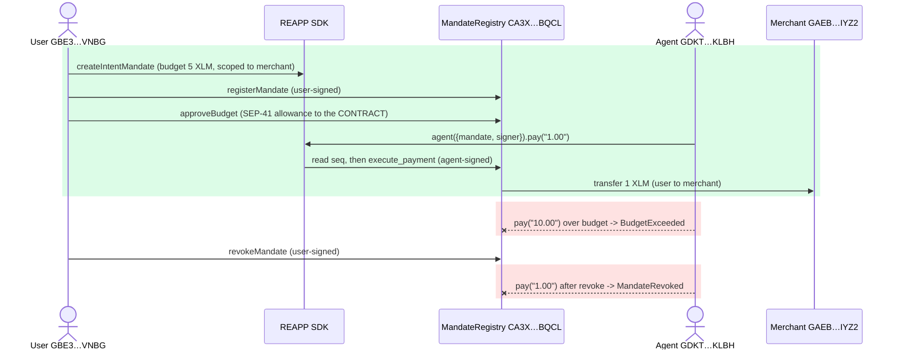

# Tranche 1, Step 2: Verified

> **Deliverable.** *REAPP SDK core package published to npm. Package installable
> via npm. Developers can create an agent, connect to the testnet contract, and
> execute a mandate-validated payment in under 10 lines of code.*

Every clause is proven below: the packages are live on npm, and the under-10-line
flow ran live on testnet through the published SDK surface. Real XLM moved, and the
rejections happened on the real network. No mocks, no local sandbox.

- **Run:** 2026-06-15, 09:03:27 to 09:03:42 UTC (ledgers 3,100,287 to 3,100,290)
- **Contract:** [`CA3X76MRIEHP7LVY6H4FIAOTRQYLSMD6NXUMVM5ZR56EOCCWMT6SBQCL`](https://stellar.expert/explorer/testnet/contract/CA3X76MRIEHP7LVY6H4FIAOTRQYLSMD6NXUMVM5ZR56EOCCWMT6SBQCL) (deployed and audited in Step 1)
- **Mandate:** `2e7c7b8746beb91486fce40685a2656616851c07a93087146e6f0f8b5b5d4513`
- **Actors:** user `GBE3…VNBG` · agent `GDKT…KLBH` · merchant `GAEB…IYZ2`

## Deliverable, clause by clause

| Claim | Proof |
|---|---|
| Core package **published to npm** | [`@reapp-sdk/core`](https://www.npmjs.com/package/@reapp-sdk/core) and [`@reapp-sdk/stellar`](https://www.npmjs.com/package/@reapp-sdk/stellar), public scope, Apache-2.0, types included |
| **Installable** via npm | `npm install @reapp-sdk/core @stellar/stellar-sdk`; published tarball ships `dist` only, no install scripts |
| **Create an agent** | `reapp.agent({ mandate, signer })` |
| **Connect to the testnet contract** | Defaults to the live MandateRegistry `CA3X76MR…BQCL`, no config |
| **Mandate-validated payment** | `agent.pay("1.00")` moved **+1 XLM** live: [tx `29dc4d72…`](https://stellar.expert/explorer/testnet/tx/29dc4d724e59c0b7a34c10b7d4e8c4c1038035026859f256163fecb3be5bb4d9), ledger 3,100,289, Horizon `successful: true` |
| **Under 10 lines** | Four REAPP calls, well under 10 lines of integration code, run end to end by `npm run e2e:sdk` (8/8) |
| Negative: **overspend** | `agent.pay("10.00")` against a 5 XLM budget refused on-chain: `BudgetExceeded` |
| Negative: **pay after revoke** | `agent.pay("1.00")` after `revokeMandate` refused on-chain: `MandateRevoked` |

## The flow that ran on-chain



## Step by step, with proof

Each method call is a real testnet transaction, re-verified on Horizon.

### 1 · `registerMandate`: store the user-signed mandate

- [tx `67d6706b…`](https://stellar.expert/explorer/testnet/tx/67d6706be748d4673a44e6cbec3a1fdc02bbc62e8f10b5265879d7577e3fe06d), user-signed (`GBE3…VNBG`), ledger 3,100,287, Horizon `successful: true`
- The contract sets `spent=0, seq=0, status=Active` itself, so the SDK cannot seed tampered state.

### 2 · `approveBudget`: the allowance goes to the contract, never the agent

- [tx `997510fa…`](https://stellar.expert/explorer/testnet/tx/997510facc2d746ecc3f22c7162d8059c7f081e0b99adc681cc93c83c8d4e89a), user-signed, ledger 3,100,288, Horizon `successful: true`
- The user grants the **contract** a SEP-41 allowance capped at the budget. The SDK and agent are untrusted and hold nothing.

### 3 · `agent.pay("1.00")`: the only money path, signed by the agent

- [tx `29dc4d72…`](https://stellar.expert/explorer/testnet/tx/29dc4d724e59c0b7a34c10b7d4e8c4c1038035026859f256163fecb3be5bb4d9), **agent-signed** (`GDKT…KLBH`), ledger 3,100,289, Horizon `successful: true`
- Real funds moved: the merchant balance read back as exactly `10001.0000000` XLM, a clean `+1` over its 10,000 XLM friendbot start.
- The pay operation is an agent-signed `invoke_host_function` against the MandateRegistry. The signer is the agent, a different key from the user who authorized the mandate.

### 4 · `revokeMandate`: the user's kill switch

- [tx `299f88f9…`](https://stellar.expert/explorer/testnet/tx/299f88f9090e956cd5e02873cf85fefa0aaf9ae60a1e11de45a4f22db94510e2), user-signed, ledger 3,100,290, Horizon `successful: true`
- Immediately after, the agent's next payment attempt was rejected on-chain.

## Negative cases: the contract says no, driven by the SDK

These are the guarantees the SDK cannot get around, because the contract enforces them.
Soroban refuses both at simulation, so by design they never become chain transactions.

```text
ROGUE · agent.pay("10.00")  against a 5 XLM budget
  -> rejected: BudgetExceeded (Error #6)
PUNCHLINE · agent.pay("1.00")  after revokeMandate
  -> rejected: MandateRevoked (Error #5)
```

`npm run e2e:sdk` summary: **8/8 passed** (accounts funded, createIntentMandate,
registerMandate, approveBudget, pay moved exactly 1 XLM, overspend rejected,
revokeMandate, revoked mandate blocks payment).

## Independent on-chain confirmation

Beyond the explorer, every transaction was re-verified straight against Stellar's
public infrastructure:

- **Horizon** (`horizon-testnet.stellar.org/transactions/<hash>`): the four method transactions return `successful: true` at ledgers 3,100,287 to 3,100,290; the payment is an agent-signed `invoke_host_function` to the MandateRegistry.
- **Balance check:** the merchant account read back exactly `10001.0000000` XLM, confirming the `+1 XLM` settlement independent of any SDK or explorer claim.

## Audit the result yourself, from the chain

The repo ships an independent on-chain auditor, `npm run audit`, built on the
published `@reapp-sdk/stellar` surface. It reads a mandate straight from the contract,
plus the live allowance and balance, and reports the true spendable ceiling. Run it
against the revoked mandate from this run:

```
npm run audit -- 2e7c7b8746beb91486fce40685a2656616851c07a93087146e6f0f8b5b5d4513
```

```text
  · status             Revoked
  · remaining          4.0 (40000000 stroops)
  · allowance → contract 4.0 (40000000 stroops)
  · agent can move now 0.0 (0 stroops)
  ✖ NOT SPENDABLE
     · mandate is REVOKED
```

Four XLM of budget and four of allowance remain, yet the agent can move nothing,
because the contract revoked it. The limit lives in the contract, and anyone can read
that fact on-chain.

## Security audit

BulletproofBar adversarial sweep on 2026-06-15: 31 agents, 8 attack surfaces, every
finding independently re-verified against the source. **Verdict: airtight for testnet,
0 confirmed defects.** Two low-severity input bounds were fixed in `@reapp-sdk/core`
0.1.2 during the pass. Full record:
[`security/sdk-audit-2026-06-15.md`](../security/sdk-audit-2026-06-15.md).

## Reproduce it yourself

```bash
git clone https://github.com/reapp-protocol/reapp-protocol && cd reapp-protocol
npm install && npm run build
npm run e2e:sdk
npm run audit -- 2e7c7b8746beb91486fce40685a2656616851c07a93087146e6f0f8b5b5d4513
```

The e2e prints fresh explorer links for every step of a new run against the live
contract. The audit reads the revoked mandate from this document directly from the
chain.
