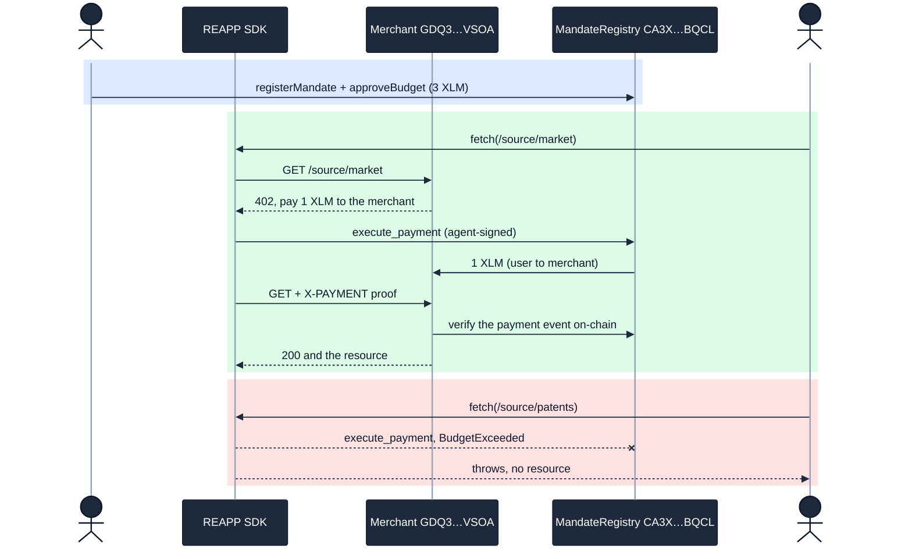

# Tranche 1, Step 3: Verified

> **Deliverable.** *x402 testnet payment round-trip working end to end.
> `Agent.fetch(url)` receives a 402, validates the mandate, signs the XDR, pays,
> and receives the resource. Reviewers can reproduce the full ResearchAgent
> scenario on testnet using the SDK.*

Every clause is proven below with live on-chain evidence: a ResearchAgent buying
real resources from a 402-gated merchant, each unlock settled by a real
`execute_payment` and verified on-chain by the merchant. No mocks. Real XLM moved,
and the over-budget request was rejected on the real network.

- **Run:** 2026-06-16, ledgers 3,108,631 to 3,108,636
- **Contract:** [`CA3X76MRIEHP7LVY6H4FIAOTRQYLSMD6NXUMVM5ZR56EOCCWMT6SBQCL`](https://stellar.expert/explorer/testnet/contract/CA3X76MRIEHP7LVY6H4FIAOTRQYLSMD6NXUMVM5ZR56EOCCWMT6SBQCL) (the Step 1 MandateRegistry, unchanged)
- **Mandate:** `b608dde3f23975abb59b4b611f5f5fcb618b3f6ee533d2753fa4014052371126`, budget 3 XLM
- **Actors:** user `GAHG…TORQ` · agent `GCZN…EZOC` · merchant `GDQ3…VSOA`

## Deliverable, clause by clause

| Claim | Proof |
|---|---|
| x402 round-trip **end to end** | `npm run e2e:x402`: 3 of 4 sources served live, the 4th rejected on-chain |
| `Agent.fetch(url)` receives a **402** | the merchant answers 402; `fetch` parses the x402 challenge |
| **validates the mandate** | `fetch` checks merchant and asset; the contract re-validates scope, budget, expiry, replay on every spend |
| **signs the XDR and pays** | agent-signed `execute_payment`: [tx `f6abd0c1…`](https://stellar.expert/explorer/testnet/tx/f6abd0c11ca9b1e2f856e92aa013bfbd456c2d9363728741799e51d7792e5b90), [tx `4be38b50…`](https://stellar.expert/explorer/testnet/tx/4be38b500da29b69900ef9cd2ba5d2c9a9f51a832929012532f471c468dc4284), [tx `90723f4b…`](https://stellar.expert/explorer/testnet/tx/90723f4bc810f677b07fb5299b2bc2155f0ba7d36c5bd43c4eb8e8cd9bcabe41) |
| **receives the resource** | three sources served after the merchant verified each payment on-chain |
| **reproducible** ResearchAgent scenario | `npm run e2e:x402`, fresh friendbot actors, zero setup |
| Negative: **over budget blocked** | the 4th `fetch` payment refused on-chain with `BudgetExceeded`, no transaction |

## The flow that ran on-chain



## Step by step, with proof

### Authorize (user-signed, once)

- register [tx `88d4462c…`](https://stellar.expert/explorer/testnet/tx/88d4462c8f15827a77af71a2f3c091f7c0ada5ed05e2dcdae2a23ebf8fead822), ledger 3,108,631, Horizon `successful: true`
- approve [tx `a42f1dba…`](https://stellar.expert/explorer/testnet/tx/a42f1dba6590deb585b52ab367bce3ebd387882055cae4b7ccf36145070ad0ec), ledger 3,108,632, Horizon `successful: true`
- The user signs a 3 XLM mandate scoped to the merchant and grants the SEP-41 allowance to the contract.

### Buy three sources (agent-signed, via `fetch`)

Each is a 402, then an on-chain payment, then the resource:

- market: [tx `f6abd0c1…`](https://stellar.expert/explorer/testnet/tx/f6abd0c11ca9b1e2f856e92aa013bfbd456c2d9363728741799e51d7792e5b90), ledger 3,108,633, `successful: true`
- academic: [tx `4be38b50…`](https://stellar.expert/explorer/testnet/tx/4be38b500da29b69900ef9cd2ba5d2c9a9f51a832929012532f471c468dc4284), ledger 3,108,634, `successful: true`
- news: [tx `90723f4b…`](https://stellar.expert/explorer/testnet/tx/90723f4bc810f677b07fb5299b2bc2155f0ba7d36c5bd43c4eb8e8cd9bcabe41), ledger 3,108,636, `successful: true`

The merchant served each only after reading the transaction from Soroban RPC and
confirming the MandateRegistry `payment` event paid it at least the price.

### The fourth source: blocked on-chain

```text
GET /source/patents  (402, pay 1 XLM)
  -> execute_payment rejected: BudgetExceeded (Error #6)
  -> agent.fetch throws, no resource served
```

The budget was already spent on three sources, so the contract refused the fourth
payment. The merchant never had a payment to verify. The limit held through the HTTP
layer.

## Independent on-chain confirmation

- **Horizon** (`horizon-testnet.stellar.org/transactions/<hash>`): the five method transactions return `successful: true` at ledgers 3,108,631 to 3,108,636. The register and approve were signed by the user (`GAHG…TORQ`); the three payments were signed by the agent (`GCZN…EZOC`), a different key.
- **Balance check:** the merchant account read back exactly `10003.0000000` XLM, confirming the `+3 XLM` settlement independent of any SDK, merchant, or explorer claim.

## Security audit

BulletproofBar adversarial sweep on 2026-06-16: 23 agents, 6 attack surfaces, every
finding re-verified against the code. The sweep found a critical access-control bug
(the merchant honored a `payment` event without checking the emitting contract), which
is fixed and verified on-chain, plus a replay TOCTOU window, also fixed. After the
fixes the surface re-audited clean for testnet. Full record:
[`security/x402-audit-2026-06-16.md`](../security/x402-audit-2026-06-16.md).

## Reproduce it yourself

```bash
git clone https://github.com/reapp-protocol/reapp-protocol && cd reapp-protocol
npm install && npm run build
npm run e2e:x402
```

The run funds fresh testnet actors, signs a 3 XLM mandate, starts the 402-gated
merchant, and drives the ResearchAgent through the full round-trip, printing a fresh
explorer link for every payment. Three sources are served and the fourth is rejected
on-chain.
