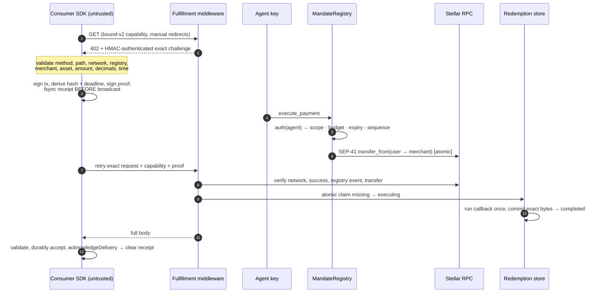
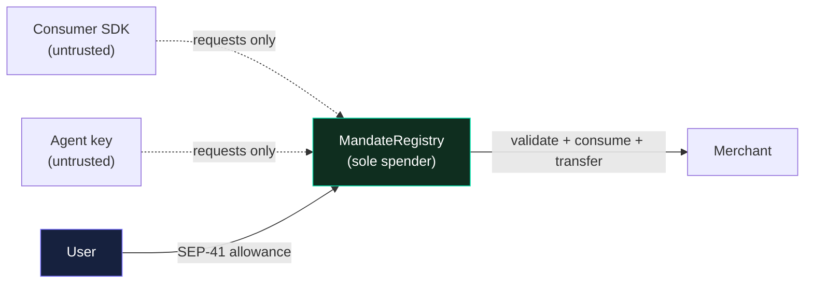

# Bound-v2 security data flow

## Diagram — first delivery

Enforcement boundary at a glance:

## Actors and state

- User: owns funds and signs the mandate.
- Agent: the only identity allowed to request contract payments.
- MandateRegistry: validates and consumes authorization before transfer.
- Consumer SDK: untrusted adapter that negotiates HTTP payment and retains receipts.
- Fulfillment middleware: authenticates requests and independently verifies settlement.
- Stellar RPC: source of transaction and event evidence.
- Receipt store: durable client-side pending-delivery evidence.
- Redemption store: durable merchant claim plus immutable JSON-result state.

## First delivery

1. Consumer sends exact-origin `GET` with bound-v2 capability and manual redirects.
2. Merchant without proof returns an HMAC-authenticated exact challenge.
3. Consumer validates method, path/query, network, registry, merchant, asset,
   amount, decimals, and time before spending.
4. Consumer signs the transaction, derives its hash/validity deadline, signs the
   bound proof, and fsyncs the receipt before broadcast.
5. Agent calls `execute_payment`.
6. Contract authenticates agent, validates scope/budget/expiry/sequence, advances
   state, and performs the SEP-41 transfer atomically.
7. Consumer retries the exact request with capability and proof; redirects remain manual.
8. Merchant verifies challenge HMAC and exact request fields.
9. Merchant obtains user/agent/merchant/asset from the verified mandate and
    checks the agent signature.
10. Merchant verifies RPC network, successful fresh transaction, registry event,
    and same-transaction token transfer.
11. Redemption store atomically claims `missing -> executing`.
12. The paid JSON callback runs once; bounded exact bytes are committed as
    `completed` before the socket receives them.
13. Consumer receives the full body, validates/durably accepts its result, and
    calls `acknowledgeDelivery`; only then is the pending receipt cleared.

## Exact recovery

1. Consumer retains a `DeliveryPendingError.receipt`.
2. `retryDelivery` validates the complete envelope and proof, refuses a changed
   URL or method, and sends the exact proof with manual redirects.
3. Merchant lookup returns `completed` only for the same transaction/proof and
   replays exact stored bytes; chain verification and callback do not repeat.
   `executing` returns `503`; a different proof returns `409`.
4. Consumer validates/persists the result and explicitly acknowledges it.
5. No payment, signature, or transaction occurs.

The first-redemption challenge deadline does not invalidate an already consumed
exact proof needed for recovery. A different proof for the same transaction is
always `409`.

## Failure paths

| Failure | Result |
|---|---|
| Missing capability | `426` before payment |
| Invalid challenge/proof/chain evidence | `402`, no delivery |
| Non-GET | `405` |
| Same transaction, different proof | `409` |
| RPC/store unavailable | `503`, no delivery |
| Client receipt save fails before broadcast | No transaction is submitted |
| Submitted hash, network, non-2xx, truncated body, or app acknowledgment uncertain | Pending receipt retained; never pay again |

## Ownership boundaries

- Contract owns cumulative spending authorization.
- User and agent keys authorize their respective contract actions.
- Merchant challenge secret authenticates quotes, not spending.
- Receipt proof is sensitive exact-request bearer evidence.
- Redemption store owns atomic claim/conflict and immutable response bytes.
- Protected callback owns one execution; external effects require a transactional outbox.

Production multi-worker merchants require a shared durable linearizable store.
The file implementation is a single-process reference; the in-memory
implementation is a demo only.
After confirming an execution owner is dead, trusted operator/outbox code may
resolve its execution id to one immutable terminal result. It never reruns work.
