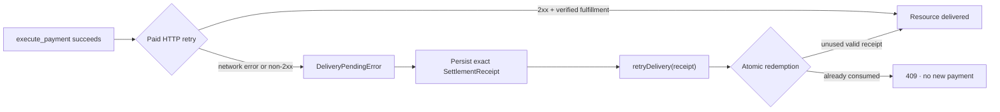
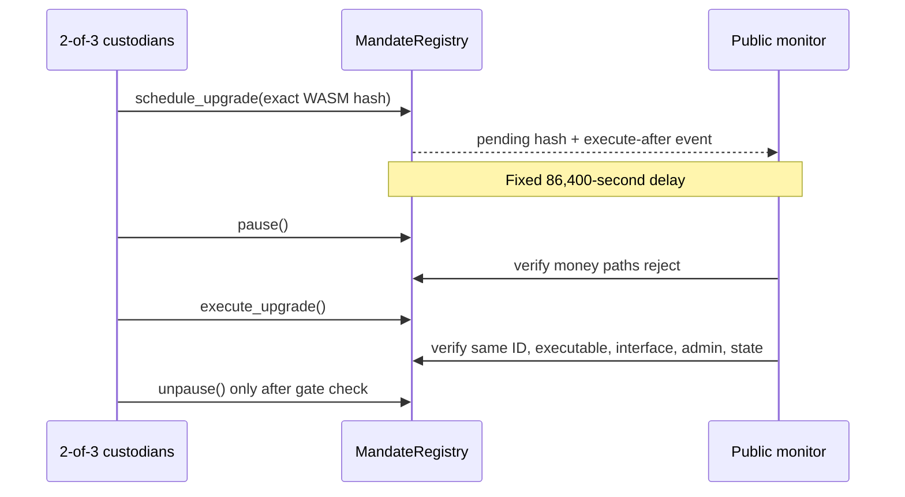

# REAPP data flow and trust boundaries

The diagrams show where authorization is created, where it is merely carried,
and where it is independently verified. HTTP and SDK objects never replace
contract state.

## Mandate creation and payment

```mermaid
sequenceDiagram
    actor User
    participant Consumer as Consumer / agent.fetch()
    participant Token as SEP-41 token
    participant Registry as MandateRegistry
    actor Merchant

    User->>Consumer: budget, merchant, asset, expiry
    Consumer-->>User: canonical mandate + id
    User->>Registry: register_mandate (user authorization)
    User->>Token: approve contract allowance

    Consumer->>Merchant: GET protected resource
    Merchant-->>Consumer: HTTP 402 requirement
    Note over Consumer,Merchant: Quote only; not authorization
    Consumer->>Registry: execute_payment (agent authorization + current sequence)
    Registry->>Registry: recheck stored status, expiry, scope, budget, sequence
    Registry->>Token: transfer_from(user, merchant, amount)
    Registry-->>Consumer: successful transaction hash
    Consumer->>Merchant: retry with X-PAYMENT receipt
    Merchant->>Registry: independently read transaction event and mandate
    Merchant->>Token: independently verify matching transfer
    Merchant->>Merchant: atomically consume redemption key
    Merchant-->>Consumer: HTTP 200 protected resource
```

### Data classification

| Data | Classification | Authority |
|---|---|---|
| User/agent secret keys | Secret; process or approved signer only | Corresponding Stellar signer |
| Mandate input object | Sensitive policy input; safe to log only without secrets | Becomes authoritative only after user-authorized registration |
| 402 requirement | Untrusted public quote | No spending authority |
| Transaction hash | Public pointer | Useful only after independent chain verification |
| Settlement receipt / `X-PAYMENT` | Bearer data until consumed | Unlocks only after chain verification and atomic redemption |
| Stored mandate | Public chain state | Authoritative for scope, budget, expiry, status, and sequence |
| App cache and browser counters | Display state | Never authoritative |

## Delivery recovery



Once the transaction hash exists, the client must never restart the 402 payment
flow for that delivery. Recovery reuses the existing proof and creates no
signature or transaction.

## Administration and upgrades



The current testnet administrator is one signer. The 2-of-3 flow is a required
pre-mainnet control and is described in
[`upgrade-authority.md`](upgrade-authority.md).

## Component ownership

| Component | Owns | Must not own |
|---|---|---|
| MandateRegistry | Authorization, mandate consumption, transfer decision | HTTP parsing, resource delivery, private keys |
| Core SDK | Canonical input construction, signing orchestration, receipt recovery | Final budget authority, cached approval, merchant fulfillment decision |
| x402 adapter | Request/response parsing and proof encoding | Contract rules or mandate schema changes |
| Express middleware | Independent chain verification and one-time redemption | Trust in caller-supplied amount, merchant, or mandate fields |
| Reference consumer | Sequential `agent.fetch()` usage and clear failure UX | Direct token transfer or blind payment retry |
| Browser companion | Ephemeral testnet demonstration and public evidence | User or agent signing keys; authoritative budget state |

## Version-change boundary

An x402 or AP2 format change may replace its adapter and tests. It must not
require a redesign of MandateRegistry unless the desired authorization semantics
cannot be expressed by the current stored mandate. Unsupported external fields
fail closed rather than becoming application-only promises.
